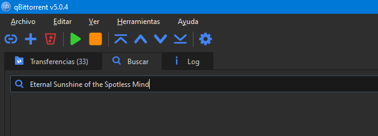
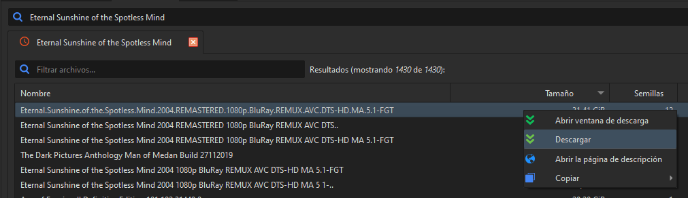
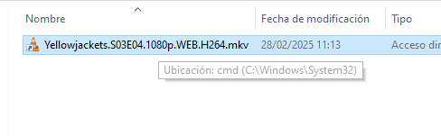
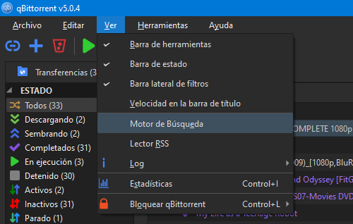
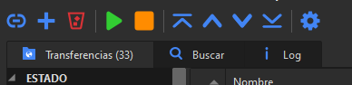
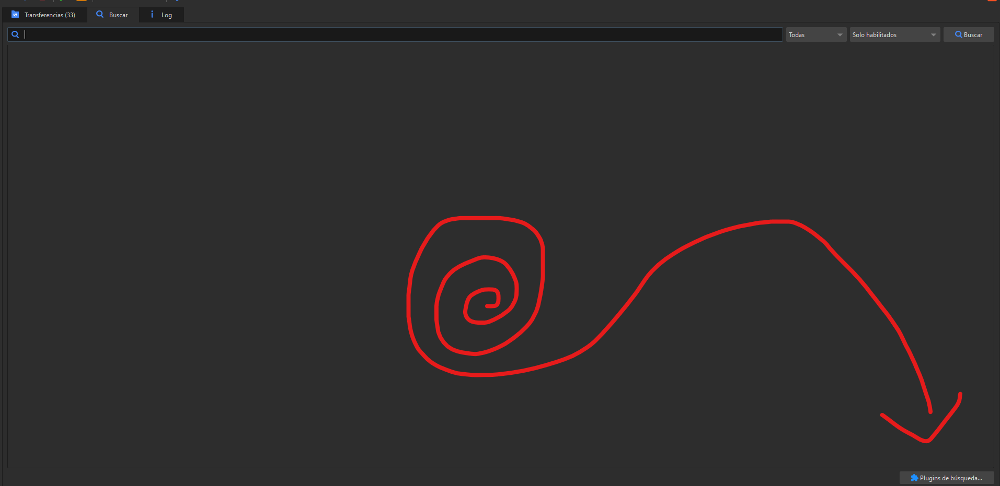
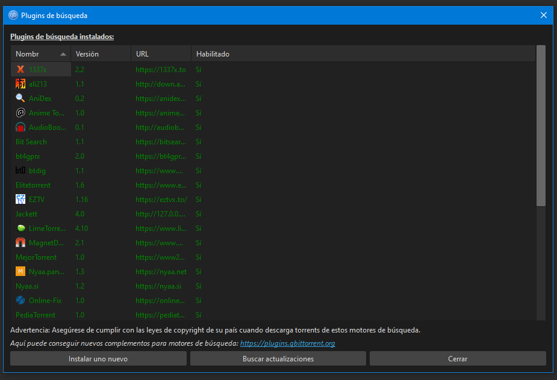
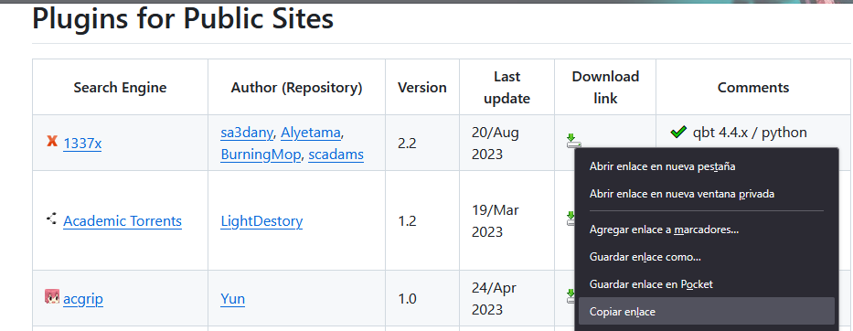
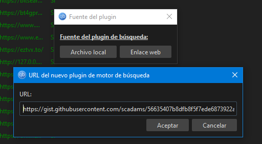

_"Tenemos esta idea de que la tecnología siempre avanza, pero en realidad está
retrocediendo todo el tiempo"_

<!-- truncate -->

## El estado actual de la tecnología es :(

Me permití robar esta frase de una
[charla dada por Jonathan Blow](https://www.youtube.com/watch?v=ZSRHeXYDLko)
para usarla como apertura de este blog. En su charla, Blow la utiliza bajo el
contexto de que, si no somos considerados y hacemos un esfuerzo consciente, es
muy fácil perder el conocimiento tecnológico que poseemos.

Yo la voy a usar bajo otro contexto: desde el punto de vista de un consumidor,
la tecnología actual es cada vez peor y hay una notable falta de innovación.

Cada vez se hace más complicado ver esa película que querés ver. Tenés que
buscar en qué servicio de streaming está. Tenés que suscribirte mensualmente.
Tenés que usar su aplicación (que probablemente sea una mierda) para verla. Si
la querés volver a ver, tenés que tener cuidado porque quizás el servicio cerró
u _otro_ servicio compró los derechos de la película y ahora está en ese.

Cada vez se hace más difícil conseguir un celular que tenga _cosas_ que tenían
los celulares hace 10 años atrás. Hoy en día podés pagar alrededor de 1400
doláres para tener un celular que:

- ❌ No tiene jack/conector para auriculares.
- ❌ No podés agregarle una memoria SD.
- ❌ No podés removerle la batería y cambiársela por otra.
- ❌ No venga con cargador.
- ❌ No puedas desbloquearlo con tu huella digital.
- ✔️ Tenga un procesador de 8 núcleos y 12GB de RAM para que puedas scrollear
  todo el día en Reels de Instagram o Tiktok sin que ande lento. 💖💖💕
- ✔️ Es prácticamente igual al del año pasado pero quizás un poco más caro y con
  alguna cosa trendy del momento, como IA.

Otros ejemplos:

- Nvidia se dedica a vender fire starters que valen más de 2000 dolares que ni
  siquiera ofrecen una mejora sustancial en comparación con la generación
  anterior.
- "Internet" se convirtió mayormente en un conjunto de 2 o 3 plataformas que
  todo el mundo usa.
- Las aplicaciones / programas son menos confiables.
- La PlayStation 5 es como la 4 pero sumándole 1. Y sin juegos.
- etc etc etc etc
- etc etc etc etc etc etc etc etc etc etc etc etc etc etc etc etc

Hay gente más inteligente y elocuente que yo para hablar de estas cosas, así que
no voy a profundizar más en esto. Recomiendo ver:

- [Algorithms are breaking how we think - Technology Connections](https://www.youtube.com/watch?v=QEJpZjg8GuA)
- [Technology isn't fun anymore - Drew Gooden](https://www.youtube.com/watch?v=P-TANCVoHlc)
- [Preventing the Collapse of Civilization - Jonathan Blow ](https://www.youtube.com/watch?v=ZSRHeXYDLko)

Pero todo eso no es lo importante ni la razón por la que estoy escribiendo esto.
La razón es

export const DopamineAddiction = ({ children }) => (
  

    <h2>PAUSA PARA INCREMENTAR NIVELES DE DOPAMINA</h2>
    <iframe
      width="560"
      height="315"
      src="https://www.youtube.com/embed/QPW3XwBoQlw?si=byCaKJ7mQrlXSn3N"
      title="YouTube video player"
      frameborder="0"
      allow="accelerometer; autoplay; clipboard-write; encrypted-media; gyroscope; picture-in-picture; web-share"
      referrerpolicy="strict-origin-when-cross-origin"
      allowfullscreen
    ></iframe>
  

);

<DopamineAddiction />

## Cómo descargar películas y series usando qBittorrent

Hoy en día descargar cosas via torrent no puede ser más fácil. Ni siquiera hace
falta que entres a una página para buscarlos. Podés hacer todo desde un solo
programa: qBittorrent.

Esto es lo mucho que tardo para descargar algo que me interesa:

1. Abro el programa.
2. Voy al buscador y tipeo lo que quiero: 
3. Selecciono el resultado que me gusta y lo descargo:
   
4. Listo. En 2 minutos busqué y descargué una película que quería ver.

### ¿Qué es un torrent? ¿BitTorrent?

BitTorrent es un protocolo que permite intercambiar archivos a través de
internet. El protocolo sigue un esquema Peer to Peer (P2P), lo que en términos
simples significa que, en vez de descargar un archivo que está almacenado en un
servidor central, el archivo puede estar almacenado en distintas computadoras de
usuarios (como vos y yo!!!) alrededor del mundo, y vos lo podés descargar
gracias a que ellos lo están compartiendo.

Esto tiene una gran ventaja en comparación de un archivo que estés descargando
de, digamos, un servicio como MediaFire (¿sigue existiendo?). Mientras que
MediaFire puede eliminar un archivo de sus servidores por copyright (o el motivo
que se les cante), en el caso de un torrent mientras alguien en el mundo esté
compartiendo ese archivo, vos vas a poder descargarlo.

Lo cual hace que BitTorrent sea una genial forma para descargar cosas que se
vean afectadas por el copyright, como por ejemplo: películas, series, música,
juegos, software...

### ¿Es seguro?

Tan seguro como descargar cualquier archivo de internet. Lo que en otras
palabras significa: no. **Uno tiene que tener cuidado con cualquier cosa que
descargue por internet**, independientemente de la forma en la que las
descarguemos.

El otro día me descargué un capítulo de una serie, y el archivo se veía así:

- ✔️ La extensión del archivo es correcta (MKV se usa para videos)
- ✔️ El icono del archivo es el de VLC (reproductor de videos)
- ✔️ El nombre del archivo sigue el formato tradicional de una película/serie
  que descargás por torrent
- ✔️ El archivo pesaba alrededor de 1 GB (no es raro ver capítulos de series que
  ronden ese peso)
- ❌ ??? el archivo tiene el icono de acceso directo en windows y la ubicación a
  la que lleva es la consola de windows en system32???????? ❌❌❌❌❌❌

Pero honestamente, es raro encontrar torrents maliciosos si los obtenés de
fuentes confiables.

### Instalando qBittorent y añadiendo plugins de búsqueda

Los plugins de búsqueda son una funcionalidad que tiene qBittorrent que nos
ayuda a buscar archivos/torrents sin tener que salir del programa. Los plugins
_no son oficiales ni creados por el equipo de qBittorrent_, pero sin embargo
ellos mantienen una guía y una lista de plugins acá:
https://github.com/qbittorrent/search-plugins/wiki/Unofficial-search-plugins

1. Descargar desde acá https://www.qbittorrent.org/download e instalar.
1. Abierto el programa, hacer click en el botón "Ver" de la barra de menús.
   Luego hacer click en Motor de Búsqueda.

   

1. Al lado de la pestaña de "Transferencias" nos va a aparecer una nueva llamada
   Buscar. 
1. Dentro de buscar, hacer click en el botón Plugins de Búsqueda
   
1. Se nos va a abrir una ventana que nos muestra los plugins que tenemos
   instalados y nos da la opción de instalar nuevos
   
1. Para buscar plugins, vamos a:
   https://github.com/qbittorrent/search-plugins/wiki/Unofficial-search-plugins#plugins-for-public-sites
1. Buscamos algún plugin que queramos y copiamos el enlace que aparece en la
   columna "Download link" 
1. Volvemos a qBittorrent, hacemos click en el botón "Instalar uno nuevo",
   seleccionamos la opción "Enlace Web", y pegamos el enlace del punto anterior
   
1. Le damos a aceptar y listo, instalamos un plugin de búsqueda. Ahora las
   búsquedas que hagamos van a hacer uso del mismo para buscar torrents

No es necesario instalar todos los plugins de búsqueda que aparecen en
https://github.com/qbittorrent/search-plugins/wiki/Unofficial-search-plugins#plugins-for-public-sites.
Por dar un ejemplo, si no te interesa el anime, no hace falta que instalés el
plugin de Nyaa.si o Nyaa.pantsu.

Lo bueno de este listado de plugins de búsqueda es que son, en mayor o menor
medida, plugins para fuentes confiables de torrents.

## Próximamente en este blog

Reemplazando Netflix, Disney+, Hulu y la concha de tu madre cuántos servicios de
streaming iban a existir? con Plex.
