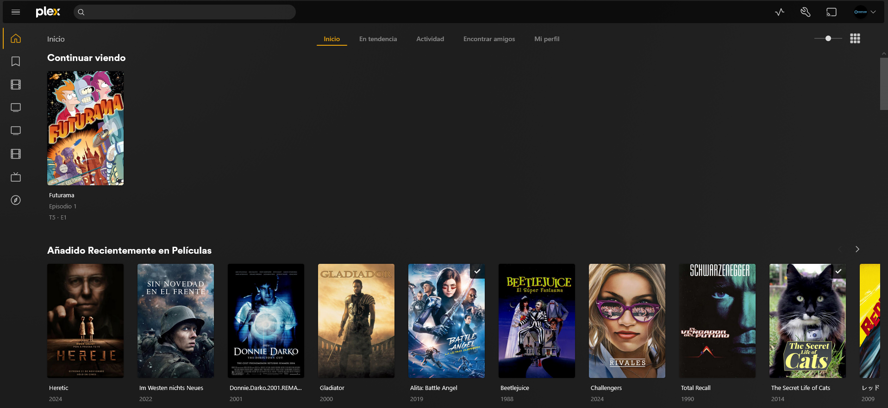
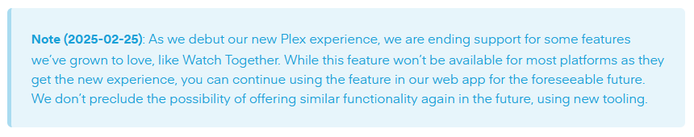

<!-- Custom component -->

import { VideoEmbed } from "@site/src/components/VideoEmbed";

La respuesta es simple: no quiero que me pase lo mismo que con las calculadoras.

<!-- truncate -->

## La cosa que nos hace humanos

Tanto en la primaria/secundaria como en la universidad, tuve momentos en que
algún profesor nos decía: _"No van a poder usar la calculadora para hacer este
examen"_, e inmediatamente una sensación de miedo y desesperación inundaba el
aula.

La mayoría de las veces la razón dada era que _"puede que en algún momento de tu
vida no dispongas de una calculadora a mano para resolver esto"_. A medida que
pasan los años ese argumento va perdiendo más y más peso. Estamos rodeados de
calculadoras: desde tu computadora, pasando por tu celular, tu reloj
inteligente, y hasta probablemente tu lavarropas. Incluso aunque pasase una
catástrofe mundial y hubiera que empezar desde cero sin cosas electrónicas, muy
cómodamente podríamos volver a las
[reglas de cálculo](https://es.wikipedia.org/wiki/Regla_de_c%C3%A1lculo) y
resolver bastantes "cuentas" sin mayores problemas.

Otras veces, el argumento era algo como: _"Te volvés dependiente y empezás a
olvidar cómo resolver cuentas con tu cabeza"_. Lo cual es algo que fue
demostrado empíricamente por la Universidad de Wisconsin-Milwaukee y respaldado
con muchos casos, principalmente el mío.

(robándome un chiste que vi por ahí: cuando estudiás ingeniería y te piden
resolver integrales 😍🥰💞💞 **vs** cuando te piden dividir a mano 😖😖😭😭)

Siento que esos dos argumentos cobran mucha fuerza si los aplicamos a las
herramientas de inteligencia artificial (IA) que tenemos hoy en día. Pero el
caso de la IA es peor: con las calculadoras como mucho terminás siendo un boludo
como yo al que le cuesta hacer cuentas mentalmente... pero con IA podés terminar
siendo un boludo total.

Muchas personas están generando una dependencia grande con estas herramientas.
No solo para resolver cosas de su trabajo, sino también para cualquier otro tipo
de duda o problema que se encuentren en la cotidianidad de sus vidas.
Básicamente delegando su capacidad de investigar, pensar, y razonar por cuenta
propia a... una gran máquina estadística.

Y la cosa se pone peor cuando te ponés a pensar (si es que no fuiste consumido
ya) que estas cosas suelen dar información falsa, tener alucinaciones, o
incluso, que en algunos casos la información que te dan es en base al
aprendizaje supervisado que realizaron sobre el contenido con el que fueron
entrenadas y los que deciden ese contenido son un par de tipos de alguna empresa
en Silly-Con Valley.

Alec Watson, en poco menos de dos minutos, me dejó pedaleando:

<VideoEmbed src="https://www.youtube.com/embed/QEJpZjg8GuA?si=cHiyTqOisDgLXMzm&amp;start=2043" />

_"[...] cayendo ante la tentación de máquinas que pueden sacarnos la carga de
pensar. **La cosa que nos hace humanos.**"_

Por eso no estoy usando esas herramientas, a pesar de que reconozco la utilidad
que tienen en algunos casos. Me gusta pensar, razonar, y tratar de resolver
problemas por cuenta propia. Hacerlo me fuerza a aprender nuevas cosas y a
desarrollar nuevas habilidades. Y si desarrollo nuevas habilidades me convierto
en alguien más útil, para mí mismo, para mi familia, mis amigos, y mi comunidad.

Pero me estoy yendo por las ramas y el AI chatbot que entrené para ser mi novia
me envió 30 notificaciones. Dejo el tema acá.

## Plex o: como aprendí a dejar de preocuparme y amar la piratería

En el anterior post mostré cómo descargar películas, series, y en general
cualquier tipo de archivo, usando qBittorrent. Prácticamente lo mejor del mundo.
Una lástima que solo podamos reproducir eso desde la computadora que lo
descargaste. Estaría bueno que existiera alguna aplicación o programa que me
deje tener la película en la computadora, pero pudiéndola reproducir desde
cualquier dispositivo, ya sea mi televisión, celular, o incluso otra
computadora. Y sería re loco si pudiera hacerlo incluso estando fuera de mi casa
(conectado a internet pero no a la red de mi casa).

### ¿Qué es Plex?

[Plex](https://www.plex.tv/) es una aplicación o programa que te deja tener la
película en la computadora, pero pudiéndola reproducir desde cualquier
dispositivo, ya sea una televisión, celular, o incluso otra computadora. Y es
tan loco que te deja hacerlo incluso estando fuera de tu casa (conectado a
internet pero no a la red de tu casa).

En términos simples, Plex convierte tu computadora en un servidor de streaming.
Si instalás Plex en tu computadora, y después lo instalás en
[casi-cualquier-dispositivo-que-se-te-ocurra](https://www.plex.tv/apps-devices/),
vas a poder streamear:

- Series
- Películas
- Música
- ¿Fotos? No sé para qué querrías eso pero es totalmente posible.

Ejemplo de la interfaz de Plex (en este caso, la interfaz web):

Plex tiene un montón de
[funcionalidades](https://support.plex.tv/articles/categories/features/), pero
las que más me llaman la atención a mí son:

- **Bibliotecas de contenido:** Plex te deja crear distintas "bibliotecas", que
  no son más que una forma de organizar tu contenido multimedia. Podés tener
  bibliotecas para Películas, Series, Música... y si te ponés creativo, podés
  crear bibliotecas más específicas (Series Animadas, Series de TV, etc).
- **Identificación automática del contenido:** siguiendo el ejemplo del post
  anterior, si te bajás _Eternal Sunshine of the Spotless Mind_, Plex va a
  identificar la película en base al nombre del archivo y el mismo va a aparecer
  automáticamente en la biblioteca.
- **Transcodificación del contenido:** cuando abrís Plex en un dispositivo, es
  posible que ese dispositivo no pueda reproducir el formato del archivo que te
  descargaste (porque no tiene el códec, o por la razón que sea). Plex puede
  transcodificar el archivo al momento de streamearlo, permitiendóte
  reproducirlo en ese dispositivo. También te permite bajarle la calidad, en
  caso de que tu conexión de internet no tenga el ancho de banda necesario.
- **Búsqueda y descarga de subtítulos:** si por alguna razón te bajaste un
  torrent que no vino con subtítulos, podés buscar unos desde Plex mismo.
- **Watch Together:** prefiero no hablar de esta.
  
- **Compartir tus bibliotecas**: podés compartir tus bibliotecas de contenido
  con otros usuarios de Plex.
- **Acceso remoto**: no hace falta que estés conectado a la red de tu casa,
  podés ver el contenido igualmente. Solo necesitás una conexión de internet.

Pero lo más importante sigue siendo lo que mencioné al principio: **con Plex
podés descargarte cualquier cosa en tu computadora y verla en cualquier
dispositivo, estés donde estés.**

### Instalación y puesta en marcha

Seguir la guía oficial:
https://support.plex.tv/articles/200264746-quick-start-step-by-step-guides/

#### Potenciales problemas que podés encontrar

1. **Identificación incorrecta:** para que la identificación de archivos
   funcione bien, tenés que organizarlos. En esta guía podés ver un ejemplo:
   https://support.plex.tv/articles/naming-and-organizing-your-tv-show-files/
1. **No puedo acceder remotamente:** probablemente tengas que abrir puertos en
   tu router. Así como cuando creabas un servidor de CS 1.6, o de Minecraft. De
   otra forma Plex no va a poder comunicarse con el resto de internet.
1. **Se traba la reproducción en mi dispositivo:** probablemente tu dispositivo
   no tenga la potencia necesaria para reproducir a la calidad que estás
   haciendo streaming. Intentá bajarla.
1. **Cuando reproduzco algo mi computadora empieza a sonar como una turbina y la
   tempertura de la habitación se incrementa**: tu computadora está
   transcodificando el archivo y al hacerlo consume recursos. Transcodificar no
   es una tarea ligera. Plex por defecto transcodifica con el procesador. La
   solución es, en lo posible, evitar transcodificar cosas. Esto lo podés evitar
   mayormente si tu dispositivo es capaz de aceptar nativamente el formato de
   video que estás transmitiendo.

¿Otro tipo de problema o duda? Contactate conmigo a través de
[iluminame@linternita.com](mailto:iluminame@linternita.com).

## Próximamente en este blog

Reemplazando Spotify con Spotify sin anuncios pero sin pagar.
