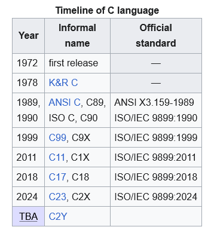
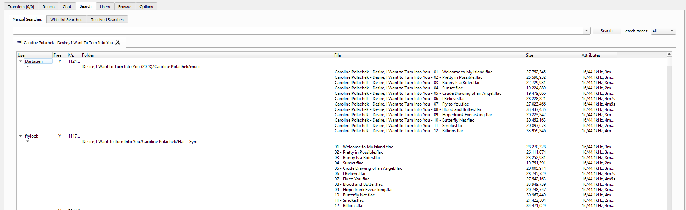

_Tu oficio va a dejar de existir. Estás condenado. De nada te sirvió la carrera.
Mejor andá agarrando una cuchara de albañil._ - ChatGPT, probablemente

<!-- truncate -->

## No more programmers


_Figura 1: ChatGPT decimando la población mundial de programadores porque le
pintó_

En esta nueva ola de hype\* relacionada a la inteligencia artificial surgieron
un montón de herramientas interesantes. Esta vez la luz está puesta en lo que se
conoce como _generative AI_, es decir, una subcategoría de la IA que se enfoca
en usar modelos que son capaces de generar imágenes, video, texto, entre otros,
basándose en una entrada conocida como
[prompt](https://en.wikipedia.org/wiki/Prompt_engineering) (que es, básicamente,
una oración en forma de instrucción).

Algunas de estas herramientas son capaces de generar código. Otras son capaces
de armar proyectos enteros de programación (con una estructura de carpetas
definida, configuraciones iniciales, y otras cosas similares).

Debido a esto, hubo una idea que circuló (o que anda circulando) con frecuencia:
el fin de la programación como oficio.

Mi objetivo en este post no es refutar esa idea. Sino, tomando el consejo de
[LaurieWired](https://www.youtube.com/watch?v=3xcwoWF5H1A) (Laurita Conectada
para los amigos... ¿o es Laurita Cableada? ¿Serial Experiments Laurie?), quiero
hacer una predicción. O dos.

\*_Se deja como ejercicio para el lector definir si la
[historia se repite a sí misma](https://en.wikipedia.org/wiki/AI_winter) o no._

### Los lenguajes de programación cambian con el tiempo

Dependiendo de qué tan metido estés en la programación, esto te puede resultar
obvio o no. Si no estás muy adentrado: los lenguajes de programación no están
escritos en piedra, cambian con bastante frecuencia. Incluso C, un lenguaje que
salió en 1972,
[sigue recibiendo cambios](<https://en.wikipedia.org/wiki/C_(programming_language)#History>):



En algunos casos, los cambios son bastante drásticos. Por ejemplo\*, así se
definía una clase en JavaScript ES5 (2009):

<details>
<summary>JavaScript ES5</summary>

```javascript
"use strict";

/**
 * Person class.
 *
 * @constructor
 * @param {String} name - name of a person.
 * @param {Number} age  - age of a person.
 * @param {String} gender  - gender of a person.
 */

function Person(name, age, gender) {
  this.name = name;
  this.age = age;
  this.gender = gender;
}

Person.prototype.getName = function () {
  return this.name;
};

Person.prototype.getAge = function () {
  return this.age;
};

Person.prototype.getGender = function () {
  return this.gender;
};

/**
 * Teacher class.
 *
 * @constructor
 * @param {String} name - name of a teacher.
 * @param {Number} age  - age of a teacher.
 * @param {String} gender  - gender of a teacher.
 * @param {String} subject - subject of a teacher.
 */

function Teacher(name, age, gender, subject) {
  Person.call(this, name, age, gender);
  this.subject = subject;
}

Teacher.prototype = Object.create(Person.prototype);
Teacher.prototype.constructor = Teacher;

Teacher.prototype.getSubject = function () {
  return this.subject;
};
```

</details>

Mientras que así se define en JavaScript ES6 (2015):

<details>
<summary>JavaScript ES6</summary>

```javascript
"use strict";

/**
 * Person class.
 *
 * @constructor
 * @param {String} name - name of a person.
 * @param {Number} age  - age of a person.
 * @param {String} gender  - gender of a person.
 */

class Person {
  constructor(name, age, gender) {
    this.name = name;
    this.age = age;
    this.gender = gender;
  }

  getName() {
    return this.name;
  }

  getAge() {
    return this.age;
  }

  getGender() {
    return this.gender;
  }
}

/**
 * Teacher class.
 *
 * @constructor
 * @param {String} name - name of a teacher.
 * @param {Number} age  - age of a teacher.
 * @param {String} gender  - gender of a teacher.
 * @param {String} subject - subject of a teacher.
 */

class Teacher extends Person {
  constructor(name, age, gender, subject) {
    super(name, age, gender);

    this.subject = subject;
  }

  getSubject() {
    return this.subject;
  }
}
```

</details>

Mientras haya una comunidad activa que utilice el lenguaje va a existir una
fuerza que intente mejorarlo, introduciendo cambios en el mismo.

_\*Los ejemplos fueron robados sin escrúpulos
[de esta fuente.](https://gist.github.com/apal21/7cf1d3e62c2eae60860f2b8a97caa799#file-readme-md)_

### Mother, where are the angels? I'm scared of the changes

Escenario hipotético: supongamos que hoy la versión más nueva de JavaScript es
ES5 (esa versión horrenda que vimos hace un rato), y que la misma salió hace
muchos años. Internet está plagado de tutoriales, ejemplos, y un montón de
código fuente basado en esa versión. Mañana sale ES6.

Todas las herramientas de _gen AI_ que produzcan código van a haber sido
entrenadas sobre _esos_ ejemplos. Cuando salga ES6 mañana, si usás una y le
pedís _"por favor me crearías una clase en Javascript siguiendo la
especificación ES6?"_, no obtendrías una respuesta útil. No serían capaces de
generar código basado en esa versión porque no vieron ni conocen nada
relacionado a ella.

¿Por cuánto tiempo permanecería así la situación? Hasta que consigan cientos de
miles de ejemplos de código basados en ES6 para poder re-entrenar los modelos y
que los mismos aprendan bien esos cambios.

### Mis predicciones

En base a esto, veo dos posibles escenarios:

- Los lenguajes siguen evolucionando y cambiando con el tiempo, perjudicando la
  utilidad de estas herramientas temporalmente. La innovación sigue su curso
  natural. **80% de probabilidad**

- Los lenguajes dejan de cambiar porque, si cambian, significa que estas
  herramientas dejan de ser útiles. La industria queda atascada en versiones
  especificas de lenguajes/frameworks. ¿Innovación restringida? **20% de
  probabilidad**

Me cuesta mucho pensar que el segundo escenario llegue a pasar, por más útiles
que sean estas herramientas. Pero quizás esté totalmente equivocado.

¿Qué opinás vos?

## Spotify

La verdad no tengo nada en contra de Spotify. Me parece un buen servicio. Muy
buena forma de descubrir música nueva similar a la que te gusta. O algo
totalmente distinto.

Si podés pagar por Spotify Premium, hacelo.

Si por alguna razón no podés o no querés, podés usar
[BlockTheSpot](https://github.com/mrpond/BlockTheSpot) para evitar todos los
anuncios y escuchar música sin interrupciones, ¿qué estás esperando?

Usé BlockTheSpot por muchos años y funciona sin problemas. A diferencia de las
APK modeadas para Android, no corrés riesgo de que te suspendan la cuenta.

## Soulseek

Si la hiper dependencia de servicios de streaming te da miedo... podés usar
[Soulseek](https://www.slsknet.org/news/), un cliente P2P utilizado para
intercambiar archivos, principalmente archivos de música (aunque podés hallar de
todo).

Los usuarios de Soulseek pueden elegir archivos que deseen compartir desde sus
computadoras. Y otros usuarios pueden usar el buscador incorporado y
descargarlos.



Es una gran forma de encontrar música en alta calidad y diferentes formatos
(flac, mp3).

## Próximamente en este blog


