Un vistazo a lo que existía antes del internet que conocemos hoy en día.

<!-- truncate -->

## Introducción

Estás en la década de los 80 y tenés una computadora y una conexión dial-up que
te da acceso a internet. Te aburrís y querés ver qué anda pasando en la
[autopista de la información](https://en.wikipedia.org/wiki/Information_superhighway).
Abrís tu navegador de confianza, escribís la siguiente URL _hache te te pe
dospuntos triple doble v punto miforofavoritodeinternet punto com_ y apretás
enter.

De golpe te das cuenta que cometiste un grave error: los navegadores web no van
a ser inventados hasta 1990. Las páginas web son un concepto inexistente. El
protocolo HTTP no va a ser lanzado hasta 1996. Si todo esto no existe... ¿Qué
corno hay en el internet entonces? ¿Dónde puedo leer una publicación, noticia, o
comentar algo como si estuviera en un foro?

Seguramente existían más formas, pero las principales eran bien usando un
[BBS](https://en.wikipedia.org/wiki/Bulletin_board_system) o...
[Usenet](https://en.wikipedia.org/wiki/Usenet).

## Usenet

En los anteriores párrafos hice referencia a foros de internet porque quizás sea
la forma más simple de entender (para gente moderna como nosotros) qué era
Usenet.

Los foros son páginas donde los usuarios pueden crear publicaciones y comentar
en las mismas, formando un hilo de discusión. Usenet es básicamente lo mismo,
solo que utiliza otros términos: en vez de foro, se llama newsgroup. En vez de
publicaciones, se llaman "news articles". Y tiene un pequeño detalle: está
totalmente basado en texto.

_Figura 1: literalmente la primera imagen que sale en Wikipedia sobre Usenet_

Si bien estaría bueno explicar cómo funciona este sistema y la tecnología que
maneja por detrás, la verdad es que:

- Nunca lo usé
- No sé cómo funciona porque nunca lo usé
- Nunca me interesó demasiado... (hasta ayer)

Uno podría pensar que las discusiones y todo el contenido de Usenet está
totalmente perdido e inaccesible. Mucho contenido de la internet que conocemos
hoy en día se encuentra perdido e inaccesible. Pero así como existe
[gente que intenta preservar el contenido de la triple W](https://archive.org/),
existe gente que decidió resguardar y archivar los artículos de Usenet.

Gracias a...
[¿GOOGLE?](https://en.wikipedia.org/wiki/Usenet#Archives_by_Google_Groups_and_Deja_News)
Podemos acceder a un archivo de Usenet con contenido que data de 1981.

Para eso tenemos que ir a [Google Groups](https://groups.google.com) y usar el
buscador incorporado. Supuestamente antes había una forma más fácil de buscar
cosas relacionadas a Usenet, pero como siempre, a Google le encanta romper todo.

## Vistazo al pasado

El hecho de tener publicaciones archivadas desde 1981 vuelven a Usenet una
fantástica cápsula del tiempo. Es posible encontrar acá información que no se
puede encontrar en otros lados. Ni siquiera en la internet que tenemos hoy en
día (y en la que cada vez es más difícil encontrar información,
paradójicamente).

En uno de sus últimos videos,
[Cathode Ray Dude](https://www.youtube.com/watch?v=ympjaibY6to) usó este sistema
para encontrar el precio de... una conexión dial-up específica allá por los
80/90. Puede parecer algo tonto, pero si no fuera porque alguien decidió hacer
un comentario poniendo el precio en Usenet (y porque otro alguien decidió
archivar todo esto), ese pedacito de información se hubiera pérdido para
siempre.

En mi caso no estoy buscando algo tan especifico. Simplemente entré para ver qué
publicaban algunos argentinos/hispanohablantes en esas épocas. A continuación un
listado de cosas que me parecieron interesantes o graciosas.

### Primer post que vi: alguien enojado y a las puteadas

https://groups.google.com/g/soc.culture.venezuela/c/qvQOGnwvdxY/m/1e_xDSHLl7oJ

Un post bastante reciente de 2011 (!) donde alguien despotrica y empieza a
insultar a otros usuarios frecuentes del newsgroup.

Un usuario (que aparece en artículos que datan de 1995) le contestó:

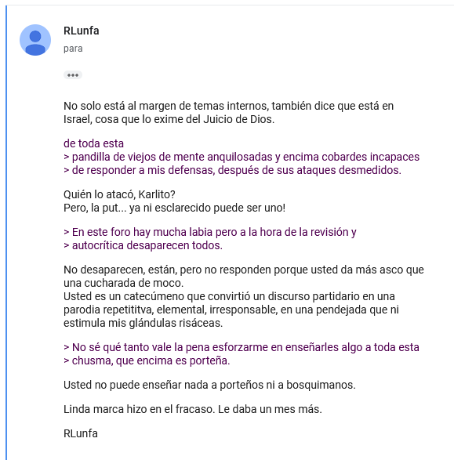

_Usted es un catecúmeno que convirtió un discurso partidario en una parodia
repetititva, elemental, irresponsable, en una pendejada que ni estimula mis
glándulas risáceas._

### Laura aprobó el examen

https://groups.google.com/g/soc.culture.argentina/c/dXn0eeYBwvU/m/bYlTLriSJXMJ

El 24 de diciembre de 1999, a las 5 de la mañana (no sé bajo qué huso horario),
Laura nos informa que:

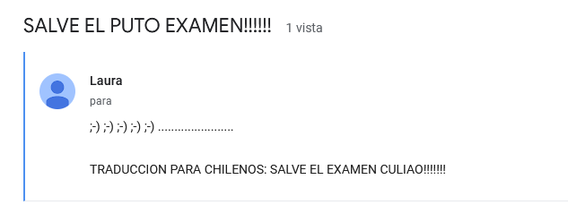

Y nos deja una traducción para los chilenos. Cachai?

Felicidades Laura.

### Un FAQ gigantesco con un montón de cosas sobre Argentina

https://groups.google.com/g/soc.answers/c/_D9o6J6iV_0/m/yHSOwVFS2S0J

Se ve que este newsgroup tenía un FAQ que cubría un montón de cosas relacionadas
a Argentina, más que nada orientado a argentinos en el exterior.

Un poco de contexto: recordemos que tener una computadora y una conexión a
internet en los 90 no era algo tan asequible como hoy en día. Menos que menos en
Argentina. Aparentemente por estas fechas muchos de los usuarios eran argentinos
que residían en el exterior, en países como Estados Unidos.

Es bastante extenso, pero resalto:

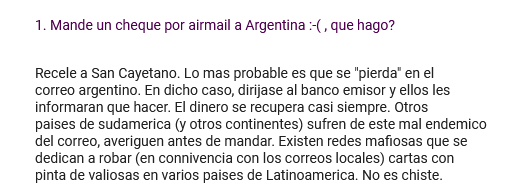

Aparentemente Chorreo Argentino funcionaba igual que hoy en día.

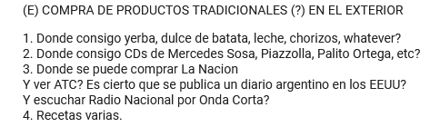

Se ve que la gente que vivía en el exterior se moría por comprar CDs de Mercedes
Sosa.

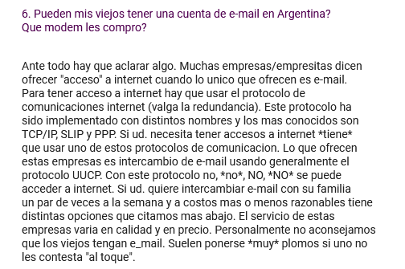

No es buena idea darle un modem a tus papás porque si no les contestás un mail
al instante se ponen muy pesados.

### Errores con Windows 98

https://groups.google.com/g/soc.culture.argentina/c/yEWVC8yYXw8/m/beczHvfGcsgJ
https://groups.google.com/g/soc.culture.argentina/c/2hJgr5nAe9o/m/zKs6hyg81yoJ

Dos posts donde un usuario reporta tener errores con Windows 98 y muchos salen a
la ayuda. Otros salen a decir que Windows no es un sistema estable. Y otros le
recomiendan tocar pasto.

### Acuchillaron a Geroge Harrison

https://groups.google.com/g/soc.culture.argentina/c/XCb6-0K5eMw/m/2CvVB7OCOfwJ

Un usuario reacciona con mucha tristza a la noticia de un posible re-encuentro
de George Harrison y John Lennon.

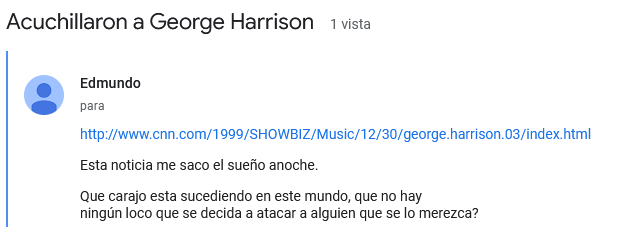

### Feliz cumple Edu

https://groups.google.com/g/soc.culture.argentina/c/7EQkRsyfdFo/m/t176QYXty1wJ

Olivia le desea un feliz cumpleaños a un tal Eduardo. ¿Y aparentemente... rolea
en la primera oración?

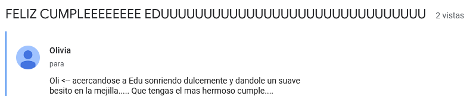

_* linternita se acerca e ilumina la situación *_

### Edmundo se pasa

https://groups.google.com/g/soc.culture.argentina/c/K6nnAosmZuA/m/T-wn7sr25HwJ

Edmundo deja este comentario:

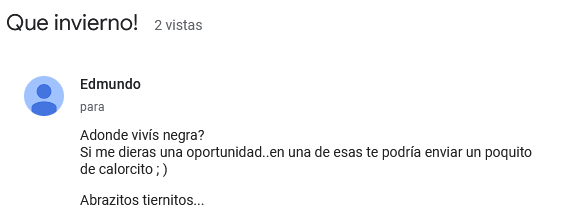

El cual le cae horriblemente mal a
[rilkecita](https://groups.google.com/g/soc.culture.argentina/c/K6nnAosmZuA/m/T-wn7sr25HwJ):

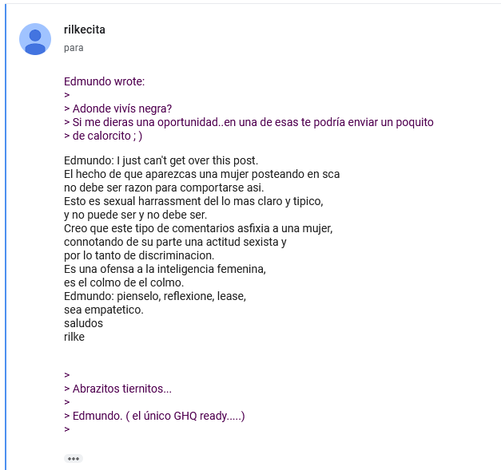

### Tucumano solitario

https://groups.google.com/g/soc.culture.argentina/c/aIjVF--wIXQ/m/gi9M0n4F5AAJ

Un tucumano se siente solo porque piensa que todos son porteños putos en este
newsgroup.

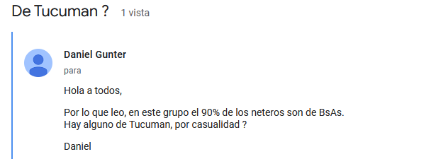

### Mujeres argentinas

https://groups.google.com/g/soc.culture.argentina/c/cRTzHi4w9qw/m/f1W9BLshOb4J

Este post de 1993 tiene muchas cosas que me parecen interesantes. La primera,
Graciela escribiendo fuego:

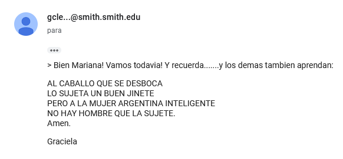

La segunda, alguien llamado Martín Raskovsky participa en el artículo dejando
varios comentarios. Aparentemente es alguien con un doctorado en Ciencias de la
Computación. Pero no solo eso: este tipo sigue vivo, y es más, parece que ahora
es un artista y fotógrafo galardonado: https://martinr.com/pages/about

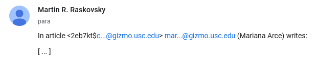

La tercera, alguien tiene opiniones muy fuerte sobre las chicas de España:

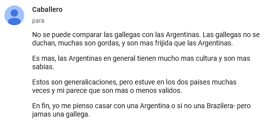

### Dónde están las mujeres

https://groups.google.com/g/soc.culture.argentina/c/4XWZRcnOSFw/m/VXT1gftndKIJ

Me fue recomendado no emitir opinión respecto a este artículo.

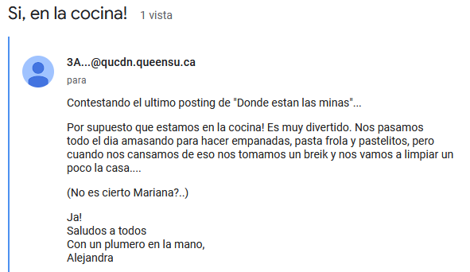

### Acá se termina lo gracioso. Si querés seguir bien con tu día/semana, cerrá la página

Podría seguir poniendo infinitos ejemplos de cosas así. Hay decenas de miles de
mensajes para revisar y solo alcancé a ver un par.

En vez de seguir viendo posts de 1990, decidí hacer un salto a un año más
interesante para Argentina... **2001** (para los que no sean argentinos,
[veáse](https://es.wikipedia.org/wiki/Crisis_de_diciembre_de_2001_en_Argentina))

Y para sorpresa mía, hay muchos artículos donde usuarios hablan de la situación
del país en ese entonces y las cosas que pasaban... Hay comentarios realizados
en _el mismo día o el día después de esos hechos_.

En este
[post](https://groups.google.com/g/soc.culture.argentina/c/QISggC8KjGo/m/3w7yeRtC25gJ)
un usuario hace referencia a la elección de Duhalde como presidente:

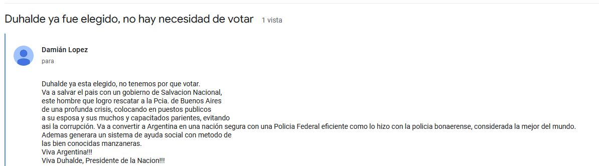

En
[este otro](https://groups.google.com/g/soc.culture.argentina/c/k1XyEXyMPIU/m/0Pfqw_wJoOwJ)
alguien habla de la renuncia de Ramón Puerta como presidente.

[Este otro](https://groups.google.com/g/soc.culture.argentina/c/Cddhd5VkRaM/m/P5GcKIU0rdoJ)
parece haber sido publicado luego de los hechos del 19 de diciembre. Usuarios
discuten acerca de los hechos, criticando al cacerolazo, las costumbres de la
gente argentina, al país en general...

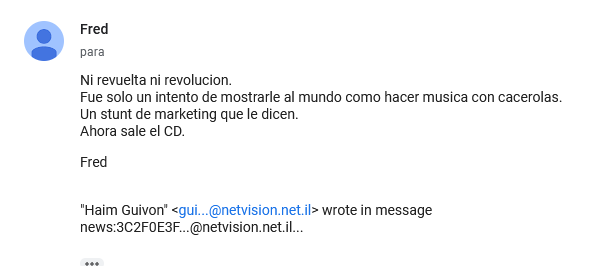

Este artículo titulado
["Y ahora qué pasa, eh?"](https://groups.google.com/g/soc.culture.argentina/c/bQhb_gknke0/m/NxTVU4nh2bsJ)
tiene un montón de comentarios. Rescato los siguientes:

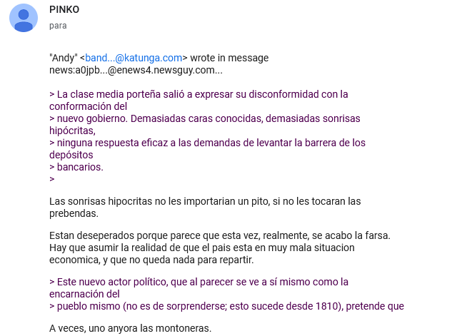

_Estan deseperados porque parece que esta vez, realmente, se acabo la farsa. Hay
que asumir la realidad de que el pais esta en muy mala situacion economica, y
que no queda nada para repartir._

_en estas marchas pacíficas siempre hay infiltrados_

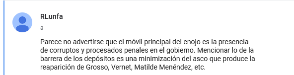

_presencia de corruptos y procesados penales en el gobierno_

- [Carlos Grosso](https://es.wikipedia.org/wiki/Carlos_Grosso#Juicios_por_su_gesti%C3%B3n):
  Las causas acumuladas contra Grosso incluyeron cargos de asociación ilícita y
  de enriquecimiento ilícito.
- [Matilde Menendez](https://es.wikipedia.org/wiki/Matilde_Men%C3%A9ndez#PAMI):
  Se acusaba a funcionarios y dirigentes de PAMI de cobrar coimas mensuales a
  los prestadores que, por este medio, se aseguraban continuar formando parte de
  la nómina de prestadores de PAMI.
- [José María Vernet](https://www.rafaelanoticias.com/provinciales/murio-jose-maria-vernet-primer-gobernador-santafesino-tras-la-restauracion-democratica.htm):
  Como gobernador, pasó a la historia por un escándalo de corrupción,
  relacionado con el destino de los restos del Puente Colgante, cuando parte de
  su estructura se derrumbó y cayó a la laguna Setúbal.

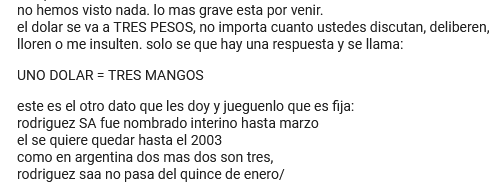

¿Cuál de todos los dólares?

Por último, este artículo titulado
["Ay pais"](https://groups.google.com/g/soc.culture.argentina/c/u_49u1auejc/m/fNdh3RfegzUJ)
también tiene cientos de comentarios donde hablan del tema.

Resalto este comentario de una tal Caro:

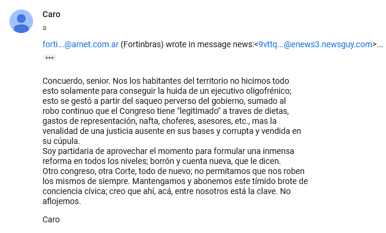

_Otro congreso, otra Corte, todo de nuevo; no permitamos que nos roben los
mismos de siempre._

Resalté todos esos comentarios porque me parecen fascinantes. Son las mismas
cosas que se escuchan hoy en día, 24 años después. Casi al pie de la letra.

Vermouth, papas fritas, y algo de un show.

## Próximamente en este blog

Sí ya sé que este post no tiene algo relacionado a piratería. No lo quería hacer
más largo. En algún próximo post lo subo.
