_I'm telling you this one's on compact disc, compact disc! Have you seen these
things? They're in stores now. I'm telling ya it's gonna knock your socks off.
It's like a record only it's played by lasers that won't skip.
[WOW!](https://youtu.be/B-8EORB783c?t=1476)_

<!-- truncate -->

## Introducción

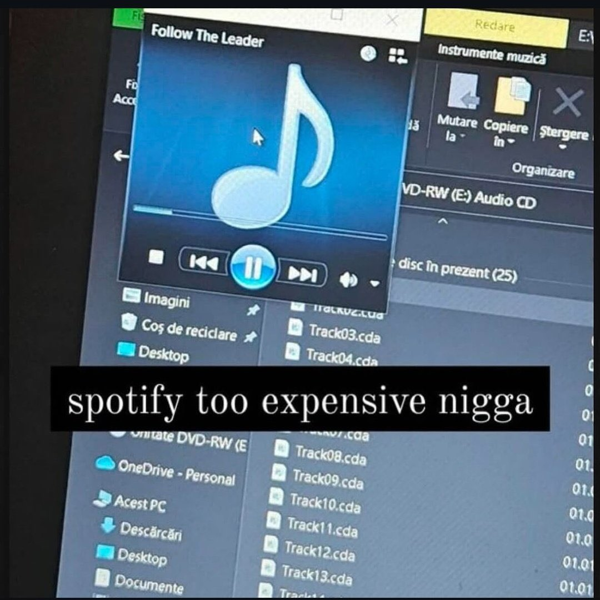

La consumisión de contenido multimedia se TRANSformó\* drásticamente en las
últimas décadas, haciendo un giro a lo que se conoce como **medios digitales**.

Si querés escuchar un albúm de tu artista favorito, no vas a comprar un CD,
abrís Spotify (o te las ingeniás
[de otra forma](https://linternita.com/blog/no-more-programmers-soulseek#soulseek))
y listo. Si querés ver una película o serie, no vas a Blockbuster a alquilar un
DVD, abrís Netflix. Incluso los fichines pasaron a ser algo mayormente digital:
podes comprar un juego físicamente, pero lo único que trae la caja es un código
de activación para que después lo descargues.

_\* Los medios digitales son una mierda ... Los medios digitales son clave._

Este giro no es algo malo de por sí. Los medios físicos tienen claros problemas
y desventajas. Son incómodos de usar y peor, dependiendo del medio, puede que un
par de años después de que lo compraste se degrade y te deje sin acceso al
contenido.

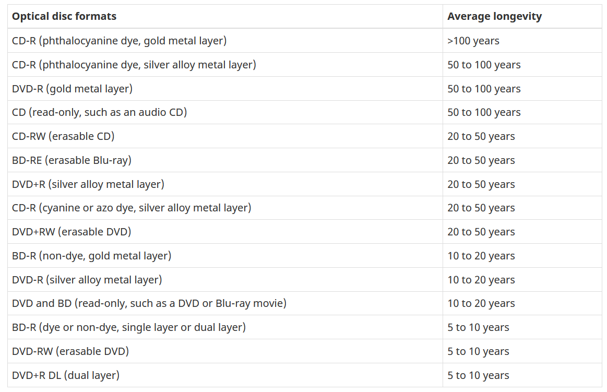

_Figura 1: longevidad de distintos medios de almacenamiento óptico.
[Fuente: CCI](https://www.canada.ca/en/conservation-institute/services/conservation-preservation-publications/canadian-conservation-institute-notes/longevity-recordable-cds-dvds.html)_

Pero... mientras el medio esté en condiciones, tenés acceso ilimitado al mismo.

La evolución a los medios digitales no solo supuso un cambio de formato (físico
a digital), sino también un cambio en la _propiedad_ de las copias de contenido
multimedia. Pasamos de ser dueños de una copia, a ser simplemente "dueños" de
una **licencia** que nos provee acceso al contenido en una plataforma dada.

**boring ass post modern technology sucks we get it 🙄🙄😴😴**

## Ripeando CDs

### ¿Ripear? ¿Qué es? ¿Por qué no solo copio y pego los archivos que están en el CD?

Los CDs de audio (es decir, los que siguen la
[especificación del libro rojo](https://en.wikipedia.org/wiki/Compact_Disc_Digital_Audio))
no almacenan archivos. El audio se almacena en pistas. Si abrís un CD de audio
en Windows, vas a ver algo como esto:

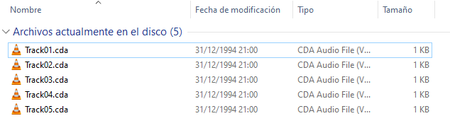

Esos no son archivos de audio convencionales: no es un WAV o un MP3. Los
archivos `.cda` son como "accesos directos" (shortcuts) que apuntan a la
ubicación de la pista en el disco. No contienen sonido alguno, por lo tanto,
necesitás una forma que realmente extraiga el sonido de la pista y lo almacene
en un archivo de audio. Esto es lo que se conoce como CD ripping.

No solo vas a conseguir un archivo de audio (que luego podés almacenar en
cualquier lugar), si no que también la calidad de ese archivo de audio va a ser
excelente.

### Guía resumida para extraer audio de un CD

La verdad es que, como todo tema que tocan los audiófilos, esto es algo que se
puede volver extenso, pesado, y pedante. Se puede hacer de mil formas y podés
configurarlo muy minuciosamente. Hay muchos detalles que se pueden explicar y
que hay que tener en cuenta. Cosa que no voy a hacer.

Cosas que vas a necesitar:

- Una lectora de CDs
- Un CD
- Exact Audio Copy (EAC)
- Seguir esta guía

#### Paso 1: Conectar la lectora a la computadora

y... si

#### Paso 2: Conseguir un CD a ripear

En mi caso voy a usar este:

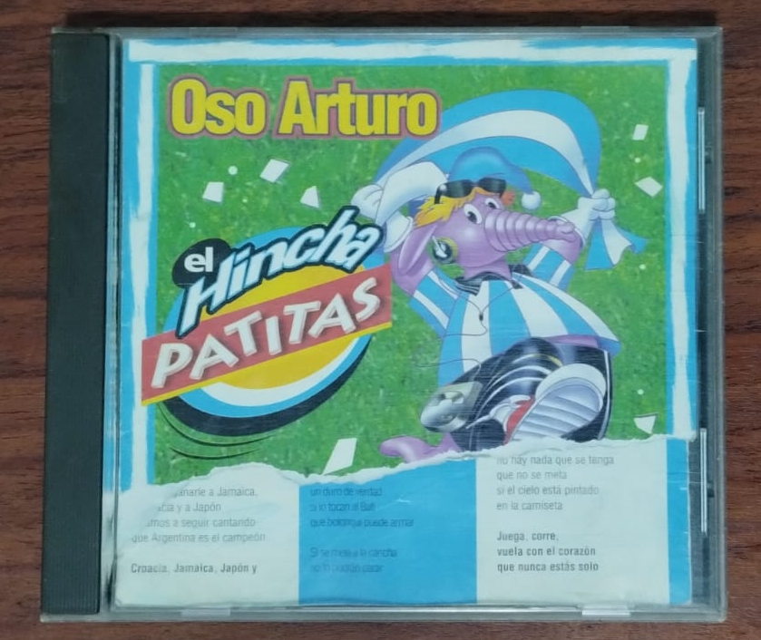

#### Paso 3: Descargar e instalar EAC

Podés descargarlo desde acá:
https://www.exactaudiocopy.de/en/index.php/resources/download/

#### Paso 4: Configurando EAC

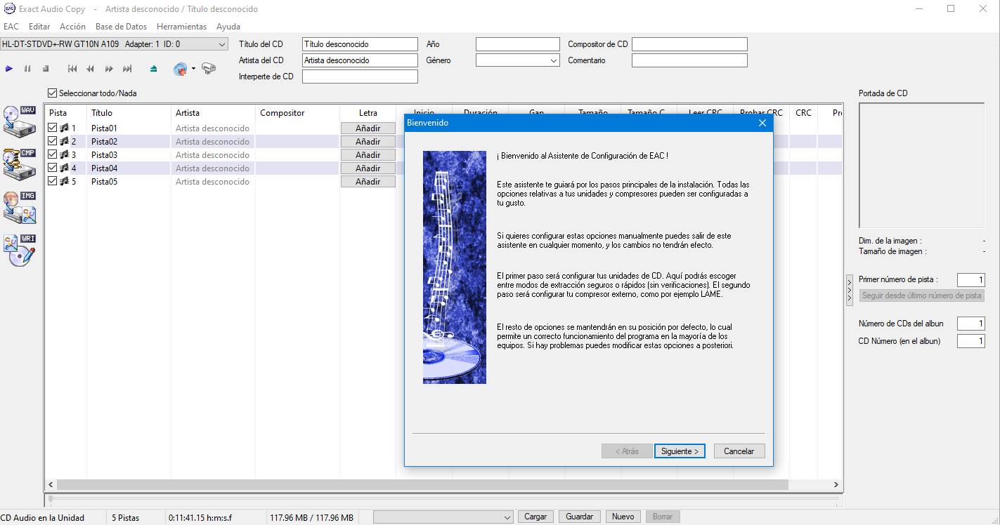

Una vez instalado y abierto, EAC nos va a recibir con un asistente de
configuración\*. Este asistente nos va a llevar a través de algunos pasos, tales
como:

1. Selección de la lectora de CDs que vamos a usar
1. Selección de la precisión de los resultados
1. Realizar pruebas sobre la lectora
1. Selección de formato de compresión
1. Selección de formato de títulos para los archivos

Paso 4.1: Precisión de los resultados

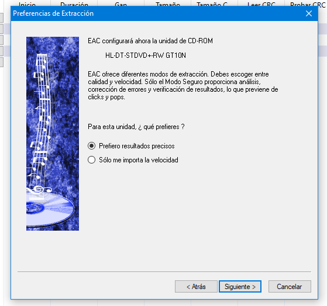

Seleccionar prefiero resultados precisos. Esto va a hacer que la extracción de
audio tarde más, pero vamos a obtener una mejor calidad de la misma.

Paso 4.2: Pruebas sobre la lectora

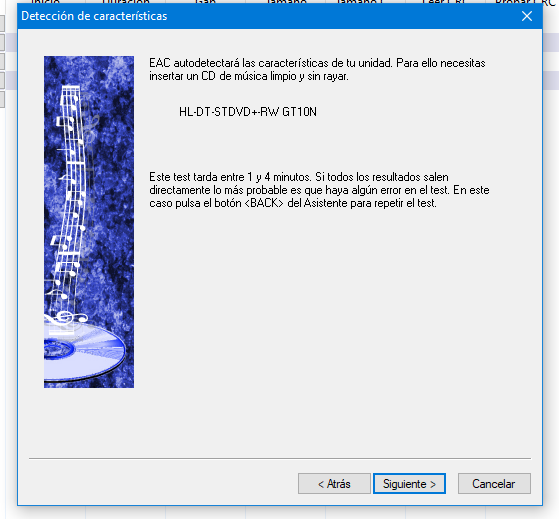

Lo único que voy a decir sobre este paso es que no uses un CD rayado, tal cual
indica el asistente.

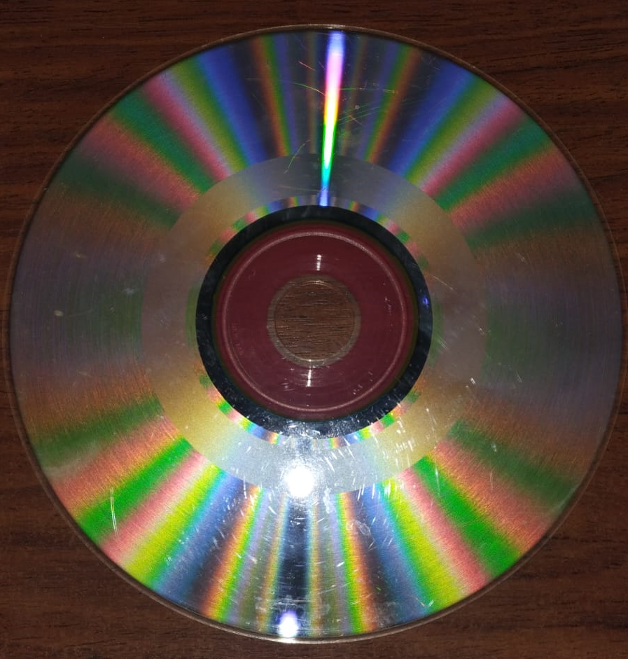

Paso 4.3: Selección de formato de compresión

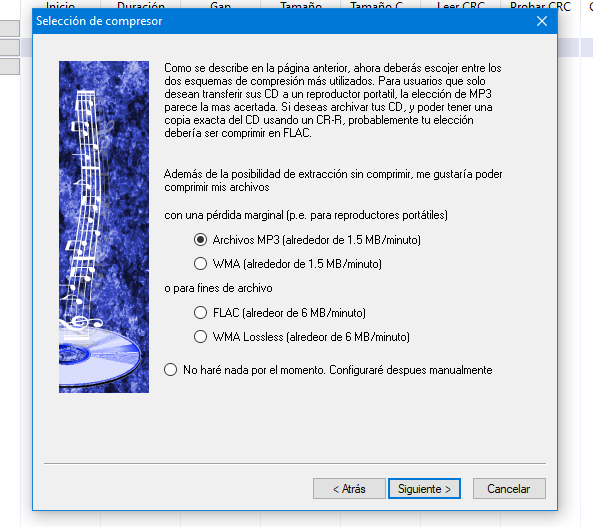

Podemos elegir distintos formatos de compresión. EAC viene con algunos
incorporados por defecto, pero si ninguno de esos nos conviene, se pueden
modificar libremente.

En este caso recomiendo optar por MP3. O FLAC, si sos un pesado obsesionado con
la calidad.

Paso 4.4: Selección de formato de títulos para los archivos

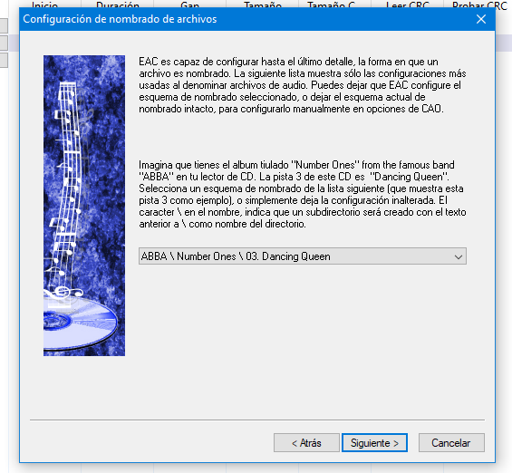

Acá podemos elegir cómo queremos que sean los títulos de los archivos de audio
que se generen. Elegí el que más te guste.

_\*Acá es donde la cosa se puede volver extensa. Si estás interesado en obtener
la mejor calidad te recomiendo seguir
[esta guía](https://wiki.hydrogenaud.io/index.php?title=EAC_and_FLAC) (que la
verdad lo único que hace es usar una versión más reciente del códec FLAC y
ajustar unos parámetros por defecto de EAC)._

#### Paso 5: Extrayendo el audio (finalmente)

Una vez que configuramos todo, vamos a Acciones --> Probar y copiar pistas
seleccionadas --> Comprimidas

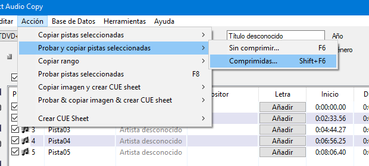

EAC nos va a pedir que seleccionemos una carpeta donde guardar los resultados.
Una vez hecho eso, va a comenzar a leer el CD y generar los archivos de audio.

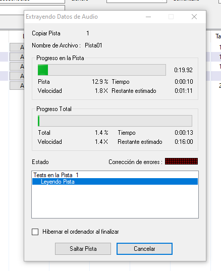

Este proceso puede llevar un tiempo. Por ejemplo, para este magnífico
[CD del Oso Arturo](https://www.youtube.com/watch?v=cMcil86djDg), tardó
alrededor de 10 minutos para 5 temas de 2 minutos de duración en promedio.

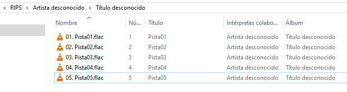

El perspicaz lector seguro se dará cuenta que los archivos generados no tienen
información alguna sobre autor, título de la pista, u otros metadatos. Eso es
porque usé un muy mal CD como ejemplo.

Pero si agarramos un CD de algún artista medianamente reconocido, podemos usar
uno de los plugins de metadatos incluidos en EAC, los cuales automatizan el
proceso de identificar/añadir información relacionada al albúm.

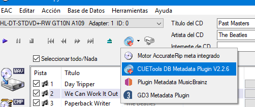

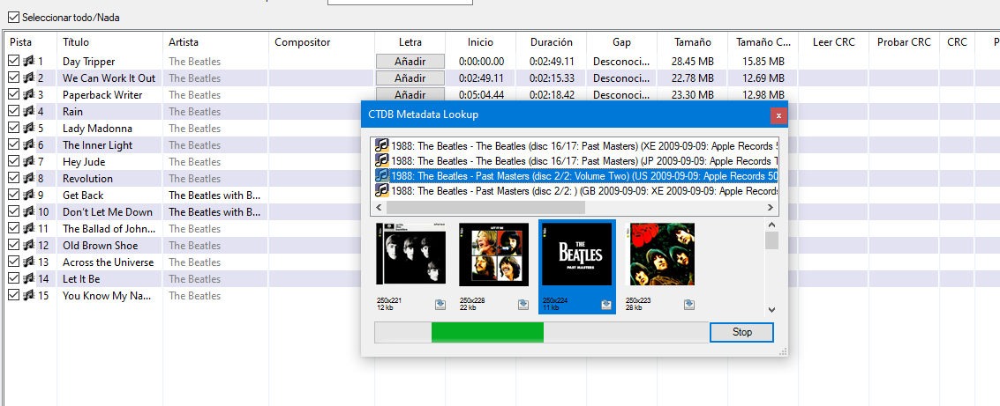

## Repacks de juegos

### ¿Qué es un repack?

Un repack de un juego es básicamente una versión comprimida de los archivos de
un juego. La compresión de los archivos solo aplica a la descarga, una vez que
se instala, el juego tiene su tamaño normal.

En la mayoría de los casos estos repacks ya vienen _crackeados_ (lo que
significa que sí, vas a poder jugar sin pagar un peso). A veces también pueden
incluir mods o "fixes" que solucionan problemas del juego.

### ¿Debería descargarme un repack o adquirir un juego de forma legal en Steam?

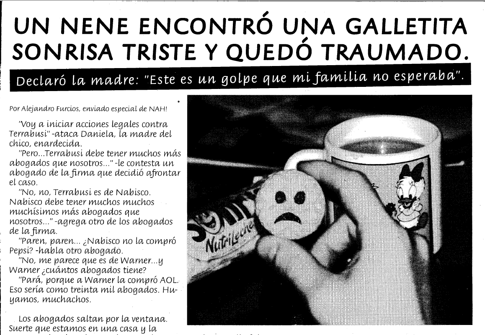

imagen equivocada, perdón.

### FitGirl

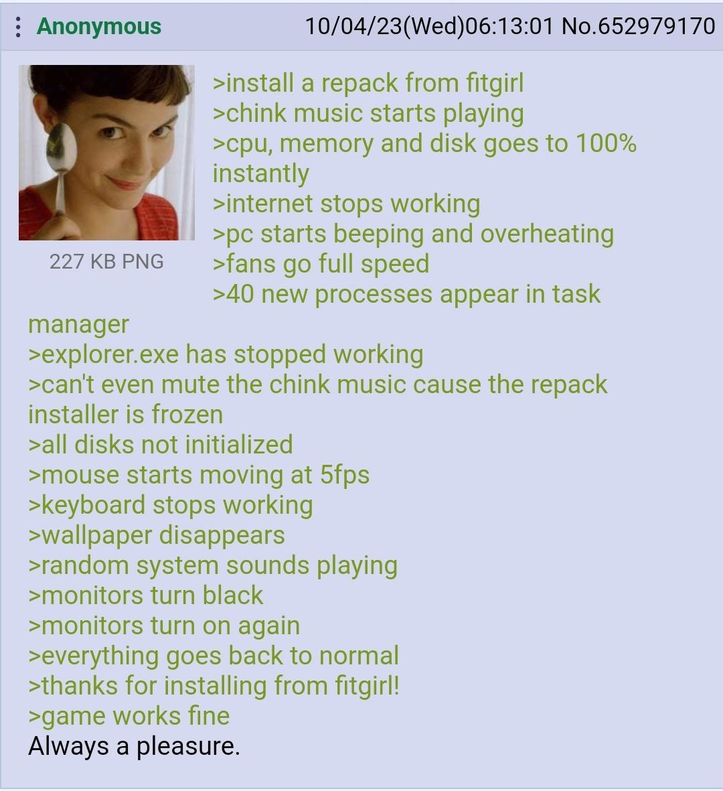

FitGirl quizás sea la repacker más conocida dentro de la escena. Desde 2016 que
empezó a subirlos de forma pública y a día de hoy en su página hay miles de
repacks.

Ofrece la opción de descargarlos de forma directa, o usando un
[cliente para torrents](https://linternita.com/blog/tecnologia-actual-torrents#c%C3%B3mo-descargar-pel%C3%ADculas-y-series-usando-qbittorrent).

Otra ventaja de los repacks de FitGirl es que vienen con un instalador que hace
_todo_. No tenés que preocuparte por "crackear" el juego manualmente,
simplemente elegís donde instalarlo y dejás que haga su magia.

Enlace a la página: https://fitgirl-repacks.site/
