Hoy en día podés convertirte en hacker muy fácilmente, solo tenés que
intentarlo.

<!-- truncate -->

## Introducción

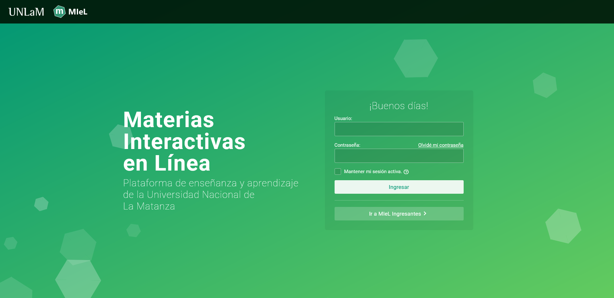

MIeL (HONeY en inglés) es una plataforma de la Universidad Nacional de La
Matanza donde los alumnos pueden ingresar y ver contenido relacionado a sus
materias, enviar mensajes a los profesores, participar en foros dejando
comentarios, subir archivos para entregas de trabajos prácticos, entre otras
cosas...

Muchas de las acciones que enumeré en el anterior párrafo tienen algo en común:
involucran la _entrada_ de datos por parte de un usuario. Y no solo eso, si no
que la entrada de dichos datos modifica el contenido de la plataforma.

No estoy diciendo nada muy llamativo. La mayoría de las páginas webs hacen eso:
recibir entradas de un usuario y adaptar el contenido adecuadamente. Cuando
ingresás a YouTube y seleccionás un video, el mismo empieza a reproducirse.
Cuando ingresás texto en un campo de búsqueda, la página lo procesa y te
devuelve datos refinados. Cuando le dejás un comentario a la chica que te gusta
en Instagram, quedás bloqueado.

En resumen: estas páginas son dinámicas, el contenido de las mismas cambia
dependiendo de las entradas de los usuarios. Esto no es malo de por sí, pero
puede llegar a ser peligroso. Un usuario podría subir un archivo que contenga
virus. Podría ingresar
[un texto específico](https://en.wikipedia.org/wiki/SQL_injection) en un campo
de búsqueda que produzca que la página revele información que no debería. O
podría dejar un comentario inofensivo a simple vista, pero que ejecuta código
malicioso cuando es visto por los demás usuarios.

Esos casos pueden ser evitados y existen distintas técnicas para hacerlo:
validación de entradas, sanitización de entradas (controversial), codificación
de salidas.

## "Hackeando" MIeL

En algunos casos no hace falta hacer nada. La página se "hackea" sola.

En el año 2020 alguien hizo un cambio en la página, provocando que todo el
directorio de archivos del servidor quede expuesto:

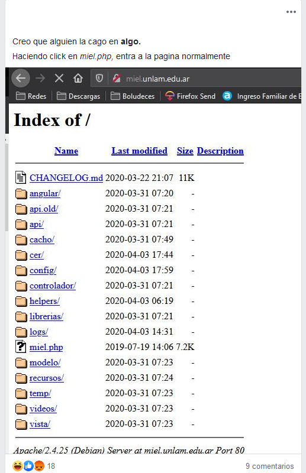

Un problema de seguridad interesante. Pero queda en segundo plano gracias a
esto:

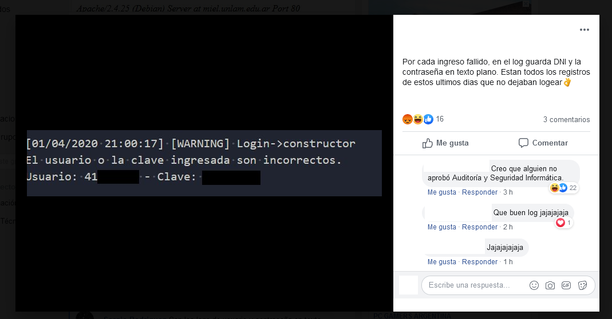

Por alguna razón el código de MIeL creaba y almacenaba un registro de todos los
intentos fallidos de inicios de sesión. No solo se guardaba el nombre de usuario
que no pudo iniciar sesión, si no también... la **contraseña del usuario**, en
texto simple.

No tiene remate.

## """Hackeando""" MIeL

El lector informado seguro se dio cuenta hace rato de la dirección de este
artículo. Mucho enfoque en las entradas de los usuarios solo puede significar
una cosa: un ataque de inyección.

Los ataques de inyección explotan vulnerabilidades presentes en una página web,
permitiéndole a un atacante inyectar una entrada maliciosa que luego puede ser
ejecutada por la página. Quizás el más conocido de estos ataques (y por suerte,
cayendo en la irrelevancia) es
[SQL Injection](https://en.wikipedia.org/wiki/SQL_injection).

Tan solo un año después del incidente de los logs, me encontraba cursando una
materia llamada Seguridad en Redes. Justamente en esta materia vimos diferentes
tipos de ataques que pueden ser realizados sobre páginas web. Me sentí como un
mono con una navaja y tuve un impulso muy fuerte y repentino que me llevó a
intentar encontrar un ataque que funcionara dentro de MIeL.

### Buscando un punto débil

Como dije antes, la plataforma permite a los usuarios enviarse mensajes o dejar
comentarios en un foro. Tiene la particularidad de soportar texto enriquecido
(rich text, permite agregar cosas como distintas fuentes, colores, o elementos
como imágenes), y para eso utiliza un editor de texto muy popular llamado
[TinyMCE](https://www.tiny.cloud/).

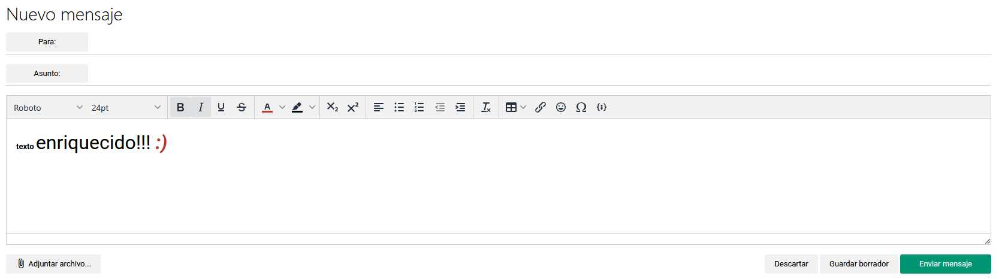

Para esto, lo que hace TinyMCE detrás de escena es crear HTML para representar
ese texto:


El lenguaje HTML permite la ejecución de scripts de código JavaScript. Y acá
estamos lidiando con un editor de texto que genera HTML, el cual luego (de
enviar un comentario) es reflejado en la página para que los demás usuarios lo
puedan ver.

¿Entonces puedo agregar código JavaScript en el editor de Tiny? ¿Así de fácil
es?

No. TinyMCE tiene medidas de seguridad para evitar que los usuarios inyecten
código JavaScript al utilizar el editor. Aplica técnicas santiización y
neutralización del contenido. El problema es que sanitizar HTML es algo difícil
de hacer. Y eso hace que esto sea un punto débil.

### Vulnerando TinyMCE

Uno podría romperse la cabeza intentando encontrar la forma de romper el
sanitizador de Tiny y lograr inyectar código JavaScript en el contenido de un
mensaje...

O podrías averiguar qué versión de Tiny está ejecutando la página y después
buscar
[CVEs](https://es.wikipedia.org/wiki/Common_Vulnerabilities_and_Exposures) que
afecten a esa versión. Lo bueno de los CVEs es que no solamente informan sobre
una vulnerabilidad, si no que muchas veces contienen pasos para replicarla.

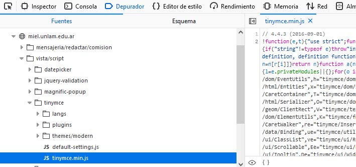

MIeL estaba usando la versión 4.4.3 de Tiny, que tenía 5 años de antiguedad en
ese entonces. Existía la posibilidad de que alguien haya encontrado una
vulnerabilidad en todos esos años y que la haya reportado.

En efecto, dicha versión es vulnerable a XSS según lo reportado por el
[CVE-2020-12648](https://nvd.nist.gov/vuln/detail/cve-2020-12648). Según el
informe, cuando TinyMCE está configurado en el modo clásico, la sanitización y
neutralización puede ser evadida utilizando tags HTML anidados y sin
terminación. De esta forma, un atacante podría insertar un tag HTML `img`,
ingresando específicamente atributos `src` y `onerror` para producir una
inyección de código malicioso.

Para poder aprovechar esta vulnerabilidad, el contenido malicioso debe ser
ingresado programáticamente en la instancia del editor TinyMCE. Es decir, el
atacante no puede escribir el contenido, sino que debe lograr una asignación
directa de dicho contenido en el editor. Existen dos formas de lograr esto:

- TinyMCE puede asignar como contenido del editor una respuesta que reciba desde
  el servidor. Un atacante podría enviar contenido malicioso al servidor para
  que el mismo sea asignado al editor.
- Mediante JavaScript, se puede asignar contenido al editor haciendo uso de las
  funciones `setContent` e `insertContent`, las cuales son funciones
  pertenencientes a la instancia activa del editor.

### Ejecución del exploit

En MIeL, la ejecución del exploit podía realizarse siguiendo estos pasos:

1. Ingresar a una publicación de un foro, o a la funcionalidad de envíos de
   mensajes.

   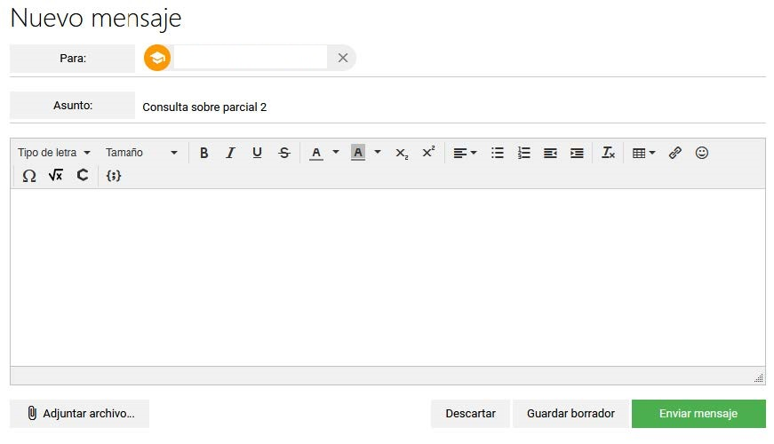

2. Abrir las Herramientas del Desarrollador en el navegador.

3. Si en la consola escribimos “tiny”, veremos los objetos e identificadores que
   existen actualmente en la memoria de JavaScript cuyo nombre comienza por
   “tiny”. Esto nos es de utilidad, ya que necesitamos acceder a la instancia
   activa del editor.

   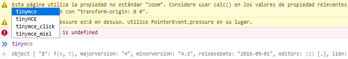

4. En base a la
   [documentación de TinyMCE](https://www.tiny.cloud/docs/api/tinymce/tinymce.editor/),
   sabemos la instancia activa del editor es identificada por la propiedad
   “activeEditor”. Al escribir esto en la consola, nos devuelve el objeto
   asociado.

   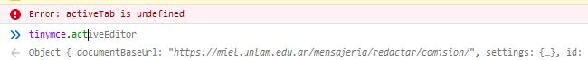

5. Una vez obtenida la instancia del editor, podemos hacer uso de la función
   `setContent` para ingresar el contenido malicioso. Basándonos
   [en el ejemplo provisto](https://bishopfox.com/blog/tinymce-version-5-2-1-advisory)
   por la consultora Bishop Fox, insertaremos el siguiente string como
   contenido:

   `<iframe><textarea></iframe>`

   Para eso, tenemos que ejecutar el siguiente comando en la consola del
   navegador:

   ```javascript
   tinymce.activeEditor.setContent(
     '<iframe><textarea></iframe>'
   );
   ```

   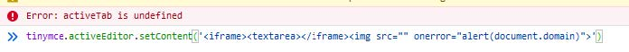

6. El código es ejecutado en el navegador ni bien es ingresado en el editor. El
   mismo permanecerá en el editor y no se verá modificado por más que el
   atacante ingrese contenido extra en el editor. Al enviar el mensaje, los
   contenidos no son neutralizados por el servidor, por lo que el código
   malicioso permanece intacto. De esta forma, cuando el recipiente abra el
   mensaje, el código se ejecutará en su navegador.

   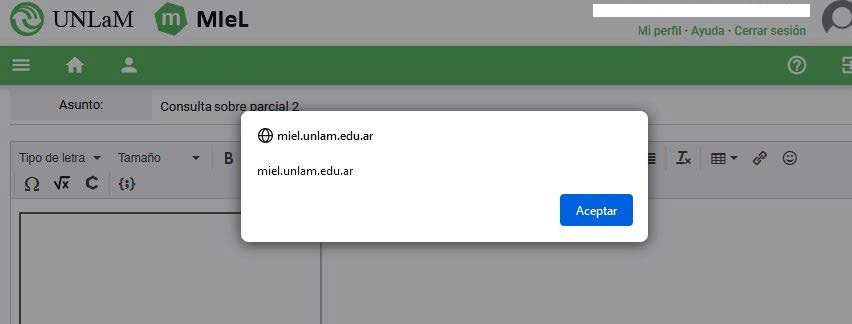

   En la siguiente imagen se puede observar una demostración real de la
   ejecución del ataque.

   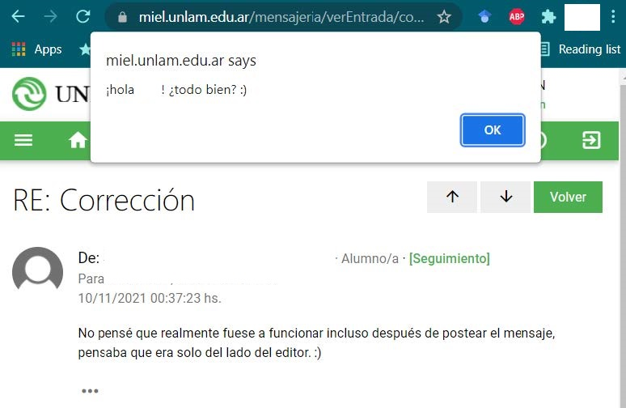

   Este exploit era posible no solo gracias a la vulnerabilidad presente en el
   editor TinyMCE, sino también gracias a la falta de neutralización del
   contenido por parte del servidor.

   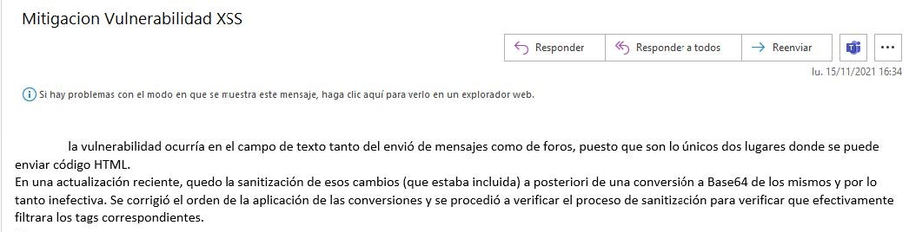

### ¿Qué es lo peor que podría haber pasado?

Muchas cosas. Se podrían haber robado cookies de sesión de los usuarios. O
redirigirlos a una página que tenga un login falso de MIeL, para luego capturar
sus credenciales. Si se hubieran obtenido credenciales de un profesor/tutor, se
podría modificar contenido bibliográfico de las materias, o mejor aún, cambiar
la corrección de algún trabajo práctico o parcial que haya sido evaluado por
MIeL.

## Conclusión

Está bien, lo admito, el título es muy clickbait. No hubo mucho hackeo que
digamos y no estoy escribiendo esto solamente porque mi abogado me dijo que lo
aclare de forma explícita.

¿Por qué elegí MIeL? Ni idea. Pintó. Rebelarse contra el sistema y esas cosas.

Pero creo que en base a los dos incidentes puedo dar los siguientes consejos:

1. No repitas/reutilices la misma contraseña. Alguien podría crear una página
   que la almacena en un registro cada vez que hacés un intento fallido o hay un
   error.

1. Las CVEs no solo son buenas para saber si hay una vulnerabilidad en un
   software que estás utilizando, sino que también pueden servir para encontrar
   ejemplos de cómo explotar esa vulnerabilidad.

Eso es todo por ahora. 🔦

## Próximamente en este blog


Todas las formas de conseguir ebooks que existen (o al menos todas las que yo
conozco) y cómo usar Calibre para enviarlas a tu Kindle.

Y si no tenés Kindle, lo lamento mucho, te estás perdiendo un montón.
