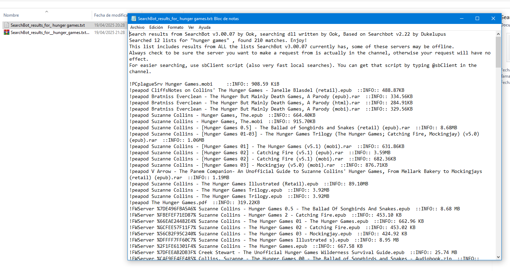

La ciencia es un proceso.

<!-- truncate -->

## Introducción

Es de público conocimiento que, si agarrás un ladrillo y lo lanzás hacia el
cielo, después de un rato el ladrillo va a caer y estamparse contra el piso (o
tu cabeza).

La parte que involucra levantar el ladrillo y lanzarlo es fácil de entender: vos
te pusiste en contacto con el ladrillo y en conjunto con tus manos y brazos lo
impulsaste hacia arriba. Entraste en contacto con el objeto, hiciste fuerza, y
lo lanzaste.

¿Por qué cae después de un rato?

Por la gravedad, claramente. Qué pregunta estúpida. Todo lo que sube tiene que
bajar.

Pero... _¿cómo hace la gravedad para forzar a que el ladrillo caiga si no hay
nada que lo toque?_

Esta misma pregunta se hizo Isaac Newton por mucho tiempo después de haber
introducido un par de leyes que ayudaban a describir el movimiento de los
objetos. Incluso después de muerto se seguía haciendo la pregunta. No él, otros.
La gente muerta no pregunta cosas.

## Acción a distancia (Siglo 17)

La
[ley de gravitación universal](https://es.wikipedia.org/wiki/Ley_de_gravitaci%C3%B3n_universal)
describe la gravedad como una fuerza y básicamente nos dice que los cuerpos que
tengan masa se atraen entre sí. Siendo más precisos: dos cuerpos cualesquiera
son atraídos por una fuerza proporcional a su masa e inversamente proporcional
al cuadrado de la distancia que los separe.

Pero esto representaba un problema: en tiempos de Newton reinaba la filosofía
mecánica. Esta corriente filosófica veía al mundo (y todos sus objetos) como una
máquina, y sostenía que todo suceso podía ser explicado a las partes físicas de
las máquinas y sus interacciones entre ellas.

A pesar de que las leyes de Newton funcionaban, iban en contra de lo establecido
por la mecánica:

1. No existe un mediador entre los cuerpos que hagan que los mismos se atraigan
   entre sí: los cuerpos pueden estar separados (es decir, sin tocarse), e igual
   experimentarían una fuerza que los atrae.
2. Los efectos de la gravedad parecerían ser instantáneos: el movimiento de un
   cuerpo dentro de un sistema podría producir un efecto en un cuerpo distante,
   sin ningún tipo de retraso temporal.

Newton, quién era seguidor de la filosófica mecánica, llegó a rechazar y
considerar absurda la idea de que una fuerza pudiese transmitirse sin un medio.
Él y otros científicos de su época propusieron la existencia de un medio llamado
“éter” (una sustancia invisible que está en todas partes), por el cual se podría
producir la interacción entre los cuerpos, pero nunca se pudo comprobar su
existencia científicamente.

Por lo tanto, muy a su pesar, se estableció la idea de que la gravedad actuaba a
distancia, sin transmitirse a través de ningún medio, sin interactuar con otras
"piezas" mecánicas del universo.

## El concepto de Campos (Siglo 18)

Un siglo después de la muerte de Newton, Lagrange, Laplace, y Poisson
introdujeron el concepto de campos\* escalares en conjunto con el
[potencial gravitatorio](https://en.wikipedia.org/wiki/Gravitational_potential).
Estos campos eran algo puramente matemático, no representaban un medio mecánico
por el cual la fuerza de la gravedad pudiera transmitirse.

_\* La definición formal de un campo es la existencia de una magnitud física,
representada por un escalar, vector, o tensor, que tiene un valor asociado para
cada punto del espacio y tiempo._

## Campos electromagnéticos (Siglo 19)

El problema de los campos y acción a distancia volvió a surgir (en realidad,
nunca se había ido) un siglo después. Esta vez, gracias al estudio de algo poco
relacionado a la gravedad: la electricidad y el magnetismo.

Michael Faraday en sus experimentos se interesó en la peculiar forma que tomaban
las limaduras de hierro al estar próximas a los polos de un imán. En base a
esto, concibió la idea de unas líneas de fuerza magnética que se extienden de un
polo al otro en el imán, de la misma forma que lo hacen las limaduras de hierro.

_Figura 1: ilustración del experimento de Faraday, las limaduras de hierro hacen
visibles a las líneas de fuerza de un campo magnético_

Faraday se imaginaba que estas líneas emanaban de los cuerpos hacia el espacio,
formando un campo. Para él, no existía un contacto entre la manzana y la tierra,
sino entre los campos de ambos cuerpos.

En 1873, James Clerk Maxwell tradujo la idea de los campos de Faraday (en
conjunto con las ideas, teorías y leyes de otros científicos que estudiaron el
electromagnetismo) en leyes matemáticas, y descubrió que había "ondas" en los
campos que viajaban a la velocidad de la luz a través del espacio.

De este descubrimiento surgen las ondas electromagnéticas: ondas creadas por las
oscilaciones de los campos eléctricos y magnéticos, que se mueven por el espacio
transportando energía, pudiendo interactuar con otras partículas cargadas,
ejerciendo una fuerza sobre ellas.

Gracias a esto se deja de lado el problema de la acción a distancia
(instantánea) que también atormentaba al electromagnetismo.

Aún así, la noción de que una onda _necesitaba_ un medio para transmitirse era
prevalente, y muchos científicos volcaron su tiempo en encontrar un
["éter" para la luz](https://en.wikipedia.org/wiki/Luminiferous_aether).

No lo encontraron, y finalmente después de mucho tiempo, la teoría de un medio
invisible que todo lo cubre fue descartada.

## La gravedad y el espacio-tiempo (Siglo 20)

La revolución de los campos electromagnéticos impulsó a que se estudiase y
explicase la gravedad como un campo, en vez de la definición clásica de los
tiempos de Newton (una fuerza entre cuerpos con masa).

Heaviside propuso en 1893 la existencia de las ondas gravitacionales, haciendo
una analogía a las ondas electromagnéticas de Maxwell. Poincaré hizo lo mismo
en 1905.

En 1915, Einstein propone la
[teoría de la relatividad general](https://en.wikipedia.org/wiki/General_relativity),
en la cual explica que la gravedad es un efecto producido por la deformación del
espacio-tiempo ante la presencia de cuerpos con masa.

Esta es la mejor explicación que tenemos acerca de la graverdad y su
funcionamiento a grandes escalas hasta ahora.

## Conclusión

En la cultura popular existe la falsa noción de que la ciencia es algo similar a
una base de conocimientos o un conjunto de reglas. Es común escuchar frases como
"tal cosa no tiene fundamento científico" o "no está respaldada por la
ciencia"... como si la ciencia se tratase de diccionario que pudieras abrir,
buscar "tal cosa" y ver si es aceptada o no.

La ciencia es un proceso: observamos fenómenos, elaboramos hipótesis, hacemos
experimentos... y eso es lo que nos lleva a expandir continuamente nuestro
entendimiento de las cosas que nos rodean.

La historia de cómo se llegó al entendimiento actual que tenemos sobre la
gravedad es un gran ejemplo de este proceso.

Nota: sí obvio que estoy siendo pedante.

## Todas las formas de obtener Ebooks que conozco

**KINDLE GANG RISE TF UP!!!!**

Desde el departamento de edición de este blog hay una constante bajada de línea
para criticar a la tecnología moderna. No aplica para los los lectores de libros
electrónicos. Entran en el top 5 mejores tecnologías de las últimas décadas
tranquilamente.

No hay mucho que explicar o definir. Un "ebook" es un libro en formato digital.
Un lector de ebooks es un aparato que solamente sirve para leer esos libros. ¿Lo
bueno? Los ebooks vienen en archivos que pesan relativamente poco (megabytes,
como mucho). Los lectores vienen con gigabytes de almacenamiento. Lo que antes
te llevaba toda una biblioteca entera lo podés almacenar en un rectángulo de
17x12 cm.

### Z-Library

Z-Lib quizás sea la forma más fácil y menos rebuscada. El único problema que
tiene es que cada tanto muere (tiran abajo el dominio) y hay que esperar a que
aparezca una alternativa.

En esta "wiki" de Reddit hay una guía que debería estar actualizada y listar los
dominios actuales por los cuales se puede acceder:
https://www.reddit.com/r/zlibrary/wiki/index/access/

- https://z-library.sk/
- https://1lib.sk/
- https://z-lib.fm/
- http://z-lib.gd/
- http://z-lib.gl/

**Siempre buscá el dominio actual en algún lugar como Reddit u otro canal de
relativa confianza.** Hay mucha gente que se aprovecha de la popularidad de
Z-Lib y crea páginas falsas en las que en vez de un libro te descargás un
troyano.

Al entrar a la página nos encontramos con un campo de búsqueda y una sección de
libros más populares:

Si abrimos o buscamos un libro, podemos descargarlo muy fácil haciendo click en
el botón que se encuentra resaltado en rojo:

### Library Genesis

Libgen es otra página bastante conocida y que comparte características similares
a Z-Lib.

En mi experiencia personal, libgen me sirvió más para encontrar "libros de
texto" (es decir, cosas como el libro de Física Universitaria de Sears) que
libros "normales" (un libro de, no sé, Hunger Games por ejemplo).

Cuando seleccionamos un libro, para descargarlo tenemos que abrir alguno de los
"mirrors":

Y en la página que se nos abre hacer click en el enlace que dice GET:

Podés acceder a libgen a través de:

- https://libgen.is/
- http://libgen.rs/
- http://libgen.st/

### Anna's Archive

Nunca usé esta página, pero me la encontré hace poco y parece una buena
alternativa como "último recurso". Según dicen ellos:

"We mirror Sci-Hub and LibGen. We scrape and open-source Z-Lib, DuXiu, and more"

Así que deberían tener bastantes libros.

Lo único que no me convence son las trabas que te ponen para las descargas:

Aparentemente si te convertís en un "miembro", solo te dejan usar opciones
lentas para las descargas. Para convertirse en un miembro hay que pagar.
Justamente algo que queremos evitar, si estamos buscando ebooks gratis.

Podés acceder a través de: https://annas-archive.org/

### IRC

Increíblemente IRC no está muerto y lo podés usar para descargar ebooks.

Es una forma un poco obtusa (comparada con simplemente ir a una página web),
pero tiene una gran ventaja: en todo este tiempo que lo estuve usando, nunca se
cayó, ni tuve que buscar un dominio alternativo, ni cosas como esas.

Para poder usarlo, vas a tener que descargarte un cliente de IRC.

1. Descargar e instalar Hexchat: https://hexchat.github.io/
1. Una vez abierto, se nos va a aparecer una ventana como esta:
   
1. Completar los campos de nickname y username con algo que sea relativamente
   único.
1. En la lista de "Networks", desplazarse hasta encontrar IRCHighWay.
1. Hacer click en el botón que dice Connect.
1. Una vez habiendo hecho todo eso, se nos va a abrir una nueva ventana:
   
1. En el campo de texto que aparece al lado de nuestro nombre, escribir
   `/join #ebooks` y apretar enter.

   

1. Al hacer eso nos vamos a estar uniendo a un canal de IRC.

   

1. En este canal podemos buscar y descargar libros. Para buscar un libro, hay
   que usar el comando `@search <nombre_libro`. Por ejemplo:
   `@search hunger games`.

   

1. Cuando se ejecuta el comando, un bot del canal realiza la búsqueda. Como
   resultado nos ofrece un archivo .txt que contiene los resultados de la
   búsqueda. Tenemos que descargar este archivo.

   

1. El archivo viene comprimido en un ZIP. Al descomprimirlo y abrirlo vemos que
   tiene una lista de resultados que coinciden con nuestra búsqueda:

   

1. Si queremos descargar uno de estos resultados, tenemos que copiar desde el
   signo de exclamación (!) hasta la extensión del archivo (NO incluir la parte
   que dice ::INFO::). Ese texto copiado lo pegamos y enviamos en el chat del
   canal. Por ejemplo:
   `!peapod Suzanne Collins - [Hunger Games 01-03] - The Hunger Games Trilogy (The Hunger Games; Catching Fire, Mockingjay) (v5.0) (epub).rar`

1. Al hacer eso vamos a repetir el proceso de descarga de un archivo, pero esta
   vez para el ebook. Los pasos son los mismos que mostré antes (se nos abre una
   ventana diciendo si queremos descargar el archivo, le decimos que sí, etc).

Como dije es la forma más rebuscada que hay. Pero funcionar funciona y una vez
que le agarrás la mano termina siendo igual de rápido que usar una página web.

### Páginas random de internet

Así como existen Z-Lib, Libgen, y Anna's Archive, también existen mil páginas
aleatorias en internet con ebooks. El problema es que quizás no sean tan
confiables como las mencionadas en este blog.

### Calibre

Calibre no es una página para descargar ebooks, es un programa para administrar
ebooks.

No quiero convertir esto en un tutorial de Calibre porque la entrada se está
volviendo demasiado larga, pero las funcionalidades que más uso son:

1. Conversión de formatos de ebook (epub a AZW3 o al formato que quieras)
1. Enviar al Kindle
1. Editar ebooks

Lo podés descargar desde: https://calibre-ebook.com/es
