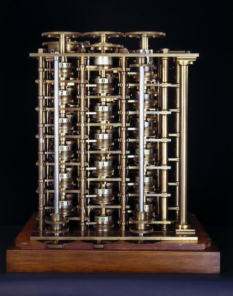

import { VideoEmbed } from "@site/src/components/VideoEmbed";

“I begin to understand Death; which is going on quietly & gradually every
minute, & will never be a thing of one particular moment" - Ada Lovelace

<!-- truncate -->

## Introducción

¿Alguna vez te pusiste a pensar cómo en la cultura popular tenemos un "almacén"
de nombres de personas relevantes por haber sido pioneros en algo? Es muy fácil
ponerlo a prueba:

- Si te digo Thomas Edison, vas a pensar en una lamparita... (o fonógrafo... o
  corriente continua... el tipo hizo bastantes cosas ok)
- Hermanos Wright, aviones.
- Ford, producción en cadena (aunque seguro pienses en automóviles primero).
- Fleming, penicilina.
- Graham Bell, teléfono.

Y la lista podría seguir.

Hay un nombre que quizás no se encuentre dentro de ese metafórico almacén de la
cultura popular. Si buscamos en Google el término "first programmer" (en inglés
a propósito para evitar caer en géneros), vamos a ver esto como resultado:

La primera programadora fue una mujer llamada Ada Lovelace. Distinción
importante: no fue la primera _mujer_ programadora. Fue **LA** primera
programadora.\*

Si estás sumergido en el ámbito de la informática quizás no te sea una
revelación tan grande. Después de todo es un "fun fact" que se comparte a
menudo. Pero... ¿primera programadora de qué lenguaje? ¿En qué computadora? ¿Qué
programó?

Para responder esto vamos a tener que desviarnos un poco y hablar
momentáneamente de otra persona y sus inventos.

_\* Esta es una afirmación controversial. Mucha gente se enojó, se enoja, y se
va a seguir enojando al oírla. En parte es porque en algunos casos es difícil
demostrar ser haber sido el primero en algo. Y por otro lado, está el tema de
que Ada fue una mujer, y hay gente estúpida que no le gusta eso._

## Tablas de matemática

Ada nació en el 1815... más de 100 años antes de que Alan Turing propusiese el
concepto de una
["máquina universal de cómputo"](https://en.wikipedia.org/wiki/Turing_machine).
No existían computadoras electrónicas. Ni siquiera electromecánicas. Ni de
ningún tipo, realmente. Lo único que había, desde tiempos de Pascal, eran
calculadoras mecánicas. Pero a pesar de su existencia no eran ampliamente
utilizadas.

Aún así, el mundo seguía girando, y la gente necesitaba una forma práctica de
resolver algunas cuentas. Los astrónomos seguían estudiando los astros y sus
movimientos. Aquellos que zarpaban hacia el mar dependían de la matemática para
la navegación. ¿Cómo hacían?

Dependían de
[reglas de cálculo](https://es.wikipedia.org/wiki/Regla_de_c%C3%A1lculo) y
tablas de matemática.

_Figura 1: Tabla de logaritmos naturales.
[Video de ejemplo que muestra cómo se usan](https://www.youtube.com/watch?v=VRzH4xB0GdM)_

Estas tablas eran hechas por calculadoras humanas. Es decir que alguien (o mejor
dicho, un grupo de personas) se tenía que sentar y calcular los números
correspondientes para cada fila y columna. Y después, traspasarlos de forma
limpia para que sea impreso en un libro. Un proceso lento, costoso, y propenso a
errores. Pensalo, ¿cuántas veces calculaste mal un resultado (encima sin tener
calculadoras para ayudarte)? Y no solo eso, si estás copiando una gran cantidad
de números (1.9523925578232382398) es muy probable que "intercambies" los
decimales de lugar sin darte cuenta o cometas algún error.

**Charles Babbage** notó que los diferentes libros de tablas matemáticas de su
época tenían valores distintos entre sí. Seguramente un producto de los errores
mencionados anteriormente. En base a eso tuvo una novedosa idea: hacer una
máquina automática que calculara los números y que los fuese imprimiendo a
medida que los obtenía.

## Babbage y la Máquina Diferencial

Esta máquina es conocida como la "Máquina Diferencial" o "Difference engine".

A diferencia (NO ES UN CHISTE. NO TENGO OTRA FORMA DE DECIRLO.) de las
calculadoras que conocemos hoy en día en las cuales podemos realizar varias
operaciones, la Máquina Diferencial era una calculadora con un fin específico:
resolver polinomios utilizando el método de "diferencia finita" (del cual se
deriva el nombre del aparato).

Con este método podemos interpolar polinomios. La interpolación es una forma de
aproximar valores, y puede ser utilizada para aproximar los resultados de
funciones trascendentales, tales como las logarítmicas o trigonométricas.
Funciones que son tediosas y requieren muchos pasos para calcularlas "a mano",
sin recurrir a aproximaciones.

En criollo: con esta máquina serías capaz de generar muchas de las tablas que
eran ampliamente utilizadas en la época, todo de forma automática, en poco
tiempo, y sin errores.

Babbage, quien definitivamente no saltaba, consiguió financiamiento del gobierno
británico para construir la máquina. El tema de las tablas de matemática era de
gran interés para los británicos, ya que eran un imperio con una gran fuerza
naval (en realidad después de las guerras napoleónicas eran **el** imperio
naval), y como mencionamos anteriormente, la navegación de los mares requería
del uso de tablas.

El problema es que todavía seguimos en el 1800, donde no existe nada más que una
solución mecánica a nuestros problemas. Babbage comenzó a hacer su "Difference
Engine No. 1", pero se enfrentó a diversos desafíos de ingeniería, precisión,
plata y tiempo.

Nunca logró construirla, más allá de un pequeño prototipo que consta de 2000
piezas.

En total la _Máquina Diferencial Número 1_ iba a estar formada por 25 mil piezas
(de las cuales, 14 mil fueron creadas, y las 12 mil restantes que no fueron
usadas las fundieron) y ser tan grande como una locomotora.

Sin embargo, la historia de la Máquina Diferencial no termina acá.

Babbage pasó un tiempo pensando en una
máquinasorpresadelacualhablaremosenlapróximasección, y luego de eso, tuvo la
idea de mejorar el diseño de la _Máquina Diferencial Número 1_ y hacer su
secuela.

La _Máquina Diferencial Número 2_ iba a estar formada por tan solo 8000 piezas y
ser tan grande como una locomotora (pero no como la locomotora de la primera
versión, una más chiquita). Babbage creó todos los planos y...

...la máquina jamás fue construida mientras él estuvo con vida.

En 1985 el Museo de Ciencias de Londres decidió poner a prueba los planos de
Babbage y empezaron la construcción del aparato. A pesar de la tecnología
moderna de la que disponían, tardaron 17 años en construirlo completamente.

Los diseños de Babbage contenían errores pequeños, los cuales tuvieron que ser
arreglados. Pero fuera de eso, la máquina funciona correctamente:

<VideoEmbed src="https://www.youtube.com/embed/BlbQsKpq3Ak" />

## La Máquina Analítica y Ada Lovelace

Babbage no saltó de una versión a la otra de la Máquina Diferencial. Por un par
de años entretuvo la idea de algo mucho más complejo: la Máquina Analítica.

El "Analytical engine" no iba a ser otra calculadora de diferencias, sino una
máquina capaz de realizar diferentes tipos de operaciones (adición,
substracción, multiplicación, división, comparaciones, raíces cuadradas)
llevadas a cabo por una unidad aritmética, contaría con un almacén de números
(memoria), sería capaz de realizar bucles y procesar sentencias condicionales, y
tendría una entrada basada en tarjetas perforadas.

Básicamente, una computadora.

La idea era muy buena, pero en Inglaterra no querían saber más de Babbage. Sin
embargo, sus ideas tomaron popularidad en otros lugares, siendo invitado en 1840
a dar conferencias sobre dicha máquina en la Universidad de Turín.

En 1842 Menabrea publicó un artículo en Francés en el cual describía la Máquina
Analítica, habiéndose basado en las conferencias dadas dos años atrás.

Ada, quien años atrás había quedado fascinada con el prototipo de la _Máquina
Diferencial Número 1_, tuvo la idea de traducir el artículo al inglés para que
sea publicado en Inglaterra. No solo eso: expandió el artículo original
añadiendo extensas notas (**tres veces** más largas que el artículo original)
acerca del funcionamiento de la máquina analítica y las capacidades que tendría
la misma.

Lo cual no es una tarea menor: científicos de la época no entendían bien de qué
iba la cosa, la alta sociedad británica no estaba interesada en la máquina, y
por sobre todo, ¿cómo le explicás a alguien en el 1800 que estás haciendo una
máquina capaz de ser "programada con tarjetas perforadas" que puede ser usada
para resolver distintos problemas?

## El primer algoritmo/programa de computación

La última de las notas de Ada, la Nota G, contiene un algoritmo que calcularía
los [números de Bernoulli](https://en.wikipedia.org/wiki/Bernoulli_number)
utilizando la Máquina Analítica.

Este es el primer algoritmo/programa en ser publicado que haya sido creado para
ser ejecutado en una computadora.

Babbage había creado algunos programas por su cuenta, pero nunca salieron a la
luz, y además, ninguno era tan refinado ni sofisticado como el trabajo que hizo
Ada.

Lamentablemente, este algoritmo nunca pudo ser ejecutado en la Máquina
Analítica, ya que la misma nunca se construyó (algo recurrente para este tipo de
máquinas de Babbage, por lo visto). Mucho tiempo después fue traducido a
lenguajes modernos de programación para ser puesto a prueba, y quizás en un
hecho que la define todavía más como la primera programadora, se descubrió que
el programa tenía un pequeño error tipográfico y no funcionaría correctamente.

Aplicando una corrección, el programa es capaz de calcular los números de
Bernoulli sin problema.

## Más que solo la primera programadora

La Nota G de por sí es algo fascinante, pero hay algo que lleva el trabajo de
Ada todavía más lejos.

En sus primeras notas, Ada imagina que los números de la Máquina Analítica
podrían ser utilizados para representar letras del alfabeto, o símbolos,
pudiendo generar programas para manipular los mismos. Incluso pensó que podría
ser utilizado para crear música:

_Again, it might act upon other things besides number, were objects found whose
mutual fundamental relations could be expressed by those of the abstract science
of operations, and which should be also susceptible of adaptations to the action
of the operating notation and mechanism of the engine. Supposing, for instance,
that the fundamental relations of pitched sounds in the science of harmony and
of musical composition were susceptible of such expression and adaptations, the
engine might compose elaborate and scientific pieces of music of any degree of
complexity or extent._

Y esto es algo de por sí muy interesante. Ada estaba expandiendo inmensamente
las capacidades de la máquina. No solo ibas a poder hacer cuentas y resolver
algo matemático. Ibas a poder escribir un programa capaz de calcular y resolver
cualquier cosa que sea computable, mientras fueses capaz de dar con las
instrucciones adecuadas.

Una
[máquina universal de computación](https://en.wikipedia.org/wiki/Turing_machine#Universal_Turing_machines).
Algo que se le ocurrió a Turing mucho tiempo después allá por 1930.

## Impacto

Lamentablemente las ideas de Babbage y Ada tuvieron nulo impacto en la
computación que conocemos hoy en día.

Las máquinas nunca lograron construirse en su época, por lo que el potencial de
las mismas nunca pudo ser visto. Con el paso del tiempo nadie le prestó atención
a los diseños, quedando olvidado.

Además... la vida de Ada tuvo un desenlace trágico, muriendo increíblemente
joven a la edad de 36 años.

Cuando se comenzó con la computación electromecánica/digital, sus ideas ya
habían sido olvidadas.

Solo nos queda pensar qué hubiera pasado si hubiese vivido más tiempo,
aprovechando los desarrollos tecnológicos (como los relacionados al
[electromagnetismo](https://linternita.com/blog/accion-a-distancia-ebooks)) que
se iban dando en la época.

## Notas finales

La historia en realidad es mucho más extensa e interesante. Por dar unos
ejemplos:

- Babbage hacía fiestas donde mostraba la Máquina Diferencial. A esas fiestas
  asistía gente como Charles Darwin, Charles Dickens, y muchos otros Carlos.
- Ada era amiga de Florence Nightingale, la fundadora de la enfermería moderna.

Recomiendo leer este blog de Stephen Wolfram, donde la cuenta en gran detalle,
incluso mostrando correspondencia entre Babbage y Ada:
https://writings.stephenwolfram.com/2015/12/untangling-the-tale-of-ada-lovelace/

_Dedicado a Ada, 2011 - 2024._
