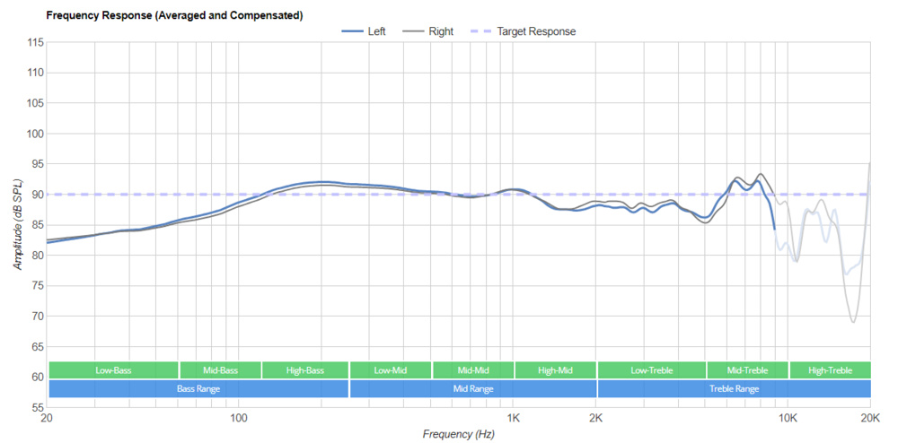
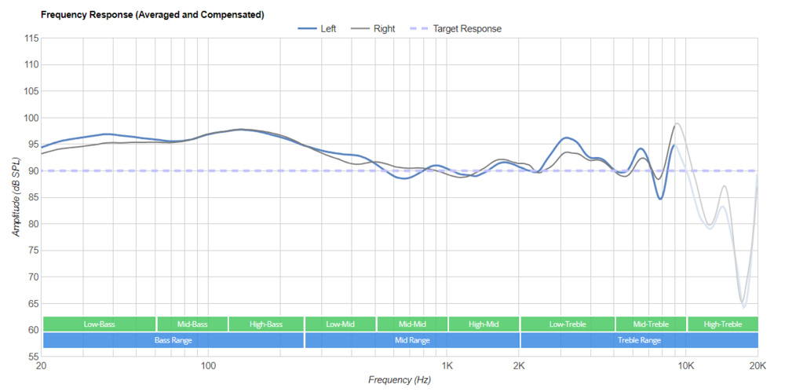
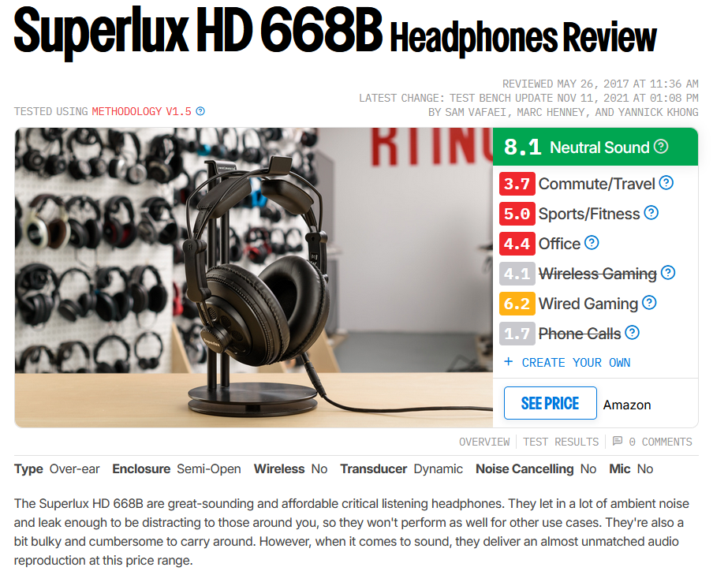
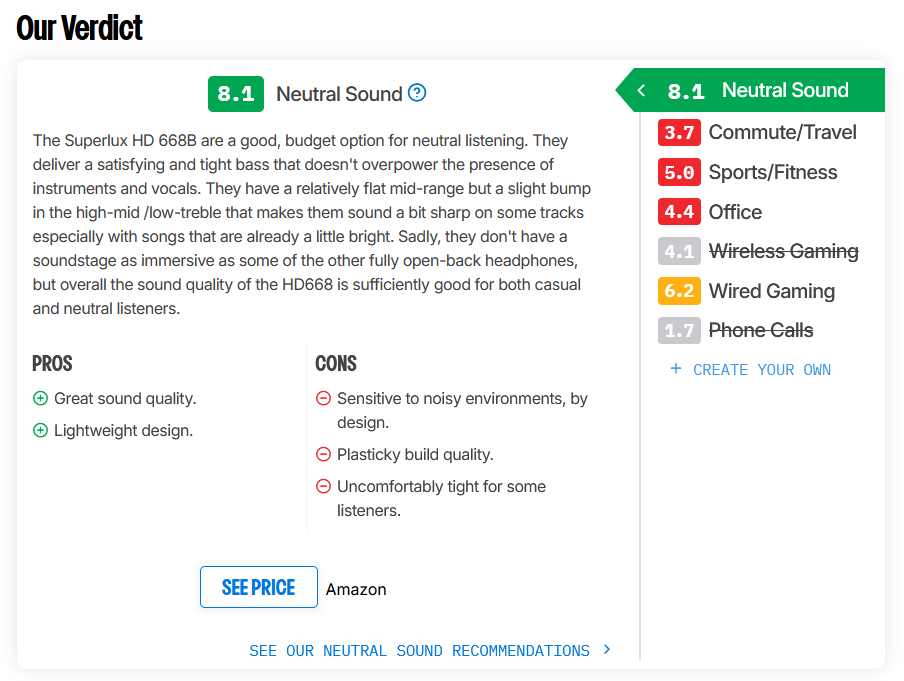

import { VideoEmbed } from "@site/src/components/VideoEmbed";

Consejos y recomendaciones a la hora de elegir un auricular.

<!-- truncate -->

## Introducción

Durante gran parte de mi vida nunca me interesó demasiado el tema de la calidad
del audio/música. Si tuviera que armar una línea de tiempo sobre cómo fue
evolucionando la importancia que le daba, sería algo así:

1. parlantes conectados a la PC ==>
2. auriculares Panasonic ["retro"](retro-panasonic.jpg) ==>
3. auriculares Panasonic random ==>
4. auriculares Motorola Pulse Escape Bluetooth ==>
5. **auriculares Superlux HD668B ==>**
6. auriculares Beyerdynamic DT 770 PRO

Los auriculares Superlux HD668B fueron un punto de inflexión. La mejor forma que
tengo de explicar por qué es: imaginate reproducir un tema que conocés de
memoria y empezar a reconocer instrumentos o cosas que _no_ habías escuchado
antes. Es revelador, como si pasaras de ver una película con la mitad de la tele
tapada a verla completa, te das cuenta que estabas perdiéndote de algo todo ese
tiempo.

No solo eso: también estaba cansado de que se me rompieran seguido. Los
"auriculares Panasonic random" pasaron por la punta de un soldador decenas de
veces. Un auricular decente te va a durar mucho más (por más que lo maltrates,
tires al piso, tironees o aplastes los cables, o reproduzcas algo como Taylor
Swift en ellos).

Y lo mejor de todo es que no hace falta gastar tanta\* plata.

_\*Esto es algo relativo._

## Tipos de auriculares

Hay distintos tipos de auriculares. Algunos son mejores o peores dependiendo de
la situación en la que estés.

Nota: todas las ventajas y desventajas que se van a mencionar a continuación son
"por lo general". Todo depende del auricular en sí. No puedo decir que todos los
auriculares Over Ear son buenos. Es como decir que todos los autos sedán son
buenos autos.

### Over Ear

Estos auriculares son los que te cubren la oreja entera. Suelen ser grandes, lo
que hace que sean muy cómodos de usar, pero también reduce su portabilidad. Al
cubrirte la oreja entera tienen una buena aislación del ruido. Pero como son
grandes, pueden tener filtraciones de audio (la gente a tu alrededor puede
escuchar lo que estás escuchando).

### On Ear

Parecidos a los Over Ear, pero en vez de cubrirte la oreja entera, se posan
sobre las orejas. Son más pequeños, un poco menos cómodos, un poco más
portables, con peor aislación del sonido y más filtración del audio.

### Earbuds

Son los clásicos auriculares que hasta hace unos años venían en las cajas de los
celulares. Se posicionan por sobre el canal auditivo de la oreja. La mayor
ventaja es la portabilidad (son extremadamente pequeños). Después el resto de
cosas es un desastre: no son cómodos, tienen pésima aislación del sonido, y
filtran audio.

### In Ear

In Ear o también conocidos como In Ear Monitors (IEM). Parecidos a los Earbuds,
pero en este caso se posicionan _dentro_ del canal auditivo. Gracias a esto
actúan como si fueran un tapón (como los tapones protectores), lo que da una
gran aislación de sonido y previenen filtración del mismo. Retienen la gran
portabilidad de los Earbuds, pero pueden llegar a ser más incomodos (después de
todo, te los estás insertando en la oreja).

### ¿Cuál es mejor?

Nuevamente, depende de la situación en la que estés. Si vas a ir a un gimnasio y
querés escuchar música mientras entrenás, puede resultar bastante incómodo estar
usando unos armatostes Over Ear. Una mejor opción serían Earbuds o In Ear.

La forma del auricular tiene una débil correlación con la calidad del sonido.
Podés comprar unos Over Ear horrendos y tener unos Efarbuds que se escuchen
mejor. Aún así, algunas formas tienen ventajas inherentes por el diseño de las
mismas (ver el caso de los In Ear, que al ser casi como tapones proveen gran
aislamiento y poca filtración).

_\* Si querés ver una comparación más extensa y en detalle, visitá
[esta entrada de RTINGS.com](https://www.rtings.com/headphones/learn/over-ear-vs-on-ear-vs-in-ear-vs-earbuds-comparison),
de la cual robé sin ningún consentimiento las imágenes y no daré crédito alguno
a RTINGS.com por las mismas._

## Frecuencia de respuesta

Algo que sí determina la calidad del sonido (o mejor dicho, cómo suena) es la
frecuencia de respuesta de un auricular.

La frecuencia de respuesta indica qué tan bien puede reproducir un auricular
distintos rangos de frecuencia. Suele ser mostrado en mostrado en un gráfico
similar a este:

_Figura 1: frecuencia de respuesta de un auricular "neutral"_

Para mantenerlo simple: las partes donde la curva tiene mayor amplitud (donde
"está más alta") indican qué tan "fuerte" (volumen) reproduce esa frecuencia el
auricular.

Si vemos un gráfico donde la curva tiene mayor amplitud en el rango de
frecuencias de los sonidos graves (o bajos, o _bass_), significa que ese
auricular reproduce más fuerte ese tipo de sonidos. Lo mismo aplica para el
resto de las frecuencias.

El gráfico de la Figura 1 pertenece a unos auriculares con una frecuencia de
respuesta "neutral", donde todo se encuentra balanceado. Este tipo de
auriculares son generalmente usados por los que producen música o realizan
edición de sonido, ya que el audio es "natural".

Este otro gráfico muestra un auricular que resalta los graves:

### ¿Qué es mejor? ¿Algo neutral? ¿Algo que resalte los graves?

Esto es altamente subjetivo. Si solés escuchar música con muchos graves, un
auricular con frecuencia de respuesta grave va a ser que sea mucho más
divertido. Si producís música o trabajás editando sonido, necesitás algo neutro.

_\* Existen muchos tipos de frecuencia de respuesta más allá de esos dos. En
esta
[entrada de la página RTINGS.com](https://www.rtings.com/headphones/tests/sound-quality/raw-frequency-response)
hay una explicación más detallada y extensa._

## Ok buenísima explicación Linternita pero cómo elijo un auricular bueno que me deje escuchar La Resaka en 4K?

Es algo difícil. Existen muchos modelos y marcas de auriculares. Si tan solo
existiera una página donde evaluaran auriculares de forma metódica y les
asignaran una puntuación o rating a los mismos...

  

RTINGS.com es una página que evalúa de forma metódica auriculares (y muchos
otros productos), asignándoles una puntuación o rating a los mismos:
https://www.rtings.com/headphones

Las reviews que realizan son exhaustivas, evaluando todos los aspectos que
mencioné antes (comfort, portabilidad, aislación, filtración, calidad del
sonido) y muchos otros más.

Por ejemplo, estas dos imágenes son una parte de la
[review de los Superlux HD668B](https://www.rtings.com/headphones/reviews/superlux/hd-668b):

La página _no_ tiene una review de todos los auriculares que existan, pero si lo
que estás buscando es medianamente conocido, seguramente lo tenga. Para darse
una idea, los auriculares Superlux son una cosa China Muy China, y sin embargo
están ahí.

## No me gusta esa página porque tiene mucho texto

En su momento, el canal de YouTube DankPods solía hacer bastantes vídeos
comparando auriculares. Es un buen punto de partida decente para conocer
distintos auriculares y formar una opinión sobre los mismos:

<VideoEmbed src="https://www.youtube.com/embed/V_gf8TZ1M6g" />

En este video en específico muestra auriculares baratos, pero decentes. No hace
falta gastar una millonada para tener un auricular que se escuche _bien_.
Incluso hay un Superlux metido por ahí \<3.
