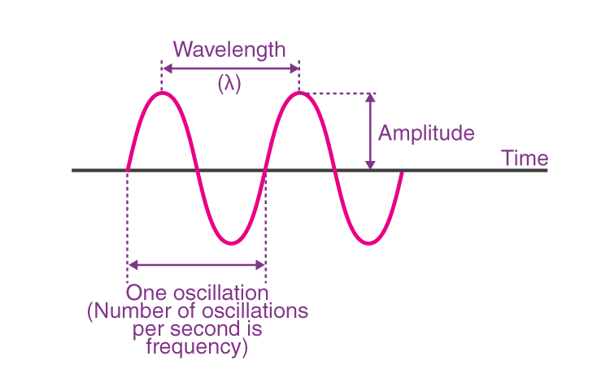
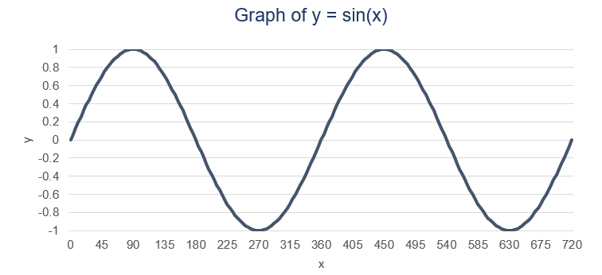
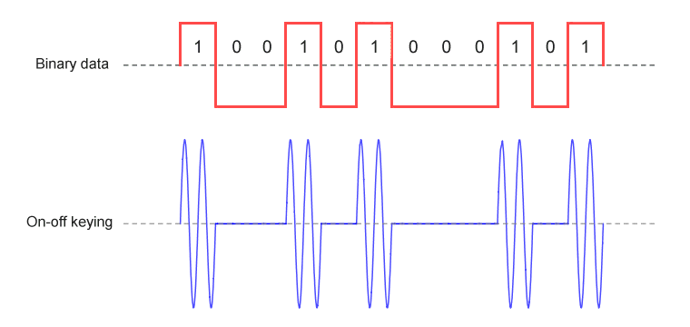
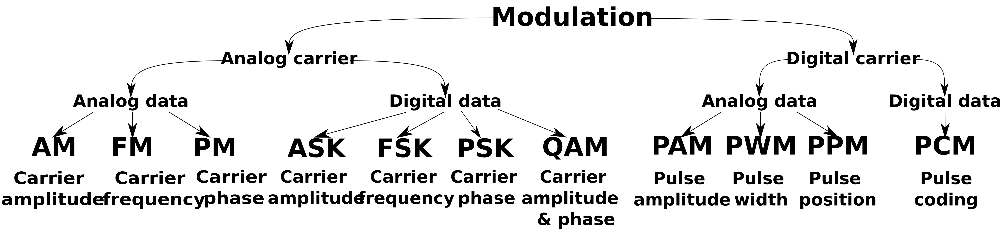
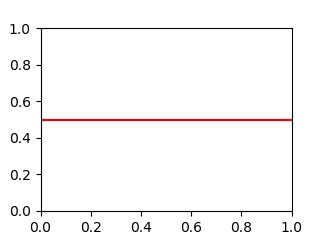

import { VideoEmbed } from "@site/src/components/VideoEmbed";
import audioUrl from "./audio.wav";

Probablemente la peor forma de transmitir datos jamás creada.

<!-- truncate -->

## Introducción

¿Existe alguna otra forma de transmitir datos que no dependan de un medio
electromagnético?

Pensá lo siguiente. Casi todas las tecnologías que transmiten datos dependen de
eso:

- Radio: ondas electromagnéticas
- Wi-Fi: ondas electromagnéticas
- GPS: ondas electromagnéticas

_Algún-Lector-Avispado: Sos re vivo Linternita. Estás listando todas cosas
inalámbricas. Obviamente dependen del electromagnetismo._

Pero lo mismo pasa con medios alámbricos\*:

- El audio que llega a tus auriculares: variaciones de voltaje (electricidad) en
  un cable
- El internet que llega a tu computadora: variaciones de voltaje (electricidad)
  en un cable
- Un cable submarino de fibra óptica: transmite pulsos de luz (más
  electromagnetismo!!!!)

_\* palabra que **algunos** dicen que no existe. yo creo que sí existe. ¿de
dónde salió inalámbrico si no?_

Un ejemplo más extremo y rebuscado: incluso las personas sordas que se comunican
con lenguaje de señas dependen del electromagnetismo. Después de todo, solo
pueden ver las señas que realiza otra persona gracias a los fotones que rebotan
de las manos de la misma y llegan a los ojos del receptor.

Pero hay una forma de comunicar datos que no depende del electromagnetismo: el
sonido\*.

_\* En realidad el sonido no es la única forma, pero tengo una narrativa que
seguir._

## Don't you wonder sometimes... about sound and vision?

Y sí. Obvio que el sonido se usa para transmitir datos. ¿Qué es lo qué pasa
cuando hablás, si no? ¿Cuando te comunicás con otra persona?

Lo "interesante" (con muchas comillas) es que el sonido no es un fenómeno
electromagnético. Cuando hablamos (o producimos algún sonido) no estamos
alterando el campo electromagnético que nos rodea. Lo que alteramos son
partículas que están dispersas en el aire, haciendo que se muevan, y ese
movimiento es interpretado como sonido por nuestros oídos.

Cuando alteramos el campo magnético se generan ondas que viajan por el
espacio... Lo mismo sucede en el caso del sonido: cuando un parlante reproduce
música altera las partículas y genera ondas de sonido que viajan por el aire.

Las ondas, independientemente del tipo que sean, tienen algunas propiedades
importantes (amplitud, frecuencia, y quizás alguna más dependiendo del
contexto).

_Figura 1: propiedades de una onda_

En el caso de las ondas de sonido, las variaciones de estas propiedades son lo
que permiten la existencia de tantos sonidos distintos. Por ejemplo, cada cuerda
de una guitarra, al ser tocada, produce un sonido distinto. Esto es debido a que
cada una genera una onda con una frecuencia (y posiblemente amplitud) distintas,
y nuestros oídos son capaces de notar e interpretar estas diferencias.

Esta capacidad que tenemos para alterar las propiedades de una onda es algo que
podemos explotar para transmitir información.

Pero... ¿cómo?

## Modulación

Pongamos el foco en una señal conformada por una onda sinusoidal común y
corriente:

Para este ejemplo podemos asumir que, así como está, no parece estar
transmitiendo mucha información... No hay cambios en la onda a lo largo de
tiempo, por lo que la señal\* permanece igual todo el rato.

_\* En el área de la teleinformática, las ondas que transmiten información
reciben el nombre de señales._

Pero, como dije antes, somos capaces de alterar las propiedades de una onda.
Podemos cambiar su amplitud o su frecuencia. Y luego, cuando interpretemos esa
señal, podemos capturar distintos datos en base a esos cambios.

Este proceso de alterar las propiedades de una onda para transmitir datos recibe
el nombre de _modulación_.

La forma más fácil de modular una onda es la
"[modulación prende y apaga](https://en.wikipedia.org/wiki/On%E2%80%93off_keying)".
Esta modulación trabaja sobre la amplitud de la onda y básicamente hace lo
siguiente: para representar un 1, aumentamos la amplitud de la onda durante
cierta cantidad de tiempo. Si queremos representar un 0, bajamos la amplitud
(hasta reducirla completamente) por la misma cantidad de tiempo.

Cuando procesemos la señal para extraer datos, cada vez que veamos alta amplitud
vamos a traducirlo como un 1, y cada vez que no haya amplitud alguna podemos
interpretarlo como un 0.

Esta no es la única forma de modulación que existe, hay muchas más. Otras en vez
de alterar la amplitud realizan cambios en la frecuencia de una señal. Pero la
modulación por amplitud es de las más fáciles de implementar y usar.

## Transmitiendo datos con sonido

Por fin llegamos a la parte principal de este post.

Ya sabemos cómo transformar una onda para convertirla en una señal que transmita
datos, en este caso, 1s y 0s. Sabiendo esto debería ser bastante simple armar
nuestro propio sistema de transmisión de datos con sonido, ¿no?

Más o menos. Acá hay unas cosas con las que me fui encontrando a medida que
avanzaba con el sistema.

### Generando sonido con una computadora

El sonido es algo analógico, pero las computadoras trabajan con datos digitales
(1s y 0s). Si tenés un archivo de audio y lo inspeccionás, no vas a encontrar
nada más que bits, datos en binario. Cuando lo reproducís, esos datos son
interpretados y convertidos a una señal analógica... es decir, sonido que podés
escuchar.

Explicar todo ese proceso de forma detallada me llevaría un post (o más de uno)
entero.

Vamos a ignorar todo eso. Lo importante es que una de las formas más fáciles de
generar sonidos con una computadora es creando un archivo en formato WAV.

Como no quiero complicarme la vida, y como vamos a utilizar "modulación prende y
apaga", mi idea era generar un archivo de audio que solamente contenga pitidos.

La pregunta es: ¿cómo genero una onda de sonido que suene como un pitido?

Al principio pensé que era tan fácil como asignar un valor constante y llenar el
archivo WAV con eso. Algo como esto:

Obviamente... no funcionó. Un valor de amplitud constante no representa una
onda. Una onda tiene cambios de amplitud (o frecuencia) a lo largo del tiempo.
Un parlante se mueve mecánicamente, siguiendo los cambios de amplitud/frecuencia
de una onda, y eso es lo que produce sonido realmente.

En mi caso como generé una amplitud constante a lo largo del tiempo, los
parlantes no hacían sonido alguno.

Entonces tuve que realmente generar una onda. La más simple de generar es una
onda sinusoidal, y lo podemos hacer siguiendo su
[ecuación](https://es.wikipedia.org/wiki/Sinusoide#Caracter%C3%ADsticas).

Mientras las variaciones de amplitud se mantengan constantes en el tiempo (y la
frecuencia no cambie), la onda va a sonar como un pitido.

### Modulando el sonido

Habiendo aprendido como generar pitidos, resulta fácil aplicar la modulación
prende y apaga.

- Pitido por X tiempo = 1
- Ausencia de pitido por X tiempo = 0

Podríamos transmitir cualquier secuencia binaria con eso. Pero para hacerla
simple, decidí modular texto convertido a binario usando el estándar ASCII.

El texto **hola mundo!** puede ser representado en binario de la siguiente
forma: 01101000 01101111 01101100 01100001 00100000 01101101 01110101 01101110
01100100 01101111 00100001

Donde cada conjunto de 8 dígitos binarios representa un carácter del texto.

Así suena el archivo de audio generado:

<audio src={audioUrl} controls></audio>

### Demodulando el sonido

Demodular consiste en aplicar el proceso inverso: extraer la información de la
onda.

Como estamos usando modulación prende y apaga, el proceso sería algo como esto:
analizamos la señal, y cuando notemos amplitud alta por cierto periodo de
tiempo, guardamos un 1. Si no encontramos amplitud alta por cierto periodo de
tiempo, guardamos un 0.

Suena simple, pero supongamos que estamos procesando el sonido en tiempo real.
¿Cómo sabemos cuándo empieza y cuando termina nuestra transmisión de datos?
Porque si estás escuchando el audio en tiempo real, seguramente captures otros
sonidos (o ausencia de) que no sean parte de tu señal... Y no deberías procesar
esos como datos.

Además, sin saber cuándo realmente empieza tu señal, te va a costar identificar
cada pitido. Recordá que cada pitido tiene una duración. Si identificás mal el
inicio de tu señal, podés perder datos, o interpretarlos de forma incorrecta.

Mi solución fue bastante primitiva y consiste de dos partes:

- El primer pico de amplitud es el comienzo de mi señal
- La señal no solo transmite los bits del texto, sino también un patrón
  predefinido que es añadido al comienzo y a final de la misma

Una vez detectado el pico de amplitud empiezo a analizar la señal. Para
interpretar cada pitido, divido la señal en "secciones" (cuyo tamaño es dictado
por la duración del pitido, algo que es fijo y conocido de antemano). Para saber
si cada "sección" representa un 1 o un 0, calculo en la que el valor absoluto de
la amplitud es alto ("alto" es arbitrario en este caso). Si la cuenta supera un
límite (arbitrario nuevamente), lo interpreto como un 1.

Después de haber interpretado la señal, voy a tener un conjunto de 1s y 0s.
Dentro de ese conjunto va a estar incluido el patrón que fue añadido al comienzo
y final de la señal. Nuestra información (el texto transmitido) está encapsulado
dentro. Por lo tanto, podemos ignorar cualquier cosa que hayamos captado antes
del patrón del inicio, y después del patrón que está al final.

Luego simplemente convertimos los bits en texto ASCII y ahí tenemos nuestra
información.

### Demo

Blablablablabla mucho texto zzzzzzzzzzz.

Acá hay una demostración en video de todo essto funcionando en la vida real:

<VideoEmbed src="https://www.youtube.com/embed/ARSIg6EtaA0" />

Y acá hay un repositorio con el código horrible que hice:
https://github.com/Squiro/sound-modulation-poc

## Notas finales

El código que hice es algo bastante ingenuo y primitivo, y la parte de
demodulación falla bastante más de lo que funciona correctamente.

La modulación prende y apaga tampoco es la más eficiente del mundo. Podríamos
mejorar las cosas usando otro tipo de modulación (basada en cambios de
frecuencia, por ejemplo), pero eso volvería más complicado programar una
solución a este problema.

Todo esto de transmitir datos con sonidos no es algo innovador. Es algo bien
sabido. El problema es que no tiene un uso práctico en la vida real, más allá de
algún proyecto "divertido" de hacer como este.

Existe un proyecto más elaborado y que funciona muchísimo mejor, el cual usa
modulación por frecuencia: https://github.com/ggerganov/ggwave

Esta página explica ondas de sonido y me pareció muy bien hecha:
https://pudding.cool/2018/02/waveforms/
