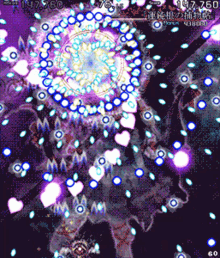
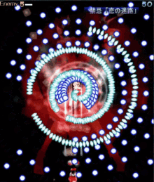
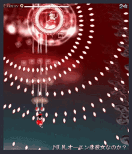
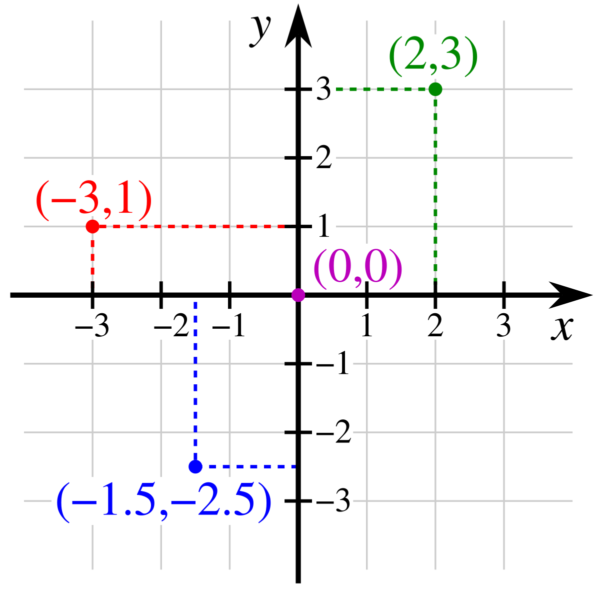
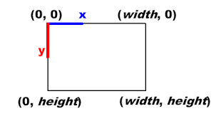
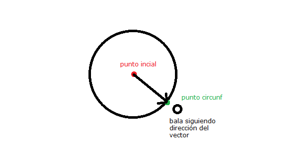
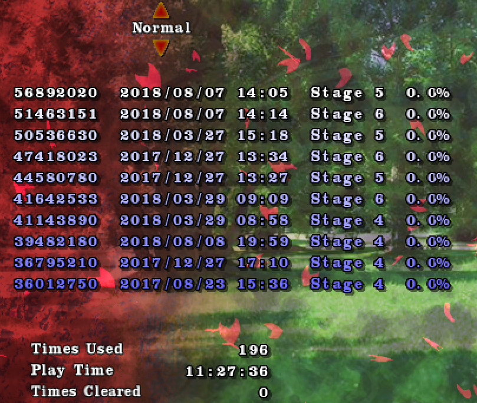

import { VideoEmbed } from "@site/src/components/VideoEmbed";
import circular1Url from "./circular-1.mp4";
import circular2Url from "./circular-2.mp4";
import sinusoidal1Url from "./sinusoidal-1.mp4";
import rotating1Url from "./rotating-1.mp4";
import rotating2Url from "./rotating-2.mp4";

Retomando algo que dejé inconcluso desde 2018.

<!-- truncate -->

## Introducción

Un bullet hell es un género de juego que juega la gente que está mal de la
cabeza. Acá abajo algunos gifs de ejemplo<sup>[1](#note-1)</sup> sacados de
Google:

<div style={{
    display: "flex",
    "justify-content": "space-between",
  }}>







</div>

_<sup><a name="note-1">1</a>:</sup> Por alguna razón son todos de
Touhou<sup>[2](#note-2)</sup>._

_<sup><a name="note-2">2</a>:</sup> La concha de tu madre Ten Desires._

Si no quedó claro con los gifs, una parte fundamental de estos juegos son los
"patrones de balas". Cada enemigo/jefe tiene distintos ataques en los cuales
generan balas siguiendo un patrón, y la idea es que vos como jugador te los
aprendas para evitar colisionar con de ellas... y eventualmente ganar. O algo
así.

Siempre me interesó saber cómo se crean esos patrones y ver si podría
replicarlos.

## Creando un juego fácil y rápido!!

Hay mil formas de crear un juego hoy en día. Existen variedad _engines_ y
_frameworks_ distintos, tales como Unity, Unreal, Godot, GameMaker, etc, etc.

Como simplemente quiero aprender a crear estos patrones, mi objetivo ahora mismo
no es gastar tiempo con ningún engine grande ni complicado. Necesito algo rápido
y flexible.

Algo como...

<div
  style={{
    display: "flex",
    "justify-content": "center",
  }}
>
  
</div>

[Phaser](https://phaser.io/) es un framework para crear juegos basado en
JavasScript. Surgió allá por 2013 y, sorprendentemente, sigue siendo activamente
desarrollado.

Es bastante simple y fácil de aprender a usar. Viene con un montón de métodos y
cosas resueltas para que uno no se mate reinventando la rueda. Y al estar basado
en JavaScript, le añade esa temida flexibilidad que tiene dicho lenguaje.

Además de todo eso, decidí usarlo porque ya tenía experiencia previa con el
mismo. Y esto es básicamente lo que hice: agarré y descargué el juego demo
_Phaser's Revenge_ y lo empecé a modificar ligeramente para centrarme en la
creación de los patrones de balas.

## Sistema de coordenadas

Los videojuegos utilizan sistemas de coordenadas para saber dónde posicionar los
objetos que aparecen en la pantalla.

Como estoy centrándome en algo 2D, asumí que el sistema de coordenadas utilizado
por este framework eran las clásicas coordenadas cartesianas:



**ERROR. NO LO ES.**

Es un sistema de coordenadas muy similar al cartesiano, pero en este caso, el
origen de las coordenadas suele estar en el borde izquierdo superior de la
pantalla, y el eje Y se encuentra invertido (en comparación con el de las
coordenadas cartesianas). Algo así:

<div
  style={{
    display: "flex",
    "justify-content": "center",
  }}
>
  
</div>

**¿Afecta en algo esto?**

Más o menos. Si seguía asumiendo que estaba bajo un sistema cartesiano, la
posición de las balas crease estaría mal.

Salvo eso, el resto de las cosas debería funcionar de igual manera.

## Creando un patrón circular: balas que giren alrededor del enemigo

Para este patrón mi objetivo es que se creen N balas y que estas empiecen a
girar alrededor del enemigo.

Para simplificar el tema, puse al enemigo en el centro absoluto de la pantalla.

**¿Cómo puedo generar un círculo alrededor de él?**

Haciendo memoria de análisis matemático, existe una forma muy simple de
"dibujar" un círculo centrado en un punto: usando la
[ecuación paramétrica de la circunferencia](https://es.wikipedia.org/wiki/Ecuaci%C3%B3n_param%C3%A9trica#Circunferencia).

De esta forma, puedo calcular cuantos puntos (X, Y) quiera, cada uno de ellos
pertenecientes a la circunferencia.

El siguiente fragmento de código devuelve un punto (X, Y) dados los siguientes
parámetros:

- CX: coordenada X del centro del círculo
- CY: coordenada Y del centro del círculo
- Radius: radio del círculo
- Degrees: cantidad de grados / ángulo

```javascript
export const getCirclePoint = (cx, cy, radius, degrees) => {
  const radians = degToRad(degrees);
  const x = cx + radius * Math.cos(radians);
  const y = cy + radius * Math.sin(radians);

  return {
    x,
    y,
  };
};
```

Ese método devuelve _un_ solo punto. Pero yo quiero crear varias balas.

Para crear N balas espaciadas de forma uniforme, puedo dividir los 360 grados de
un círculo por X cantidad de grados. Por ejemplo, si quisiera una separación de
72 grados entre bala y bala, calculo **360 / 72 = 5**, donde **5** es la
cantidad de balas que serán creadas.

El siguiente método realiza la creación de esas N balas:

```javascript
export const createCircularPattern = ({
  cx,
  cy,
  radius,
  degreeInterval,
  bulletGroup,
}) => {
  const numberOfBullets = Math.ceil(360 / degreeInterval);

  for (let i = 0; i < numberOfBullets; i++) {
    const degrees = i * degreeInterval;
    const bullet = bulletGroup.get();
    if (bullet) {
      bullet.spawn(cx, cy, radius, degrees, "enemy-bullet");
    }
  }
};
```

Aplicando estas dos cosas obtenemos lo siguiente:

<video controls style={{ width: "100%", height: "315px" }}>
  <source src={circular1Url} type="video/mp4" />
</video>

Lo cual no es muy emocionante, pero es un comienzo.

**¿Cómo hacer que cada bala empiece a girar?**

La forma más ingenua y simple que se me ocurrió fue... calcular un nuevo punto
usando la ecuación paramétrica del círculo, pero incrementando el ángulo inicial
de la bala. Una vez obtenido, actualizo la posición de la bala usando ese nuevo
punto.

Si hago esto para cada una de las balas en cada frame/update del framework,
obtenemos esto:

<video controls style={{ width: "100%", height: "315px" }}>
  <source src={circular2Url} type="video/mp4" />
</video>

Extremadamente emocionante.

## Creando un patrón sinusoidal

Para este patrón mi objetivo es que las balas formen una onda sinusoidal a
medida que se desplazan.

En este caso la ecuación/función que voy a usar es... la del seno. Es decir: **y
= sen(x)**.

Para eso creé el siguiente método, que recibe un ángulo y una amplitud como
parámetros, y retorna un valor que uso como la coordenada Y de la bala que será
generada.

```javascript
export const getSinusoidalPoint = (degrees, amplitude) => {
  return amplitude * Math.sin(degToRad(degrees));
};
```

**¿Y el valor de la coordenada X?**

No interesa mucho realmente. Las balas pueden comenzar todas en el mismo X.

Después, para aplicarles movimiento, simplemente aumento el valor de esa
coordenada en cada frame del juego para cada bala.

Y este es el resultado que obtenemos:

<video controls style={{ width: "100%", height: "315px" }}>
  <source src={sinusoidal1Url} type="video/mp4" />
</video>

## Creando un patrón rotativo

Para este patrón mi objetivo que surjan balas desde el enemigo pero que la
dirección de cada bala vaya rotando y sea distinta a la anterior.

En este caso es mejor si muestro el resultado primero y después doy la
explicación:

<video controls style={{ width: "100%", height: "315px" }}>
  <source src={rotating1Url} type="video/mp4" />
</video>

Otra vez recurrí a la ecuación paramétrica de la circunferencia. My beloved.

En este caso, todas las balas se generan en el mismo punto inicial (donde está
centrado el enemigo). Lo que cambia es la dirección de movimiento de cada una.

Para que "rote en círculos", al momento de crear la bala creo también un punto
dentro de una circunferencia, usando un ángulo único para esa bala. Después lo
que hice fue aplicar movimiento tomando la dirección del vector que se forma
entre el punto inicial de la bala y el punto de la circunferencia.

Crudamente hecho en Paint, algo así:



## Bonus: patrón rotativo x4

El patrón rotativo anterior comienza a rotar desde el ángulo 0. Si varío el
ángulo inicial y creo distintas instancias del patrón al mismo tiempo, obtenemos
esto:

<video controls style={{ width: "100%", height: "315px" }}>
  <source src={rotating2Url} type="video/mp4" />
</video>

Este patrón resulta muy parecido a uno de los que se puede discernir en el
primer gif de ejemplo al principio del post:

<div
  style={{
    display: "flex",
    "justify-content": "center",
  }}
>
  
</div>

Así que esto me dice que no estoy _tan_ alejado de la forma real en la que se
hacen estos patrones. Lo que sí, seguramente haya formas más eficientes de
hacerlo.

## ¿Todo se hace con la ecuación del círculo?

No, ni ahí. Hay patrones más complicados e interesantes. Pero la ecuación del
círculo te da una muy buena base para crear distintos patrones comunes.

<hr></hr>

Otra cosa que dejé inconclusa desde 2018 es este juego del orto:



- Times used 196

- Play Time 11:27:36

- **Times Cleared 0**

11 horas y casi 200 intentos y no me lo pasé ni una sola vez. Mamita lo malo que
soy.
