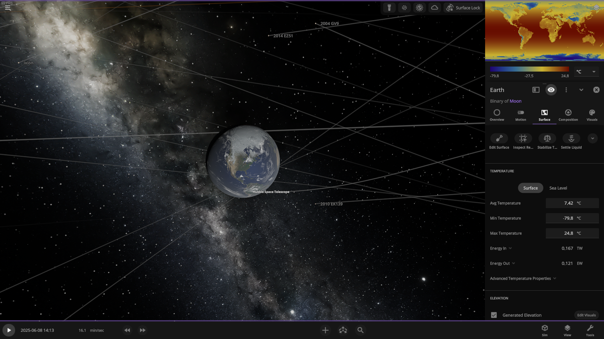
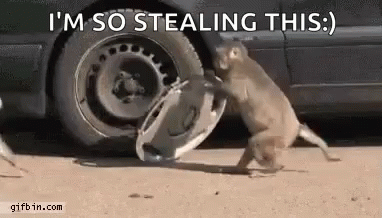
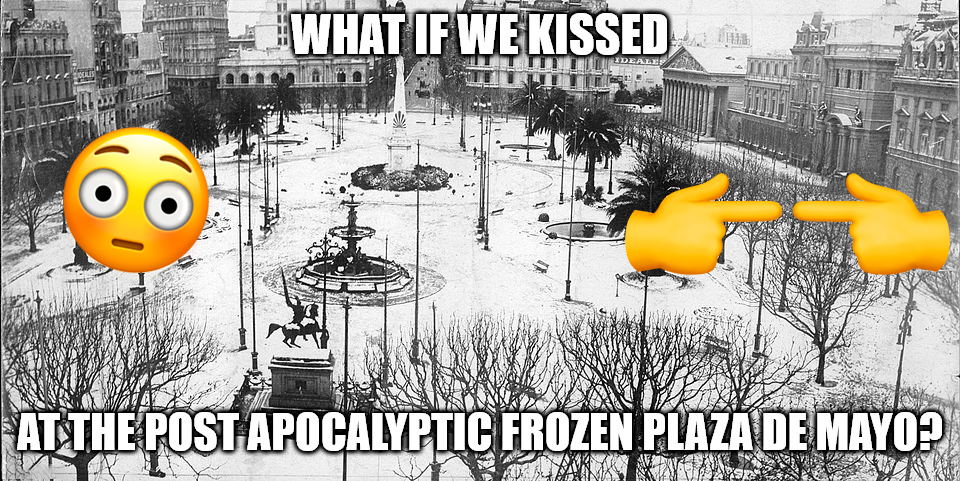

import { VideoEmbed } from "@site/src/components/VideoEmbed";
import t0 from "./T-0.mp4";
import t24temp from "./t+24-temp.mp4";
import t1wtemp from "./t+1w-temp.mp4";
import t6mtemp from "./t+6m-temp.mp4";

☀️💣💥😱

<!-- truncate -->

## T-1: 1 minuto para que el Sol desaparezca

Es un día normal como cualquier otro en el planeta Tierra. El Dow Jones abre en
alza. Hay un paro de colectivos en la ciudad de Buenos Aires. Un médico en
Estados Unidos salva a alguien que tuvo un paro cardíaco, y después le hace una
factura por 30000 dólares. En China un menor esclavizado y con precaria salud
está ensamblando el nuevo iPhone que te vas a comprar cuando salga.

Nadie sabe que en exactamente un minuto el Sol va a desaparecer.

## T-0: el Sol desaparece

<video controls style={{ width: "100%", height: "400px" }}>
  <source src={t0} type="video/mp4" />
</video>

Sin previo aviso y por intervención divina el Sol desaparece. Es una incógnita:
no tiene entidad, no está, ni muerto ni vivo, está desaparecido.

El día sigue como si nada en nuestro mundo. Aunque esa bola gigante de fuego ya
no exista, nosotros no nos vamos a dar cuenta de esto instantáneamente. Hay un
límite impuesto por las reglas de nuestro universo. Este límite dice que no hay
nada que pueda viajar más rápido que a 300.000 km/s.

Nosotros estamos bastante lejos de nuestra estrella, a unos 149.6 millones de
kilómetros. Cualquier información sobre la desaparición del Sol tardaría
aproximadamente 8 minutos en llegarnos.

Esto no solamente implica a los últimos rayos de luz emanados por la estrella:
el efecto gravitacional de la misma sobre la Tierra también tardaría esos 8
minutos en notarse.[1](#note-1)

_<a name="note-1">1</a>: Un pensamiento bastante trillado en sí, pero
esto significa que cuando mirás las estrellas a la noche, no las estás viendo en
tiempo real, si no que estás observando la luz que emitió esa estrella hace
millones de años. Posiblemente algunas de esas estrellas no existan más, pero
nosotros seguimos viéndolas._

## T+8: se cortó la luz!!

### Luz

Si justo era de noche en el lugar donde estabas, posiblemente no te des cuenta
de lo que pasó. A menos que estuvieras viendo directamente a la Luna en ese
momento. En cuyo caso, notarías como se desvanece del cielo nocturno sin dejar
rastro alguno.

Si es de día, te darías cuenta bastante rápido. De un momento a otro todo se
sumergiría en la oscuridad.

Pero no sería una oscuridad absoluta, incluso aunque no dispongamos de la Luna
para iluminarnos vagamente. Primero que nada, todavía podríamos iluminar nuestra
vida como lo hacemos actualmente: quemando combustible y contaminando nuestro
planeta con dióxido de carbono que luego aspiramos en nuestros pulmones.

Segundo, por algunos escasos minutos todavía recibiríamos la luz del Sol
reflejada en algunos de los otros planetas, como Marte o Júpiter, lo cual no es
mucho, pero es algo. Y por último, la Vía Láctea tiene muchas otras estrellas
que nos brindarían su luz. Esta sería la única forma de iluminación que nos
llegaría "desde afuera".

### Gravedad

La absencia de la luz solar sería el único cambio que notaríamos a simple vista.
Pero al mismo tiempo perderíamos la influencia gravitacional de nuestro astro.
La Tierra dejaría de orbitar y saldría "disparada" siguiendo su última
dirección. Nosotros no nos daríamos cuenta, no sentiríamos ningún cambio en
absoluto.

### Temperatura

No habría un cambio percetible en la temperatura... por ahora.

### Sociedad

El impacto más notable en la sociedad sería que la gente ya no podría decir "no
se puede tapar el sol con un dedo".

## T+24 hs: un día entero sin el Sol

### Temperatura

<video controls style={{ width: "100%", height: "400px" }}>
  <source src={t24temp} type="video/mp4" />
</video>

En tan solo un día la temperatura bajaría drásticamente en tierra firme, con
pocos lugares superando los 0 grados celsius.

¿Qué pasa con los océanos? El agua es increíblemente buena reteniendo calor, y
la Tierra está mayormente cubierta por una inmensa cantidad de agua. En tan solo
un día no se produciría un gran salto... pero al igual que la superficie, el
agua está perdiendo calor, y rápido.

### Luz

Las ventas de linternas vuelan por los cielos. https://linternita.com/ se
convierte realmente en una página sobre linternas, listando en tiempo real las
fluctuaciones de los precios de los modelos más demandados.

### Gravedad

Perdimos al Sol y estamos vagando en una dirección, pero a pesar de eso, la Luna
y nuestros cientos de satélites artificiales siguen con nosotros, fieles
acompañantes en nuestro camino a la extinción.

### Sociedad

## T+1 semana

### Temperatura

<video controls style={{ width: "100%", height: "400px" }}>
  <source src={t1wtemp} type="video/mp4" />
</video>

Lo que no era notable en un día, se vuelve evidente en una semana. Los océanos
comienzan a ceder: donde antes había temperaturas que rondaban los 20/24ºC,
ahora tan solo llegan a 18/19ºC.

El mundo se vuelve un lugar cada vez más frío e inhóspito. Pero esto no quiere
decir que sea imposible vivir en él. Todavía podríamos calentar nuestra vida
como lo hacemos actualmente: quemando combustible y contaminando nuestro planeta
con dióxido de carbono que luego aspiramos en nuestros
pulmones.[2](#note-2)

Eso ayudaría... un poco. La verdad es que un descenso tan drástico de las
temperaturas traería problemas en todos lados, quizás principalmente relacionado
al uso/consumo de agua potable. Incluso en un mundo con Sol
[las tuberías se congelan y explotan en invierno](https://protectyourpipes.org/frozen-pipes),
teniendo que adoptar medidas para prevenirlo.

_<a name="note-2">2</a>: ¿Linternita repitiendo contenido? Más
probable de lo que pensarías._

### Flora

Las plantas realizan un inexplicable y curioso proceso llamado fotosíntesis,
gracias al cual básicamente viven. Para realizar fotosíntesis necesitan... luz.

No necesariamente luz solar, la luz artificial también puede ser usada para este
proceso. Mientras tengamos combustibles (que quememos para contaminar nuestro
planeta...) podemos generar luz y hacer que las plantas crezcan. Y para que el
creciente frío no las afecte, podríamos crear ambientes climatizados,
otorgándoles las condiciones propicias para su desarrollo.

Pero es imposible aplicar algo así a gran escala. Imaginate tratar de hacerlo
solamente para un campo de maíz de 100 hectáreas... Y después tener que
replicarlo para miles de hectáreas alrededor del mundo.

Sin mencionar que, sin el Sol, el ciclo del agua se rompería. No habría
precipitaciones. Toda la irrigación debería ser artificial.

Puede que algunas plantas sobrevivan, pero en 1 o 2 semanas, la mayoría estarían
muertas. Ya sea por la falta de luz, agua, o por haberse congelado.

### Fauna

Si la situación es complicada para las plantas, para los animales es peor.
Incluso los peces que están en el océano (de los pocos lugares con temperaturas
mayores a cero grados) se verían afectados por esto, ya que son extremadamente
sensibles a los cambios de temperatura.

### Sociedad

### T+6 meses: el mundo entero bajo cero

### Temperatura

<video controls style={{ width: "100%", height: "400px" }}>
  <source src={t6mtemp} type="video/mp4" />
</video>

La temperatura de los océanos llega a 0 grados celsius. A partir de ahora la
superficie de los océanos se empieza a congelar.

## T+1 año: 🥶

### Temperatura, Sociedad, Flora y Fauna

A esta altura, el planeta está bastante congelado.

De todos los seres vivos, aquellos que se verían menos afectados serían los
[extremófilos](https://es.wikipedia.org/wiki/Extrem%C3%B3filo), organismos que
viven bajo condiciones extremas en la Tierra. Existen organismos de este tipo
que no dependen de la luz solar (ni siquiera la conocen) y que viven en las
profundidades de los océanos.

Si bien la superficie del planeta estaría congelada, todavía existirían zonas
con agua líquida. Principalmente en aquellas zonas donde existe actividad
geotermal bajo el océano. Estos organismos extremófilos _ya sobreviven_ en zonas
así hoy en día. En el caso de que el Sol desapareciera, ni se inmutarían.

¿Qué pasaría con nosotros?

Posiblemente sobrevivamos, pero en números muy reducidos. Los pocos que
sobrevivan deberían moverse a zonas donde haya actividad geotermal (donde haya
géiseres o similares) para aprovechar un poco del calor interno del planeta.

Si bien es cierto que dispondríamos de combustibles fósiles, realizar la
extracción de los mismos en las condiciones extremas en las que se encontraría
el planeta sería increíblemente complicado. Lo mismo sucedería con otros
recursos que son necesarios (metales, madera, fibras para uso textil, etc) para
subsistir.

Y ni hablar de la comida.

## Video con la simulación de 1 año

Acá abajo vas a poder ver el video con una simulación de este escenario:

<VideoEmbed src="https://www.youtube.com/embed/LETuauqe4aI" />

El mismo está hecho con [Universe Sandbox](https://universesandbox.com/), del
cual también salieron las imágenes utilizadas a lo largo del post.
