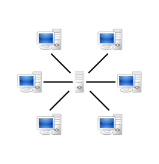
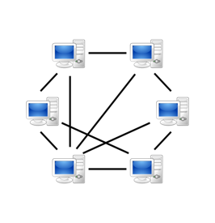
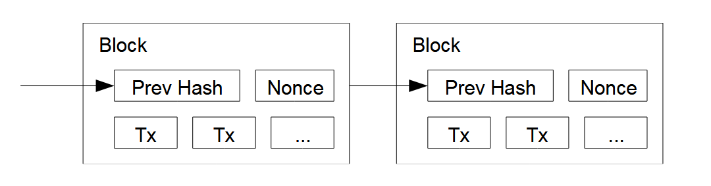
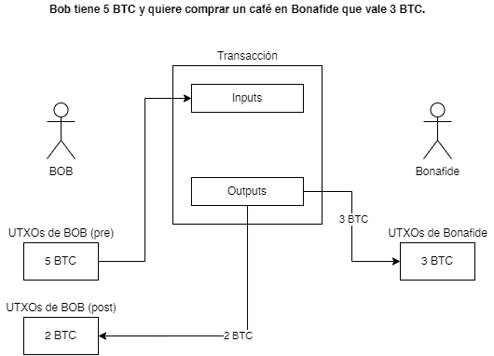
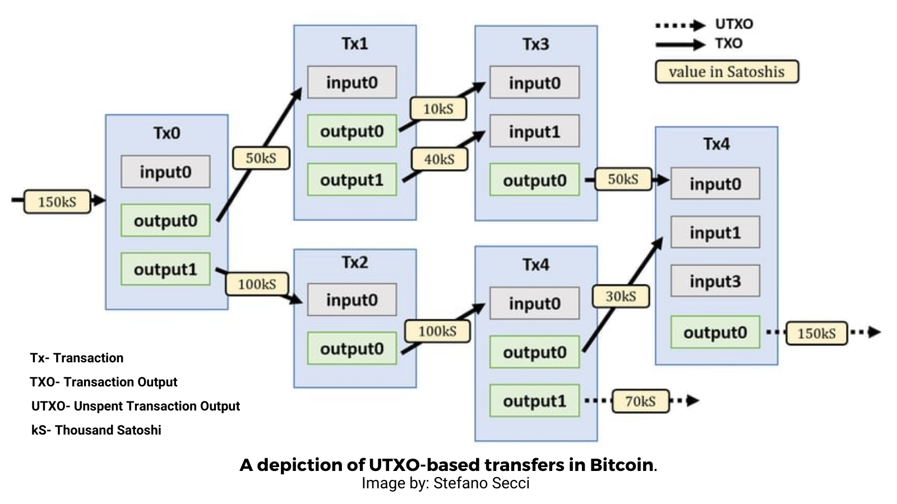
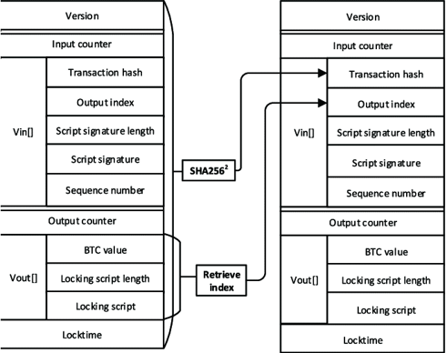

¿Qué era eso de lo que todo el mundo estaba hablando entre 2016 y 2021?

<!-- truncate -->

## Introducción

Si estabas vivo entre 2016 y 2021 es casi seguro que, incluso en contra de tu
voluntad, hayas sido bombardeado con alguna de las siguientes palabras o
términos: blockchain, Bitcoin, criptomonedas, NFTs, Proof of Work...

Es inevitable: en estos tiempos que vivimos cuando surge una nueva tecnología
"prometedora" la misma es ovacionada y aclamada como si fuese la segunda venida
de \<INSERTAR MESÍAS ACA SEGUN TU RELIGIÓN\>. Después de un rato, cuando el humo
comienza a disiparse, se ven las cosas como son y lo que prometía ser una
revolución de la humanidad pasa a un relativo olvido.

**Blockchain** es una de estas tecnologías. Algo que, según algunos, prometía
_ser la rampa de la humanidad hacia el futuro_[1](#note-1), algo que
fue tan popular que _crypto_ se convirtió en sinónimo de criptomonedas (en vez
de criptografía), pero que hoy en día quedó en segundo plano, reemplazada por
otra tecnología que está siendo aclamada y ovacionada como la nueva "cosa
caliente".

Pero es muy fácil criticar una cosa cuando ya pasó su momento de fama y sus
promesas resultaron ser vacías. Lo difícil es sostener este escepticismo cuando
las cosas se están desarrollando en vivo y en directo. Para eso no hay mejor
arma que el conocimiento: saber y entender cómo funciona algo es fundamental
para no ser arrastrado por olas masivas de desinformación y sensacionalismo.

Por eso, más tarde que nunca y sin que sea de mucha utilidad, en este post vamos
a explicar: **¿¿QUÉ ES UNA CADENA DE BLOQUES Y QUÉ TIENE DE IMPORTANTE??**

_<a name="note-1">1</a>: Fragmento extraído de una conversación que
tuve con una persona, la cual lo dijo con absoluta seriedad y convicción._

## ¿¿QUÉ ES UNA CADENA DE BLOQUES Y QUÉ TIENE DE IMPORTANTE??

Antes de meternos de lleno en este grandioso tema hay que detallar algunos
conceptos.

### ¿Qué es una aplicación distribuida?

Una aplicación distribuida es un programa/software donde los componentes que lo
conforman se encuentran ubicados (o distribuidos) en diferentes computadoras
conectadas entre sí por medio de una red.

Dichos componentes se comunican a través de mensajes, que son enviados por la
red, con el objetivo de brindar un servicio o proporcionar alguna funcionalidad
en específico.

Las computadoras que son parte de la aplicación suelen conocerse como _nodos_.
Cada nodo posee sus propios recursos (memoria, almacenamiento, ancho de banda,
etc.), y a su vez, un nodo puede ejercerse diferentes tareas y asumir distintos
roles.

Existen distintas formas de armar una red para una aplicación distribuida. En
este caso vamos a mencionar solo dos:

- Arquitectura cliente-servidor
- Arquitectura Peer to Peer (P2P)

#### Cliente servidor

  

Quizá sea la forma más popular de armar una aplicación distribuida, ya que en
general la mayoría de las aplicaciones que usamos hoy en día utilizan esta
arquitectura.

En este caso, tenemos un nodo central que actúa como servidor. ¿Servidor de qué?
De alguna funcionalidad o servicio (de ahí su nombre, se llama servidor porque
provee un servicio...).

Mientras que el resto de los nodos son considerados clientes: consumen y
solicitan los servicios ofrecidos por el servidor.

Lo importante es saber que la carga pesada de la aplicación la lleva el
servidor, y que no hay colaboración directa entre los clientes al momento de
ofrecer el servicio.

Veamos un ejemplo: imaginate una aplicación como Instagram. Cada persona que
tiene la aplicación descargada en su celular es un cliente. Cuando abrís la
aplicación y empezás a... consumir contenido (o lo que sea), tu celular se
comunica con un servidor y es el servidor el que responde con el contenido que
estás viendo.

Y si bien es posible que dos usuarios de Instagram se comuniquen, esta
comunicación no es directa, no sucede "cliente a cliente". La misma "pasa" a
través del servidor. Si se caen los servidores de Instagram, los clientes quedan
inutilizables, incapaces de consumir cualquier servicio.

#### Peer to Peer

  

En este caso, cada computadora (nodo) perteneciente a la red contribuye a
brindar el servicio. Los nodos actúan como clientes _y_ proveedores. De esta
forma, los mismos "comparten" una porción de sus recursos (memoria, espacio en
disco, ancho de banda) con los otros miembros de la red.

No existe un nodo "central" (o si lo hay, su importancia queda reducida), y ya
no tenemos el problema de que si se cae el servidor nuestra aplicación queda
inutilizable. Para que la aplicación deje de funcionar, se tendrían que caer
_todos_ los nodos de la red. Es decir, en comparación con la anterior, esta
arquitectura es más resiliente ante fallos.

Veamos un ejemplo: aplicaciones de
[torrents](https://linternita.com/blog/tecnologia-actual-torrents). Cuando
descargás un archivo usando un cliente de torrents, no lo descargás desde un
servidor central, si no de los diferentes nodos que hay en la red P2P que posean
una copia del archivo. A su vez, a medida que lo vas descargando, tu computadora
ahora se vuelve capaz de compartirlo a otros nodos. Es decir: no solo actuás
como un cliente solicitando un archivo, si no que tambén actuás como servidor
proveyendo ese archivo a otros.

Qué tecnología impresionante, ¿no?

### Esquema centralizado vs descentralizado

En términos de informática, la centralización/descentralización hace referencia
a dónde están ubicados los recursos/quién es el que provee los servicios de una
aplicación.

En un esquema centralizado, la mayoría de los recursos se encuentran en una sola
ubicación, y los servicios son ofrecidos por una sola computadora que actúa como
servidor.

En un esquema descentralizado, los recursos se encuentran desparramados en
diferentes computadoras, y no hay una sola computadora de la cual dependa el
servicio.

O al menos, esto era así en los inicios de la computación. Hoy en día la
definición no es tan literal.

No es que Instagram (nuevamente como ejemplo) tenga solamente UNA computadora
donde almacenan toda la información y que provee todos los recursos para brindar
su servicio. Tiene varias (más de 2 seguramente), posicionadas en distintas
ubicaciones geográficas incluso. Todas estas actúan como servidores de la
aplicación.

Es por eso que tenemos que alejarnos un poco y verlo de forma más abstracta: sí,
tiene distintos servidores, pero aún así posee la forma de un esquema
centralizado. Todo lo que pasa en la aplicación depende de los servidores, y los
clientes no tienen injerencia alguna, y no pueden colaborar con sus recursos
para ayudar a ofrecer el servicio.

En temas relacionados a Blockchain, la descentralización es algo nombrado a
menudo y con cierta relevancia. Tiene este aspecto tanto técnico que acabamos de
mencionar, como también un aspecto filosófico/ideológico.

EJERCICIO PARA EL LECTOR: ¿CUÁL DE LAS ARQUITECTURAS DE APLICACIONES
DISTRIBUIDAS QUE VIMOS SE PRESTA MEJOR PARA CADA ESQUEMA? MANDÁ TUS RESPUESTAS A
[iluminame@linternita.com](mailto:iluminame@linternita.com)

### [La cadena](https://open.spotify.com/intl-es/track/5e9TFTbltYBg2xThimr0rU?si=3ae0d003d42e413d) de bloques

Bueno BASTA de preámbulos. ¿Qué es esto? ¿Por qué es tan importante? ¿Por qué
todavía te sigo escuchando decir que nunca romperías la cadena?

Es como un libro contable.

Un libro contable digital.

En un libro contable se registran las transacciones que ocurrieron en un período
de tiempo. Por ejemplo, si tenés un emprendimiento de ropa, cada venta que
realices es una transacción que será registrada en una nueva línea dentro de una
página del libro contable.

  

Con una blockchain podemos hacer prácticamente lo mismo: mantener un registro de
sucesos que ocurrieron en un determinado tiempo y orden. Pero como estamos en el
mundo digital, en vez de agrupar las transacciones en una página de un libro,
las agrupamos en una estructura de datos que recibe el nombre de **bloque**.

Y así como las páginas de un libro se siguen una con la otra, los bloques se
enlazan uno con otro formando una **cadena**.

**Lector/a de Linternita.com:** Ok. Todo esto es llamativo. Pero sigo sin
entender por qué tanto revuelo. Visa existe desde 1970 y ya en 1973 estaban
usando un sistema computarizado para agilizar el procesamiento de transacciones
de tarjetas de crédito. ¿Me estás queriendo decir que el mundo no tenía una
forma de registrar transacciones digitalmente hasta que surgió todo esto de
blockchain?

No. Justamente, mantener un registro de digital transacciones era un problema
resuelto hace mucho tiempo.

Pero a diferencia del servicio ofrecido por Visa (o cualquier otra institución
financiera), manejar transacciones usando blockchain tiene las siguientes
ventajas:

- **Inalterabilidad de la cadena:** la forma en la que están enlazados los
  bloques hace que la cadena sea inalterable. Es decir: una vez que un bloque es
  agregado a la cadena, no hay forma de modificarlo, ni de añadirle o quitarle
  transacciones. El **esfuerzo computacional** que llevaría hacer esas
  modificaciones es tan grande que lo convierte en algo fútil.

  Esto _no_ pasa con una tarjeta de crédito, donde las transacciones pueden ser
  disputadas/desconocidas, obligando a la institución financiera a mediar.
  Dependiendo del resultado de la mediación, la transacción puede ser alterada.
  Por lo tanto, el registro de transacciones no está escrito en piedra.

- **Descentralización:** cuando hacés una compra con una tarjeta de crédito
  (Visa, Mastercard, etc) la misma es procesada por una institución financiera.
  Todas las transacciones pasan a través de sus servidores y son estos los que
  tienen la última palabra. Es decir: siguen un esquema centralizado.

  ¿Cuál es el problema de esto? Que el manejo de tu transacción depende total y
  absolutamente de un único tercero. En cambio, en blockchain, las transacciones
  son manejadas por los distintos nodos de una red Peer to Peer. No hay una
  autoridad central, todos los nodos de la red trabajan para brindar el
  servicio.

No necesariamente usemos una cadena de bloques para registrar transacciones
comerciales (compras, ventas, uso de tarjetas de crédito, etc). Podemos usarlas
para registrar cualquier suceso. Pero torné el post para este lado para hablar
de la primera aplicación que utilizó la tecnología blockchain...

## Bitcoin

¿Existe alguna forma de crear un sistema de pagos electrónico que no dependa en
depositar toda la confianza en un tercero?

_Esa_ pregunta es la razón de existir de Bitcoin. Esa fue la razón por la cual
surgió todo esto. O al menos eso es lo que dice el autor en el paper titulado
[Bitcoin: A Peer-to-Peer Electronic Cash System](https://bitcoin.org/bitcoin.pdf).

Para crear este sistema de pagos, Bitcoin utiliza los conceptos que venimos
viendo hasta el momento: hay una cadena de bloques inalterable donde se
registran las transacciones, es una aplicación distribuida que sigue un esquema
descentralizado, utiliza la arquitectura Peer to Peer...

Pero un sistema de pagos involucra más cosas que solamente registrar que se
realizó una transacción. Tiene que haber un movimiento de plata desde el pagador
al pagado. También, al ser un sistema electrónico, hay que tener especial
cuidado para no caer en el problema del
[doble gasto](https://es.wikipedia.org/wiki/Doble_gasto) (cosa que no pasa con
dinero físico porque no podés gastar el mismo billete dos veces).

Si empezamos a hilar fino, surgen muchas preguntas: ¿cómo se valida que la
persona que está pagando tiene los suficientes fondos para hacer el pago? ¿Qué
evita que un nodo introduzca transacciones falsas en la cadena de bloques? ¿De
dónde sale el incentivo para que alguien quiera poner una computadora como nodo
de la red y ofrecer sus recursos para que el sistema funcione?

Hagamos un recorrido top-down de los elementos que conforman Bitcoin para
intentar responder estas preguntas.

### Bloques

Los bloques agrupan transacciones y están encadenados uno con el otro.

  

Para "encadenar" los bloques se incluye una referencia al
[hash](https://es.wikipedia.org/wiki/Funci%C3%B3n_hash) del bloque anterior.
Para hacerlo simple, una _función hash_ toma una entrada y devuelve un valor
único que depende de esa entrada. De ahora en adelante cuando mencione "hash"
voy a estar haciendo referencia al valor único que se obtiene.

Y acá pasa algo importante: este hash no es cualquier hash. Al momento de crear
un bloque nuevo, Bitcoin impone una restricción: **el hash resultante de este
bloque tiene que contener un número de bits que estén en cero**.

Recordemos que el valor del hash calculado _depende_ de la entrada. Si nuestra
entrada es siempre la misma, obtendremos el mismo valor.

Los bloques en Bitcoin tienen un campo extra llamado _nonce_. Este campo es un
número, y la idea es que este número puede ser incrementado/modificado cuantas
veces queramos, con el objetivo de poder generar hashes distintos para el mismo
bloque.

Calcular _un_ hash es algo que se puede hacer relativamente rápido. El problema
acá es que no nos sirve cualquier hash, necesitamos obtener sí o sí uno que
tenga N bits con valor cero. No hay forma fácil de hacer esto. No queda otra que
hacerlo a "fuerza bruta": empezar con un nonce, calcular el hash, verificar si
tiene N bits en 0, incrementar el nonce, calcular el hash, verificar si tiene N
bits en 0, incrementar el nonce...

Esto es un proceso _muy_ lento. Comúnmente recibe el nombre de "minado" y hay
nodos dentro de la red que solamente se encargan de _minar_ el bloque, es decir,
calcular un hash válido para que el bloque sea añadido a la cadena.

Una vez que se obtiene un hash válido, el nodo que lo obtuvo difunde el bloque a
toda la red, otros nodos verifican que este todo sea correcto, y ese bloque
queda oficialmente añadido a la cadena.

Supongamos que tenemos tres bloques A, B, y C en este orden:

  A --> B --> C

Si un nodo "maligno" quisiera tomar ventaja del sistema y modificar el bloque A
con transacciones que le sean favorables, debería volver a calcular el hash del
bloque A.

Y el hash del bloque B, porque el bloque B tiene una referencia al de A.

Y el hash del bloque C, porque el bloque C tiene una referencia al de B.

Ya de por sí es bastante complicado calcular el hash para _un_ solo bloque, pero
este nodo maligno está intentando calcular los hashes para 3 bloques distintos
con el fin de modificar la "historia" de la blockchain.

Y no solo eso: mientras este nodo está ocupado calculando esos 3 hashes, los
otros nodos "honestos" están trabajando para expandir la cadena con nuevos
bloques. En Bitcoin la cadena "verdadera" es aquella que sea la más larga. Así
que el nodo maligno tendría que, de alguna forma, sobrepasar a los demás nodos
honestos y tratar de crear una cadena más larga que ellos.

Mientras la red de Bitcoin esté compuesta por una mayoría de nodos honestos, es
efectivamente imposible que un nodo con malas intenciones introduzca cambios en
la historia de la cadena.

Por eso la cadena es inalterable.

### El incentivo de "minar" bloques

Cada vez que un nodo calcula un hash válido y difunde el nuevo bloque, recibe
"monedas".

La primera transacción que se incluye en el nuevo bloque es una transacción que
le atribuye monedas al nodo que lo está intentando minar.

También existe otro incentivo, las _tarifas de transacción_, que también son
atribuidas al nodo.

De esta forma, un nodo gana "plata" haciendo su trabajo. Es recompensado por los
recursos que está poniendo a disposición. Además, el incentivo monetario ayuda a
que el nodo se mantenga honesto: es preferible hacer las cosas bien y ganar
monedas que arriesgarse a rescribir la cadena de bloques, comprometiendo al
sistema y la validez del mismo.

### Unspent Transaction Outputs (UTXOs)

Los UTXOs son análogos a los billetes que usamos para pagar algo. Son
efectivamente la "moneda" que se usa en Bitcoin al momento de realizar una
transacción.

Un UTXO es una estructura de datos que almacena un valor que representa una
cantidad de monedas y cierta información que ayuda a identificar a quién le
pertenecen esas monedas.

Como su nombre lo indica, los UTXOs son la "salida" que se obtiene luego de
realizar una transacción. Estas salidas permanecen "no gastadas" (unspent) hasta
que... alguien las gasta en una transacción, generando nuevos UTXOs en el
proceso (pero que tendrán distinto dueño).

  

_Figura 1: Probablemente el café más caro de la historia_

En el diagrama de arriba podemos ver un ejemplo donde Bob utiliza un UTXO con
valor de 5 monedas para comprar un café que con valor de 3. Cuando la
transacción se realiza, el UTXO de 5 monedas se convierte en un Spent
Transaction Output (se gasta), y al mismo tiempo se generan dos nuevos UTXOs,
uno de valor 3 del cual Bonafide pasa a ser dueño, y el vuelto con valor 2 que
es de Bob.

Todos los nodos que conforman la red Bitcoin mantienen una copia del conjunto de
UTXOs en su totalidad, actualizándola a medida que suceden nuevas transacciones.
Este conjunto de UTXOs es usado para verificar que una transacción sea válida
(es decir: que los UTXOs no hayan sido ya gastados en otra transacción,
incurriendo en doble gasto).

**¿Cómo se genera el conjunto de UTXOs? ¿Cómo funciona la validación de una
transacción?** 📌

Esas son muy buenas preguntas a las cuales les pondremos un "pin" y
responderemos luego.

### Transacciones

Las transacciones son un registro de los pagos dentro del sistema. Y al igual
que los bloques, las transacciones _también_ están enlazadas.

  

_Vista simplificada de las transacciones en Bitcoin_

Una transacción puede tener múltiples entradas y salidas. Las salidas de una
transacción son los UTXOs (que acabamos de ver), y las entradas... son los UTXOs
también.

La estructura real de una transacción en Bitcoin es algo como esto:

  

Un UTXO es identificado de forma única utilizando el _hash_ de la transacción de
donde surgió, y además, usando el _output index_, un número que indica cuál de
las múltiples salidas de una transacción es esta.

### ¿Cómo se genera el conjunto de UTXOs? ¿Cómo se valida una transacción?

Tiempo de sacar el pin y responder estas preguntas.

Un nodo tiene acceso a toda la cadena de bloques, es decir, al historial
completo de transacciones.

Para generar el conjunto de UTXOs, un nodo recorre el historial de
transacciones. A medida que avanza a través de cada bloque y transacción,
realiza modificaciones en el conjunto. Cuando llega a la última transacción
tendrá el conjunto de UTXOs final que representa el "estado actual".

Este trabajo de recorrer toda la cadena de bloques se hace una sola vez. Después
de eso, cuando se recibe un nuevo bloque, solo basta con analizar las
transacciones dentro de ese bloque y actualizar el conjunto de UTXOs
adecuadamente.

Para saber si una nueva transacción es válida, el nodo tiene que verificar que
los UTXOs que están siendo utilizados en las entradas de la misma se encuentren
dentro del conjunto. Si no están, es posible que ya hayan sido gastados en una
transacción previa, por lo que esta nueva transacción queda invalidada.

## Conclusiones

**Lector/a de Linternita.com:** ¿Eso es todo? ¿La gente se volvió loca por un
sistema de pagos electrónico?

Sí, más o menos.

La verdad es que la tecnología y el concepto detrás de una blockchain _fue_ algo
innovador. Incluso impulsó y revitalizó el mundo de la criptografía (un tema que
irónicamente evité lo más que pude en este post): una oleada de gente nueva se
vio interesada en la criptografía, se crearon nuevos algoritmos y protocolos,
algunos ideas y conceptos criptográficos que tenían poco uso práctico lo
encontraron gracias a blockchain.

Fuera de eso, no fue más que otra burbuja.

Bitcoin y otras criptomonedas siguen existiendo y son utilizadas a día de hoy.
Se pueden comprar cosas con criptomonedas, pero no es algo masivo y soportado
por todos los comercios, ya que no se convirtió para nada en una moneda
estándar.

Pero más que nada las criptomonedas se terminaron usando como un activo
financiero debido a la alta especulación y volatilidad del valor de las mismas.

Se crearon otras cosas "interesantes" basadas en blockchain. Una de ellas fue la
tan conocida estupidez de los NFTs. Otras fueron ideas un poco más inteligentes,
como los [smart contracts](https://es.wikipedia.org/wiki/Contrato_inteligente).

Aún así, hoy (en 2025) el _hype_ murió. No surgió ninguna aplicación o solución
basada en blockchain que revolucionase al mundo (fuera de la locura financiera).
Muchos se dieron cuenta que blockchain era "una solución sin problema", y con el
tiempo, la industria la fue descartando y buscando algo nuevo en lo que
centrarse.

No es algo de lo que deberíamos sorprendernos. Después de todo, el mundo se
mueve de burbuja en burbuja. Pasó en los 80s con la inteligencia artificial.
Pasó en los 90s/00s con dot-com. Y pasó entre 2016 y 2021 (fechas aproximadas)
con blockchain.

Y en la actualidad estamos con mucho _hype_ por la inteligencia artificial (de
nuevo). Pero eso es un tema para otro post.
