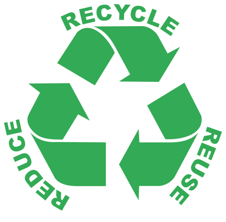

import { VideoEmbed } from "@site/src/components/VideoEmbed";

Otra vez nos mintieron en la cara.

<!-- truncate -->

## La era del plástico

A menos que hayas nacido antes de 1950, lo más probable es que hayas vivido toda
tu vida rodeado de plásticos.

Hay plásticos en tus botellas, en tus utensilios de cocina, en tu celular, en
las cañerías de tu casa,
[dentro de tu cuerpo en forma de microplásticos](https://www.nationalgeographicla.com/medio-ambiente/2022/04/los-microplasticos-ya-estan-en-nuestros-cuerpos-cuanto-nos-danan)
los cuales todavía no sabemos si nos causan algún daño o no, incluso en el
océano formando
[grandes "islas" de basura](https://en.wikipedia.org/wiki/Great_Pacific_Garbage_Patch).

No hay escapatoria.

Y todo esto tiene su buena razón: es increíblemente útil, versátil, durable, y
por sobre todas las cosas, barato.

¿Lo mejor de todo? Es reciclable. Hay tachos de basura que tienen un
color/loguito específico que indica que podés tirar ahí tu botella de plástico,
y eventualmente una compañía como Coca-Cola va a producir una nueva botella con
ese plástico que tiraste.

Eso es lo que realmente pasa, ¿no? La botellita que tiré en el tacho realmente
se recicla... ¿no...?

Ehhh... :/

## Reciclar...

...tiene muchos beneficios, como todo eso de salvar al mundo y cuidar el
medioambiente.

Pero realmente el beneficio más importante es que suele ser más barato que
volver a generar/obtener el material desde cero.

Ciertos elementos se reciclan tan bien que sería una estupidez no hacerlo. Ese
es el caso de algunos metales:

- **Aluminio**: para reciclar aluminio tan solo se necesita **5% de la energía**
  que se requiere para crear aluminio nuevo partiendo desde el mineral en crudo.
  El proceso de reciclaje del aluminio no altera las propiedades del metal, los
  productos creados con aluminio reciclado poseen la misma calidad que un
  producto hecho con aluminio virgen. Es infinitamente reciclable.

- **Cobre**: similar al aluminio, el proceso de reciclado de cobre tampoco
  altera las propiedades del material, es decir, no se pierde calidad alguna.
  Utiliza 85% menos energía que la que se requiere para minar cobre nuevo. Se
  estima que **un 80% de todo el cobre que fue minado todavía es utilizado** en
  la actualidad.

- **Hierro y acero**: la misma historia que los otros dos metales. Su reciclado
  requiere un 75% menos de energía. Sus propiedades no se ven alteradas. 42% del
  acero producido es material reciclado. A diferencia del aluminio y el cobre,
  es más fácil recuperarlo de la basura porque podés usar un imán.

Cifras y números impresionantes. Me va a costar dormir esta noche de lo tanto
que me fascina saber que casi un 80% del cobre que usamos es cobre reciclado.

¿Y con el plástico? ¿Qué pasa?

Según EPA (la agencia de protección ambiental de Estados Unidos), hasta 2018
[tan solo se recicló un 8.7% de todo el plástico](https://www.epa.gov/facts-and-figures-about-materials-waste-and-recycling/plastics-material-specific-data)
generado por Estados Unidos desde 1960.

¿El resto? O se quemó, o fue a parar a un basural.

## Reciclar plástico no funciona

No es que no sepamos. O que exista algún impedimento a nivel tecnológico o
técnico. El plástico puede ser y es reciclado, generalmente en "bolitas"
(pellets) de plástico que después son usadas para crear nuevos productos.

  

_Figura 1: pellets de plástico_

El gran problema es que **reciclar plástico no es algo económicamente viable**.
Hay una serie de problemas que se presentan en la cadena de reciclaje del
plástico que hace que sea más caro obtener plástico reciclado que plástico
virgen.

### Problema 1: no existen mercados para algunas categorías de plástico

El plástico se divide en 7 categorías distintas dependiendo del polímero que se
usa para hacerlos.

  

De todas estas categorías, solo los plásticos de tipo PET y HDPE (usados
comúnmente para botellas y jarras) son los únicos que tienen un "mercado" luego
de ser reciclados. Es decir, existen empresas que activamente compran y usan
plástico reciclado de esas categorías para crear nuevos productos.

Los otros plásticos se vuelven _imposibles_ de reciclar solo por el simple hecho
de que nadie quiere comprar plástico reciclado de esas categorías. Si no hay
demanda, no hay incentivo económico, entonces no se recicla.

### Problema 2: separar los plásticos es una tarea casi imposible

Si bien los organizamos en 7 categorías generales, en realidad existen miles de
plásticos diferentes. Al momento de ser reciclados, **los plásticos deben ser
separados y ordenados** según su tipo. Esto asegura que el plástico generado
mantenga la misma calidad.

Dos botellas pueden estar hechas del mismo tipo de plástico (PET), pero pueden
contener distintos aditivos químicos o colorantes. Y esto afecta en cómo cada
una de las botellas es reciclada. Por ejemplo,
[plásticos de distintos colores son reciclados por separado](https://www.mewburn.com/news-insights/recycling-the-rainbow-coloured-plastics-in-the-circular-economy),
existiendo una gran preferencia hacia el reciclado de plástico transparente. Tan
fuerte es la preferencia que Coca-Cola decidió
[cambiar el color de las botellas de Sprite](https://www.npr.org/2022/07/28/1114242535/sprite-green-bottles-recycle)
de verde a transparente.

Para empeorar las cosas, existen muchos productos que están hechos con _más_ de
un tipo de plástico, sin contar con que pueden contener adhesivos, papel,
metales, u otros elementos.

Esto hace que en algunos casos la tarea de separar cada tipo de plástico sea
impráctica o casi imposible.

### Problema 3: los plásticos pierden calidad al ser reciclados

Como vimos antes, una de las grandes ventajas de los metales es que los podés
reciclar y no van a perder sus propiedades. Una lata hecha con acero reciclado
va a tener la misma calidad que una lata hecha con acero virgen.

No pasa lo mismo con los plásticos. El proceso de reciclaje degrada la calidad
de los mismos. Por ejemplo, los
[plásticos de tipo PP son vulnerables a las altas temperaturas](https://www.cleantech.com/why-is-polypropylene-pp-so-difficult-to-recycle/),
perdiendo integridad química, fuerza y flexibilidad. Como mucho, estos plásticos
solo pueden ser reciclados una o dos veces, volviéndose inútiles para cualquier
producto después de eso.

### Problema 4: toxicidad del plástico y sus aditivos

Como aditivos químicos un plástico puede contener estabilizadores,
plastificantes, retardantes de llama, entre otros, muchos de los cuales pueden
ser tóxicos. A su vez, un plástico puede ser contaminado con una sustancia
tóxica al entrar en contacto con la misma (por ejemplo, un camión recolector de
basura recoge algún contenedor que contenga restos de un pesticida).

Al ser reciclados los plásticos se degradan y empiezan a filtrarse estas
sustancias tóxicas. Esto los vuelve indeseables para ser reciclados en ciertos
productos, como envases de comida o cualquier otro tipo de producto que tenga
alto contacto con seres humanos.

### Problema 5: costo

Por sobre todas las cosas, **reciclar es un problema económico**. Todos los
problemas que mencionamos anteriormente producen que el costo del plástico
reciclado sea alto.

Es más barato crear plástico virgen a partir de combustibles fósiles que tener
que atravesar todo el proceso de...

- Recolección
- Separado
- Procesamiento
- Transporte

...con todos y cada uno de los problemas que ellos representan, solo para
obtener una materia prima que es de calidad _inferior_ al plástico virgen.

Ninguna empresa optaría por plástico reciclado mientras este sea más caro.

## La importancia de las Tres Rs

  

Las "Tres Rs" (Reducir, Reutilizar, Reciclar) es un eslogan bastante popular y
conocido en Estados Unidos que se enseña en las escuelas primarias.

Con todo lo que vimos, queda claro que para el plástico no podemos aplicar la R
del reciclaje, pero todavía quedan las otras dos. Así que, si bien no podemos
salvar al medioambiente reciclando plástico, podemos alivianar el impacto
_reduciendo_ la cantidad de plásticos que consumimos y _reutilizando_ en los
casos que sea posible.

## Más información sobre este tema

Este post es una visión simplificada y general del problema. Hay muchas cosas
que pasé por alto o no mencioné, como por ejemplo, quiénes impulsaron la gran
mentira de que el plástico es reciclable (las petroleras).

Acá algunos enlaces de interés:

- [The Fraud of Plastic Recycling](https://climateintegrity.org/uploads/media/Fraud-of-Plastic-Recycling-2024.pdf):
  este post es básicamente una copia descarada de la segunda sección de este
  documento

- [How Big Oil Misled The Public Into Believing Plastic Would Be Recycled](https://www.npr.org/2020/09/11/897692090/how-big-oil-misled-the-public-into-believing-plastic-would-be-recycled):
  artículo que explica la historia de cómo las grandes petroleras impulsaron la
  idea de que el plástico era reciclable solo para seguir lucrando

- Por último, un vídeo de Wendover Productions que toca los mismos puntos que
  este post, pero mencionando que el reciclado de plástico tuvo una breve época
  donde fue económicamente viable gracias a China.

<VideoEmbed src="https://www.youtube.com/embed/KXRtNwUju5g" />
