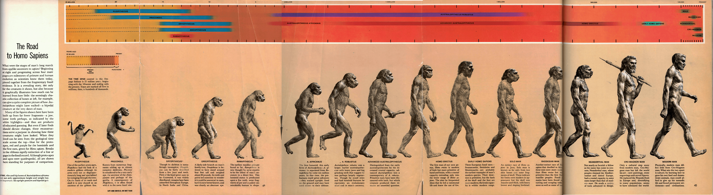
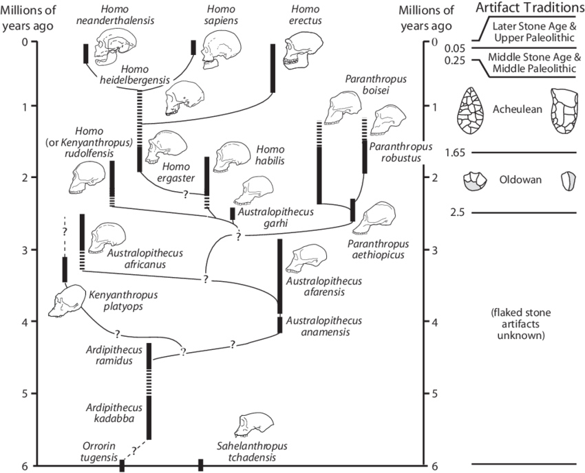
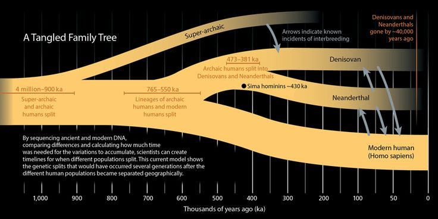
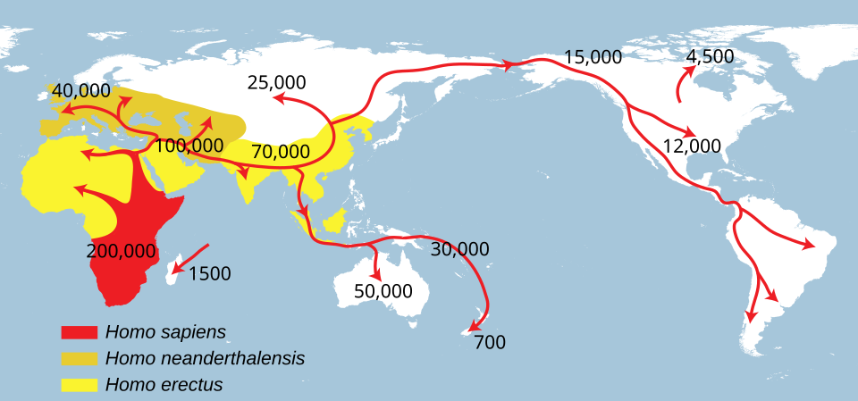
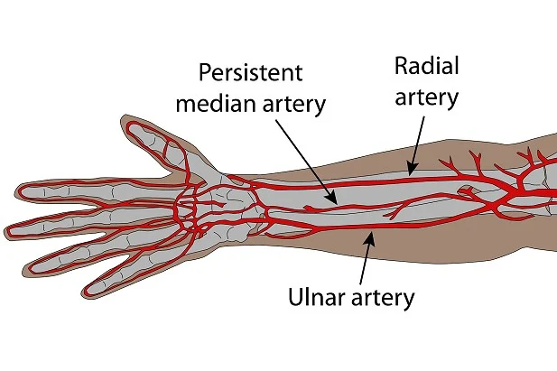

import { VideoEmbed } from "@site/src/components/VideoEmbed";

Después de trescientos mil años, ¿qué tanto cambiamos?

<!-- truncate -->

## El origen de la humanidad

Hagamos un ejercicio. Intentemos establecer _cuándo_ se originó la humanidad.

Debería ser relativamente fácil, ¿no? Simplemente buscamos el fósil de Homo
Sapiens más antiguo que tengamos y eso nos va a dar una respuesta aproximada.

Los restos fósiles son la mayor evidencia de que una especie realmente existió.
Si conseguimos uno bastante viejo que podamos identificar como parte de la
especie Homo Sapiens eso daría por zanjado la cuestión.

Ahora... no solo hallar fósiles es difícil (hay que cavar y hacer cosas que
sacuden mucho polvo, ¡puf!), sino que el solo hecho de que los restos de un ser
vivo se fosilicen es de por sí un fenómeno extremadamente raro. Se estima que
[menos del 1% de todas las especies](https://www.bbc.com/future/article/20180215-how-does-fossilisation-happen)
que vivieron se convirtieron en fósiles.

También, en el afortunado caso de que encuentres un resto fósil, lo más seguro
es que solo encuentres un fragmento de algún hueso. O un diente. O un pedacito
cualquiera.[1](#note-1)

Vas a tener que identificarlo y tratar de enmarcarlo dentro de alguna especie.
¿Es Homo Sapiens? ¿Es Homo Neanderthalensis? ¿Es Homo Sexual?

¿Y qué es una especie? Un concepto en el que nadie se pone de acuerdo. Una de
esas cosas que surge de nuestra obsesión por intentar clasificar y organizar
nuestro conocimiento. Todo eso de la taxonomía es un sistema arbitrario que
nosotros imponemos por sobre la naturaleza. ¿Qué tanto se parece tu hueso al de
los otros huesos que pertenecen a una especie? ¿Qué tanto tiene que diferir para
_no_ ser considerado como parte de esa especie?

Y además... ¿Por qué si la humanidad empieza con el Homo Sapiens hay otras
especies con el prefijo _Homo_?

Porque la humanidad no empieza con el Homo Sapiens y estaba siendo engañoso
intencionalmente. Te mentí, perdoname.

Antes de que te pongas a buscar evidencia de una especie humana deberías definir
bien qué es lo que considerás como "la humanidad". Si pensás que lo que nos hace
humanos son cosas como el control del fuego, hacer herramientas, llorar y
enterrar a nuestros fallecidos, construir cosas complejas como botes, hacer
arte... Bueno, nosotros (Homo Sapiens) no fuimos los únicos capaces de hacer
esas cosas.

Homo Habilis era capaz de hacer herramientas de piedra.

Homo Erectus construía botes, controlaba el fuego, y también hacía herramientas.

Más cercano a nosotros, los
[Neandertales eran capaces de hacer arte](https://www.nationalgeographic.com/science/article/neanderthals-cave-art-humans-evolution-science),
y también enterraban a sus muertos (además de todo lo anteriormente mencionado).

_<a name="note-1">1</a>: A menos que tengas muchísima suerte y
encuentres una cueva con la mayor colección de restos fósiles de un homínido
como en el caso de
[Homo Naledi](https://en.wikipedia.org/wiki/Homo_naledi#Discovery)._

## Tangente: algunas clarificaciones sobre la evolución

Todos sabemos qué es la evolución.

Más o menos.[2](#note-2)

Es un concepto que se instaló en la cultura popular contemporánea. Si le
preguntás a alguien sobre la evolución humana, lo más probable es que te
contesten con algo como "evolucionamos de los monos", o que al pensar en la
evolución humana se imaginen algo similar a la Marcha del Progreso.

  

_Fig. 1: Socios del Club Boca Juniors haciendo fila para ver un partido, circa
2025, óleo sobre lienzo_

Pero a veces esas ideas están un poco alejadas o distorsionadas respecto al
entendimiento que tenemos de la evolución.

Por ejemplo, es cierto que evolucionamos de "los monos", pero ojo: no
evolucionamos de un chimpancé ni de ninguno de los monos que conviven con
nosotros en la actualidad y que se parecen mucho a nosotros.

Con los chimpancés compartimos gran parte de nuestro ADN, pero nuestra historia
_no_ comienza con ellos. Millones de años atrás tuvimos un antepasado en común,
que posiblemente se pareciera en forma a lo que nosotros asociamos con un mono,
pero definitivamente no era un chimpancé.

De ese antepasado común[3](#note-3) se desprendieron dos (o varias)
_ramas_. Ambas fueron evolucionando a lo largo de millones de años, una llevando
al Homo Sapiens, y otra dando como resultado al chimpancé moderno.

La mención de "ramas" en el anterior párrafo hace alusión a que la _evolución no
es lineal_, como mucha gente interpreta a la Marcha del Progreso. El proceso se
parece mucho más a un árbol, como se ve en la siguiente imagen:

  

Esa imagen representa un modelo más acertado de la evolución. Además en este
caso no solo muestra las distintas ramas evolutivas del género Homo y sus
antepasados, sino que también nos dice algo muy interesante: algunas de estas
ramas estuvieron vivas al mismo tiempo.

Y en algunos casos, esas distintas ramas llegaron a encontrarse en la misma
ubicación geográfica.

...una cosa llevó a la otra y esto resultó en un
[mestizaje entre diferentes miembros del género Homo](https://en.wikipedia.org/wiki/Interbreeding_between_archaic_and_modern_humans),
complicando aún más nuestro "árbol" evolucionario:

  

Debido a esto, dependiendo de dónde seas, es posible que compartas un mayor o
menor porcentaje de ADN con los Neandertales o con los Denisovanos (de los
cuales hubo
[noticias importantes](https://www.nationalgeographicla.com/historia/2025/06/hallazgo-clave-cientificos-identificaron-al-hombre-dragon-un-nuevo-tipo-de-humano)
hace tan solo un mes). O con otras especies arcaicas del género Homo que todavía
no tenemos identificadas.

Para cerrar esta parte, no hay que olvidar que la evolución es un proceso
constante. Lento, muy lento, pero constante. No es que una vez que una especie
"aparece" se queda en el molde y nunca cambia. Si eso pasase todo lo que
mencioné en esta sección nunca hubiera pasado.

_<a name="note-2">2</a>: Una vez alguien me dijo "hasta hace como 2
semanas habia entendido mal como funcionaba la evolucion" y después se rehusó a
elaborar._

_<a name="note-3">3</a>: Ese antepasado común entre nosotros y los
chimpancés está extinto actualmente, pero esto no es una regla de la evolución.
Es decir, es posible que una especie diverja en otras y que la especie original
permanezca "viva". Las comillas en este caso son porque con el tiempo una
especie puede cambiar (evolucionar) mucho, lo suficiente para que pensemos que
es "un animal distinto"._

## Cambios en el Homo Sapiens

Volvamos al tema principal del post.

Se estima que los Homo Sapiens aparecieron hace aproximadamente 300.000 años
atrás. Contamos con algunos restos fósiles, como los de
[Jebel Irhoud](https://en.wikipedia.org/wiki/Jebel_Irhoud#Human_remains), que
datan de esas fechas y que encajan con el concepto de
"[humanos modernos](https://en.wikipedia.org/wiki/Early_modern_human)" (es
decir, se parecen a nosotros).

Con 300.000 años de distancia, ¿qué tan diferentes somos a los primeros miembros
de nuestra especie?

### Adaptaciones a nuevos entornos

Los primeros Homo Sapiens surgieron en África. En algún momento se cansaron y
decidieron migrar y expandirse por el resto del mundo.

A medida que se asentaban en distintas partes fueron adaptándose a las mismas,
sufriendo así una serie de cambios a nivel inmunológico (protección contra
nuevas enfermedades) como morfológico (cambios en la piel, pelo, forma del
cuerpo en general).

### Cruces con Neandertales y Denisovanos (y otros)

Pero en el mundo no estaba _solo_ el Homo Sapiens. Tanto en África, Europa, y
Asia estaba lleno de otras especies humanas.

  

Nuestro ADN cuenta con rastros de algunas de ellas. Es imposible saber con
exactitud todas las especies que contribuyeron a que tengamos el ADN que tenemos
hoy en día, ya que para eso deberíamos encontrar fósiles de cada una en
suficiente cantidad que nos permita secuenciar el ADN de las mismas y así
compararlo con Homo Sapiens.

Pero en definitiva, esos cruces nos cambiaron. En algunos casos obtuvimos
mutaciones benéficas, como lo es el
[caso del gen EPAS1](https://www.nationalgeographic.com/science/article/sex-with-extinct-humans-passed-high-altitude-gene-to-tibetans),
que ayuda a que los Tibetanos/Sherpa puedan vivir tan alto y con niveles bajos
de oxígeno.

### Tolerancia a la lactosa

Durante la infancia los mamíferos son capaces de digerir leche sin problemas
gracias a que producen la enzima _lactasa_. Sin lactasa no se puede descomponer
la lactosa en glucosa y galactosa. Es decir, no se puede digerir.

Luego del destete y con la edad, la lactasa deja de ser producida
paulatinamente. Es decir, todos los mamíferos adultos son intolerantes a la
lactosa. No pueden consumir leche.

Pero nosotros (o algunos, al menos) somos la excepción. Hace 7000 años en el
norte de Europa surgió una mutación que permite que sigamos generando lactasa
incluso en la adultez.

Esta mutación no está presente en toda la población humana. Acá hay un
[mapa que muestra la intolerancia a la lactosa por país](https://worldpopulationreview.com/country-rankings/lactose-intolerance-by-country)
en 2025.

Así que si vos sos adulto leyendo este post y sabés que podés tomar leche sin
tener que ir corriendo al baño, considerate afortunado.

### Color de ojos

6000 a 10000 años atrás sufrimos otra mutación en uno de nuestros genes:
[OCA2](https://en.wikipedia.org/wiki/P_protein). Este gen controla la producción
de melanina, moléculas responsables del color que tenemos en la piel, ojos, y
pelo.

Antes de que se produjera la mutación de este gen todos los humanos teníamos
ojos marrones (alta concentración de melanina en el iris). Pero la mutación de
este gen provocó que en algunos casos la producción de melanina en el iris se
viera reducida, lo que dio lugar a distintos colores de ojos.

Por ejemplo, alguien con ojos azules tiene poca concentración de melanina en el
iris del ojo.

### Resistencia a la malaria

La malaria es una enfermedad que se transmite a través de los mosquitos. Cuando
un mosquito portador de malaria te pica, te inyecta en el torrente sanguíneo un
montón de parásitos. Los mismos se alojan en tus glóbulos rojos y después...

No importa. No es un post sobre medicina esto. La malaria te pone mal y en casos
severos te podés morir.

Este parásito existe hace mucho tiempo, pero hace 10.000 años tuvo un rápido
crecimiento. ¿Por qué? Porque hace 10.000 años más o menos inventamos la
agricultura. En vez de andar de acá para allá cazando animales, nos quedamos
quietos, nos asentamos. Y empezamos a multiplicarnos como locos.

Eso puso una presión sobre nuestra supervivencia, lo cual tuvo como consecuencia
la aparición de ciertos "trastornos sanguíneos", tales como la
[talasemia](https://es.wikipedia.org/wiki/Talasemia#Ventaja_de_sufrir_alfa_talasemia)
o la
[anemia de células falciformes](https://es.wikipedia.org/wiki/Anemia_de_c%C3%A9lulas_falciformes).
Estos trastornos, si bien puede ser perjudiciales, proveen resistencia ante los
parásitos de la malaria.

### Reducción de mandíbulas / muelas de juicio

Casi todos tenemos problemas en los dientes. Es muy común tener dientes
torcidos. O que tengas que ir al dentista para que te saquen las muelas del
juicio.

Nuevamente, esto es culpa de la agricultura.

Pero, contrario con lo que venimos viendo, no es que algún gen haya mutado y que
por eso tenemos estos problemas ahora. El problema reside en que nosotros
evolucionamos para comer _otro_ tipo de comida, lo que nos preparó para tener
dientes grandes y más afilados. Nuestros cuerpos todavía están "programados"
para eso.

Cuando se nos ocurrió la gran idea de plantar cosas y después comerlas, nuestra
dieta cambió drásticamente. Nuestra comida se volvió más procesada, más suave,
sin la necesidad de masticar tan fuerte y de usar tanto nuestros dientes. Y
aparentemente, esto impide que nuestras mandíbulas se desarrollen como deberían
cuando somos infantes.

### Arteria mediana

Hasta ahora todos los cambios que estuvimos viendo se remontan a miles de años
en el pasado. Sin embargo, un cambio notable empezó a emerger hace 200 años:
mucha gente está
[naciendo con una nueva arteria](https://www.discovermagazine.com/the-sciences/what-the-discovery-of-an-extra-artery-means-for-human-evolution).

  

La arteria mediana es una arteria que por lo general se encuentra en los
embriones y que desaparece en la octava semana de gestación. Por alguna razón,
cada vez más y más gente nace con esta arteria.

A fines del 1800 se estimaba que tan solo un 10% de la población nacía con la
misma. A fines del 1900 ese porcentaje se elevó a un 30%. Hoy en día estamos en
un 35%. Si esta tendencia sigue, para el 2100 todos van a nacer con esa arteria.

## Conclusiones

La lista de cambios no termina ahí. Es considerablemente más larga e incluye
algunos temas interesantes tales como que los partos por cesárea favorecen a que
los bebés nazcan más cabezones, y como eso puede afectar a los partos naturales
en el futuro.

También no incluí ciertos cambios que provienen de estudios cuestionables o
controversiales, como el que afirma que nuestros cerebros se han reducido con el
paso del tiempo.

En conclusión, cambiamos bastante en relación con los primeros Homo Sapiens. Y
esta diferencia no va a hacer más que acrecentarse en el futuro. Si logramos ser
tan afortunados de no auto-extinguirnos, es posible que cambiemos lo suficiente
como para tener que considerarnos una nueva especie. Pero tan solo llevamos
300.000 años (algunos de nuestros antepasados lograron existir por _dos millones
de años_), y la evolución es lenta en la mayoría de los casos.
