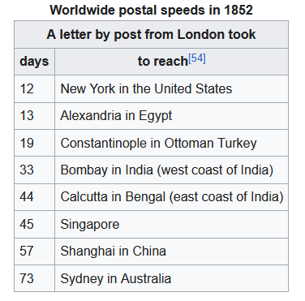
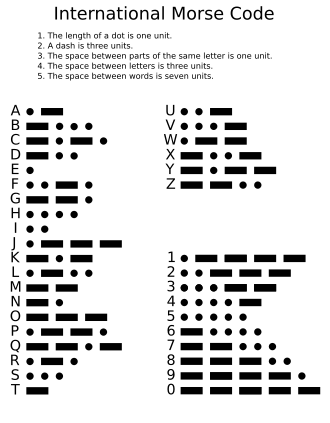
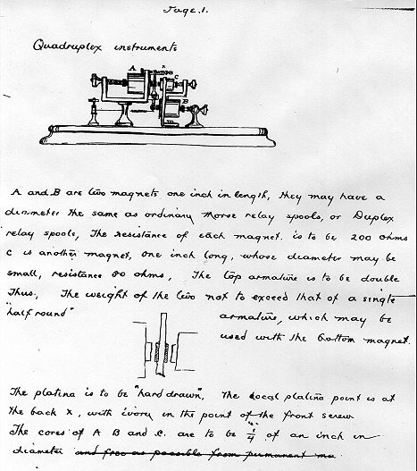
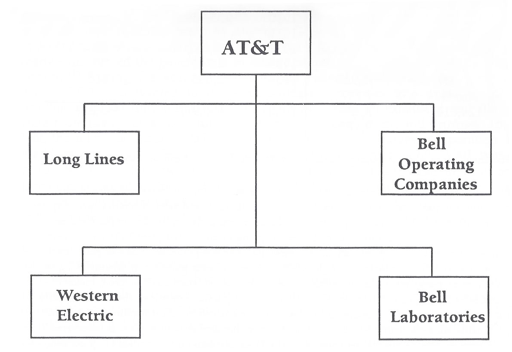
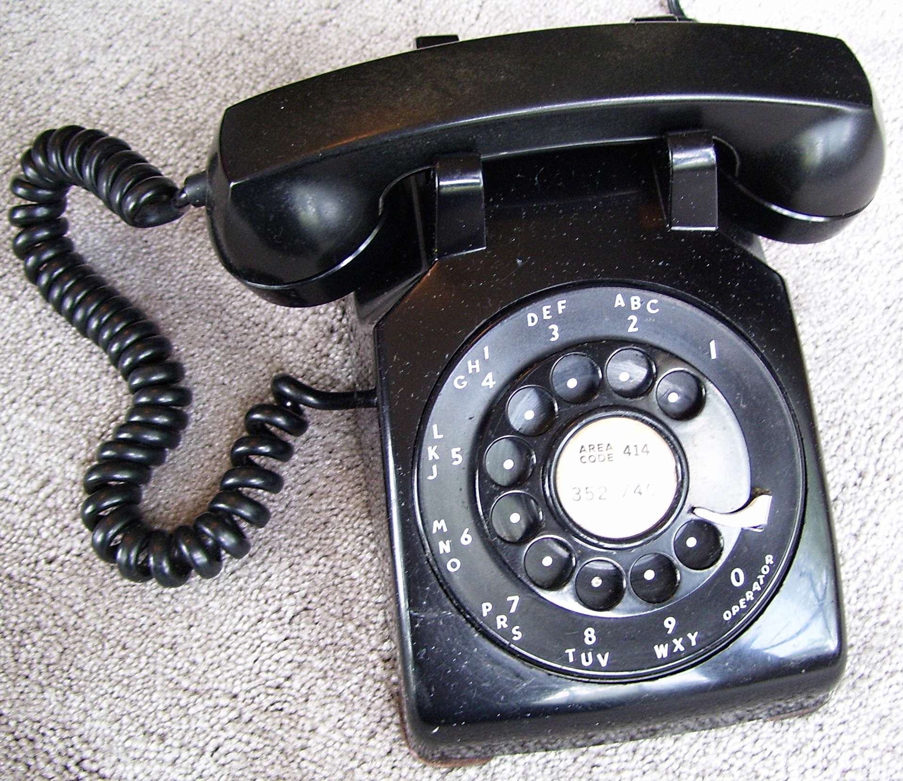

import { VideoEmbed } from "@site/src/components/VideoEmbed";

You can ring my beeeeeeeeeeeeeeeeell.

<!-- truncate -->

## La era de la innovación

La innovación tecnológica es algo que precede a la humanidad. En algún momento
del pasado, uno de nuestros ancestros decidió usar una piedra como una
herramienta (posiblemente para matar a algún pobre animal de la sabana
africana), otorgándole una increíble ventaja por sobre otras especies.

Con el tiempo aparecimos nosotros, los humanos, y empezamos a hacer algo que nos
caracteriza: innovar. No nos limitamos a agarrar una piedra y usarla. Nos
esforzamos en modificarla, en cambiar su forma para que cumpla una función
distinta.

Pero a pesar de ser buenos en eso (o al menos, mejor que el resto de las
especies), fue un proceso muy lento que duró millones de años. Incluso a pesar
que de
[nuestra especie tenga más de 300 mil años](https://linternita.com/blog/que-tan-diferentes-homo-sapiens),
hace tan solo 3000 años que empezamos a usar el hierro para herramientas (y
otras cosas).

Todo esto cambió a partir de 1870, donde...

> una nueva era amaneció para llenar el vacío. Un camino desconocido con pulso
> propio. Un tempo que no es dictado por la labor del hombre, sino acelerado por
> el ritmo de las máquinas, lanzando al mundo a una era de innovación audaz.
>
> De este caldero de sudor y acero surgió una visión de prosperidad,
> aprovechando el poder incalculable de los elementos, convirtiendo la noche en
> día, creando nuevos diseños que trajeron el escenario mundial a las masas y
> brindando una experiencia que muchos nunca habían imaginado.
>
> El advenimiento de la guerra mecanizada trajo devastación como ninguna que el
> mundo haya visto jamás, brindando una ventana de oportunidad para que algunos
> dicten conformidad, mientras los regímenes difundían sus ideologías con mano
> dura, incitando al mundo al borde de la guerra.
>
> Y, sin embargo, algunos eligieron un camino diferente, y a través de su visión
> trajeron perspectivas únicas al mundo, mientras que los defensores singulares
> del libre pensamiento permanecieron luchando por la paz en sus esfuerzos por
> desbloquear los secretos del universo... algunos de los cuales llenarían
> nuestros corazones de miedo y arrepentimiento.
>
> Pero a medida que este progreso se desarrolla, la naturaleza finita de nuestro
> mundo se vuelve clara: nuestra supervivencia, la supervivencia de todos los
> pueblos del mundo, depende de nuestra capacidad de coexistir en paz. Pero esta
> paz es tenue.
>
> Aunque la humanidad siempre mirará hacia adelante, anhelando más, buscando
> nuevos límites solo para romperlos... con el entendimiento de que este mundo
> es uno en el que todos compartimos, viene la responsabilidad de saber que las
> decisiones que tomes hoy tendrán un impacto duradero en las generaciones del
> mañana. [1](#note-1)

Volviendo al tema, a partir de 1870 es como si algo hubiera hecho _click_ y
nuestra tecnología comenzó a crecer de forma exponencial. En tan solo un par de
décadas empezamos a tener electricidad, petróleo, automóviles, bicicletas,
fertilizantes, y...

_<a name="note-1">1</a>:
[Terra novum et caelum a deo.](https://www.youtube.com/watch?v=CVuNhNHxbD4)_

## Telégrafos

El telégrafo apareció un par de décadas antes que el teléfono (circa 1830) y por
sí solo revolucionó al mundo. Pensalo de esta forma: antes de eso la única
manera de comunicarse a alguien que estaba a una larga distancia era enviando
una carta[2](#note-2), lo que ya de por sí tardaba tiempo, y en caso
de que la otra persona te respondiese tenías que esperar _todavía más_ hasta que
te llegue su carta.

  

_Fig. 1: una tabla que me robé de Wikipedia_

Con el telégrafo la transmisión era instantánea: las señales viajan a la
velocidad de la luz a través de los cables. No hay demora alguna relacionada al
envío del mensaje. Aunque sí existían algunas demoras propias del sistema
telegráfico, tales como:

1.  La introducida en el proceso de codificación/decodificación y transcripción
    del mensaje: el telégrafo, como todo sistema de comunicación, transmite
    señales. Si querías enviar un "hola", de alguna forma tenías que convertir
    ese mensaje en un conjunto de señales. Esto se lograba usando métodos de
    codificación, como el
    [código morse](https://es.wikipedia.org/wiki/C%C3%B3digo_morse).

        

            

        

        En los inicios del telégrafo (y por gran parte de su historia) esto era un
        proceso manual. Una persona tenía que encargarse de codificar/decodificar
        los mensajes y transcribirlos. No era algo que tardaba mucho, cualquier
        persona entrenada podía realizar en tiempo real a medida que llegaba el
        mensaje.

2.  O la introducida por retransmitir el mensaje a otra estación telegráfica:
    las líneas telegráficas conectaban estaciones entre sí de forma "punto a
    punto". Es decir, algo como: A --> B --> C, donde A se conecta a B y B se
    conecta a C. La estación A no puede enviar directamente un mensaje a C,
    tiene que pasar primero por B.

Pero igual, aún considerando eso, el tiempo para comunicarse a larga distancia
pasó de ser de muchos días a tan solo horas, o escasos minutos!!!

Debido a esto[3](#note-3) el telégrafo se empezó a expandir con
celeridad por todo el mundo, incluso llegando a existir cables submarinos para
conectar distintos continentes entre sí (todo esto en el 1800!!! ¿¿cómo carajo
lo hicieron sin tener inteligencia artificial??).

Pero el sistema no estaba preparado para esta explosión en popularidad. Los
telégrafos solo podían enviar un mensaje a la vez en una misma línea. Esto
significaba que, si querías poder enviar múltiples mensajes a un destino al
mismo tiempo, ibas a tener que tener múltiples líneas telegráficas que se
conecten con ese destino.

Cada línea nueva implicaba el tendido de cables, lo cual era costoso.
Multiplicar la cantidad de cables no era una solución viable para satisfacer la
creciente demanda.

Este problema llamó la atención de muchos inventores y personas involucradas en
la industria telegráfica, y con los años surgieron algunas mejoras. Primero,
alrededor de 1871, Joseph Stearns (presidente de una compañía telegráfica)
desarrolló el telégrafo dúplex, que permitía que se envíen 2 señales por el
mismo cable (una en cada dirección).

Luego, en 1874, Western Union (sí, _ese_ Western Union que todavía existe hoy en
día) se estaba convirtiendo en un monopolio que controlaba la industria
telegráfica de todo Estados Unidos, y para resolver este problema contrató a un
par de inventores, como a Thomas Edison, quien terminó inventando un
[telégrafo cuádruplex](https://en.wikipedia.org/wiki/Quadruplex_telegraph) (4
señales, 2 en cada dirección).

    

Por otro lado, el inventor Elisha Gray (quien era cofundador de Gray & Barton
Co, una empresa que le suministraba equipamiento telegráfico a Western Union y
que luego se convertiría en _Western Electric_) también se vio interesado en
buscar una solución al problema e intentó desarrollar un
"[telégrafo harmónico](https://en.wikipedia.org/wiki/Acoustic_telegraphy)", en
síntesis, un telégrafo capaz de enviar múltiples señales al mismo tiempo en una
sola línea utilizando diferentes frecuencias de audio.

En realidad no fue el único. Muchos inventores de esa época estaban intentando
hacer lo mismo. Tanto Gray, como Edison, como un tipo llamado Alexander Graham
Bell.

_<a name="note-2">2</a>: O gritando muy fuerte._

_<a name="note-3">3</a>: La reducción en los tiempos de comunicación
cambió la forma de hacer política, la guerra, y la de hacer negocios. Para más
información véase [Referencias](#referencias)_

## Teléfonos

La historia de la invención del teléfono es complicada y controvertida. No hubo
un solo inventor del teléfono.

Los intentos por desarrollar un telégrafo harmónico hizo que muchos
experimentasen con la transmisión de _sonido_ a través de los cables. Una cosa
llevó a la otra y eventualmente se les ocurrió transmitir el habla.

El 14 de Febrero de 1876 llegaron dos documentos a la Oficina de Patentes de
Estados Unidos. El primero de ellos fue una aplicación para patente de Alexander
Graham Bell, titulada _Improvement in Telegraphy_, en la cual afirma haber
inventado una forma para transmitir habla de forma telegráfica. Se menciona el
uso de un cable conductor sumergido en mercurio líquido, el cual produciría
variaciones en la resistencia del circuito a medida que el cable fuese afectado
por las vibraciones producidas al hablar (al hablar, el cable se sumergiría más
o menos, este movimiento produce un cambio en la resistencia del circuito,
generando señales "ondulatorias" en vez de pulsaciones).

El segundo de ellos fue "patent caveat" (un documento que indicaba la
_intención_ de realizar la aplicación para una patente sobre un invento) de
Elisha Gray, en el cual se menciona un invento capaz de transmitir el habla
telegráficamente variando la resistencia de un circuito usando un líquido, en
este caso, agua.

> Elisha Gray le escribió indignado a Bell, acusándolo de haber plagiado su
> invento; la respuesta no se hizo esperar: "Usted me ofende", dice Bell en su
> carta; "justamente a mí, que siempre digo que el inventor que se apodera de la
> idea de otro enturbia las aguas del manantial del espíritu", famosa frase...
> de Elisha Gray.

Al notar la similitud entre ambos documentos, la Oficina de Patentes puso las
cosas en pausa, dándole 3 meses a Gray para realizar una aplicación de patente y
que ambas (la suya y la de Bell) sean examinadas.

Gray nunca lo hizo, es más, abandonó por completo su "caveat". Debido a esto, el
7 de marzo de 1876 se le otorgó a Bell la patente número 174,465.

Poco después Bell decidió utilizar un electroimán para generar las señales
ondulartorias, y en 1877 aplicó y se le fue otorgada la patente 186,787,
titulada _Improvement in electric telegraphy_.

## El monopolio de AT&T

Nota sobre el uso de "Bell"

En esta sección se usa "Bell" intercambiablemente para referirse tanto a
Alexander Graham Bell, como a Bell Telephone Company / American Bell Telephone
Company.

Bell obtuvo las patentes y fundó la Bell Telephone Company. Pero como venimos
viendo, no era el único visionario que tuvo una idea similar al teléfono y que
quería lucrar con eso.

Y por eso a partir de 1876 se comió una sarta de juicios. O él los tuvo que
iniciar para defender sus patentes. La cantidad de juicios que hubo relacionado
a este tema es tal que se conocen como
[The Telephone Cases](https://en.wikipedia.org/wiki/The_Telephone_Cases) en la
justicia estadounidense.

Después de batallar durante ese año, Bell le ofreció todos los derechos de sus
patentes a Western Union, el gigante de la industria telegráfica, por tan solo
$100.000 dólares (algo así como 3 millones de simoleoenes hoy en día).

Western Union dijo "nuh uh" y continuaron **-- .- -. -.. .- -. -.. --- / .--.
..- -. - --- ... / -.-- / .-. .- .-.. .-.. .- ... / -.-. --- -- --- / - .- .-.
.- -.. --- ...**

Un poco después se dieron cuenta de que si bien el telégrafo era revolucionario,
el teléfono hacía que la gente no dejara de hablar, y decidieron meterse en el
negocio también. Inmediatamente Bell comenzó una demanda por infracción de
patente contra Western Union.

Ambas compañías entraron en una feroz competencia hasta que, en Noviembre de
1879, llegaron a un acuerdo extrajudicial. Acordaron no pisarse los pies (es
decir, Bell no podía hacer nada con telégrafos, y Western nada con teléfonos) y,
además, Bell adquirió 56000 teléfonos de Western Union, mientras que por su
parte Western Union recibiría 20% de los ingresos de Bell. Todo esto hasta que
las patentes de Bell expiraran en 1893.

La jugada le salió muy mal a Western Union.

En 1891, Bell adquirió Western Electric, la compañía que originalmente le
suministraba equipamiento a Western Union.

Para la vuelta del siglo, Bell cambió de nombre a AT&T: American Telephone and
Telegraph Company.

A medida que AT&T fue ganando territorio, devorando a competidores y
estableciéndose como un gigante de la industria, en 1909 compró un 30% del stock
de Western Union, ganando control de la compañía.

En 1913 el gobierno estadounidense puso a AT&T en la mira porque temían que
estuvieran monopolizando la industria. Antes de que el gobierno los investigase
o los llevara frente a la justicia por esto, la empresa decidió negociar y
llegaron a un acuerdo conocido como _Kingsbury Commitment_. En el mismo, AT&T
renunciaba al control de Western Union, se comprometía a no comprar competidores
y además permitiría que empresas de telefonía local competidoras pudieran
interconectarse a su red telefónica de larga distancia.

Un par de años después, en 1921, la parte de "no comprar competidores" fue
puesta en total irrelevancia gracias a la ley
[Willis Graham](https://en.wikipedia.org/wiki/Willis_Graham_Act), en la cual le
permitían comprar empresas a AT&T si un organismo regulatorio lo aprobaba (al
final, le terminaron aprobando casi todas las compras).

En 1925 crean Bell Labs, un laboratorio de investigación y desarrollo (R&D) y
con esto se termina de conformar lo que se conocía con el nombre de **Bell
System**: un conjunto de empresas que conformaban el monopolio vertical de Bell.

    

- **AT&T:** la compañía "padre" que se encargaba de la planificación y finanzas
  en general.
- **AT&T Long Lines:** era la empresa que proveía servicios de telefonía a larga
  distancia (es decir, para llamadas fuera de tu localidad).
- **Bell Operating Companies:** compañías telefónicas que proveían servicios de
  llamada local.
- **Western Electric Company:** la compañía que producía el equipamiento para
  AT&T. Todos los teléfonos, cables, y demás cosas salían de acá.
- **Bell Labs:** conjunto de laboratorios de investigación y desarrollo.

### ¿Cómo funcionaba el monopolio?

Hay que tener en cuenta lo siguiente: no existía la interconectividad entre
distintas empresas telefónicas. Si contratabas a una Bell, solo podías hacer
llamadas a otros números de Bell. Quizás el acuerdo de Kingsbury modificó
ligeramente esto, pero solo para un escenario específico: si tenías servicio
telefónico provisto por una empresa local independiente y querías realizar una
llamada a larga distancia, entonces esa llamada se iba a realizar a través de la
red de larga distancia de AT&T.

Para que sus clientes pudieran hablar entre sí, AT&T solucionó el problema de
forma muy fácil: si vos sos la única empresa que ofrece servicios, la
interconectividad no te importa. Entonces empezó a comprar empresas competidoras
y a absorber sus clientes.

También es notable que los clientes no eran dueños del teléfono, es decir, del
aparato en sí... Los teléfonos eran producidos por Western Electric, el dueño
del teléfono era una de las Bell Operating Companies (BOC), las cuales eran
parte de AT&T, quien también era dueña de Western Electric. Para terminar el
círculo, parte del ingreso recaudado por las BOC iba a parar a Bell Labs.

Y vos, como cliente, simplemente alquilabas ese teléfono mes a mes además de
pagar por la conexión telefónica.

    

Además, AT&T _no te dejaba usar un teléfono que no fuera hecho por ellos._ Ni
siquiera podía tener modificaciones o accesorios. En el caso de que quisieras
tener un teléfono no provisto por ellos, primero tenías que pagarlo
(obviamente), después enviarlo a AT&T para que lo "cableen" de una forma
distinta, pagar por ese servicio, y después pagar una tarifa para poder usarlo.

Con este modelo de negocios, obtuvieron **12 mil millones de dólares en
ingresos** en 1966 (aproximadamente $120 mil millones al día de hoy).

## Bell Labs

A pesar de ser un monopolio, AT&T tenía el visto bueno del gobierno
estadounidense. Podían seguir manejándose así mientras ofrecieran un acceso
universal/conectividad básica a todos los clientes del país.

Las tarifas eran reguladas por la Comisión Federal de Comunicaciones (FCC), y
esto significaba que no se tenían que preocupar tanto por las variaciones de sus
ingresos, eran totalmente predecibles.

Pero para mantenerse en esta posición y ser _la_ empresa de teléfono, no podían
quedarse atrás. Necesitaban innovar, seguir desarrollando cosas que "mejoren el
servicio telefónico". De otra forma, los competidores podían sacar una ventaja y
terminar desplazándolos, quizás al ofrecer un servicio más barato o con alguna
característica nueva.

Así que para evitar eso, parte de las ganancias de AT&T eran destinadas a Bell
Labs con un solo propósito: investigación y desarrollo (R&D).

**¿Cuánto destinaban?**

Brian Kernighan en su libro _Unix: A History and a Memoir_ dice que:

> In effect, Bell Labs was paid for by a modest tax on every phone call in the
> country. According to a paper by A. Michael Noll, AT&T spent about 2.8 percent
> of its revenues on research and development, with about 0.3 percent on basic
> research. I’m not sure how well this would work today, but for decades, the
> arrangement led to a steady flow of improvements to the phone system and a
> significant number of fundamental scientific discoveries.

Si tomamos en cuenta los ingresos que obtuvieron en 1966, eso se traduce en
**336 millones de dólares dedicados a R&D en un año.**

Al día de hoy, esa cifra se acerca a los 3 mil millones de dólares.

Hoy tenemos empresas como Google que, por ejemplo, destinaron 49 mil millones de
dólares en R&D el año pasado. AT&T estaba destinando cantidades similares 60
años atrás.

**¿Qué lograron?**

Inventaron el siglo 21.

### Dualidad onda partícula

Una de las primeras cosas que se menciona cuando se toca el tema de física
cuántica. Los electrones se comportan como partículas y como ondas. Un
experimento que confirmó que los electrones se comportan como ondas fue
realizado en Bell Labs por Clinton Davisson y Lester Germer.

### Reloj de cuarzo

El primer reloj en utilizar un oscilador de cristal basado en cuarzo fue creado
por Warren Marrison en 1927.

El cuarzo es un material piezoeléctrico. A estos materiales si les aplicás una
tensión mecánica, emiten una pequeña corriente. Y si le aplicás una corriente,
se mueven mecánicamente, es decir, vibran a una frecuencia determinada con mucha
precisión.

En un reloj de cuarzo, la frecuencia a la que vibra el oscilador es dividida
utilizando circuitos electrónicos hasta llegar a 1 hercio, lo que genera un
pulso eléctrico que se repite cada segundo. Si nuestro reloj es analógico
podemos imaginar que se pulso se utiliza para alimentar un motor que mueve las
manecillas del reloj en cada segundo, de esa forma manteniendo un registro de la
hora.

### Teorema de muestreo

El teorema de muestro es un tema extremadamente importante en el procesamiento
de señales digitales. Es esencial en las telecomunicaciones y en cosas como el
audio digital. Fue formulado por Harry Nyquist en 1928.

El teorema establece que, dada una señal que no contenga frecuencias más grandes
que un valor F, entonces toda la información importante de la señal puede ser
capturada con una tasa de muestreo con valor 2F o más alta.

### Radio astronomía

En 1933 Karl Guthe Jansky construyó una antena direccional para captar señales
de radio en una frecuencia de 20.5 MHz. La antena podía rotarse y gracias a eso
se podía detectar la dirección de donde provenía la señal.

Tras un par de meses de grabar señales de todas las direcciones, detectó la
presencia de una débil señal la cual no podía clasificar. Al comparar sus
observaciones con mapas astronómicos concluyó que la intensidad de la señal era
más alta cuando la antena apuntaba a la parte más densa de la Vía Láctea en la
constelación de Sagitario.

Esto dio inicio a la radio astronomía, un campo dentro de la astronomía que
estudia las ondas de radio emitidas por los astros.

### Radiación de fondo de microondas

Décadas después de haberse inventado la radio astronomía, en 1964 Arno Penzias y
Robert Wilson descubrieron la _radiación de fondo de microondas_, una radiación
que está presente en todas partes del universo y que no está asociada a ningún
cuerpo celeste en particular. Esta radiación es una evidencia clave para la
teoría del Big Bang.

### Voy a ser honesto

Originalmente mi idea era ir atrás de cada invención o descubrimiento que me
resultase notable, pero _son muchos_ y explicar (incluso brevemente) cada uno
haría que este post fuera interminable.

Esta
[página](<https://ethw.org/Bell_Telephone_Laboratories,_Inc._List_of_Significant_Innovations_%26_Discoveries_(1925-1983)>)
tiene una buena recopilación, y a pesar de que es gigante, ni siquiera está
completa.

Aún así, solo recorriendo esa lista, podemos ver cosas como:

- La modulación por pulsos codificados (PCM) de Pierce, Shannon
- El cable coaxial creado por Lloyd Espenschied y Herbert Apfel
- El sistema de microondas de radios TDX
- **Paneles solares** por Russell Shoemaker Ohl
- **La Teoría de la Información** de Claude Shannon
- Los códigos de correción de errores de Richard Hamming
- **El transistor** de William Shockley
- **La telefonía celular**
- **Laser**
- Bell 101, el **primer módem para computadoras**
- Telstar 1, **el primer satélite de telecomunicaciones**
- La Transformada Rápida de Fourier (FFT)
- **El sistema operativo Unix** (sin el cual no tendríamos Linux, ni MacOS, ni
  iOS)
- **El lenguaje de programación C** (la raíz de la mayoría de los lenguajes de
  programación; sigue siendo usado hoy en día) por Dennis Ritchie
- Varias innovaciones relacionadas a la fibra óptica y a la transmisión de datos
  por ese medio

Y la lista sigue y sigue y podría mencionar aún más cosas, pero este post se
está haciendo demasiado largo y es hora de colgar el teléfono.

## Conclusiones

Si bien hablé considerablemente de la historia del teléfono y de AT&T, la
realidad es que es algo mucho más enrevesado y extenso, con muchos detalles y
cosas que no mencioné.

La historia de AT&T tampoco termina donde la dejé (obviamente... el tiempo sigue
avanzando por más que yo no lo describa). El monopolio fue disuelto en 1982, lo
que significó el fin de la era dorada de Bell Labs.

Si el monopolio de AT&T nunca hubiera existido, ¿habrían surgido todas estas
innovaciones por compañías independientes que compitiesen entre sí? No creo que
haya nadie calificado para responder eso. Pero muchos de los que trabajaron
dentro de Bell Labs declaran que las condiciones de trabajo eran ideales para la
innovación.

Recomiendo ver:

<VideoEmbed src="https://www.youtube.com/embed/WMhgbj9bc4Y" />

<VideoEmbed src="https://www.youtube.com/embed/weRd0l2Pync" />

<VideoEmbed src="https://www.youtube.com/embed/QFK6RG47bww" />

## Referencias

Algunas referencias o material de interés:

- [Lesson 8 Telegraph](https://www.youtube.com/watch?v=Cif1QJx46Yo): corto video
  que muestra cómo funcionaba el sistema de telegrafía en su máximo apogeo.

- [U.S. Diplomacy and the Telegraph](https://history.state.gov/milestones/1866-1898/telegraph):
  cómo el telégrafo cambió la forma de hacer política.

- [The Telegraph](https://www.essentialcivilwarcurriculum.com/the-telegraph.html):
  cómo el telégrafo cambió la guerra _[...] For the first time in the history of
  warfare, the telegraph helped field commanders to direct real-time battlefield
  operations and permitted senior military officials to coordinate strategy
  across large distances._.

- [The trade impact of the transatlantic telegraph](https://blogs.lse.ac.uk/businessreview/2018/03/20/the-trade-impact-of-the-transatlantc-telegraph/):
  cómo el telégrafo cambió la forma de hacer negocios

- [Bell Telephone Laboratories, Inc. List of Significant Innovations & Discoveries (1925-1983)](<https://ethw.org/Bell_Telephone_Laboratories,_Inc._List_of_Significant_Innovations_%26_Discoveries_(1925-1983)>)

- [Telephones - Engineering and Technology History Wiki](https://ethw.org/Telephones)

- [Improvement in telegraphy - Patent](https://patents.google.com/patent/US174465A/en)

- [IMPROVEMENT IN TELEGRAPHY](https://www2.iath.virginia.edu/albell/bpat.1.html):
  una mejor transcripción de la patente de arriba

- [Improvement in electric telegraphy - Patent](https://patents.google.com/patent/US186787A/en)

- [AT&T Archives: What is the Bell System?](https://www.youtube.com/watch?v=iBPTM_irIco)

- [THE TELEPHONE CASES](https://tile.loc.gov/storage-services/service/ll/usrep/usrep126/usrep126001/usrep126001.pdf)

- [Science of Phones The Telephone Patent Follies](https://www.telcomhistory.org/science-patent-follies.html)

- [113 CHAPTER 4 The Early Period: 1876 - 1880](https://vtechworks.lib.vt.edu/server/api/core/bitstreams/5fa81b2f-1c64-4cfb-994e-bd381f361858/content)

- Unix: A History and a Memoir - Brian Kernighan

- [Annual research and development expenditure of Alphabet from 2013 to 2024](https://www.statista.com/statistics/507858/alphabet-google-rd-costs/)
