import { VideoEmbed } from "@site/src/components/VideoEmbed";

¿Vinilos? ¿CDs? ¿MP3s? ¿¿FLAC?? Quién necesita eso cuando la mejor forma de
reproducir música es con un teléfono fijo.

<!-- truncate -->

## Anunciando el futuro

En el anterior post vimos como gracias a la invención del teléfono,
[una empresa inventó el siglo 21](https://linternita.com/blog/monopolio-que-cambio-mundo).

Hoy es mi turno para revolucionar a la industria. Recién salido de nuestra
división de R&D _Linternita Labs_, me enorgullece presentar:

<div
  style={{
    display: "flex",
    "flex-direction": "column",
    "align-items": "center",
  }}
>

**Linternita Lo-Fi: La _peor_ forma de escuchar música**

</div>

Nada de vinilos. Ni de CDs. Ni formatos "lossless" como FLAC. _Linternita Lo-Fi_
desafía cualquier pretensión que tengas de escuchar música con buena calidad y
de forma cómoda.

Para participar de esta grandiosa experiencia tan solo necesitás:

- Una computadora
- Un módem
- Un teléfono fijo
- No ser sordo
- Tener ganas de sufrir

Acá nuestro video demostrativo:

<VideoEmbed src="https://www.youtube.com/embed/PHusSniWM1M" />

## Making-of

### Desentrañando un módem

Mi objetivo era, de alguna forma, lograr reproducir un archivo de audio desde mi
computadora y que el sonido salga a través del teléfono. Quería hacer esto de la
forma menos destructiva para el teléfono, es decir, que se mantenga lo más
funcional posible y que no tenga que desarmarlo para cortar cables y cosas así.

Lamentablemente no hay forma fácil de hacer esto.

Históricamente los teléfonos fijos funcionaban con señales analógicas que eran
enviadas a través de cables de cobre o similares.

Pero la música que tenemos en nuestras computadoras se almacenan como señales
digitales.

Es decir, no podemos "conectar" un teléfono fijo directamente a la computadora y
esperar que reproduzca música. Necesitamos un dispositivo que actúe como un
traductor, convirtiendo señales digitales en analógicas.

Por suerte tenemos la ayuda de un pequeño y cuadrado amigo:

<div
  style={{
      display: "flex",
      "flex-direction": "column",
      "align-items": "center",
    }}>

    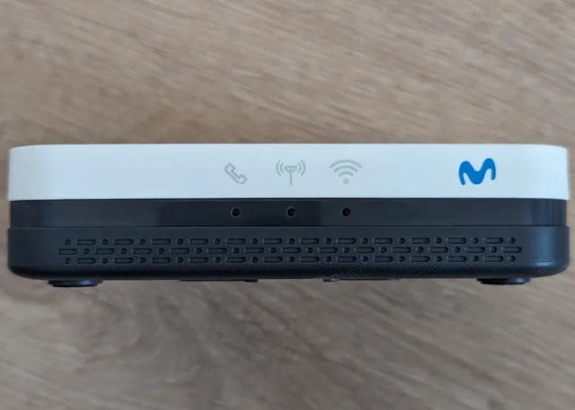

</div>

Cuyo nombre es Blu-Castle PhoneBox modelo BCEG670. Esto es un
_módem_<sup>[1](#note-1)</sup>, un aparato que actúa como un "traductor".

Si damos vuelta nuestro módem, vamos a ver que tiene un par de puertos (entre
otras cosas):

- Un puerto RJ11 (para conectar nuestro teléfono al módem)
- Un misterioso puerto micro USB

<div
  style={{
      display: "flex",
      "flex-direction": "column",
      "align-items": "center",
    }}>

    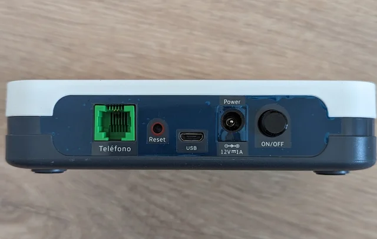

</div>

Al ver ese puerto micro USB pensé: si tiene un puerto así entonces lo puedo
conectar a mi computadora y con suerte lo va a reconocer como un dispositivo USB
con el que puedo interactuar.

Lo cual fue totalmente ingenuo y muy optimista de mi parte. Pero lo hice igual.

Al conectarlo, Windows reconoció el módem como un... ¿adaptador de red?

<div
  style={{
      display: "flex",
      "flex-direction": "column",
      "align-items": "center",
    }}>

    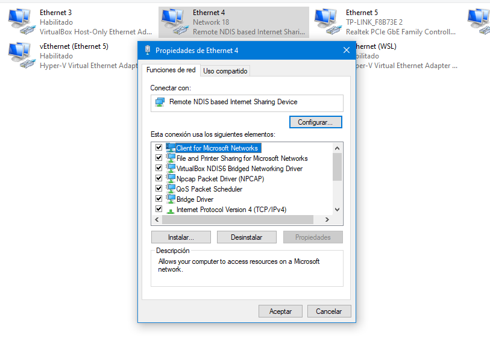

</div>

Antes de seguir decidí hacer lo que debería haber hecho en un comienzo: buscar
información sobre el dispositivo. En algún lado tiene que haber un manual o
cierta documentación del fabricante que diga para qué sirve ese puerto.

Primero me encontré
[con este documento](https://suportebc.com.br/documents/manual_bceg670.pdf), el
cual me dice que puedo acceder a una página de administración web si conecto el
módem a una PC.

<div
  style={{
      display: "flex",
      "flex-direction": "column",
      "align-items": "center",
    }}>

    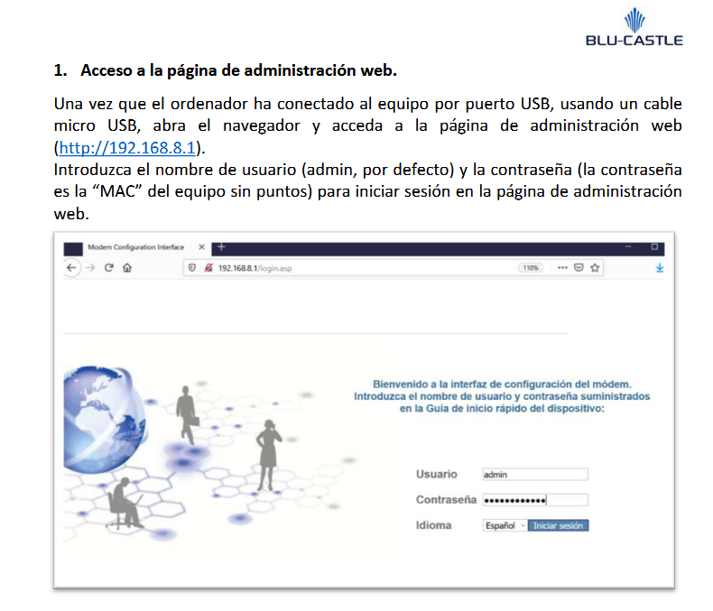

</div>

Intenté ingresar, pero me rendí tras muchos intentos fallidos. La dirección MAC
que veía en Windows no era realmente la MAC del dispositivo.

<div
  style={{
      display: "flex",
      "flex-direction": "column",
      "align-items": "center",
    }}>

    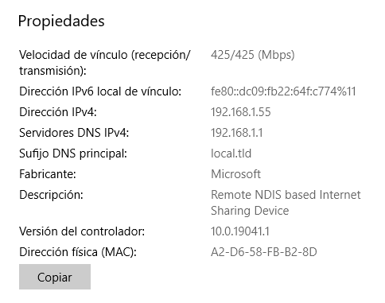

</div>

Seguí buscando información sobre el módem y me encontré
[este otro documento](https://es.scribd.com/document/576177998/guia-PhoneBox-BCEG670-1)
que dice que puedo conectarme al módem a través del protocolo Telnet para
acceder... ¿a un Linux?

<div
  style={{
      display: "flex",
      "flex-direction": "column",
      "align-items": "center",
    }}>

    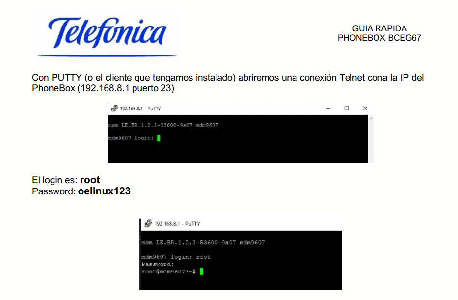

</div>

¿Eh? ¿Cómo que mi módem tiene un sistema operativo y encima es Linux?

Abrí PuTTY, configuré la conexión, y...

<div
  style={{
      display: "flex",
      "flex-direction": "column",
      "align-items": "center",
    }}>

    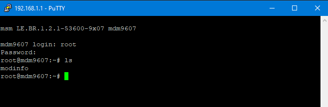

</div>

Esto es muy interesante, básicamente que corra Linux hace que esta pequeña
cajita cuadrada sea más cercana a lo que conocemos como "computadora
convencional".

Y esto me hizo pensar en lo siguiente: si está ejecutando Linux, tiene que haber
un programa o algo que controle el teléfono... que capte los botones, realice
las llamadas, _transmita el audio_...

_<sup><a name="note-1">1</a>:</sup> en este caso, provisto a comodato por la
empresa Movistar para poder realizar llamadas telefónicas a través de lo que se
conoce como Voice over LTE luego de que se fuesen robadas todas las líneas de
par trenzado de cobre en el país._

### Una mini computadora

Una vez que iniciamos sesión podemos acceder a todo el sistema operativo y
obtener más información.

Antes de siquiera iniciar sesión nos dice un dato importante que puede pasar por
desapercibido: _mdm9607_. Esto hace referencia al chipset en el que está basado
todo el aparato, en este caso, **Qualcomm MDM9607**. Nos puede ser útil para
saber de qué es capaz esta mini computadora.

Si empezamos a revisar en los archivos del sistema operativo, hay algunas cosas
interesantes, como scripts de configuración utilizados por Telefónica Argentina:

<div
  style={{
      display: "flex",
      "flex-direction": "column",
      "align-items": "center",
    }}>

    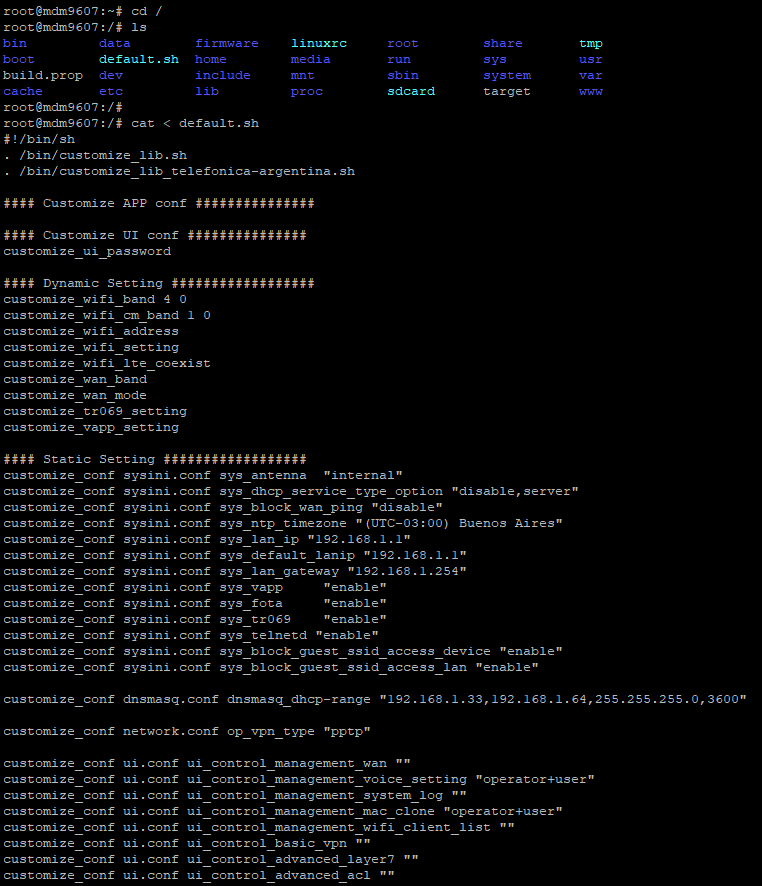

</div>

Pero realmente no me ayudó con mi objetivo de reproducir música porque no
entiendo nada relacionado a esas configuraciones.

Lo que siguió fueron varias horas de buscar entre todas las carpetas y archivos
para tratar de hallar _algo_ relacionado al control de teléfono fijo.

En algún momento me encontré con el script **d2volte_control.sh** dentro de la
carpeta `/usr/d2/`. ¿d2volte_control...? D2<sup>[2](#note-2)</sup> Voice over
LTE Control. Esto TIENE que estar relacionado al teléfono.

<div
  style={{
      display: "flex",
      "flex-direction": "column",
      "align-items": "center",
    }}>

    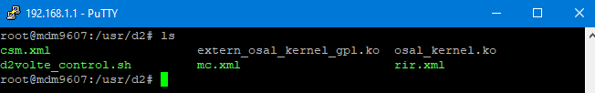

</div>

Al abrir el script me encontré con que tenía varias funciones adentro, pero la
que más me llamó la atención fue vapp_start:

<details>
<summary>d2volte_control.sh - vapp_start</summary>

```bash
vapp_start()
{
        local bind_to_lan=$(cmscfg -ggn vapp_networkInterface)
        local slic_general_config_id=`cmscfg -gggn vapp_cms_slic_general_config`
        [ -z "$slic_general_config_id" ] && slic_general_config_id=0

        mkdir -p /var/tmp/osal

        # 9x07 idu command
        amix 'AUX_PCM_RX Audio Mixer MultiMedia1' 1
        amix 'MultiMedia1 Mixer AUX_PCM_UL_TX' 1
        aplay -P &
        arec -P &

        amix 'AUX_PCM_RX_Voice Mixer CSVoice' 1
        amix 'Voice_Tx Mixer AUX_PCM_TX_Voice' 1
        aplay -D hw:0,2 -P &
        arec -D hw:0,2 -P -R 8000 -C 1 &

        insmod $D2_DIR/osal_kernel.ko
        insmod $D2_DIR/extern_osal_kernel_gpl.ko
        insmod $D2_DIR/ve_vtsp_hw.ko slic_general_config_id=$slic_general_config_id
        insmod $D2_DIR/ve_vtsp_rt.ko

        sleep 8
        $D2_DIR/vapp_config
        vapp_set_xml
        sg volte -c $D2_DIR/vapp &
        sleep 3

        $D2_DIR/vapp_client &
        if [ "$bind_to_lan" == "1" ]; then
                $D2_DIR/vapp -v $(cmscfg -ggn sys_lan_ip)
        fi
}
```

</details>

Estas líneas me llamaron mucho la atención porque mencionan explícitamente
"audio":

```
    # 9x07 idu command
    amix 'AUX_PCM_RX Audio Mixer MultiMedia1' 1
    amix 'MultiMedia1 Mixer AUX_PCM_UL_TX' 1
    aplay -P &
    arec -P &
```

Por curiosidad ejecuté `amix 'AUX_PCM_RX Audio Mixer MultiMedia1' 0` y levanté
el auricular del teléfono. No se escuchaba el tono de marcado, ni los botones,
ni nada en absoluto, el teléfono estaba mudo. Después ejecuté
`amix 'AUX_PCM_RX Audio Mixer MultiMedia1' 1` para revertir el cambio y el
teléfono empezó a hacer sonidos de vuelta.

¿Y los otros comandos? ¿Qué hace `aplay`?

<div
  style={{
      display: "flex",
      "flex-direction": "column",
      "align-items": "center",
    }}>

    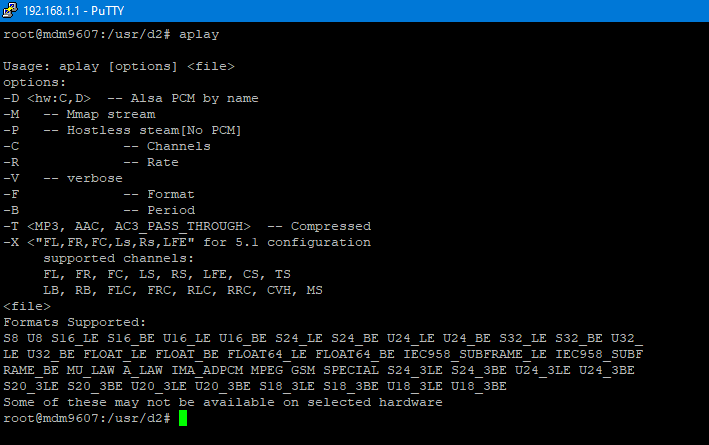

</div>

Reproduce archivos de música, por supuesto.

Esto no puede ser así de fácil.

_<sup><a name="note-2">2</a>:</sup> [D2](https://www.d2tech.com/) resulta que es
una empresa que ofrece productos relacionados a VoIP, VoLTE, entre otros. En
este módem, VAPP es un software de ellos que controla todo lo relacionado a las
llamadas. Antes de ir por la ruta de reproducir un archivo de audio con `aplay`
pensé que tenía que controlar el programa VAPP de alguna forma para reproducir
sonido, lo cual hubiera sido un quilombo._

### ALSA y buffer underruns

No fue así de fácil.

Al principio `aplay` fallaba todo el tiempo con el siguiente error:

```
aplay: Playing 'dummy':Signed 16 bit Little Endian
cannot open device '/dev/snd/pcmC0D0p', errno 16
```

Muchas horas de investigación después, descubrí que:

- El Linux de este módem tiene una versión propia de
  [ALSA](<https://wiki.archlinux.org/title/Advanced_Linux_Sound_Architecture_(Espa%C3%B1ol)>)
  (Advanced Linux Sound Architecture), que es un componente que proporciona
  drivers/controladores para las tarjetas de sonido que tengas instaladas en tu
  computadora.

- `aplay`, `arec`, y `amix` son programas que vienen por defecto con ALSA.
  `aplay` y `arec` se usan para reproducir y para grabar sonido,
  respectivamente, mientras que `amix` se usa para configurar cosas relacionadas
  a los dispositivos de sonido. Al igual que ALSA, estos programas son una
  versión propia del fabricante (Qualcomm), _esto es importante porque me
  terminó complicando la vida después_.

- `/dev/snd/pcmC0D0p` es la forma que ALSA usa para identificar a los
  dispositivos de sonido. La parte `pcm` significa _pulse coded modulation_,
  mientras que `C0` identifica a la primera tarjeta (card 0), y `D0` (device 0)
  al primer dispositivo dentro de la tarjeta. La `p` del final hace referencia a
  que es un dispositivo de _playback_, es decir, para reproducir sonidos.

- `aplay` fallaba en iniciarse porque ya había otro proceso utilizando ese
  dispositivo de sonido.

- Ese dispositivo de sonido es el parlante del teléfono. Es decir... **el Linux
  de este módem reconoce directamente al teléfono fijo como un dispositivo de
  sonido.**

Solucioné el problema de tener el dispositivo de sonido ocupado matando todos
los procesos de `aplay`. Usando magia<sup>[3](#note-3)</sup> transferí un
archivo WAV al módem. Después intenté reproducirlo:

```
root@mdm9607:/mnt/jffs2/sound# aplay test.wav
Aplay:aplay: 'test.wav' is not 16bit per sample
```

Ok. Se queja porque el formato del archivo WAV que le di no es lo que está
esperando. No hay problema, `aplay` soporta parámetros para configurar lo que se
reproduce. Usando `-F` puedo especificar el formato.

```
root@mdm9607:/mnt/jffs2/sound# aplay -F S8 test.wav
optarg = S8
format_names S8aplay: Playing 'test.wav': format Signed 8 bit ch = 2
Aplay:cannot set hw params
Aplay:params setting failed
```

Acá es donde entra en juego eso que dije de que estamos usando una versión no
convencional de ALSA y aplay. Por alguna razón falla automáticamente si me
desvío de la configuración por defecto del comando `aplay`.

La configuración por defecto espera archivos WAV que tengan:

- Formato PCM Signed 16 Bit Little Endian
- 8000Hz de frecuencia de muestreo

Lo cual es malísimo en términos de calidad de sonido, pero no es el fin del
mundo. Con Audacity puedo convertir cualquier archivo de música para que sea un
WAV con esas características.

Agarré un [tema](https://www.youtube.com/watch?v=dQw4w9WgXcQ) que todos
conocemos muy bien, recorté los primeros 30 segundos, y creé un WAV con esas
especificaciones. Funcionó... más o menos.

<VideoEmbed src="https://www.youtube.com/embed/Rsum0prmWJs" />

El tema se reproduce, pero se escucha ralentizado, como si fuera una versión
slowed+reverb. También a medida que se reproduce salta continuamente un mensaje
de error en la consola de Linux:

<div
  style={{
      display: "flex",
      "flex-direction": "column",
      "align-items": "center",
    }}>

    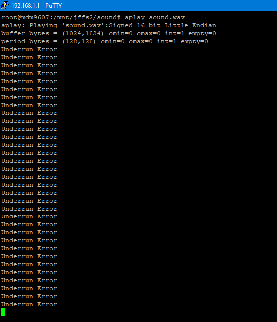

</div>

Este error hace referencia a un
[subdesbordamiento del búfer](https://es.wikipedia.org/wiki/Subdesbordamiento_de_b%C3%BAfer).
Esto pasa cuando un búfer de memoria se carga más lento que la velocidad a la
que se procesa la información de ese búfer.

En nuestro caso significa que, por alguna razón, los datos del archivo de música
se transfieren muy lento a memoria, lo que causa interrupciones en el audio y
que hace parecer que el tema se está reproduciendo de forma ralentizada.

_<sup><a name="note-3">3</a>:</sup> Si bien creo que el módem tiene soporte para
FTP, decidí usar NCAT para transferir datos. Fue lo más sencillo y rápido._

### Tratando de arreglar el audio

Intenté de todo para arreglar ese problema, pero no encontré ninguna solución
mágica.

En mi opinión, el problema puede estar relacionado a:

- La versión de `aplay` que tiene este módem: voy a dejar que el
  [código fuente](https://android.googlesource.com/platform/hardware/qcom/audio/+/jb-mr1-dev/libalsa-intf/aplay.c)
  hable por sí mismo. No quiero ser malo, pero es medio feo.

- El módem no se la banca: capaz no tiene suficiente poder como para reproducir
  archivos de audio, pero no tendría mucho sentido, porque el módem es capaz de
  conectarse a una red 4G y realizar llamadas telefónicas... las cuales
  generalmente reproducen audio.

Pero hoy se me prendió la linternita y pensé: si el audio se "escucha lento",
¿qué pasa si le incremento la velocidad al tema?

<VideoEmbed src="https://www.youtube.com/embed/dvzABOUfp4o" />

No soluciona el problema del búfer, pero eh, se escucha un poco mejor.

Así que, con esto, _Linternita Lo-Fi_ puede reproducir archivos WAV que tengan:

- Formato PCM Signed 16 Bit Little Endian
- 8000Hz de frecuencia de muestreo
- Un solo canal de audio (mono)
- Tengan un 10% de la velocidad incrementada (en algunas canciones quizás deba
  ser más o menos)
- La amplitud de la canción reducida (descubrí que si la canción se escucha "muy
  fuerte" termina siendo horrible el sonido que sale del parlante)

## Conclusiones

No hagas esto no vale la pena.
