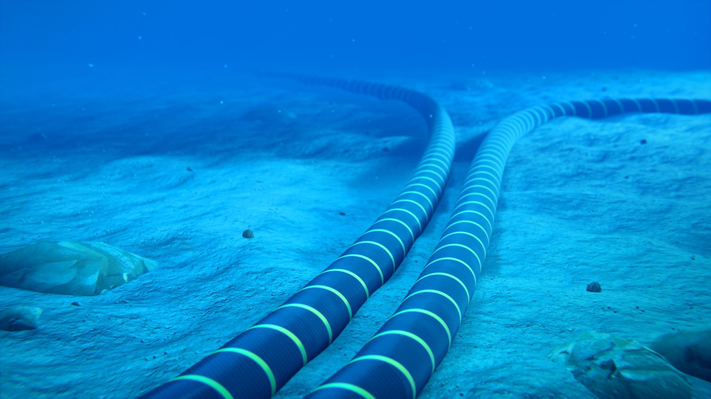
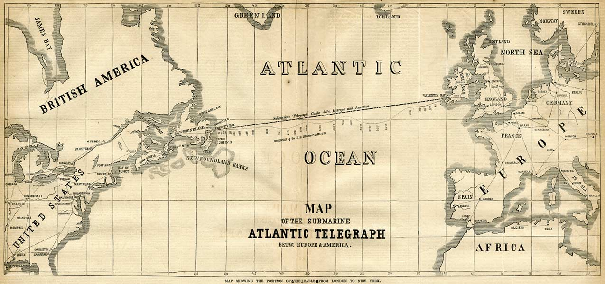
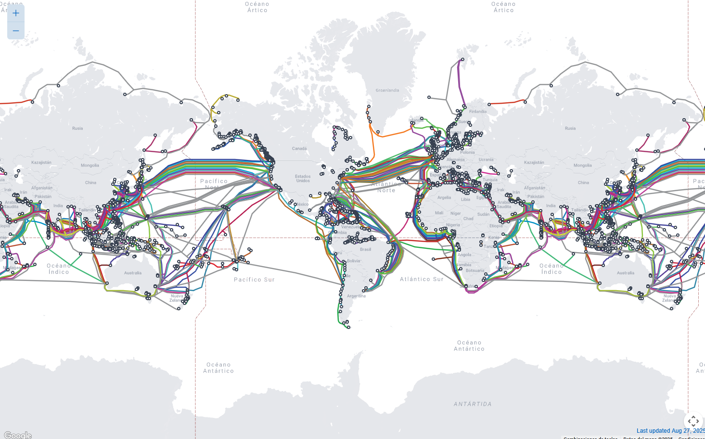
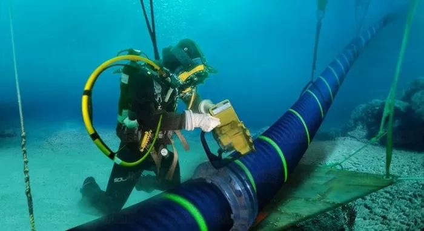
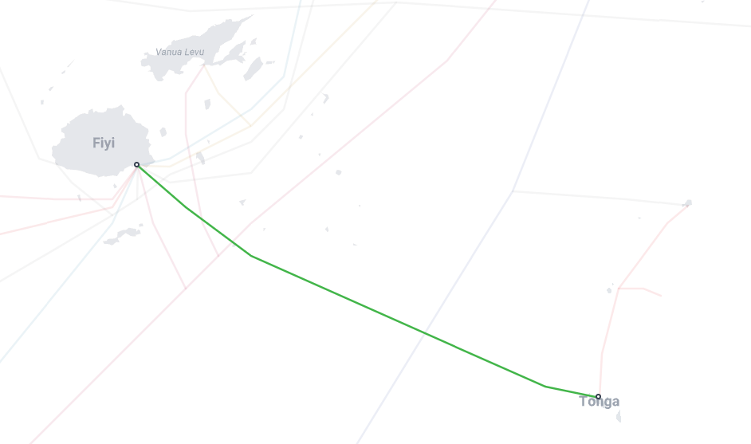
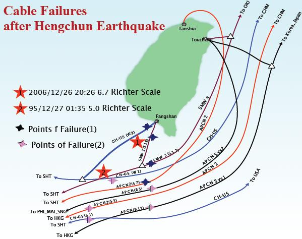
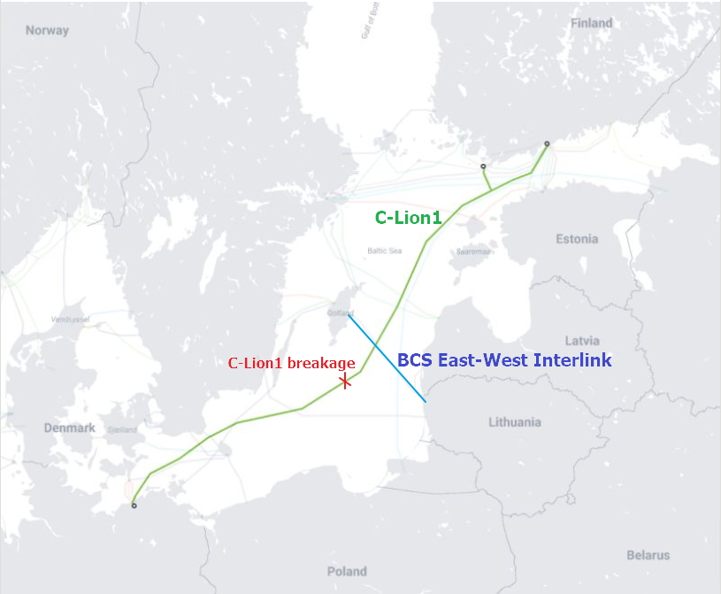
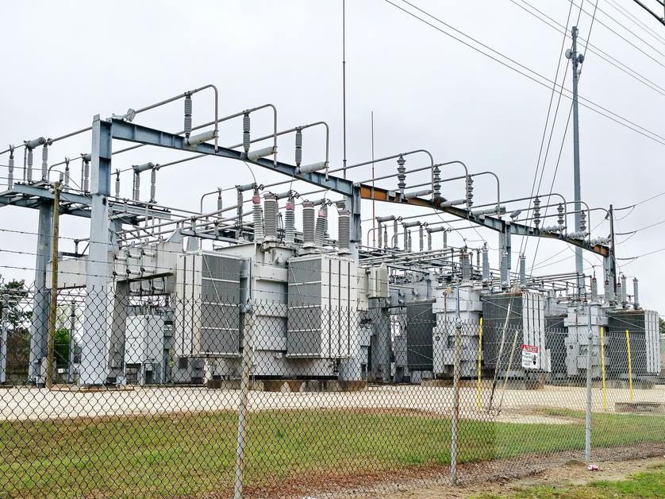

    

<!-- truncate -->

## Hay cables en el fondo del mar

Hay muchas piezas de infraestructura que tendemos a ignorar. Nadie se para en la
calle a ver un poste de cables eléctricos. Sabemos que están ahí pero _no nos
importan_, es parte del escenario y no afectan en casi nada a nuestras vidas
diarias.

Por más que esos mismos cables sean gracias a los que tenemos electricidad en
nuestras casas, trabajos, hospitales, etc.

Pero al menos esos cables están ahí a simple vista. Los percibimos más a menudo
que estos otros, que están sumergidos en el fondo del mar y que cumplen un rol
tal vital como los cables que usamos para el suministro eléctrico.

    

**¿Qué son?**

Cables de fibra óptica, un tipo de cable que transmite información utilizando a
la luz como el medio, en vez de la electricidad como en el caso de un cable de
cobre o similares.

**¿Por qué... tiramos cables en el fondo del mar?**

Para comunicarnos.

Esto es algo que empezó con el telégrafo, como vimos en el post
[más largo y aburrido](https://linternita.com/blog/monopolio-que-cambio-mundo)
de este blog. Para comunicarte con un telégrafo necesitabas una conexión
cableada. No existían medios inalámbricos, y no iban a existir hasta el fin del
1800 cuando Marconi empezó a jugar con las ondas de radio.

Pero la gente quería _telegrafiar_ y querían hacerlo también con gente que
viviese al otro lado del charco.

Entonces decidieron embarcarse (ja ja) en una gran hazaña y en 1858 agarraron y
tiraron un cable desde Irlanda hasta lo que hoy en día es Canadá.

    

Cuando llegó el teléfono seguimos tirando cables al agua, incluso aunque ya en
ese entonces existieran algunas formas de comunicación inalámbrica.

Hoy en día tenemos internet como nuestra forma de comunicación estrella, que en
sus inicios también fue una tecnología "alámbrica" (cable dependiente). Pero
todo lo relacionado al mundo inalámbrico avanzó drásticamente. Tipo, tenemos
Wi-Fi, Bluetooth, satélites, y en algunas partes del mundo hay antenas 5G (lo
que sea que signifique eso). ¿Sigue estando la necesidad de tirar cables al
agua?

Sí.

A pesar de contar con todas estas formas de comunicación inalámbrica, los cables
les pasan el trapo (en la mayoría de los casos).

Por ejemplo, la comunicación cableada en comparación con la satelital es:

- Más rápida: los satélites orbitan a alturas desde 2.000 Km a 36.000 Km, lo que
  introduce un retardo indeseable en las comunicaciones.
- Más eficiente: los cables de fibra óptica tienen un ancho de banda superior al
  de cualquier satélite. Básicamente: pueden transmitir información en mayores
  cantidades y más rápido.
- Más "barata": tirar cables al fondo del mar es algo increíblemente costoso,
  pero ¿construir y lanzar a órbita un satélite?
- Más fácil de mantener: si un cable se corta, arreglarlo es relativamente
  fácil. La única mantención para un satélite es lanzar otro nuevo que lo
  reemplace.
- Y un largo etcétera[1](#note-1).

Es por esto que el 99% del tráfico de internet _pasa_ a través de los cables
submarinos, lo que los convierte en una pieza de infraestructura global crítica.

    

    _Figura 1: mapa de cables submarinos, cortesía de https://www.submarinecablemap.com/_

A día de hoy existen más de 600 cables submarinos activos, que, en conjunto,
tienen un largo de más de 1.48 millones de kilómetros . Algunos son muy "cortos"
con tan solo cientos de kilómetros de longitud, mientras que otros son
increíblemente laaaaaaaaaaaaaaaaaaaaaaaaaaaaaaaaaaaargos, como el cable
_[Asia-America Gateway](https://www.submarinecablemap.com/submarine-cable/asia-america-gateway-aag-cable-system)_
que cuenta con una longitud de 20.000 kilómetros .

**¿Qué tanto nos afectaría si se cortasen estos cables?**

_<a name="note-1">1</a>: en realidad no conozco más ventajas, estoy
usando la clásica técnica de poner "etc" para fingir que sé más cosas pero que
las omito para no alargar el tema._

## Cortes en los cables submarinos

Hay tres cosas que aterran al ser humano moderno:

1. Que se corte la luz
2. Que se corte internet
3. Que pierda Boca[2](#note-2)

Es quizás una obviedad decir esto hoy en día, pero en mayor o menor medida,
todos dependemos del internet. Incluso aunque tu trabajo no dependa de eso,
aunque tus hobbies sean tocar pasto y mirar vacas... estás atado a que funcione
ese servicio.

No es una exageración. Por ejemplo, en 2022 uno de los principales proveedores
de internet de Canadá (Rogers Communications)
[tuvo un corte masivo](https://en.wikipedia.org/wiki/2022_Rogers_Communications_outage)
de internet y telefonía celular que afectó a más de 12 millones de usuarios. No
solo quedaron incomunicados, si no que en el país entero nadie podía usar
tarjetas de débito, porque la empresa que maneja las transacciones quedó
completamente fuera de servicio. Tampoco podías llamar al 911 en caso de
emergencias... entre otras cosas divertidas como páginas del gobierno caídas y
muchos canadienses enojados.

Este corte masivo duró 15 horas y se estima que tuvo un impacto de $142 millones
de dólares en la economía canadiense (oh shit! the economy!!).

Es cierto que esta disrupción masiva no se produjo por que se haya cortado un
cable submarino. Pero, ¿podría pasar algo así? Además, ¿cómo se cortarían? Están
en el fondo del mar... ¿Qué va a venir, un buzo con un cuchillo Tramontina y
empezar a serrucharlos?

    

    _Oh no, not again..._

_<a name="note-2">2</a>: si pierde boquita... pierde la familia._

### Desastres naturales

Una de las principales causas que hacen que se corten estos cables son los
desastres naturales.

#### 2022: erupción del volcán submarino Hunga Tonga–Hunga Haʻapai

Tonga es archipiélago de islas en el Océano Pacífico. También es un país. O un
reino. No importa.

En las cercanías de las islas de Tonga hay un volcán submarino (Hunga
Tonga–Hunga Haʻapai) que el 15 de enero de 2022 explotó así:

    

Esta erupción destrozó todos los cables submarinos de Tonga. Que no eran tantos,
solo dos. Uno que los conecta con Fiji (y con el resto del mundo) y otro que
utilizan de forma doméstica para comunicarse con otras islas.

    

Las noticias sobre el estado de Tonga tardaron en llegar al resto del mundo
porque simplemente no podían enviarlas. Al cortarse los cables, quedaron
bastante incomunicados con el resto del mundo.

Tardaron alrededor de 1 mes en arreglar la conexión con Fiji (y el resto del
mundo), y, sorprendentemente, 18 meses para arreglar el cable doméstico.

Obviamente en Tonga la estaban pasando demasiado mal (que el cable se haya
cortado era malo, pero también estaban lidiando con el desastre causado por el
volcán), pero el resto del mundo siguió como de costumbre.

#### 2006: Terremoto de Taiwán

Un día después de la Navidad de 2006, Papá Noel les regaló un terremoto de
magnitud 7.0 a Taiwán. Al menos 8 cables submarinos que conectan Taiwán con
otros países asiáticos resultaron dañados.

    

Si bien Taiwán fue el más afectado, muchos países de la región, como China, Hong
Kong, Malasia, Singapur, Tailandia, y Filipinas reportaron tener serias
disrupciones de los servicios de comunicación. Estuvieron días sin acceso a
internet y con una degradación del servicio telefónico.

También afectó a la timba local:

> Un terremoto dañó varios cables submarinos de fibra óptica que conectan con
> Taiwán, lo que provocó un caos en la red de telecomunicaciones de Asia
> Oriental y paralizó el centro de datos de Bloomberg, una plataforma popular
> para casas de bolsa y medios de comunicación de Hong Kong. El mercado
> cambiario de Corea del Sur quedó prácticamente paralizado, lo que lastró a las
> acciones coreanas, cuyo rendimiento fue significativamente inferior al de
> otros mercados de Asia-Pacífico. Los corredores de futuros de Singapur
> declararon que no pudieron realizar operaciones extrabursátiles de futuros de
> petróleo tras el cierre del mercado de Singapur debido a la falta de acceso al
> sistema informático de la Bolsa de Futuros de Materias Primas.
>
> https://web.archive.org/web/20070518152250/http://hk.news.yahoo.com/061227/12/1yxbr.html

### Desastres... no naturales

Pero la razón más frecuente de estos cortes es la actividad humana.

Generalmente es culpa de barcos pesqueros y sus anclas, que a veces las
arrastran por el fondo del mar y se llevan puesto uno (o varios) de estos
cables.

Es algo que pasa muy seguido, incluso pasó la semanada pasada:

- **6 de septiembre de 2025:**
  [cortes en el Mar Rojo](https://www.reuters.com/world/middle-east/red-sea-cable-cuts-disrupt-internet-across-asia-middle-east-2025-09-07/)
  producen disrupciones en el servicio en Asia y Medio Oriente
- **17 de noviembre de 2024:**
  [dos cables del Mar Báltico se cortan casi al mismo tiempo](https://www.newsweek.com/nato-baltic-sea-undersea-cables-sabotage-finland-germany-sweden-lithuania-1988002),
  y dado el contexto mundial, se levantan sospechas de si se trató de cortes
  intencionales

    

- **Abril de 2018:**
  [Mauritania se queda completamente sin conexión a internet](https://fortune.com/2018/04/09/mauritania-cable-break-internet/)
  por dos días después de que se cortara un cable
- **Marzo de 2013:** un cable en el Mar Arábigo se corta, reduciendo la
  velocidad de internet en un 60% para varios países,
  [tres tipos son arrestados en Egipto](https://www.bbc.com/news/world-middle-east-21963100)
  al intentar cortar cables cerca de Alejandría (¿buzos con tramontinas? quién
  hubiera pensado que realmente existían)
- **etc**

## No es para tanto... ¿o sí?

Con estos ejemplos que mencioné queda claro que estos cortes son malos. En el
mejor de los casos solamente se sufre una degradación del servicio. En el peor,
tu país puede quedar incomunicado por días.

La verdad es que internet está construido de forma resiliente. Se estima que hay
entre 150 y 200 cortes de este tipo al año, y sin embargo el mundo entero navega
a través de internet todo el año sin mayores problemas. Esto es porque el
tráfico puede ser re-enrutado por otros cables en caso de una falla. O incluso a
través de otros medios, como los satélites.

Pero resulta interesante saber lo vulnerables que son. Todo el mundo depende de
estos cables y la única protección que tienen es la confianza de que nadie va a
cortarlos intencionalmente (porque sería malo... para la economía).

El contexto mundial se está caldeando cada vez más y empiezan a surgir estas
conspiraciones de sabotaje llevado a cabo por algunos países. Si bien es algo
plausible, sería una estrategia cuestionable para usar en una guerra propiamente
dicha. Después de todo, si se enteran que estuviste cortando cables de un país,
lo más seguro es que en represalia vayan a cortarte los tuyos.

También esto me hace pensar en los
[ataques que hubo en algunas subestaciones eléctricas de Estados Unidos](https://www.nbcnews.com/news/us-news/north-carolina-substation-attack-raises-security-concerns-us-electric-rcna60428)
hace algunos años. Estas subestaciones son una parte importante del suministro
eléctrico, pero a diferencia de las centrales donde se genera la energía, no
cuentan con seguridad o vigilancia. Lo único que tienen es una valla/cerco
alrededor de las mismas.

    

En este caso también la seguridad de las mismas está en la confianza de que la
gente no rompería algo así, porque sería malo para todos (y para la
economía...).

## Referencias

- https://www.submarinecablemap.com/

- https://blog.telegeography.com

- https://en.wikipedia.org/wiki/2022_Rogers_Communications_outage

- https://www.datacenterdynamics.com/en/news/tongas-domestic-submarine-cable-fixed-18-months-on-from-volcanic-eruption/

- https://en.wikipedia.org/wiki/2024_Baltic_Sea_submarine_cable_disruptions

- https://www.submarinenetworks.com/en/nv/news/cables-cut-after-taiwan-earthquake-2006

- https://www.kentik.com/blog/subsea-cables-parted-in-red-sea-again/

- https://gulfnews.com/technology/red-sea-cable-chaos-why-the-internet-didnt-go-dark-1.500263896
