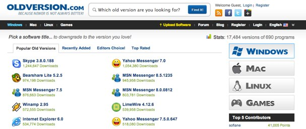

import { VideoEmbed } from "@site/src/components/VideoEmbed";

¿Por dios esta linterna alguna vez se va a callar y dejar de hablar de Windows
95?

<!-- truncate -->

## Sobre el piloto

Hace unos días subí un video sobre Windows 95 y qué tan obsoleto es en 2025.
Contrario a lo que podrías asumir, se pueden hacer bastantes cosas que hacés a
diario en ese sistema operativo, a pesar de tener 30 años y estar casi
completamente olvidado.

Si todavía no lo viste, lo podés ver acá:

<VideoEmbed src="https://www.youtube.com/embed/U1_P8C0PxiA" />

Escribir es lo que se me da mejor y me es relativamente fácil (ojo, no estoy
diciendo que lo que escriba sea bueno, o que vaya a ganar el próximo Pulitzer,
solamente que me es mucho más fácil escupir texto), pero hay dos grandes
realidades que no puedo ignorar:

1. Para mucha gente leer es aburrido y no es su formato preferido para consumir
   contenido.

2. Algunos temas de los cuales me gustaría hablar son difíciles o no funcionan
   bien en formato texto. Por ejemplo, en vez de haber hecho ese video sobre
   WIndows 95 podría haber escrito un artículo, pero siento que perdería mucho
   la gracia. Parte de lo que hace interesante de ese video es ver cómo las
   cosas funcionan "en vivo".

Y quizás una tercera realidad es que hacer un video es algo que siempre me
interesó, pero que nunca me digné a hacer por el esfuerzo que conlleva.

Es interesante la curva de aprendizaje que existe para hacer un video. Acá hay
una lista desordenada de cosas que me sorprendieron:

- Premiere Pro funciona, pero no es lo más amigable del mundo: tengo un
  conocimiento rudimentario de este programa, pero aún así, algunas cosas
  muestran el poco... diseño amigable al usuario que tiene. Por ejemplo, al
  menos en la versión que tengo, si arrastrás una pista de audio y ésta se
  superpone sobre otra, la otra pista desaparece. Linda forma de perder
  progreso.

- Me costó horrores improvisar: mi idea era hacer algo más natural y hablar
  sobre la marcha explicando lo que hacía. No me salió y tuve que grabar "voice
  overs" y después ajustarlos para que concuerden con el video grabado. Creo que
  al estar consciente de que estaba grabando me auto-impuse una presión y me
  ponía nervioso.

- La edición de sonido no es fácil: salvo una parte donde tardé como una hora
  censurando una dirección de correo electrónico (y otras cosas), la edición del
  video fue fácil. Un par de "fade-ins" y "fade-outs", texto blanco sobre un
  fondo negro, y no mucho más. ¿Pero el sonido? Mamita... asegurarme que se
  escuche bien mi voz, que no haya ruido en la grabación, que haya música de
  fondo (sabiendo que no puedo poner nada que tenga copyright), nivelar a mano
  el volumen de cada tema para que no tape mi voz (quizás haya una mejor forma,
  no lo sé)...

Capaz muchas de estas cosas me pasaron por intentar perseguir el "estándar" de
calidad de YouTube.

Dejame aclarar, sé que no hay un estándar de calidad de YouTube, justamente
tenés videos de todo tipo de calidad. Pero en mi caso estaba apuntando a lograr
algo similar a los videos que veo yo, de canales como
[Michael MJD](https://www.youtube.com/channel/UCS-WzPVpAAli-1IfEG2lN8A) o cosas
por el estilo. No me pareció para nada fácil.

Aunque también es cierto que todo esto que comento me llevó menos de 8 horas
(sin contar toda la preparación de Windows 95) y que mi objetivo era probar y
ver qué salía (de ahí que lo llame "piloto"). Así que capaz estoy quejándome
demasiado.

En fin, la mejor forma de convertirse bueno en algo es haciéndolo.

## Sobre Windows 95

Hay muchas cosas que no incluí en el video pero que me hubieran gustado
mencionar. Podés considerar esta parte del post como un complemento al mismo.

### Seguridad

Esto es algo que sí o sí debería haber mencionado en el video:

**WINDOWS 95 NO ES SEGURO NI DEBERÍAS HACER NADA MINIMAMENTE IMPORTANTE EN ESE
SISTEMA OPERATIVO**

Es un sistema operativo de 30 años que no recibe parches desde... 1997 o andá a
saber cuándo. Es total y completamente vulnerable.

Pero...

También es cierto que ya no hay virus dando vuelta que ataquen específicamente a
esa versión de Windows. Los que hay dando vuelta atacan versiones recientes de
Windows, porque eso es lo que la mayoría de la gente está usando.

Y además, hoy en día casi todos nos conectamos a internet a través de un router
que usa NAT (Network Address Translation). La NAT rechaza cualquier conexión
entrante que no esté incluida en la tabla de port-forwarding. También algunos
routers bloquean ciertos puertos por defecto. Así que es muy poco probable que
una computadora con Windows 95 se infecte con tan solo conectarse a internet.

En mi caso estuve horas conectado a internet, descargué software desde una
página dudosa, e incluso me conecté a mi cuenta de Gmail (con una contraseña de
aplicación de Google) y no me pasó nada.

BUY LTN THE BEST NEW CRYPTO CURRENCY IN THE WORLD BUY LTN 🔦 BUY LTN 🔦 BUY LTN
🔦 BUY LTN 🔦 🔦 🔦 🔦!!!!

### Emulando Windows 95

Cuando empecé a hacer este video mi primera idea era crear una máquina virtual
con VirtualBox e intentar hacer todo ahí.

Si bien es posible, no es la mejor forma. Esto es porque VirtualBox es un
hipervisor. Las máquinas virtuales que crees con un hipervisor se ejecutan sobre
el hardware que tengas en tu computadora.

El problema con esto es que Windows 95 es viejo y no en algunos casos no sabe
qué hacer con el hardware moderno. Por ejemplo, si tu procesador tiene más de
2.1GHz, te vas a encontrar con un mensaje como este cuando intentés arrancar el
sistema operativo:

    

    _Figura 1: un error de Windows_

El cual se puede solucionar pero tenés que instalar un parche
(https://archive.org/details/fix-95-cpu-v3-final).

Además de eso, se complica ajustar cosas como la resolución de la pantalla. Si
vas por la ruta de VirtualBox, vas a ver que te recomiendan instalar un driver
extraño para el video, y que en mi caso me rompía Windows 95.

La mejor forma que existe hoy en día es usando [86Box](https://86box.net/), un
emulador.

A diferencia de los hipervisores, los emuladores se toman el trabajo de "imitar"
el hardware de la época en el que corrían estos programas. Por ejemplo, 86Box es
capaz de emular distintos tipos de procesadores, placas de vídeo, lectoras de
CDs, etc, etc.

Lo cual te da mucho mejor control del ambiente virtualizado y hace que el
software que corras tenga mejor estabilidad y funcione... como funcionaba en ese
entonces.

A primera vista 86Box da un poco de miedo. Hay muchas opciones y cosas para
configurar. Afortunadamente hay...
¿[una guía en Steam](https://steamcommunity.com/sharedfiles/filedetails/?l=english&id=2526174088)?

Es uno de los primeros resultados que me salió cuando busqué un tutorial en
Google y es una increíblemente buena guía.

Puede parecer raro que esté en algo como Steam, pero tiene sentido: mucha gente
utiliza este emulador para poder jugar juegos de la época sin tener problemas de
compatibilidad o errores raros.

### Oldversion.com

Un poco más arriba mencioné que había descargado software de una página dudosa.
Estaba haciendo referencia a oldversion.com.

    

Realmente no sé si sea "dudosa" o no, lo que sí sé es que no puedo acceder a
esta página desde ningún navegador moderno... pero sí pude desde Windows 95 y
con RetroZilla.

Esta página guarda versiones antiguas de varios softwares, y la verdad que fue
bastante útil para conseguir algunos programas que no estaban archivados en
archive.org.

Por ejemplo, desde OldVersion descargué Winamp y Notepad++, y ambos terminaron
funcionando bien y sin problemas.

Ojalá que la página siga funcionando y que arreglen el problema de no poder
ingresar con un navegador moderno. El archivo de versiones de software que tiene
es bastante interesante y sería una lástima que se pierda.

### WinWorld

Archive.org es un buen lugar para encontrar software e imágenes ISO de sistemas
operativos. Pero al meterme en todo esto descubrí
[WinWorld](https://winworldpc.com/), que si no me equivoco debe ser el mejor
archivo de imágenes ISO de Windows y otros sistemas operativos. No solo te dejan
descargarlas, si no que también te algo de contexto, mencionan las diferencias
entre cada versión, te dan instrucciones sobre como instalarlas...

    

### Worms Armageddon

Increíble. Juegazo. GOTY of the year.

Este juego salió en 1998 y todavía lo siguen actualizando/manteniendo. O bueno,
más o menos, hace 5 años fue la última actualización, y antes de eso habían
pasado 8 años sin actualizaciones.

Pero estamos hablando de un juego de 1998... que 22 años después de su
lanzamiento le hayan dado soporte es increíble. Y a día de hoy podés jugar
online porque todavía tienen un servidor levantado.

Aprovecho para dejar lo que es capaz la mejor pieza cómica jamás realizada:

<VideoEmbed src="https://www.youtube.com/embed/WjvGtCo8RLE?si=CY2bTIbpZaXqvENS&amp;start=120" />
