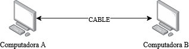
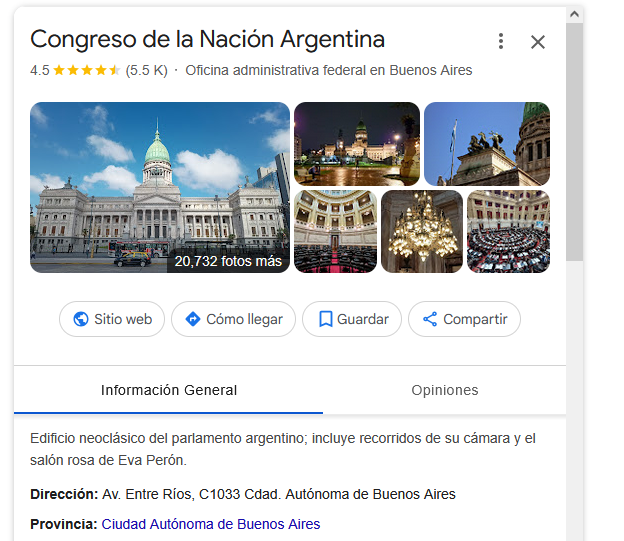
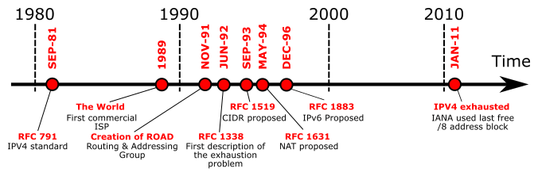

import { VideoEmbed } from "@site/src/components/VideoEmbed";

Una transición que empezó en los años 2000 y que todavía no se termina.

<!-- truncate -->

## ¿Cómo hacen las computadoras para comunicarse entre ellas?

...es una muy buena pregunta que no voy a responder en este post, porque la
respuesta sería tan o más larga que este libro:
[Andrew S. Tanenbaum - Computer Networks](https://csc-knu.github.io/sys-prog/books/Andrew%20S.%20Tanenbaum%20-%20Computer%20Networks.pdf).<sup>[1](#note-1)</sup>

Pero de alguna forma tengo que empezar este post, así que voy a intentar
explicar algo mucho más simple.

_<sup><a name="note-1">1</a>:</sup> Esta nota es para lectores que realmente
sepan de redes. Esto es un tema realmente extenso y complicado. En este post voy
a sobre-simplificar las cosas para que sea más fácil de digerir._

## ¿Qué es el Internet?

Imaginemos el siguiente escenario: tenés dos computadoras y querés que se
comuniquen entre ellas. De alguna forma, lográs conectar ambas máquinas con un
cable, formando algo como lo siguiente:

<div
  style={{
      display: "flex",
      "flex-direction": "column",
      "align-items": "center",
    }}>

    

    _Figura 1: Dos computadoras conectadas por un misterioso cable_

</div>

Ahora las dos computadoras disponen de un medio por el cual pueden comunicarse.
Ya que estamos imaginando cosas, podemos dar rienda suelta y asumir que la
comunicación es bidireccional entre ambas.

Es más... Nuestro mundo computadoril es bastante pequeño. ¿Por qué no agregás
una tercera computadora, ya que estamos?

<div
  style={{
      display: "flex",
      "flex-direction": "column",
      "align-items": "center",
    }}>

    

</div>

Felicitaciones. Acabás de crear tu primera **RED** de computadoras. Estas tres
computadoras van a poder comunicarse entre ellas y pasarse... datos... o lo que
sea que hagan las computadoras normalmente.

Esto está buenísimo. Ahora, supongamos que tu vecino tiene una computadora con
todas las temporadas de Dr. House en alta definición, y a vos te gustaría poder
verlas desde tu casa usando una de tus computadoras...

Cuando le golpeás la puerta a tu vecino y le decís que querés conectar su
computadora a tu red para ver la serie, tu vecino te dice que él también tiene
una red. También te pregunta cómo anda tu mujer.

<div
  style={{
      display: "flex",
      "flex-direction": "column",
      "align-items": "center",
    }}>

    

</div>

Le decís ah qué bueno y que tu mujer está bien. Le preguntás si podés conectar
_Computadora B_ con _Compu 1_ porque quedan más cerca. Te dice que sí que no hay
problema. Tirás el cable y ahora tenés algo como esto:

<div
  style={{
      display: "flex",
      "flex-direction": "column",
      "align-items": "center",
    }}>

    

</div>

<details>
<summary>Detalles aburridos</summary>

Mientras seguimos en nuestro Mundo Imaginario, asumamos que además de tener
comunicación bidireccional, también las computadoras pueden "retransmitir" los
mensajes que no son para ellas y enviarlos a la computadora adecuada.

Así, por ejemplo, si _Computadora A_ quiere comunicarse con _Compu 2_, podría
hacerlo tranquilamente pasando por _Computadora B_ y _Compu 1_ (o la ruta que
más prefieras) hasta llegar a _Compu 2_.

</details>

Con esto, pasamos de tener una red de computadoras, a establecer una conexión
entre dos redes distintas. Es decir, **interconectamos** redes.

Este proceso de conectar redes entre sí recibe el nombre de _internetworking_ en
inglés. El resultado final que obtenemos (un sistema de redes interconectadas)
se llama _internetwork_ o **internet**.

En la actualidad contamos con un sistema mundial de redes interconectadas al que
popularmente nos referimos como... Internet. El Internet es una internet, pero
no toda internet necesariamente pertenece o es parte del Internet.

## Protocolo de comunicaciones

Siendo reduccionistas, las computadoras de nuestra "internet imaginaria" se
comunican enviándose mensajes a través de los cables.

Pero para que haya una comunicación real, las computadoras tienen que
"entenderse". Es decir, los mensajes que se envíen tienen que poder ser
entendidos y procesados por que cualquier computadora que sea parte de la red.

Es por esto que se crearon los _protocolos de comunicaciones_, que no son más
que un conjunto de reglas que establecen cómo tienen que ser los mensajes que
son enviados. Un protocolo de comunicaciones puede definir reglas, la sintaxis y
semántica de los mensajes, manejo de tiempos y sincronización, entre otras
cosas.<sup>[2](#note-2)</sup>

De esta forma, los mensajes que se envían pasan a ser más complejos. No
solamente contienen la "información" que se quiere comunicar, sino que pasan a
incluir datos adicionales del protocolo, que ayudan a las otras computadoras a
procesar/interpretar esos mensajes.

Esto es algo similar a lo que pasa cuando enviás una carta. No escribís un
mensaje en un papel y esperás que mágicamente sea entregado y procesado por la
persona correcta. El papel se tiene que guardar en un sobre, luego al sobre se
le escribe otra información adicional, como la dirección del destinatario y la
del remitente, una estampa... lo que sea.

Ya que hablamos de direcciones: en la vida real una "dirección" identifica de
forma única una casa/edificio. Por ejemplo, la dirección _Av. Entre Ríos, C1033
Cdad. Autónoma de Buenos Aires_ está asociada/identifica al Congreso de la
Nación Argentina.

<div
  style={{
      display: "flex",
      "flex-direction": "column",
      "align-items": "center",
    }}>

    

</div>

En nuestro mundo computadoril, un protocolo de comunicaciones también puede
asignar direcciones para cada una de las computadoras que son parte de la red.
Estas direcciones cumplen el mismo rol que las de la vida real: permiten dirigir
un mensaje hacia un destinatario específico.

_<sup><a name="note-2">2</a>:</sup> Una analogía a esto son los
idiomas/lenguajes humanos. El idioma español tiene un conjunto de reglas
sintácticas, gramaticales, etc. Dos personas que hablen español pueden
entenderse gracias a que ambas siguen el mismo conjunto de reglas, pudiendo así
comunicarse._

## IPv4: El Protocolo Internet

IPv4 es un protocolo de comunicaciones que fue creado en 1981 para definir cómo
las computadoras pertenecientes a una internet pueden/deben comunicarse.

Es un protocolo muy interesante y demasiado extenso de explicar. Lo importante
es saber que cuando se diseñó, se hizo bajo la idea de que cada computadora
debía tener una dirección única que la identificase. Y como en esa época no
había tantas computadoras y dispositivos interconectados como hoy, **se definió
que IPv4 "tan solo" tuviese 4,294,967,296 direcciones
posibles.**<sup>[3](#note-3)</sup>

Claro, en 1980 solamente tenías a dos universidades locas de Estados Unidos
conectadas. Esa cantidad de direcciones era más que suficientes y todos estaban
felices. Pero en los 90s Internet se convirtió en la-nueva-cosa-caliente y todo
el mundo quería conectarse. Ahí es cuando un grupo de nerds entró en pánico al
darse cuenta de que, dentro de poco, no iban a haber más direcciones IPv4
disponibles.

<div
  style={{
      display: "flex",
      "flex-direction": "column",
      "align-items": "center",
    }}>

    

</div>

Para complicar un poco más las cosas, de las 4 mil millones de direcciones que
tiene el protocolo IPv4, tan solo 3 mil millones (y monedas) son utilizables
para identificar a una computadora.

Hoy en día se estima que hay más de 18 mil millones de dispositivos conectados a
Internet.

Por cómo funciona IPv4, si no tenés más direcciones disponibles, significa que
nuevas computadoras que quieran ser parte del Internet no van a poder serlo. No
van a poder conectarse. Internet sería cosa de "unos pocos" (muchos).

Nadie quería esto, entonces se pusieron a pensar en algunas soluciones para
evitar que esto pase.

_<sup><a name="note-3">3</a>:</sup> Por... cuestiones de cómo funcionan las
computadoras, no podemos diseñar un protocolo que tenga infinitas direcciones.
Siempre va a existir un límite, una cantidad finita de direcciones._

## IPv6

IPv6 fue propuesta como una posible solución. En sí, la podemos considerar como
"la siguiente versión" del protocolo IP, destinada a reemplazar a IPv4.

Esta versión contiene diferencias notables con IPv4 (que a un grupo de gente les
encanta debatir y pelear sobre ellas). Pero, las más importantes (a mi criterio
y en base a lo que venimos hablando) son:

- 340,282,366,920,938,463,463,374,607,431,768,211,456 direcciones posibles
- No es retro-compatible con IPv4

Son 340 [undecillones](https://es.wikipedia.org/wiki/Undecill%C3%B3n) de
direcciones, en comparación contra las 4 mil millones de IPv4.

IPv6 se propuso en 1996 y comenzó a ser implementado en los años 2000.

Cerca del 2010, las direcciones IPv4 fueron agotadas.

¿Esto quiere decir que el Internet en 2025 utiliza solamente/mayormente IPv6?

No.

Google tiene una página donde muestra cuántos de sus usuarios utilizan sus
servicios bajo el protocolo IPv6.

Así se ven las estadísticas al momento de escribir este post:

<div
  style={{
      display: "flex",
      "flex-direction": "column",
      "align-items": "center",
    }}>

    

</div>

Solamente el 44% de los usuarios de Google está utilizando IPv6.

¿Pero si no hay más direcciones IPv4 y no está todo el mundo usando IPv6 cómo
tenemos "todos" acceso a Internet?

Porque hubo un par de propuestas antes de IPv6 que actuaron como "parches" para
evitar el agotamiento de direcciones IPv4. Lo más relevantes fueron CIDR, las
direcciones IP privadas, y NAT.

## Direcciones IP privadas

Inicialmente, el protocolo IPv4 se creó bajo la idea de que cada dirección IP
sea "alcanzable" por el resto de los dispositivos conectados en Internet. Es
decir, cada dirección era global, única y pública. Si tenías tu computadora
conectada a Internet, todo el que quisiese (y supiese tu dirección) podía
enviarte mensajes.

Pero se notó lo siguiente: algunas empresas no querían que todas las
computadoras de su red fueran públicamente accesibles/estuvieran conectadas a
Internet. Sí deseaban que esas computadoras pudieran ser accedidas/referenciadas
con una dirección IPv4 _dentro_ de la red de la empresa (para comunicarse con
ellas), pero no que todo el mundo pudiera hacerlo.

Entonces se crearon los siguientes rangos de direcciones IP "privadas":

```
    10.0.0.0        -   10.255.255.255  (10/8 prefix)
    172.16.0.0      -   172.31.255.255  (172.16/12 prefix)
    192.168.0.0     -   192.168.255.255 (192.168/16 prefix)
```

Las computadoras que sean asignadas con alguna de esas direcciones dentro de una
red pueden comunicarse libremente con otras computadoras de la misma red, pero
no tienen acceso alguno a Internet.

El resto de direcciones que no se encuentren dentro del rango de privadas
empezaron a recibir el nombre de "públicas". Una computadora con una dirección
IP pública sí puede conectarse a Internet y recibir mensajes de cualquier otra
computadora perteneciente a esa red.

## NAT: Network Address Translation

Una forma fácil de explicar NAT es la siguiente: permite que varios dispositivos
dentro de una red compartan la misma dirección IPv4 pública.

NAT utiliza fuertemente el concepto de direcciones IP privadas. Básicamente,
todas las computadoras dentro de tu red van a tener direcciones IP privadas.
Para poder acceder a Internet, vas a tener una sola computadora (o... router...)
que posea una dirección IPv4 pública.

Cuando una de las computadoras de tu red quiera acceder a Internet, se produce
un proceso de "traducción", donde la dirección privada se asocia a la pública y
viceversa.

<div
  style={{
      display: "flex",
      "flex-direction": "column",
      "align-items": "center",
    }}>

    

</div>

Este TREMENDO truco básicamente desactivó la bomba del agotamiento de
direcciones IPv4. Ojo, no lo resuelve, pero gracias a esto el problema se pateó
para adelante. Hoy, 30 años después, Internet sigue funcionando y recibiendo
nuevos usuarios mayormente gracias NAT.

Esto no quiere decir que NAT sea una buena solución o que sea lo mejor del
mundo. Mucha gente lo odia y con justa razón.

## ¿Por qué tarda tanto la transición a IPv6?

Es una mezcla de cosas, pero todo se reduce al costo.

Los parches que se hicieron sobre IPv4 calmaron un poco las cosas, pero en un
mundo ideal ya hubiéramos migrado a IPv6 en los años 2000, en vez de estar
sobreviviendo en base a parches por 30 años.

El hecho de que IPv6 no sea retro-compatible con IPv4 dificulta mucho la
transición. Migrar a IPv6 significa comprar nuevo equipamiento y reemplazar todo
el existente que solamente funciona con IPv4.

Pero no podés deshacerte del equipamiento viejo, porque no todo el mundo está en
IPv6 todavía, entonces tenés que ofrecer _ambos_ protocolos al mismo tiempo.

IPv6 tiene algunas mejoras con respecto a v4 más allá de la cantidad de
direcciones, pero ninguna sobresale demasiado como para invertir la migración a
ese protocolo.

Esto no quiere decir que cosas como NAT no tengan sus costos. En realidad,
también los tienen. Pero se ve que, por ahora, son menores a los asociados a
IPv6.

## Comentarios finales

Hasta antes de investigar para este post, solía decir que "IPv6 nunca se va a
terminar de implementar" por la increíble lentitud de la transición.

Probablemente lo siga diciendo en joda porque me causa gracia, pero me sorprende
saber que IPv6 casi llega al 50% en las estadísticas de Google.

También, en alguna de las referencias que incluyo acá abajo (↓↓↓) hay un post
que dice que IPv6 es ampliamente utilizado en internet móvil (celulares, redes
4G/5G). Es una grata sorpresa y tiene mucho sentido que la adopción venga por
ese lado.

Por otra parte, **"Habrá que esperar"** quizás se convierta en una serie de
posts sobre tecnologías que vienen siendo prometidas hace tiempo, pero que
todavía siguen en sus primeros pasos. Como la computación cuántica, la fusión
fría, o...

## Referencias

https://en.wikipedia.org/wiki/Capitalization_of_Internet

https://www.ipv4.global/events/ipv5/

https://apenwarr.ca/log/20170810

https://tailscale.com/blog/two-internets-both-flakey

https://blog.apnic.net/2024/10/22/the-ipv6-transition/

https://hackernoon.com/why-we-are-not-likely-to-transition-to-ipv6-any-time-soon

https://iot-analytics.com/number-connected-iot-devices/

https://datatracker.ietf.org/doc/html/rfc1597

https://datatracker.ietf.org/doc/html/rfc1918

https://www.rfc-editor.org/rfc/rfc1631.html

[Andrew S. Tanenbaum - Computer Networks](https://csc-knu.github.io/sys-prog/books/Andrew%20S.%20Tanenbaum%20-%20Computer%20Networks.pdf)
