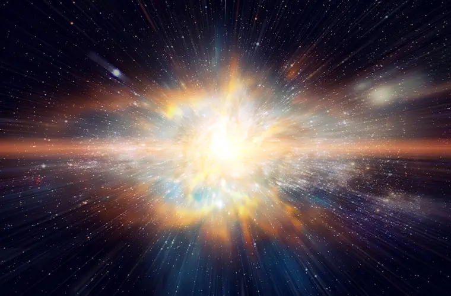
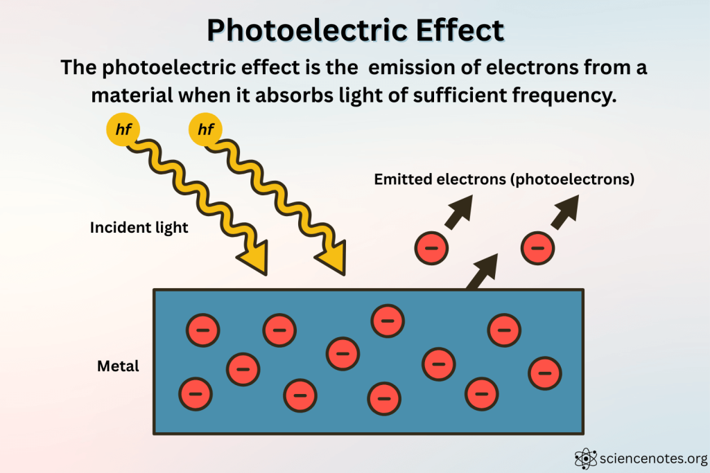

import { ExpandableList } from "@site/src/components/ExpandableList";
import { ThoughtBubble } from "@site/src/components/ThoughtBubble";
import { VideoEmbed } from "@site/src/components/VideoEmbed";

¿No escuchaste? Las computadoras cuánticas van a romper la criptografía moderna
en tan solo 5 años. Lo vienen diciendo hace 30 años.

<!-- truncate -->

  
    
HABRÁ QUE ESPERAR: COMPUTACIÓN CUÁNTICA

  

## ¿Qué es la mecánica cuántica?

...es una muy buena pregunta que no voy a responder en este post, en cambio, voy
a intentar explicar algo mucho más simple.

## ¿Qué es una computadora cuántica?

Ah, mierda.

No puedo explicar esto sin explicar lo de mecánica cuántica.

Volvamos al principio.

## 13 mil millones de años en el pasado

    

NO TAN LITERALMENTE!!!

## Mecánica clásica

Por mucho tiempo a lo largo de la historia de la humanidad nos centramos en el
estudio del movimiento de objetos o cuerpos macroscópicos, es decir, aquellos
objetos que se aprecian a simple vista.

Para intentar explicar cómo los cuerpos se mueven se generaron muchos
postulados, conceptos, teorías. La mayoría de ellas recaían en la idea de una
"fuerza" y cómo esta al ser aplicada a un cuerpo produce que el mismo se mueva.

Recién en el siglo 17, gracias a las leyes del movimiento de Isaac Newton (y las
contribuciones de muchos más, pero alguien se tiene que llevar el protagonismo
siempre), es que se da comienzo a lo que conocemos como _mecánica clásica_.

La mecánica clásica es una teoría científica. Las teorías intentan explicar el
_cómo_ de algo. Y contrario al uso popular de la palabra, las teorías
científicas no son un "se me ocurreeee que podría ser por esto", sino que tienen
sus bases en repetidos experimentos que validan la teoría y la dan por
verdadera.

En este caso, la mecánica clásica explica cómo los
cuerpos[1](#note-1) se mueven. Utilizándola podemos predecir cómo un
objeto se moverá en el futuro, e incluso determinar cómo se movió en el pasado.
Y la verdad es que las predicciones que podemos realizar con esta teoría son muy
buenas, tan buenas que se siguen utilizando hasta el día de hoy.

Pero las predicciones se caen a pedazos cuando intentamos estudiar cuerpos de
otro tipo. Por ejemplo, no nos sirve para predecir el movimiento de cuerpos
extremadamente masivos, ni para describir cuerpos que se encuentren cercanos a
la velocidad de la luz, ni para estudiar cuerpos que sean inferiores al tamaño
de un átomo. Para cada uno de estos casos necesitamos otras teorías, como la
relatividad general, la relatividad especial, y la **mecánica cuántica**,
respectivamente.

_ <a name="note-1">1</a>: Se entiende por cuerpo a un conjunto de
materia que tiene propiedades tales como masa, velocidad, momento, y energía._

## Vieja teoría cuántica

Así que... llega un punto en el que la mecánica clásica se rompe.

¿Pero por qué? ¿Qué es lo que no podemos predecir usando esa teoría?

Hubo algunos casos que se consideran "puntos de quiebre": fenómenos que no
podían explicarse utilizando las bases clasicistas. Estos dieron inicio a una
nueva forma de explicar las cosas.

### 1. Radiación de cuerpos negros

A menos que hayas vivido en un tupper toda tu vida, la siguiente frase no
debería ser una revelación: cuando las cosas se calientan, emiten luz. Esto
aplica a cualquier objeto cuya temperatura sea mayor al cero
absoluto.[2](#note-2)

A medida que un objeto se va calentando más y más, el color de la luz emitida
cambia. Si alguna vez viste un metal calentándose, seguramente apreciaste como
al comienzo empieza a brillar con un color rojo apagado, luego un rojo vivo, y
si le seguís sumando temperatura pasaría por naranja, amarillo, y _casi_-blanco.

    

    _Figura 1: un pedazo de hierro caliente que emite luz de color naranja_

La explicación física de este fenómeno es la siguiente: la luz es una onda
electromagnética que se genera por los movimientos de una carga eléctrica. Lo
que llamamos temperatura es un promedio de la energía cinética (movimiento) de
los átomos que conforman un objeto. Mientras más temperatura tenga un objeto,
más se van a mover los átomos. Estos están compuestos por protones, neutrones, y
electrones. Los electrones son una partícula con carga eléctrica que puede
moverse libremente alrededor del átomo. Por lo tanto, mientras mayor sea la
temperatura, mayor es el movimiento de electrones, lo que termina generando más
luz.

Allá por fines del 1800 los científicos querían estudiar esta relación entre la
temperatura de un cuerpo y la luz que es emitida. Para ello, se concibió la idea
de un "cuerpo negro", un objeto idealizado capaz de absorber de forma perfecta
_toda_ la radiación electromagnética (luz) que le llega.

<ThoughtBubble>
  perdoname linternita no entiendo un pomo, qué tiene de importante que absorba
  toda la luz de forma perfecta??
</ThoughtBubble>

El hecho de que absorba la luz de forma perfecta significa que _no refleja_
ninguna luz proveniente del ambiente que lo rodea. Entonces, cualquier luz que
sea emitida por el cuerpo negro es únicamente un resultado propio de la
temperatura del mismo. De esta forma podés concentrarte únicamente en la
relación temperatura / luz emitida sin tener algo externo que afecte al
resultado.

Usando el marco de la mecánica clásica que había en ese entonces, se generó una
ecuación que se podía utilizar para predecir la intensidad de la radiación
emitida por un cuerpo negro. Esta ecuación, conocida como la _Ley
Rayleigh–Jeans_, establecía que la intensidad era directamente proporcional a la
temperatura e inversamente proporcional a la longitud de onda elevada a la
potencia de cuatro.

    

Esta fórmula funcionaba bien para longitudes de onda grandes. Pero si tenés una
mínima noción de análisis matemático, hay algo que te debería estar llamando la
atención...

**_¿Qué pasa cuando la longitud de onda tiende a cero????_**

La intensidad emitida tiende al infinito... la cantidad de energía generada
sería infinita.

Esto no concuerda para nada con nuestra intuición, ni con lo que los
experimentos mostraban.

En el siguiente gráfico, la curva negra representa los resultados arrojados por
la ecuación de Rayleigh–Jeans, donde se puede apreciar como para longitudes de
onda que se acercan a cero la intensidad de la radiación es infinita.

    

Mientras que las curvas de otros colores muestran los valores obtenidos
experimentalmente.

Para arreglar esta discrepancia entra en escena Max Planck, un físico alemán.
Tomando los valores experimentales intentó hallar una fórmula que concordase con
los mismos.

La fórmula de Rayleigh–Jeans asumía que la energía promedio de un sistema era
_continua_ (y esto no era algo que ellos sacaron de la galera, sino que era una
asunción de la física clásica de ese entonces). Planck, después de romperse la
cabeza por años, postula que la energía en realidad tomaba valores _discretos_
proporcionales al valor de la frecuencia.

Es decir, cuantizó los valores de energía. Bajo este contexto, el término
"cuantizar" hace referencia a cómo restringimos una cantidad para que solamente
pueda adoptar ciertos valores. La energía pasó de poder tomar cualquier valor
(variable continua) a tan solo poder tomar valores pertenecientes a un conjunto
(variable discreta).

Al principio, ni Planck sabía por qué la energía tenía que ser cuantizada. Esta
solución funcionaba bien para el problema de la radiación de cuerpos negros,
pero para convertirse en una ley debería poder utilizarse para explicar otros
problemas...[3](#note-3)

_ <a name="note-2">2</a>: Y vos, por estar vivo, tenés una
temperatura que ronda los 36ºC, por lo que también estás emitiendo luz. Sos un
ser de luz 🥰 ._

_ <a name="note-3">3</a>: No te preocupes si no entendiste lo de la
cuantización de energía. La explicación es muy larga e incluye bastante
matemática y física (la cual yo tampoco entiendo, ni a palos). Lo importante es
saber que el punto de quiebre fue pasar de pensar en la energía como algo
continuo a algo discreto/cuantizado._

### 2. El efecto fotoeléctrico

El efecto fotoeléctrico consiste en la emisión de electrones cuando un material
es expuesto a radiación electromagnética (como la luz). Está presente en
cualquier material que contenga un electrón, pero es más fácil de
apreciar/reproducir en los metales.

    

La perspectiva clásica explicaba el fenómeno de la siguiente manera: la luz
(radiación electromagnética) es una onda. Cuando la onda golpea al metal, le
transfiere energía lentamente. Cuando la energía se acumula hasta cierto umbral,
hace que los electrones salgan disparados.

Se presumía que, cuanto mayor fuese la intensidad de la luz (lo "brillante" que
es), más energía se transfería. En cambio, una luz con intensidad menor (tenue)
causaría un retardo en el efecto fotoeléctrico: los electrones no saldrían
disparados tan rápido, porque la energía tardaría más tiempo en acumularse.

Nuevamente... esto no concordaba con los experimentos. Los mismos mostraban que
la intensidad de la luz era irrelevante, sino que lo importaba era la frecuencia
de la misma. Si la frecuencia no superaba cierto umbral, ningún electrón era
emitido, independientemente de lo mucho que brillase la luz.

Para solucionar este problema, un científico propuso la siguiente teoría
basándose en las ideas de Planck: la luz consiste en pequeños paquetes de
energía llamados fotones o "cuantos" de luz. La energía dentro de estos paquetes
es proporcional a la frecuencia de la onda electromagnética. El efecto
fotoeléctrico solo se produce si los fotones que golpean el metal tienen la
suficiente energía para "desprender" a los electrones. Aumentar la intensidad de
la luz (cantidad de fotones por segundo) no hace nada, ya que, si los fotones
tienen poca energía, nunca llegarían al umbral necesario.

¿El nombre de ese científico...?

...

Albert Einstein.

### 3. El átomo de hidrógeno y su espectro de emisión

A la vez que sucedían todas estas revelaciones, los científicos estaban
intentando entender la estructura de los átomos.

A través de los
[experimentos de Rutherford](https://en.wikipedia.org/wiki/Rutherford_scattering_experiments),
se descubrió que los átomos poseían un núcleo en el cual residía la carga
positiva de los mismos y que los electrones (descubiertos antes que estos
experimentos) rodean al núcleo.

Pero según el electromagnetismo clásico, una partícula con carga bajo
aceleración debe radiar su energía como ondas electromagnéticas. Y a medida que
irradia esa energía, pierde energía cinética, es decir, se reduce su movimiento.

    

Bajo el modelo nuclear del átomo, esto significaría que los electrones
eventualmente dejarían de girar alrededor del núcleo y se estrellarían contra el
mismo, haciendo que el átomo deje de existir. Para empeorar las cosas, esto
pasaría casi instantáneamente.

Obviamente, esto no es lo que pasa. Los átomos son estables y los electrones que
los componen no están constantemente irradiando ondas electromagnéticas.

Además de ese problema, se estaba intentando entender por qué el espectro de
emisión de los átomos era discreto.

Como vimos hace un rato con los cuerpos negros, cuando calentás un objeto a
altas temperaturas, el mismo empieza a emitir radiación electromagnética en un
espectro continuo. Pero cuando calentás una muestra de gas de un elemento
individual (imaginá un tubo de ensayo lleno de gas de hidrógeno), solo emite luz
en ciertas frecuencias.

    

Ninguno de estos dos problemas podían ser resueltas con los métodos de la teoría
clásica.

En 1913 Niels Bohr presenta un nuevo modelo donde, nuevamente, las cosas se
cuantizan (pasan a ser discretas). Postula cinco suposiciones (de las cuales
solo voy a mencionar tres):

1. El átomo no puede absorber o radiar energía continuamente, contrario a lo que
   el electromagnetismo clásico sugiere. Por lo tanto, el electrón mantiene
   órbitas estables y estacionarias, y el mismo no puede tener ninguna otra
   órbita entre medio de las discretas.

2. Los electrones obedecen el resto las reglas de la mecánica clásica en las
   órbitas estacionarias.

3. La absorción o emisión de radiación electromagnética con una frecuencia _v_
   está relacionada a una energía de acuerdo a la Relación de Planck **E = hv**,
   donde _h_ es la Constante de Planck.

Con esto en mente, se puede explicar por qué los átomos no producen un espectro
continuo de radiación electromagnética: porque la energía que pueden emitir los
electrones al moverse entre las órbitas está discretizada.

Peroooo... el mismo falla en explicar concretamente _por qué_ los electrones no
irradian energía al estar en una órbita. Simplemente lo estipula como una ley de
la naturaleza. Así que... este modelo no fue más que otro parche temporal, ya
que el mismo está incompleto y es incorrecto.

### El problema con la vieja teoría cuántica

¿Por qué "vieja" teoría cuántica?

Porque, más que ser una teoría nueva, intentaba emparchar y reconciliar las
cosas con la mecánica clásica. No estaba completa, acarreaba consigo prejuicios
clasicistas, y tenía contradicciones que eran difíciles de ignorar.

Con los ejemplos que vimos, hay una contradicción que claramente sale a la luz.

La de la luz.

Originalmente se pensaba que se comportaba como una onda, pero los "parches" que
estuvimos viendo dan a entender que la luz está compuesta por partículas
(fotones).

El "experimento de la doble rendija" confundió todavía más las cosas, mostrando
que bajo ciertas condiciones la luz parecía comportarse como una onda, y bajo
otras, como algo compuesto por partículas.

Como un remedio, se presentó el concepto de "dualidad onda-partícula", que
establece... básicamente eso que dije. Las partículas elementales (electrones,
fotones) bajo ciertas condiciones se comportan como la definición clásica de una
onda y bajo otro conjunto de condiciones se comportan como la definición clásica
de una partícula.

Pero esto... es otro parche contradictorio. Si bien fue importante y ayudó a dar
el siguiente paso que nos llevaría a la teoría cuántica moderna, hoy en día es
un concepto obsoleto.

### Inercia

Lamentablemente, el concepto de dualidad onda-partícula se sigue enseñando y
hablando como si fuera algo que realmente es parte de la teoría cuántica
moderna.

Parece haber una gran inercia al tratar de este tema, tanto en la bibliografía
como en la "ciencia popular". En vez de enseñar la teoría cuántica moderna, se
habla sobre la mecánica clásica y los "parches" que fueron surgiendo al intentar
explicar cosas que no se acomodaban a la misma.

Como este post lo muestra, fui víctima de esa inercia. No estaba enterado.
Incluso pensaba que la dualidad onda-partícula era algo que seguía teniendo
relevancia al día de hoy, algo que quizás era un concepto fundamental de la
teoría cuántica.

No es así. La teoría cuántica moderna es algo totalmente diferente a lo que
venimos viendo. Incluso es contraproducente seguir pensando y acarreando las
ideas clasicistas.

## INTERMISIÓN

Este post es largo y todavía falta un montón.

<VideoEmbed src="https://www.youtube.com/embed/tSsiS-v6_6M" />

## Mecánica cuántica

La mejor forma de abordar la teoría cuántica moderna es dejando de lado tu
intuición y toda preconcepción clasicista que tengas. Esto puede resultar muy
difícil, porque intentamos explicar las cosas en base a las experiencias que
tenemos a diario. Pero en la escala subatómica las cosas no se comportan como
nada a lo que estamos acostumbrados. No se comportan como ondas, ni como
partículas.

### Estado cuántico y probabilidad

Un "estado" es una abstracción matemática que describe un sistema. En la
mecánica clásica, un estado está compuesto por variables dinámicas con valores
reales precisos para cada instante del tiempo.

Un ejemplo clásico de esto: el estado de una bala que acaba de ser disparada.
Las variables dinámicas que pueden llegar a componer ese estado serían la
posición de la bala y la velocidad de la misma (en el tiempo). Estas dos
variables evolucionan de acuerdo a... cualquiera sea la ecuación que define el
movimiento de una bala. Conociendo la posición original desde dónde se disparó
la bala y usando ecuaciones que tengan en cuenta cosas como la fuerza de la
gravedad, podemos _predecir_ con precisión la trayectoria de la bala.

Un estado cuántico también consiste en un conjunto de variables dinámicas que
evolucionan en base a alguna ecuación. Pero a diferencia de los "estados
clásicos", están compuestos por números complejos, son afectados por el
principio de incertidumbre, y como "predicción" arrojan una distribución de
probabilidad para los resultados del sistema.

Esto último es muy importante, siendo quizás el cambio más chocante con respecto
a las teorías clásicas: **bajo el esquema cuántico, perdimos la capacidad de
predecir con certeza qué es lo que va a pasar.**

Podés tener un estado que represente la posición de un electrón, pero los
resultados que obtengas solamente van a ser las probabilidades de encontrar al
electrón en una ubicación dada.

Sin duda, las ramificaciones filosóficas de esto son bastante interesantes. Fue
algo que causó mucho revuelo y disgusto en su tiempo (y sinceramente, lo sigue
causando), incluso entre aquellos que fueron grandes contribuidores de la teoría
cuántica, como Einstein y Schrödinger. En particular, Einstein solía decir que
_dios no juega a los dados_, expresando así su disgusto ante la falta de
determinismo presente en la teoría cuántica.

El siguiente es un extracto de una clase dada por Richard Feynman que considero
relevante:

Extracto de _First principles of quantum mechanics_ (en inglés)

_We would like to emphasize a very important difference between classical and
quantum mechanics._ We have been talking about the probability that an electron
will arrive in a given circumstance. We have implied that in our experimental
arrangement (or even in the best possible one) it would be impossible to predict
exactly what would happen. We can only predict the odds! This would mean, if it
were true, that physics has given up on the problem of trying to predict exactly
what will happen in a definite circumstance. Yes! physics _has_ given up. _We do
not know how to predict what would happen in a given circumstance_, and we
believe now that it is impossible—that the only thing that can be predicted is
the probability of different events. It must be recognized that this is a
retrenchment in our earlier ideal of understanding nature. It may be a backward
step, but no one has seen a way to avoid it.

[...]

And no one has figured a way out of this puzzle. So at the present time we must
limit ourselves to computing probabilities. We say “at the present time,” but we
suspect very strongly that it is something that will be with us forever — that
it is impossible to beat that puzzle — that this is the way nature really _is_.

### Superposición de estados

Esto puede incluso complicar más las cosas, pero básicamente los estados
cuánticos pueden estar compuestos por otros estados. Esto es una consecuencia de
la ecuación de Schrödinger.

Matemáticamente esto no es ninguna revelación ni nada de otro mundo. En sí, los
estados cuánticos son un vector (sí, como los de algebra lineal, exactamente lo
mismo), y la ecuación de Schrödinger puede ser resuelta con combinaciones
lineales de vectores. Es decir, sumas de distintos vectores. Es decir... sumas
entre estados.

<ThoughtBubble>q carajo es la ecuacion de heimerdinger</ThoughtBubble>

Sin ahondar mucho, la ecuación de Schrödinger se utiliza para obtener la
evolución del estado cuántico a través del tiempo, y es válida mientras que no
"midamos" el estado.

Saliendo del mundo matemático, podemos llegar a una explicación más intuitiva
con el tan famoso "experimento mental" del gato de Schrödinger, el cual voy a
obviar su explicación debido a la popularidad del mismo.[4](#note-4)

    

En este experimento, el estado cuántico es una superposición de los estados
GatoVivo y GatoMuerto. Es decir, matemáticamente no es más que la suma de ambos:
|GatoVivo> + |GatoMuerto>.

Cuando abrimos la caja, estas superposiciones "colapsan" y vemos el resultado
final: un gato vivo, o un gato muerto y un dueño muy triste.

Lo irónico de esto es que, si bien el experimento mental se utiliza comúnmente
la superposición, Schrödinger lo presentó como una crítica a la teoría cuántica,
ya que consideraba la superposición como algo absurdo. En sí, el problema que
quiere plantear es el siguiente: si una partícula (como un electrón) puede estar
en un estado de superposición, entonces cosas más grandes, como un gato, también
pueden estarlo. Lo cual no cuadra con nuestra intuición: las cosas son o no son,
el gato está vivo o está bien muerto.

_ <a name="note-4">4</a>: Si no lo conocés, buscalo en Google. Y si
sos algún arqueólogo del futuro y tu única fuente de información es este blog,
estoy terriblemente apenado por vos. Quizás te interese saber cómo descargar
música de manera ilegal, si Soulseek sigue existiendo en el futuro podés
[chequear mi otro post](https://linternita.com/blog/no-more-programmers-soulseek#soulseek)._

### El problema de la medición

Hablar sobre el gato de Schrödinger nos lleva directamente a lo que se conoce
como el problema de la medición.

Las "partículas cuánticas" (electrones, fotones, cualquier cosa subatómica)
tienen ciertas propiedades, como su posición, momento, spin, entre otras. Los
estados cuánticos tienen superposiciones y solo pueden arrojar una probabilidad
de cierta propiedad de una partícula (como vimos anteriormente, no podemos saber
con exactitud, por ejemplo, la posición de un electrón).

Esto no quiere decir que nunca podamos conocer la posición exacta de un
electrón. En realidad, si construís un aparato que detecte la posición, vas a
obtener un resultado exacto y definitivo.

Y ahí está el problema: ¿Cuándo decide el electrón asumir una posición
definitiva (o mejor dicho: ¿cuándo ocurre la medición?)? ¿Cómo pasamos de una
superposición de múltiples estados a un solo valor? ¿Por qué no podemos ver la
superposición? ¿Qué es lo que selecciona el resultado que obtenemos?

La teoría cuántica no otorga respuesta a estas preguntas.

Aclaración importante sobre el concepto de medición

La teoría cuántica, como muchas otras cosas, tiene el gran problema de usar
palabras inadecuadas o que prestan a la confusión.

Por ejemplo, una propiedad de los electrones es el "spin" (giro). Pero por más
que sea una propiedad de los mismos y la palabra haga referencia a girar, los
electrones no giran.

Lo mismo pasa con el concepto de medición. En toda la bibliografía que
encuentres se va a mencionar el acto de medir, y esto generalmente confunde a la
gente, porque algunos llegan a pensar que el colapso de la superposición (es
decir, el hecho de obtener un solo resultado dentro de las infinitas
probabilidades) del estado cuántico se produce cuando un observador consciente
realiza una medición.

**NO. NO TIENE NADA QUE VER CON OBSERVADORES CONSCIENTES.** El colapso no pasa
porque un ser humano justo decida abrir la caja de Schrödinger y ver al gato
vivo (o muerto). No tiene nada que ver con nosotros.

Una mejor palabra sería **interactuar**. Las partículas interactúan con los
aparatos de medición, y es esta interacción la que lleva al colapso de la
superposición.

En base a esto, podemos preguntarnos... ¿qué interacciones hacen que el estado
se colapse? Porque una partícula está constantemente interactuando con otras que
hay a su alrededor... ¿no debería el estado colapsar todo el rato?

Y para complicar TODAVÍA MÁS las cosas, cuando una partícula cuántica es
"medida", el estado de la misma cambia de forma permanente. Si leíste la
aclaración de arriba, se presume que esto es porque la medición involucra una
interacción con la partícula.

### Entrelazamiento cuántico

Otra característica importante de la mecánica cuántica, relacionada con los
estados y también con las mediciones, es el entrelazamiento cuántico.

Uno de los ejemplos que se suele dar para explicar este fenómeno es el
siguiente: imaginá que tenés un electrón que tiene un 0 como valor de spin
(nuevamente, el spin es una propiedad física del electrón). Luego, el electrón
se divide en dos partículas menores A y B. Al medir el spin de estas dos
partículas vamos a encontrar que se encuentran altamente correlacionados: la
partícula A va a tener un spin con valor -1, y la partícula B va a tener un spin
con valor 1.

Este entrelazamiento se mantiene incluso aunque las partículas estén separadas
por una gran distancia (incluso miles de años luz).

Contado así puede parecer poco sorprendente. Pero hay que recordar que el estado
de superposición de una partícula colapsa cuando realizamos una medición. Es
decir que, aunque las partículas A y B estén separadas por años luz de
distancia, cuando midamos el spin en A, instantáneamente vamos a saber cuál es
el spin de la partícula B.

Los estados de ambas partículas se entrelazan, volviendo imposible describir
cada partícula individualmente. Ambas partículas se mantienen en un estado de
superposición hasta que se realiza una medición en una de ellas.

Esta fue otra de las cosas que causó revuelo cuando se descubrió. Muchos
científicos no podían hacer las paces con este fenómeno. Einstein (sí, otra
vez...) dijo la famosa frase "spooky action at a distance", haciendo referencia
a que no podía existir algo que pudiese influenciar a las partículas de forma
instantánea, yendo más rápido que la velocidad de la luz.

Con el tiempo se descubrió que realmente no hay un intercambio de información
entre las partículas. No hay ninguna influencia que viaja de forma instantánea.
No se produce una comunicación más rápida que la velocidad de la luz.

### El universo no es localmente real

Pero comprobar eso de forma experimental llevó mucho tiempo, siendo recién en
2022 que se le otorgó el premio Nobel de Física a los científicos que lograron
hacerlo.

Como venimos hablando, la superposición de estados y el entrelazamiento cuántico
suponen problemas que desafían las preconcepciones de la teoría clásica.

Antes de que surgiera todo esto, se creía que el universo era _localmente real_.

**Localmente** (o local) hace referencia a que los objetos solo pueden ser
influenciados por lo que haya dentro de su entorno inmediato. Para que un objeto
ejerza una influencia sobre otro que se encuentra "lejos", _algo_ tiene que
viajar hasta el otro objeto. Y la velocidad de ese _algo_ está limitada por la
velocidad de la luz.

**Real** hace referencia a que los objetos tienen propiedades bien definidas
incluso cuando no están interactuando con otros.

Los experimentos realizados por los ganadores del Nobel demuestran que el
universo no es localmente real.

Puede ser local. O puede ser real. Pero no ambas cosas.

Cabe destacar que no sabemos realmente cuál de esas propiedades es falsa. Los
experimentos realizados no demuestran eso. Pero sí demuestran que no podemos
tener ambas verdaderas al mismo tiempo.

Sobre las implicaciones de vivir en un universo no localmente real, consultalo
con el filósofo de turno.

## Computación cuántica

Sé que este era el tema principal y la idea detrás de hacer este post, pero a
esta altura me siento como esta imagen:

    

Estoy un poco harto de pensar en partículas y en estados que se superponen y en
cómo un estado puede ser modificado de forma que el mismo no se colapse para así
representar cambios en bits y poder armar una computadora cuántica que sea capaz
de jqewd2hd21ie3ajsdh231e092344wjrsdpfñlsdf32'fi032fi

### Qubits

Para entender una computadora cuántica tenés que tener cierto conocimiento de
cómo una computadora clásica funciona. Dependiendo del nivel de abstracción que
queramos manejar esto puede ser bastante complicado.[5](#note-5)

Para no complicar las cosas, vamos a hablar de bits.

Las computadoras clásicas manipulan y almacenan información utilizando cadenas
de dígitos binarios (bits). Estos dígitos solo pueden tomar dos valores: 0 o 1.

Utilizando compuertas lógicas podemos alterar y manipular dichas cadenas,
pudiendo así "computar" distintos resultados.

Las computadoras cuánticas intentan replicar lo mismo, pero utilizando los
conocimientos que tenemos de la mecánica cuántica. En vez de bits tenemos
_qubits_, y a diferencia de los bits clásicos, un qubit se mantiene en un estado
de superposición entre 1 y 0.

Por ejemplo, si en una computadora clásica tenemos una secuencia de 3 bits, con
la misma tan solo podemos representar 1 de los 8 posibles números a la vez. Pero
en una computadora cuántica la secuencia de 3 qubits nos permite representar los
8 posibles números todos al mismo tiempo utilizando la superposición del estado.

La gran ventaja que nos da esto es que podemos realizar cálculos en paralelo
para cada uno de los valores de esta superposición.

_ <a name="note-5">5</a>: después de todo, si realmente querés saber
cómo funciona una computadora clásica, deberías saber cómo funciona un
transistor y cosas por el estilo, que estoy seguro que la mayoría de
informáticos vio en algún momento pero que si le preguntás ahora mismo no tienen
ni puta idea._

### Decoherencia

La decoherencia es un fenómeno por el cual un estado cuántico pierde sus
propiedades cuánticas debido a las interacciones que sus partículas tienen con
el ambiente.

La decoherencia es un gran obstáculo en la construcción física de una
computadora cuántica. Se debe asegurar que las partículas que
conforman/representan los qubits o el estado de la computadora tengan la menor
interacción con el entorno que los rodea, de otra forma cualquier cálculo
realizado por la computadora se vería afectado.

Para evitar al mínimo las interacciones con el ambiente se utilizan distintas
técnicas, como enfriarlas hasta el cero absoluto (−273.15 °C) y aparatos que
aseguran un vacío.

Es por esto que las computadoras cuánticas tienen la siguiente apariencia:

    

### Corrección de errores cuántica

Pero por más que el problema de la decoherencia sea grande e inevitable, se
encontró que se pueden aplicar
[técnicas de corrección de errores](https://en.wikipedia.org/wiki/Quantum_error_correction)
para reducir los problemas acarreados por la interacción con el medioambiente.

Lamentablemente, las técnicas de corrección implican tener qubits extra que son
utilizados únicamente para solucionar los errores, y no para realizar cálculos.

Cuando leas una noticia donde se anuncia una computadora cuántica, prestá
atención a la cantidad total de qubits que tiene, y cuántos de esos son "qubits
lógicos". Estos qubits lógicos son los que realmente terminan siendo utilizados
para computar, el resto son todos para corrección de errores.

### Hardware

Armar una computadora cuántica es increíblemente costoso y difícil. No solo por
los problemas que estamos mencionando: un qubit puede estar representado
físicamente por iones atrapados magnéticamente. Para modificar el qubit se puede
utilizar un láser que energiza al ion.

Esto quiere decir que "preparar" el estado cuántico para realizar un cálculo o
resolver un algoritmo no es una tarea trivial y se necesitan usar técnicas con
increíble nivel de precisión.

PERO las cosas vienen bien. El hardware, después de tantos años de inversión e
investigación, viene avanzando. Las metas se están cumpliendo según lo
estipulado.

### Los problemas que puede resolver una computadora cuántica

¿Por qué, si es algo tan costoso y difícil de hacer, se le da tanta atención?
¿Por qué no seguir mejorando las computadoras clásicas y aferrarse a esas?

Porque en algunos casos las computadoras cuánticas pueden resolver cosas de
forma más rápida que una computadora clásica.

**En algunos casos.**

Esta distinción es clave y es algo que se pasa mucho por alto. Las computadoras
cuánticas NO SON computadoras de uso general. No vas a poder jugar al DOOM en
una computadora cuántica. No van a reemplazar las computadoras que ya tenemos.

Pero sí pueden servir para resolver algunas cosas que a las computadoras
clásicas le llevaría miles de años en resolverlo.

Por ejemplo, la factorización de números enteros muy grandes es un problema
difícil para las computadoras clásicas. No es que no sepamos cómo hacerlo, sino
que los algoritmos tardarían miles de años en dar una respuesta (y mientras más
grande el número, peor). Muchos sistemas de cifrado, como RSA, están basados en
este problema.

En 1994 Peter Shor publica un algoritmo cuántico que es capaz de realizar la
factorización de números enteros muchísimo más rápido que una computadora
clásica.

Ese es _uno_ de los pocos casos donde una computadora cuántica tiene ventajas
sobre la clásica. Porque no hay muchos más algoritmos. Los podés contar con los
dedos de tu mano.

El siguiente es un extracto del libro _Principles of quantum computation and
information_ de Benenti y Casati:

> In short, to be useful, quantum computers require the development of
> appropriate quantum software, that is, of efficient quantum algorithms.
>
> Besides the problem of decoherence, we should also remark on the difficulty of
> finding new and efficient quantum algorithms. We know that the
> integer-factoring problem can be solved efficiently on a quantum computer, but
> we do not know the answer to the following fundamental question: What class of
> problems could be simulated efficiently on a quamtum computer?

Aclaración sobre cifrado y Shor

Si el algoritmo de Shor puede resolver rápidamente la factorización de números
enteros, ¿significa esto que estamos condenados y que toda nuestra criptografía
es insegura?

Respuesta corta: no.

Respuesta larga: noooooooooooooooooooooooooooooooooooooooooooooooooo

¿Sabés cuál es el entero más grande que se logró factorizar con el algoritmo de
Shor hasta la fecha? **21**

Para que el algoritmo de Shor funcione para enteros más grandes necesitamos
**millones** de qubits. A día de hoy, las computadoras cuánticas rondan los mil
qubits.

Vos dirás "y pero en algún momento vamos a llegar a esos números". OK. Es
verdad, no tenemos que confiarnos y quedarnos tranquilos solo porque es algo que
"está lejos".

Pero lo importante es que el algoritmo de Shor solo afecta a los sistemas de
cifrado que recaen en el problema de factorización de números enteros, como RSA
y curvas elípticas. Es decir, aquellos sistemas asimétricos.

Los sistemas de cifrado simétricos, como AES, no son afectados por las
computadoras cuánticas.

Así que no tiene sentido tener tanto pánico por esto y CUALQUIERA que te diga
que las computadoras cuánticas son el fin de TODA la criptografía moderna que
utilizamos te está queriendo vender algo.

### ¿Es puramente hype?

Si las computadoras cuánticas no son un "upgrade" que nos llevaría a calcular
cualquier cosa de forma exponencialmente más rápida, ¿significa que son
puramente hype?

No me prestes atención a mí, mejor fijate lo que dice alguien que realmente
estudió y sabe del tema:

<VideoEmbed src="https://www.youtube.com/embed/pDj1QhPOVBo" />

## Aclaraciones finales

Este post fue muy difícil de hacer porque no soy un experto del tema, para nada.
Todo lo que está escrito acá es producto de mi investigación y mi esfuerzo por
intentar entender la teoría cuántica. Seguramente algunas cosas estén mal o no
del todo bien explicadas. Si algún físico cuántico lee esto, me puede contactar
a través de iluminame@linternita.com.

Además, en muchos casos asumo que el lector tiene algunos conocimientos de base.
Es muy difícil armar un post para un público general. Destilar el conocimiento e
intentar explicarlo para que "todos" lo puedan entender conlleva mucho esfuerzo.

## Próximamente en este blog

próximamente???? te pensas que voy a escribir mas???????

jajajajajajajajjaajjajaajajajjajajajajajajajajjajajajajajajajjajajajajajajajjajajajajajajajjajajajajajajajjajajajajajajajjajajajajajajajjajajajajajajajjajajajajajajajjajajajajajajajjajajajajajajajjajajajajajajajjajajajajajajajjajajajajajajajjajajajajajajajjajajajajajajajjajajajajajajajjajajajajajajajjajajajajajajajjajajajajajajajjajajajaja

## Bibliografía

- https://chem.libretexts.org/Courses/University_of_Florida/CHM2047%3A_One-Semester_General_Chemistry_(Kleiman)/01%3A__Introduction/1.04%3A_The_failures_of_Classical_Mechanics-_the_Particle_Nature_of_Light
- https://chem.libretexts.org/Bookshelves/Physical_and_Theoretical_Chemistry_Textbook_Maps/The_Live_Textbook_of_Physical_Chemistry_(Peverati)/16%3A_The_Motivation_for_Quantum_Mechanics/16.03%3A_The_Ultraviolet_Catastrophe
- https://chem.libretexts.org/Courses/Howard_University/General_Chemistry%3A_An_Atoms_First_Approach/Unit_1%3A__Atomic_Structure/Chapter_2%3A_Atomic_Structure/Chapter_2.2%3A__Quantization_of_Energy
- https://chem.libretexts.org/Courses/Solano_Community_College/Chem_160/Chapter_07%3A_Atomic_Structure_and_Periodicity/7.03_The_Atomic_Spectrum_of_Hydrogen
- https://physics.stackexchange.com/questions/770420/in-simple-terms-how-does-the-quantisation-of-energy-solve-the-ultraviolet-catas
- https://physics.stackexchange.com/questions/20003/why-dont-electrons-crash-into-the-nuclei-they-orbit
- https://www.youtube.com/watch?v=rCfPQLVzus4
- https://www.physicsforums.com/threads/why-does-wave-particle-duality-not-exist-anymore.910647/
- https://www.physicsforums.com/threads/is-wave-particle-duality-still-relevant-in-modern-physics.917079/
- https://physics.stackexchange.com/questions/43992/is-wave-particle-duality-considered-a-valid-interpretation-of-the-behavior-of-ph
- https://physics.stackexchange.com/questions/46237/is-the-wave-particle-duality-a-real-duality
- https://www.youtube.com/watch?v=41Jc75tQcB0
- https://quantumcomputing.stackexchange.com/questions/1280/how-are-quantum-gates-implemented-in-reality
- https://www.feynmanlectures.caltech.edu/III_01.html
- https://www.scientificamerican.com/article/the-universe-is-not-locally-real-and-the-physics-nobel-prize-winners-proved-it/
- https://www.youtube.com/@LookingGlassUniverse/videos
- https://www.youtube.com/watch?v=Wsjgtp9XZxo&list=PLwgQsqtH9H5djIfFhXE6We207beTgUnyL
- Y un montón de búsquedas aleatorias en Google y posts de Reddit con gente
  discutiendo y explicando cosas relacionadas al tema

    

    feliz 2026 a todos!!! \<3 \<3 \<3!!

