🐟... gluv

<!-- truncate -->

    

    _La estrella de este post: Kodak EasyShare CX 7300, una camára digital del 2004. Todas las fotos de este post fueron sacadas con esta cámara._

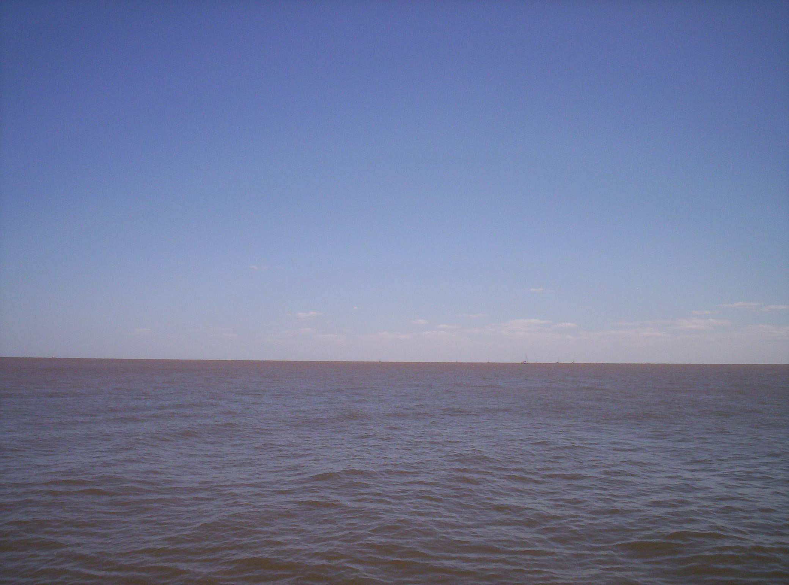

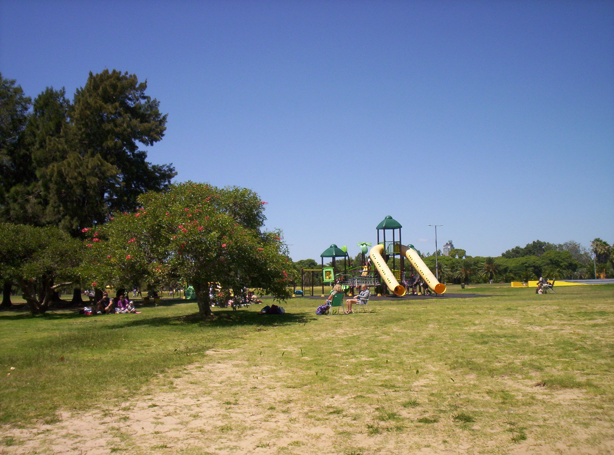

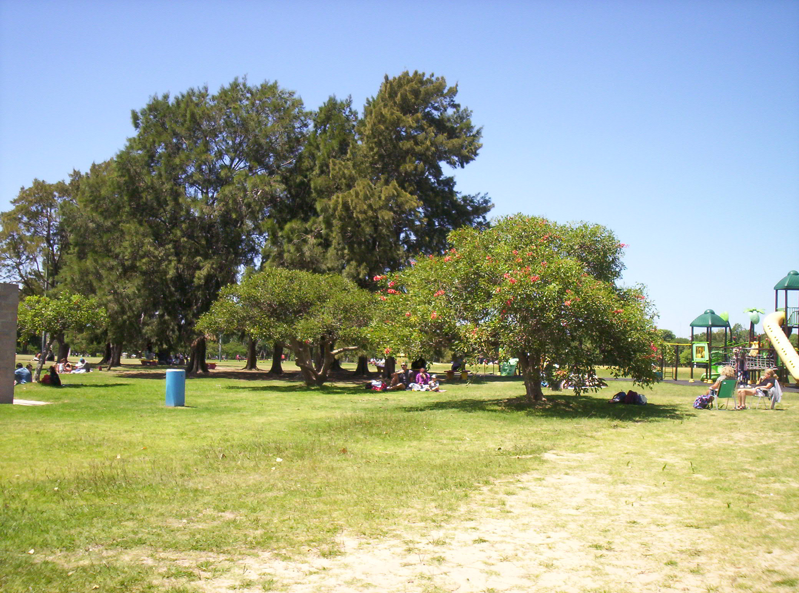

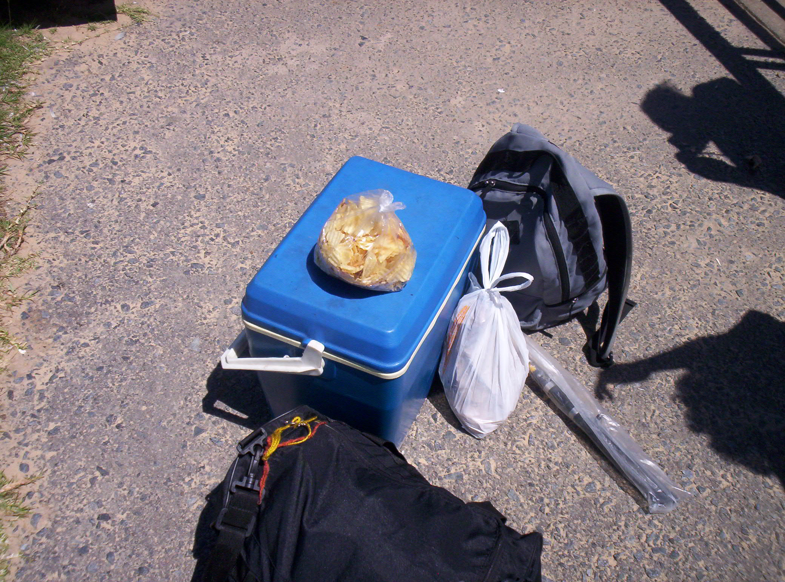

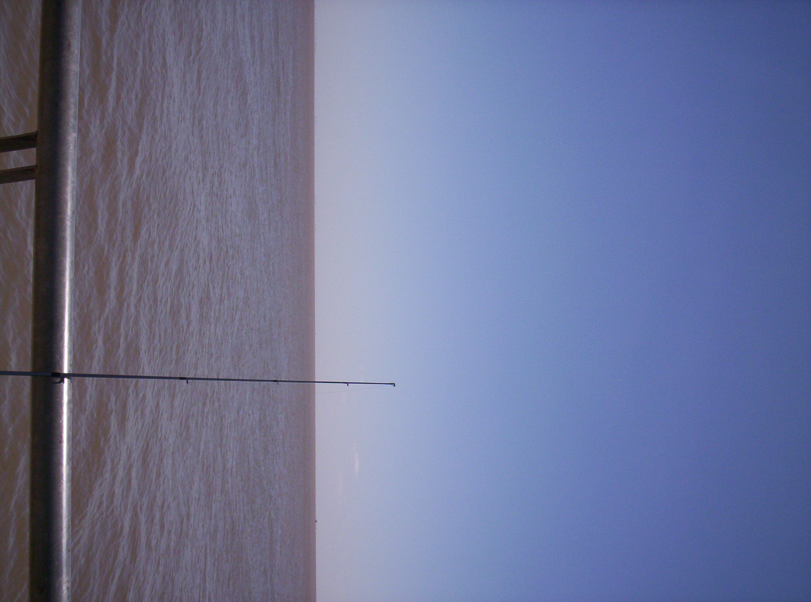

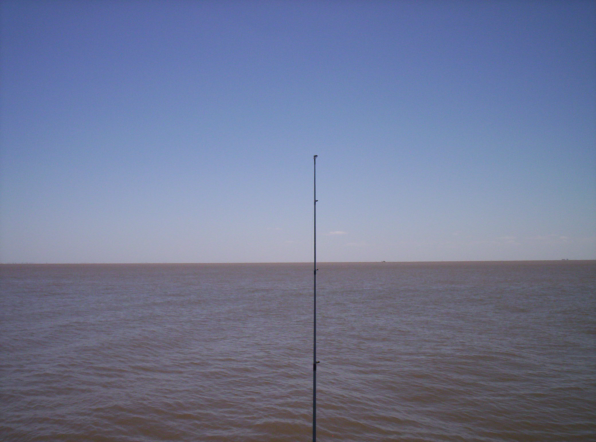

    

    _Pensábamos que se había enganchado la línea..._

    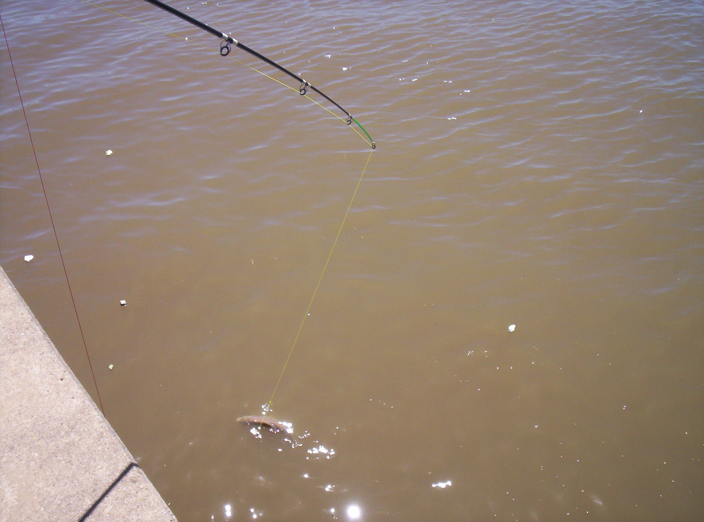

    _Pero!!!_

    

    _Era una boga de dos kilos. Medido a ojímetro._

    

    _Y este un bagre que salió algún tiempo después._

    

    _Nosotros también teníamos que picar algo._

    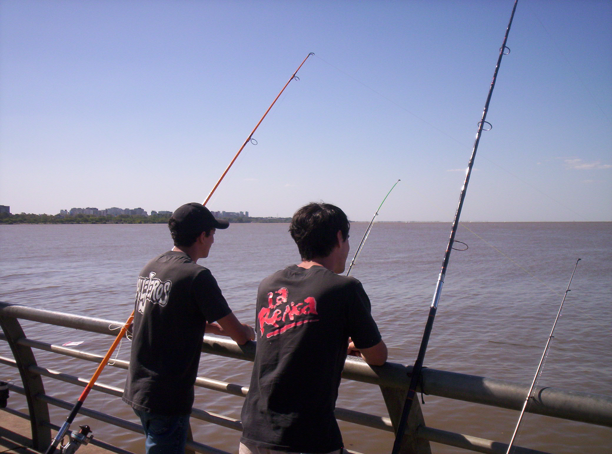

    _Dos grandes mentes contemporáneas debatiendo si la inicuidad fáctica de los diálogos socráticos no dogmáticos afectan a las condiciones del pique._

    

    _Si yo fuera un pez no me gustaría nadar en ese agua. Pero como no soy pez no opino._

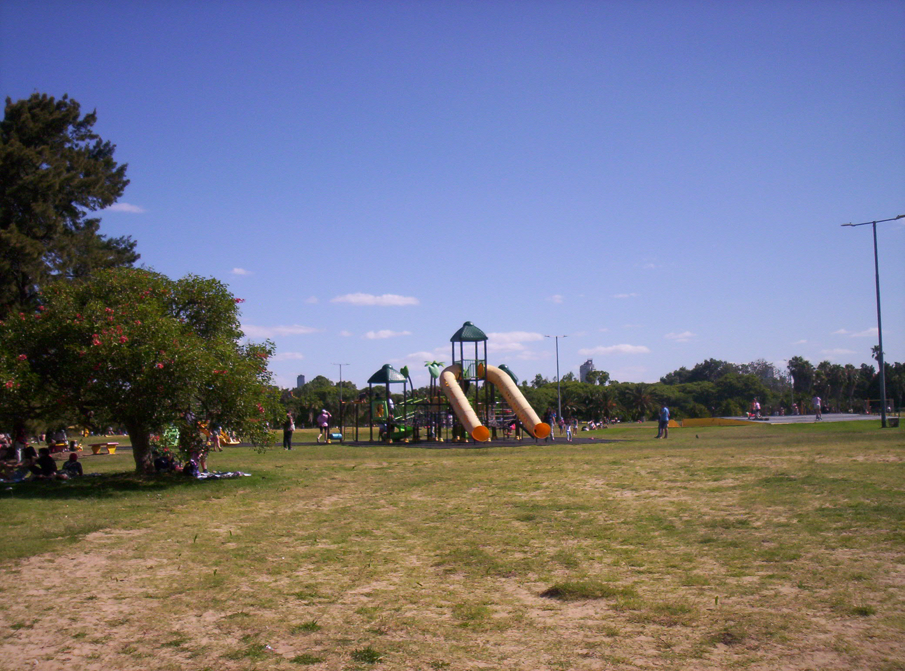

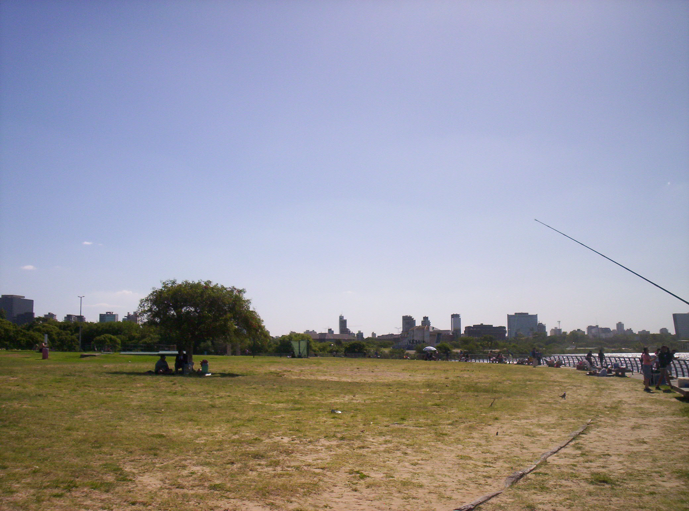

    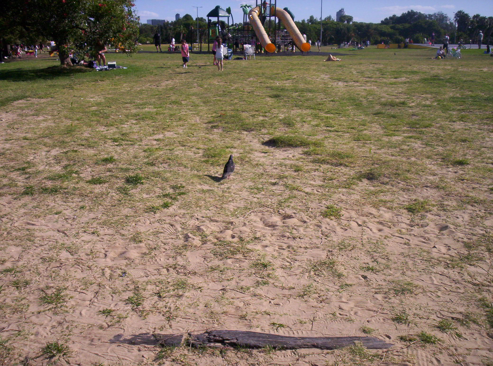

    _Una paloma amistosa._

    

    _En algún momento ensucié el lente y arruiné todo el resto de las fotos._

    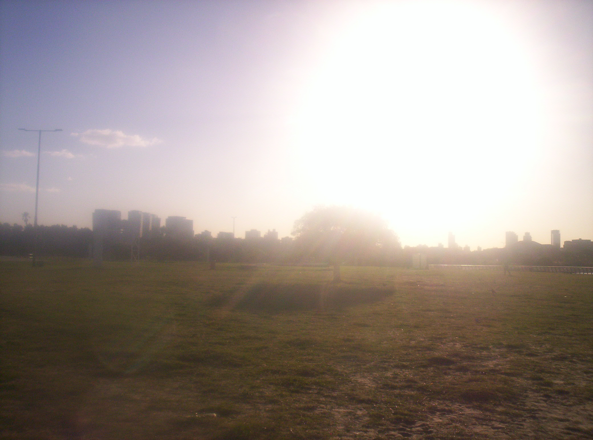

    _Evidencia de una masiva bola de fuego sobre Buenos Aires._

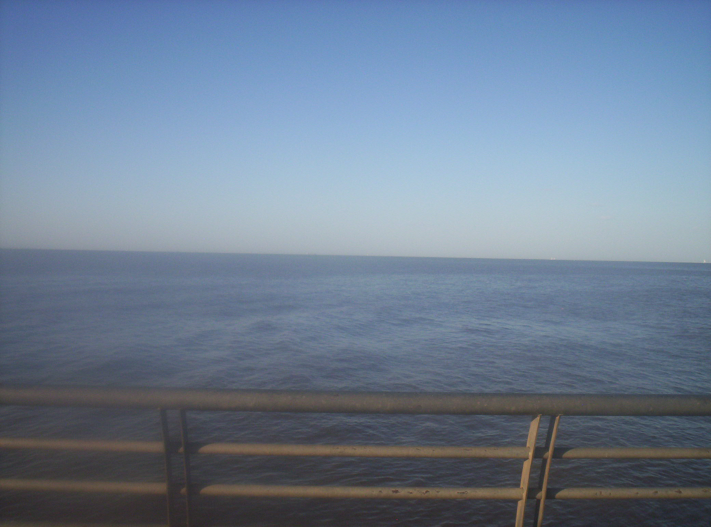

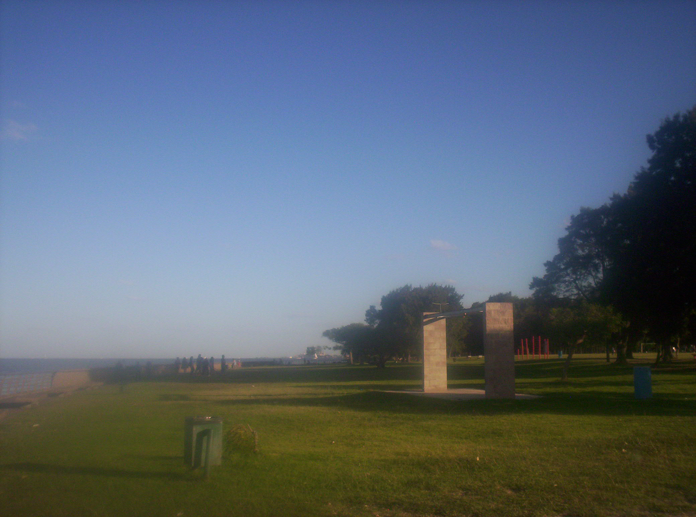

Espacio conmemorativo para todas líneas, anzuelos y plomadas pérdidas. Y para
aquellos peces que sufrieron por nuestra culpa.
