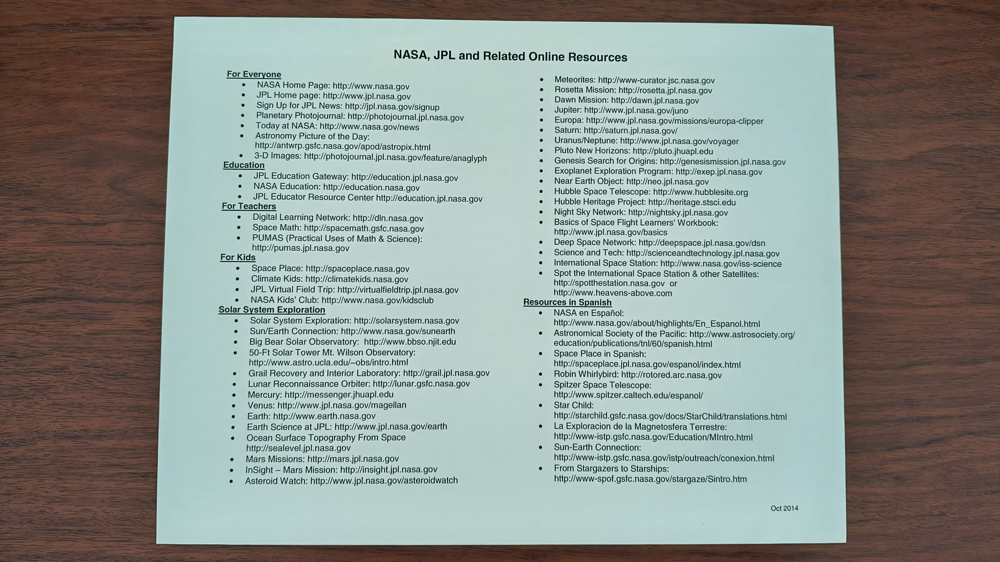
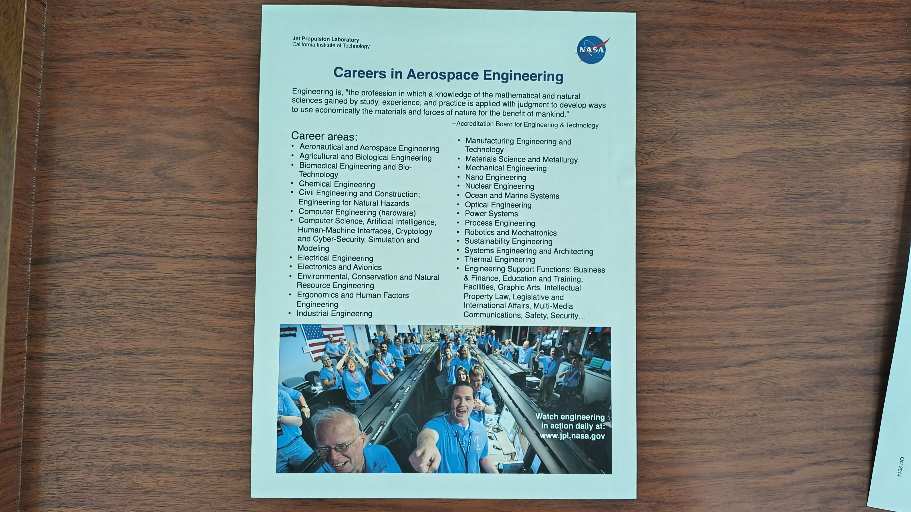
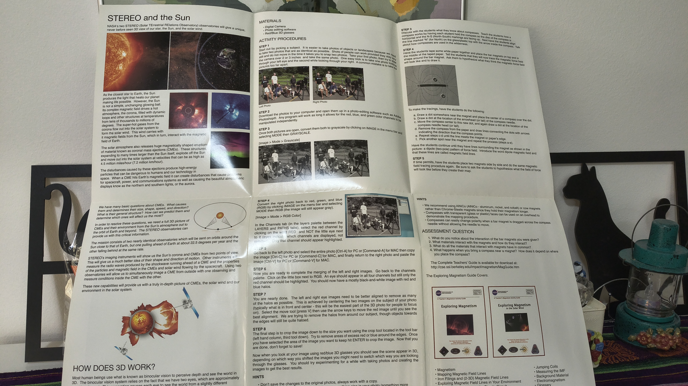
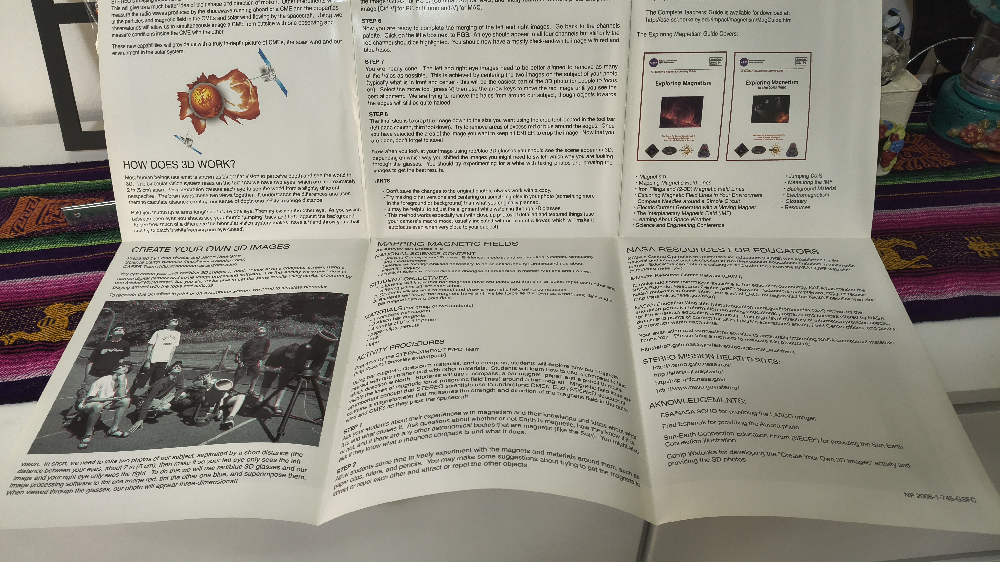
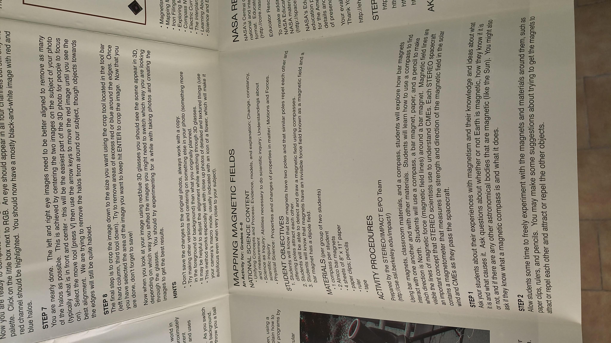
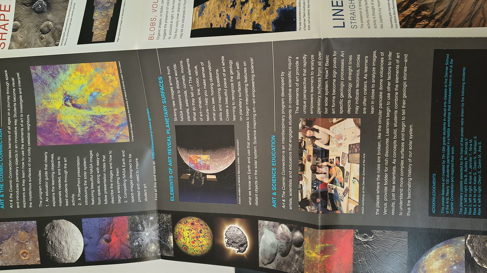

<!-- truncate -->

## carta

hola

hace 12 años recibi una carta de la NASA

imagenes... aca abajo

mi cuadro no está mal colgado. simplemente la gravedad es mucho mas fuerte en
esa punto especifico de mi casa.

## ¿Cómo?

Les envié una carta primero, y en unos meses me respondieron.

La historia resumidamente es así: en 2014 estaba boludeando en internet (como de
costumbre) y me encontré con un post o algo que decía que podías enviarle una
carta al
[Jet Propulsion Lab](https://es.wikipedia.org/wiki/Laboratorio_de_Propulsi%C3%B3n_a_Chorro),
el lugar donde la NASA construye naves espaciales, y obtener una respuesta. El
post alegaba que la respuesta por lo general podría incluir fotografías,
revistas, y algún que otro material o mensaje.

Esto me pareció _Una Idea Original y Diferente™_ así que me mandé.

El 10 de marzo de 2014 abrí Word y escribí la siguiente carta (en un inglés
bastante roto), en la cual mentía descaradamente:

carta

March 10th, 2014

Hello, I’m a highschool teacher from Argertina. Classes are about to begin and
this year I want to teach my students how beautiful, wonderful and magnificent
is the space.

I have a lot of information and I’d like to complement it with pictures or
images from space, yet I can’t print them because I have not the necessary funds
to do it…

Could you help me? I really want to show them how are the things that are ‘out
there’.

Regards,

\<nombre de mi madre acá\>

JPL California

Institute of Technology 4800 Oak Grove Drive

Pasadena, CA 91109-8099

USA

Mentí de esa forma porque 1. era una joven linterna 2. pensaba que si hacía
pasar a mi amada madre como una profesora de secundaria capaz me iban a
responder con más cosas.

Después de imprimir la carta y meterla en un sobre, me fui a una sucursal de
Correo Argentino para realizar el envío (internacional) de la misma.

Meses después (en octubre?) me llegó la respuesta con el contenido que está ahí
arriba al inicio de este post.

## ¿Se puede hacer esto hoy en día?

enviar una carta...? si... te acercas a una oficina de correos y...

--

Siendo que vivimos en una era cada vez más digital y que a la NASA le recortan
presupuesto cada dos por tres, me imaginé que cosas como estas seguro no
existen/no se pueden hacer más. Es decir, vas a poder enviar la carta, pero,
¿recibir una respuesta? ¿En 2026? ¿Con esta economía?

Pero aparentemente en 2023 todavía existía esto... según las respuestas a este
[comentario en Reddit](https://old.reddit.com/r/nasa/comments/11jyi9v/sending_a_letter_to_jpl/jb5px6z/).[1](#note-1)

> JPL has many, many of these things. Photos, stickers, pins, cards and more.
> Sincerely, they would love nothing more than to send you some. There is a
> Public Affairs office you might contact, or address it to a Project Manager
> for a mission you like. They should load you up with goodies. They were
> everywhere when I worked there. If you ask nicely it should work fine.

_ <a name="note-1">1</a>: No es coincidencia que el creó el post sea
argentino. Está en nuestra genética querer rasguñar cosas gratis._

## Misión STEREO

Uno de los posters que vinieron en la carta menciona a la
[misión STEREO](https://es.wikipedia.org/wiki/Misi%C3%B3n_Stereo): una misión
del año 2006 que consistió en lanzar dos satélites para obtener imágenes
estereoscópicas del sol, y así poder estudiar tridimensionalmente algunos
fenómenos solares como las eyecciones de masa coronal.

[Esta página](https://stereo-ssc.nascom.nasa.gov/) contiene información sobre la
misión e incluso datos/imágenes capturadas por el satélite a la fecha de hoy.

Digo _el_ porque aparentemente uno de los dos satélites se "perdió": la NASA no
puede comunicarse con el mismo. El contacto cesó inesperadamente en octubre de
2014[2](#note-2). Se hicieron intentos por restablecer la
comunicación, y se logró en obtener cierta información del satélite en 2016. Con
eso la NASA descubrió que estaba operando con muy bajo voltaje y que la posición
de los paneles solares impedía que el satélite obtuviera la energía necesaria
para funcionar.

Intentaron hacer "rescates" por muchos años, pero eventualmente se dieron por
vencidos. La historia completa de eso se puede ver acá:
[https://stereo-ssc.nascom.nasa.gov/behind_status.shtml](https://stereo-ssc.nascom.nasa.gov/behind_status.shtml)

<video controls style={{ width: "100%", height: "315px" }}>
  <source
    src="https://stereo-ssc.nascom.nasa.gov/img/3dimages/movies/3D_EUV195_0507_bestH264.mov"
    type="video/mp4"
  />
</video>

_ <a name="note-2">2</a>: Cercano a la fecha en la que recibí la
carta... ups._
