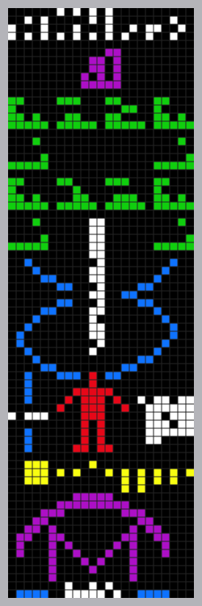
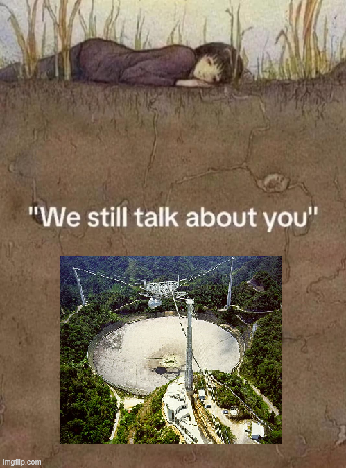
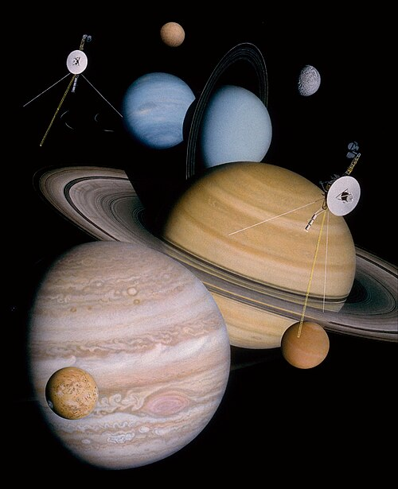
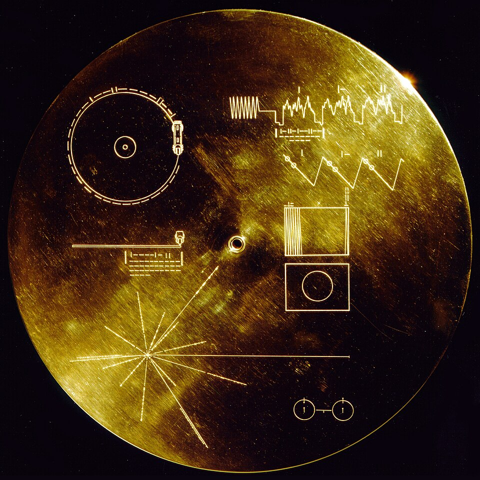
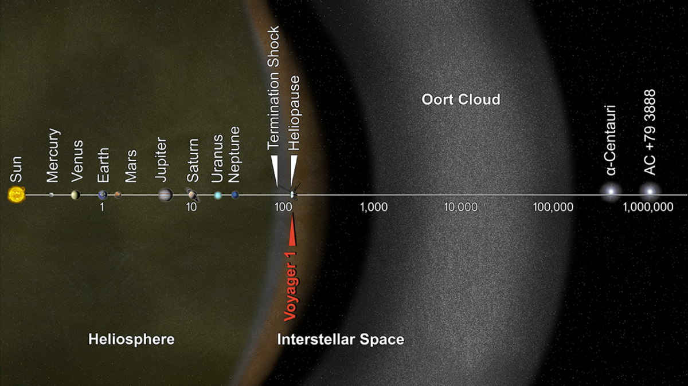
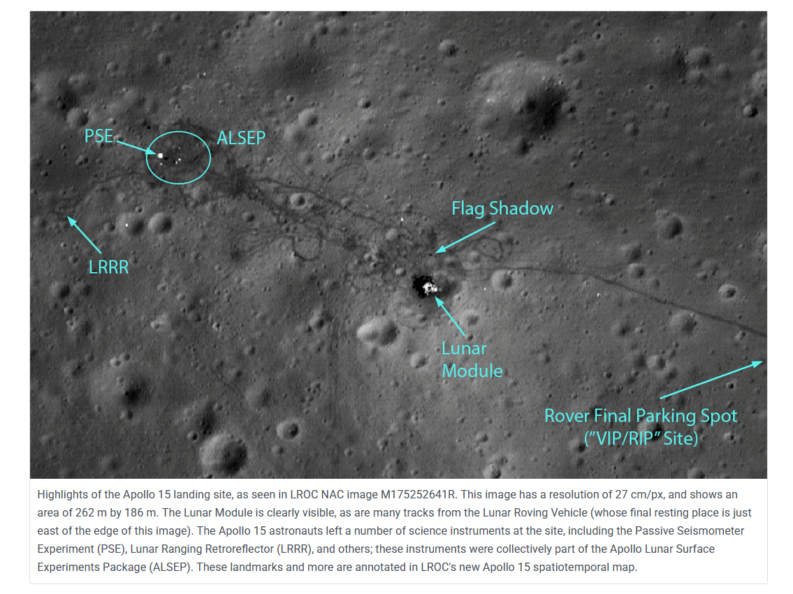

import { VideoEmbed } from "@site/src/components/VideoEmbed";
import { Note } from "@site/src/components/Note";

¿Estamos dejando algún rastro de nuestra existencia en el universo?

<!-- truncate -->

---

## El calendario cósmico

La existencia de nuestra especie tal como la conocemos es... corta. En el post
[_¿qué tan diferentes somos a los primeros homo sapiens?_](https://linternita.com/blog/que-tan-diferentes-homo-sapiens)
hablamos de cómo los Homo Sapiens (nosotros) tan solo llevan merodeando por
estas tierras unos 300 mil años (aproximadamente).

Por más que parezca un número grande, antepasados nuestros vivieron por mucho
más tiempo que nosotros. Los Homo Erectus, por ejemplo, llegaron a vivir 2
millones de años.

Pero incluso esa cantidad inmensa de años no significa nada si la ponemos en
comparación con la edad del universo.

El [calendario cósmico](https://en.wikipedia.org/wiki/Cosmic_Calendar) es una
forma de visualizar la cronología del universo. El mismo extrapola los (casi)
13.8 mil millones de años de edad del mismo en tan solo un año. Nuestra historia
empieza en el último día... del último mes.

  

_Figura 1: el calendario cósmico_

Y eso es siendo _muy_ generosos e incluyendo la historia de nuestros antepasados
como parte de la nuestra. Si nos enfocásemos únicamente en el periodo donde
encontramos nuestros más admirables hitos, estaríamos hablando de tan solo un
minuto de duración dentro del calendario cósmico.

Esto pone en claro dos cosas: la primera, que somos una especie infante dando
sus primeros pasos, la segunda, que Homo Erectus vivió por 2 millones de años y
ni siquiera pudieron crear algo como el dulce de leche. Total desperdicio
evolutivo, su extinción está más que justificada.

En tan poco tiempo logramos cosas increíbles: construimos pirámides gigante,
domesticamos animales y plantas, creamos máquinas capaces de surcar los cielos,
llevamos gente a la Luna, y por encima de todo eso inventamos las linternas. Qué
útiles que son.

**Pero si llegáramos a extinguirnos... ¿qué rastro estamos dejando de nuestra
existencia?** ¿Qué cosas hablarían por nosotros cuando ya no estemos?

## Radiaciones electromagnéticas

Muchas de las señales que emitimos son capaces de atravesar la atmósfera y
escapar hacia el espacio. Al estar compuestas de radiación electromagnética,
estas señales viajan a la velocidad de la luz, lo que significa que en tan solo
un año serían capaces de atravesar 9460730472580.8 kilómetros (mejor conocido
como un [año luz](https://en.wikipedia.org/wiki/Light-year)).

La película Contact[1](#note-1) muestra (de forma ficticia) qué
señales escucharíamos a medida que nos vamos alejando de la Tierra (si
reproducís esto bajá el volumen porque empieza fuerte):

<VideoEmbed src="https://www.youtube.com/embed/s4XbnJvtqGU" />

<Note noteIndex="1"> me encanta esta peli!!! </Note>

No solamente es "de forma ficticia" porque sea una película, sino porque hay dos
cosas que están mal en esa escena:

La primera es un detalle menor... Las cosas que se escuchan cambian muy rápido
en base a la distancia que se muestra. Ya a distancia de Marte la música cambió
un par de décadas... pero Marte se encuentra entre 3 a 20 minutos luz de
distancia de la Tierra. No debería haber un salto tan
grande.[2](#note-2)

<Note noteIndex="2">
  La página [LightYear.fm](https://lightyear.fm/) está inspirada en esa escena,
  pero arreglando el problema de la distancia.
</Note>

La segunda es la que realmente importa: las señales pierden potencia a medida
que se propagan por el espacio, siguiendo la
[ley de la inversa al cuadrado](https://en.wikipedia.org/wiki/Inverse-square_law).
En criollo: la intensidad con la que recibís la señal se ve afectada por la
distancia que haya entre vos y el origen de la misma. Mientras más lejos estés,
menor intensidad.

Es decir... que a medida que las señales se vayan alejando de la Tierra, más
difícil se hace discernirlas. Eventualmente las señales se volverían tan débiles
que sería imposible distinguirlas del ruido electromagnético de fondo del
universo.[3](#note-3)

Así que lamentablemente los aliens que estén apuntando sus radiotelescopios
hacia la Tierra planeta no van a poder escuchar nuestra evolución musical.

Cabe destacar que estamos hablando de afortunadas señales que lograron escaparse
de nuestro planeta. Señales emitidas quizás por una estación de radio o de
televisión. Estaciones que simplemente transmitían con la potencia suficiente
para ser captadas a un par de kilómetros a la redonda. Ninguna estación de radio
va a transmitir con la suficiente potencia como para escuchar música estando en
Aldebarán.

Pero, ¿y si decidiéramos transmitir con la suficiente potencia como para que nos
escuchen desde otras estrellas?

<Note noteIndex="3">
  Además... así de lejos llegaron nuestras señales en comparación con nuestra galaxia.

  

_Tomado de https://www.planetary.org/articles/3390_

</Note>

### SETI

Poco después de que surgiese la revolución electromagnética, algunos se pusieron
a pensar en lo siguiente: nosotros somos inteligentes y usamos señales
electromagnéticas para comunicarnos... si hay vida inteligente en el resto del
universo, alguna tiene que comunicarse de la misma forma.

En base a esto surgió lo que se conoce como SETI (**S**earch for
**E**xtra**t**errestial **I**ntelligence), la búsqueda de vida inteligente que
sea extraterrestre. Y aunque parezca algo inventado por un loquito conspiranoico
que usa sombreros de aluminio, en realidad es una iniciativa encabezada por
reconocidos científicos e instituciones (como la NASA).

Mayormente consiste en una búsqueda pasiva: algunos proyectos SETI utilizan
[radiotelescopios](https://en.wikipedia.org/wiki/Radio_telescope), antenas
(gigantes) específicamente diseñadas para capturar las débiles señales
provenientes del espacio. Mientras que otros realizan experimentos ópticos,
tratando de capturar pulsos láser.

Pero también existe **Active SETI**: una búsqueda activa que consiste en el
envío de mensajes, principalmente a través de señales de radio.

#### Mensaje de Arecibo

El primero de estos mensajes (y uno de los más conocidos) es el
[mensaje de Arecibo](https://en.wikipedia.org/wiki/Arecibo_message), transmitido
por el radiotelescopio del mismo nombre[4](#note-4) en el año 1974,
con una potencia de 450 kilowatts. A diferencia de las señales emitidas por,
digamos, una estación de radio FM, el mensaje de Arecibo (y los otros mensajes
de Active SETI) son mensajes direccionales: se apunta a una región específica
del espacio a donde queremos que el mensaje llegue. Esta direccionalidad ayuda a
concentrar la potencia de la señal, permitiendo que un receptor lejano pueda
detectarla más fácilmente.

El mensaje de Arecibo fue enviado en dirección a un clúster de estrellas llamado
Messier 13, que se encuentra a 24.000 años luz de distancia. Se espera que
llegue en el año 25974.

¿Qué fue lo que enviamos? Números del 1 al 10, los números atómicos de los
elementos que componen el ADN, algunas cosas relacionadas al ADN, la altura
promedio de un ser humano, un dibujito de un ser humano... entre otras cosas.

  
  
  _Contenidos codificados del mensaje de Arecibo_

<Note noteIndex="4">

El telescopio de Arecibo fue por mucho tiempo el radiotelescopio más grande del
mundo (desde 1963 hasta 2016). Consistía de un platillo gigante de 305 metros de
diámetro ubicado en una cavidad natural (un agujero gigante) en Puerto Rico.

Lamentablemente el telescopio colapsó catastróficamente en diciembre 2020.

  

</Note>

#### Otras transmisiones

El mensaje de Arecibo no fue la única transmisión de ese estilo que realizamos.
Acá hay una lista de las transmisiones más notables:
https://en.wikipedia.org/wiki/List_of_interstellar_radio_messages

EN MI OPINIÓN las dos mejores transmisiones son la que envió la canción
[Across the Universe](<https://en.wikipedia.org/wiki/Across_the_Universe_(message)>)
de The Beatles, y Cosmic Call 2, que transmitió la canción Starman de David
Bowie. Muy buenas elecciones.

De todas formas, a pesar de que estas transmisiones se realizan con bastante
potencia, es muy difícil que sean capturadas. La "vida inteligente" que esté del
otro lado necesitaría contar con un radiotelescopio inmenso (más grande que el
de Arecibo incluso) para poder detectarlas. Aunque tampoco sabemos qué clase de
tecnología manejan. En el lado positivo de las cosas, es posible que cuenten con
mejores radiotelescopios, en el lado negativo, puede que ni siquiera usen
señales electromagnéticas para comunicarse.

## Satélites y sondas espaciales

### Voyager

Si hablamos de mensajes enviados al espacio exterior, inevitablemente hay que
mencionar al que fue enviado en las sondas espaciales Voyager.

Estas sondas tenían como objetivo realizar un "grand tour" en el cual visitarían
a los planetas Júpiter, Saturno, Urano, y Pluto (en ese entonces todavía era un
planeta).

  

_Montaje de los planetas visitados por las sondas Voyager, hecho con las fotos
que tomaron_

Además de llevar varios instrumentos científicos, cada sonda lleva consigo un
disco de oro (idéntico para ambas).

  

  

  

Estos discos son una cápsula de tiempo. Dentro suyo contienen:

- Cerca de 116 imágenes que muestran nuestro planeta, nuestro sistema solar, el
  ADN y su estructura, la anatomía humana...
- 31 pistas de audio, entre las que se encuentran saludos grabados en 55 idiomas
  diferentes, 12 minutos de "sonidos de la Tierra" (animales, viento, pasos,
  risas) y varios temas de música de diferentes géneros (desde Clásica hasta
  Mariachis)
- Una grabación de una hora (comprimida a un minuto) de las ondas cerebrales y
  el latido del corazón de Ann Druyan, mientras pensaba en cosas sobre la
  historia de la humanidad, la civilización humana, y el enamorarse

El dorso del disco contiene información que explica cómo debe ser reproducido
para obtener acceso al contenido del mismo:

  

Dentro de las imágenes se incluye la siguiente declaración del entonces
presidente de los Estados Unidos Jimmy Carter:

Voyager Spacecraft Statement

July 29, 1977

This Voyager spacecraft was constructed by the United States of America. We are
a community of 240 million human beings among the more than 4 billion who
inhabit the planet Earth. We human beings are still divided into nation states,
but these states are rapidly becoming a single global civilization.

We cast this message into the cosmos. It is likely to survive a billion years
into our future, when our civilization is profoundly altered and the surface of
the Earth may be vastly changed. Of the 200 billion stars in the Milky Way
galaxy, some--perhaps many--may have inhabited planets and spacefaring
civilizations. If one such civilization intercepts Voyager and can understand
these recorded contents, here is our message:

This is a present from a small distant world, a token of our sounds, our
science, our images, our music, our thoughts, and our feelings. We are
attempting to survive our time so we may live into yours. We hope someday,
having solved the problems we face, to join a community of galactic
civilizations. This record represents our hope and our determination, and our
good will in a vast and awesome universe.

La cual me parece increíblemente inspiradora... _Estamos tratando de sobrevivir
en nuestro tiempo para poder vivir en el de ustedes._

Si querés escuchar la música y ver algunas de las imágenes que fueron incluidas
en los discos, podés visitar [goldenrecord.org](https://goldenrecord.org).

Quizás lo más importante de estos discos no es solamente el contenido, sino que,
a día de hoy, la sonda _Voyager 1_ es el objeto hecho por humanos que más lejos
se encuentra de la Tierra.

  

Se encuentra fuera de nuestro sistema solar y está emprendiendo viaje a través
del espacio interestelar a una velocidad de 61196 kilómetros por hora. Podríamos
decir que nuestra cápsula de tiempo más distante.

**¿Significa esto que es la mejor forma que tenemos de que una especie
extraterrestre nos descubra?**

No. Ni de cerca. Por más que el mensaje de las Voyager sea increíblemente
inspirador y emotivo, es... algo simbólico. Detectar las sondas en el espacio
(sin saber nada sobre ellas) es una tarea imposible. Son muy "pequeñas" (del
tamaño de un auto compacto) y serían indistinguibles de cualquier basura
espacial.

Sería como intentar encontrar un grano de arena en específico después de tirarlo
en la playa.

Pero quién sabe. Capaz algún día...

### LAGEOS

LAGEOS son un conjunto de satélites que están orbitando a más de 5900 kilómetros
de distancia de la superficie de la Tierra. La órbita de estos satélites es
bastante estable, se espera que "caigan" nuevamente a la Tierra en 8 millones de
años.

LAGEOS-1 contiene una cápsula del tiempo. Mucho más simple que la de las
Voyager, es una placa de 10 x 17 cm cuyo objetivo es indicar cuando el satélite
fue lanzado. Incluye los números del 1 al 10 en binario, un diagrama de la
Tierra orbitando al Sol que indica que una revolución completa dura un año, y
otros diagramas que muestran la deriva continental a lo largo del tiempo
(268.435.456 años en el pasado, el presente, y 8 millones de años en el futuro).

  

¿Sería este un buen candidato de "rastro" que dejamos en el universo?

Más o menos. Al igual que las Voyager, sería imposible de detectar para alguien
fuera de este planeta. Pero quizás si alguna especie inteligente está con vida
en la Tierra dentro de 8 millones de años...[5](#note-5)

<Note noteIndex="5">
  Honestamente, si ese fuera el caso, tendrían mil formas más fáciles de saber
  sobre nosotros, y seguramente ya sabrían de nuestra existencia... más sobre
  esto al final del post!!!
</Note>

## La Luna

La Luna es un excelente lugar para preservar... cosas. La Luna no cuenta con una
atmósfera, a términos prácticos se la considera rodeada de un vacío. Sin
atmósfera no hay viento, ni lluvia, ni agua, ni ningún fenómeno climático como
los presentes en nuestro planeta.

Esto genera un ambiente propicio para que las cosas se mantengan en su lugar y
perseveren. No ocurriría ningún tipo de erosión con el paso del tiempo.

Las misiones lunares Apollo que aterrizaron en la Luna dejaron algunos elementos
(banderas, vehículos lunares, el módulo de aterrizaje lunar, instrumentos
científicos), los cuales a día de hoy siguen estando ahí:

  

_Tomado de: https://lroc.im-ldi.com/images/1198_

Si bien es un buen lugar, la Luna no está excenta de comerse un meteorito. O de
recibir la radiación ultravioleta del Sol sin ningún tipo de filtro. Y además
volvemos al mismo problema de antes: estas cosas son increíblemente pequeñas y
nosotros podemos detectarlas porque ya sabemos que están ahí. Para alguien fuera
de la Tierra sería imposible encontrarlas.

### Radiotelescopio lunar

Ok, esto ni siquiera es algo que exista aún, y seguramente sea algo que no se
llegue a realizar en nuestras vidas, pero... sería rastro interesante.

La construcción de un
[radiotelescopio lunar](https://en.wikipedia.org/wiki/Lunar_Crater_Radio_Telescope)
es una propuesta encabezada por el Instituto de Conceptos Avanzados de la NASA.
En resumidas cuentas, la idea es crear un radiotelescopio gigante en uno de los
cráteres de la Luna, para evitar así el ruido y las interferencias de radio
provenientes de la Tierra.

  

Las ventajas son las mismas que mencionamos anteriormente (la Luna es un buen
lugar para preservar las cosas), pero en este caso estaríamos hablando de una
estructura de 5 kilómetros de diámetro. Un cráter entero ocupado con algo
artificial, hecho por humanos.

## La Tierra

La idea de este post era intentar hallar algún rastro de nuestra existencia que
no esté ligado a la Tierra. Algo que sea capaz de moverse a través del espacio y
eventualmente ser encontrado o captado por vida inteligente.

Pero con la tecnología y el conocimiento que tenemos hoy en día... no hay muchas
cosas que hagamos que puedan dejar un rastro de ese estilo.

Sin embargo, si todos nos fuésemos a extinguir ahora mismo (por favor no, tengo
impuestos que pagar), nuestro planeta quedaría plagado de evidencia de actividad
humana.

A nivel orbital, seguramente quede nuestra basura espacial dando vueltas por
millones de años, o incluso "para siempre".[6](#note-6)

A nivel de la superficie terrestre habría muchísimos más rastros aún. Con el
paso de los años algunos de estos irían "escondiéndose" o haciéndose difíciles
de ver a simple vista (gracias a un proceso de erosión, movimiento de placas
tectónicas, meteoritos, subida del nivel del mar, etc), pero si una especie
inteligente pisase el planeta, tardarían poco en darse cuenta de ciertas
peculiaridades del mismo.

Y cuando empiecen a investigar, lo más probable es que se encuentren con
ciudades enterradas, construcciones gigantes (como represas), y restos
fosilizados, al igual que nosotros al investigar el pasado de nuestro planeta.

Quizás al hallar esos restos fósiles lleguen a la conclusión de que en este
planeta habitaban tres posibles especies inteligentes: nosotros, los perros, y
los gatos.

<Note noteIndex="6">
  En unos 6 mil millones de años nuestro sol se va a convertir en una estrella
  gigante roja, devorando a su paso a Mercurio, Venus, la Tierra y la Luna.
  Realmente nos tenemos que poner a trabajar en esto de dejar un rastro, nos
  queda poco tiempo.
</Note>
