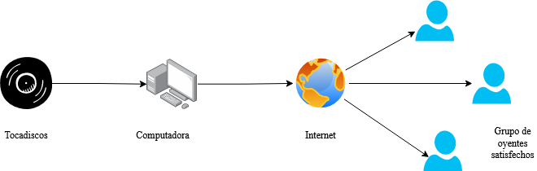
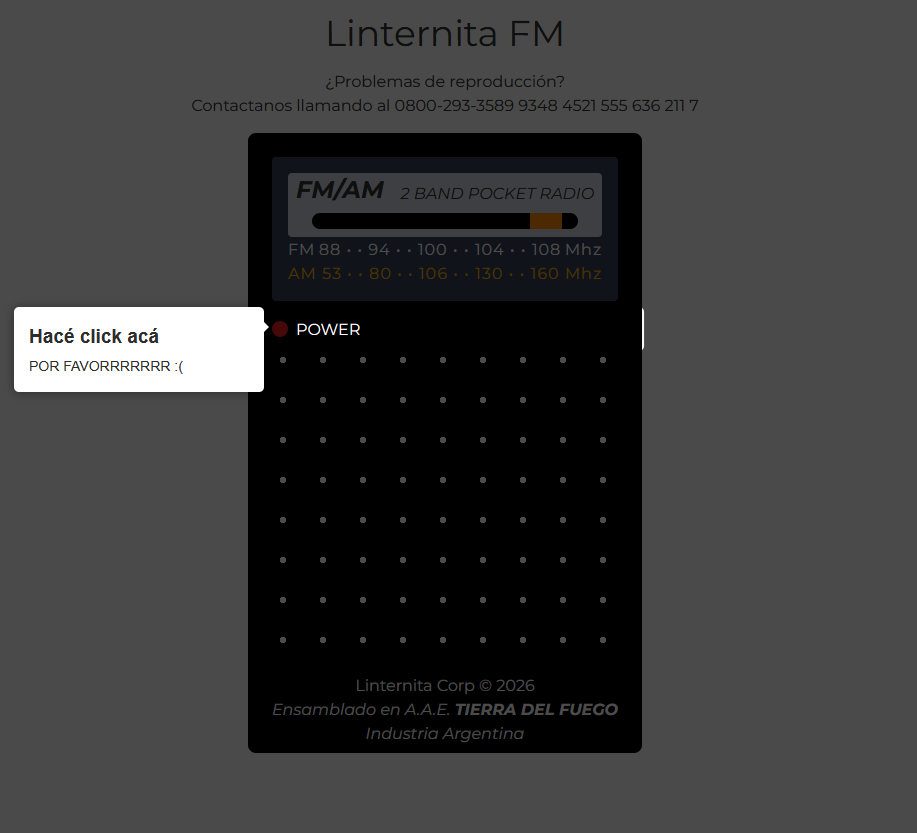
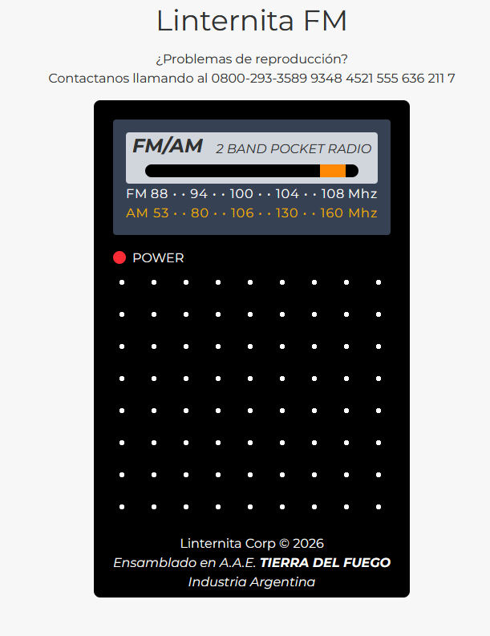
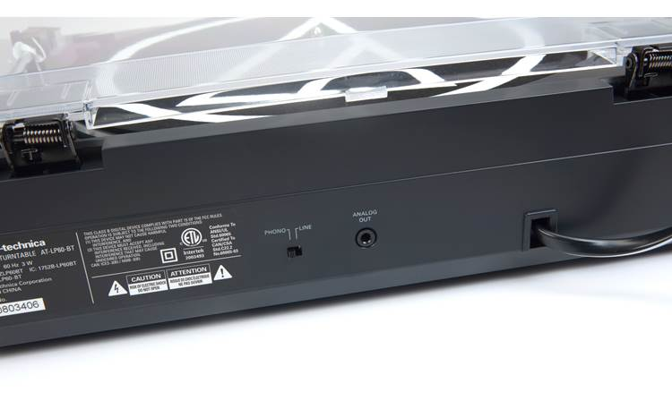
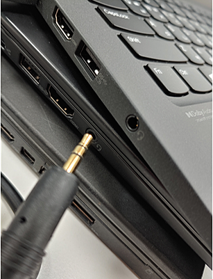
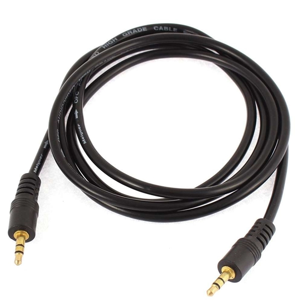
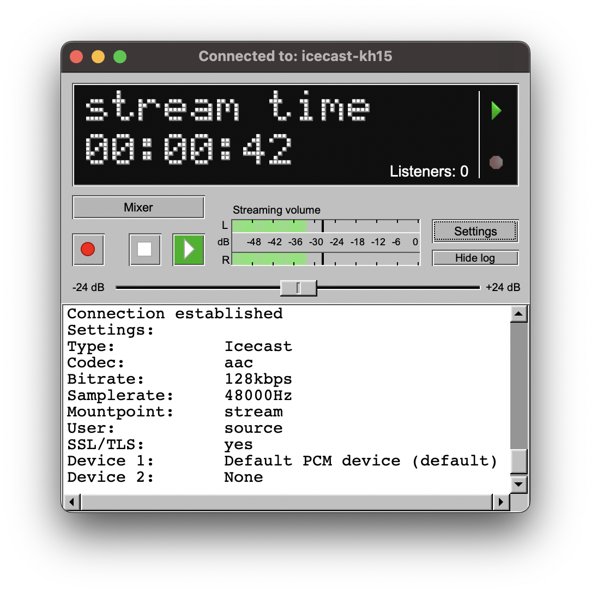

import { VideoEmbed } from "@site/src/components/VideoEmbed";
import { Note } from "@site/src/components/Note";

reproduciendo mis vinilos... ¿para todo el internet?

<!-- truncate -->

## Introduciendo... Linternita FM

**Si estás leyendo este post momentos después de que haya sido publicado, es muy
posible que la radio esté en vivo. Entrá acá para escucharla:
https://cs.linternita.com** [1](#note-1)

Linternita FM es una radio... web. Así que de _frecuencia modulada_ tiene poco y
nada. Pero si hay algo que la historia nos enseñó es que todas las buenas radios
tienen FM en su nombre. Por ejemplo, Flash FM. No se me ocurre otra más.

Una imagen dice más que mil palabras así que esta es la idea detrás de la radio:

  

Básicamente, conectar el tocadiscos a mi computadora y transmitir la música a
internet para que pueda ser escuchada por... gente.

Caso contrario...

Si no llegaste a ver la radio en vivo, acá tenés unas imágenes de cómo se ve la
página:

Obviamente te estás perdiendo toda la gracia de escuchar un vinilo
reproduciéndose y siendo transmitido por internet. Usá tu imaginación.

<Note noteIndex="1">
  Sí, el subodminio es CS porque originalmente esto iba a ser un servidor de
  Counter-Strike 1.6, pool_day 24/7.
</Note>

## Making-of

### Conectando el tocadiscos a la computadora

La conexión va a depender del tocadiscos que tengas, en mi caso el mío trae una
salida de audio de 3.5mm.

Muchas computadoras (¿casi todas?) tienen una entrada de audio que utiliza el
mismo conector de 3.5mm.

  

Consiguiendo un cable como este...

  

...podés conectar el tocadiscos la computadora. Después lo configurás como una
Entrada de Audio en tu sistema operativo y listo, lo que el tocadiscos
reproduzca lo vas a poder capturar en tu computadora.

### Transmitiendo audio

Para transmitir el audio a través del internet tuve que usar dos programas:

#### Icecast

  

[Icecast](https://icecast.org/) es un servidor capaz de transmitir audio (y
video, aparentemente) a través del internet.

Es bastante simple de instalar y configurar. En conjunto con otros programas
permite hacer cosas bastantes complejas, como una radio totalmente automatizada
que reproduzca música las 24 horas.

Este servidor en sí no "reproduce" música ni es capaz de "capturar" el sonido de
tu computadora y transmitirlo. Esa tarea se la delega a otros programas, a los
que denomina "source clients". Estos clientes se conectan al servidor de Icecast
y le transmiten el audio. Después el servidor se encarga de retransmitir eso al
internet.

Generalmente los source clients son programas que reproducen música o video,
como VLC.

En el caso de Linternita FM, necesitamos un programa que sea capaz de capturar
la entrada de audio (del tocadiscos) y enviársela al servidor de Icecast.

#### BUTT

[CULO](https://danielnoethen.de/butt/) (Broadcast Using This Tool) es uno de
esos programas. Es capaz de capturar el audio que recibe tu computadora y
enviárselo al servidor de Icecast.

  

Soporta distintos formatos de transmisión como MP3, Vorbis, FLAC, etc. Te
permite configurar el bitrate de la transmisión y tiene algunas funcionalidades
interesantes que no son relevantes a este post.

### Abriendo la radio al público

El problema con el setup que tenemos hasta ahora es que... está concentrado en
una computadora. Más específicamente, la mía.

¿Cómo hacemos para que el resto de la gente pueda conectarse al servidor?

Es fácil, primero tenés que comprar un dominio en un
_[registrar](https://es.wikipedia.org/wiki/Registrador_de_dominios)_, que es una
empresa que administra y vende dominios. Después tenés que delegar el DNS del
dominio a un proveedor de DNS que en mi caso es CloudFlare porque tiene un plan
gratuito donde no te cobran por administrar tus registros DNS, entre otras
cosas.

Luego tenés que crear registros DNS que apunten a la dirección IP
pública de tu computadora. En mi caso creé un subdomino "cs" y lo apunté a mi
dirección IP pública. Es posible que tu proveedor de internet no te asigne una dirección fija, sino una que cambia todos los días. En ese caso, las cosas se te van a complicar un poco más, pero hay algunas soluciones, como por ejemplo [CloudFlare Tunnel](https://developers.cloudflare.com/cloudflare-one/networks/connectors/cloudflare-tunnel/)

Después, accediendo a la configuración de tu router, tenés que abrir algunos
puertos para poder recibir conexiones entrantes. Además, si tenés varios
dispositivos en la red de tu casa, vas a tener que indicar la dirección IP
privada a la que dirigir el tráfico entrante que llegue a través de esos
puertos. Los puertos que tengas que abrir dependen de los servicios que levantes
en tu computadora.

  Por ejemplo, el servidor de Icecast escucha conexiones por defecto en el
  puerto 8000. Un servidor HTTP en el puerto 80, y un servidor HTTPS en el
  puerto 443. No es necesario que levantes un servidor HTTP ya que Icecast tiene
  una interfaz web y el stream de audio puede escucharse directamente.

  Pero en caso de que quieras hacer algo más lindo vas a tener que crear una
  página web (lo cual no vamos a indagar demasiado pero podrías utilizar algo
  como React o algún otro framework popular y moderno) y servirla utilizando
  algún servidor HTTP, como Apache o Nginx. A todo esto, vas a necesitar un
  certificado SSL/TLS para que los navegadores web no se quejen al intentar
  ingresar a tu dominio.

  Caso contrario un cartel grande que dice "PELIGRO TE VAN A ROBAR DATOS" les va
  a aparecer a tus usuarios. Para poder generar un certificado SSL/TLS podés
  usar certbot. Al ejecutar certbot se te van a generar dos archivos .PEM. Uno
  contiene la clave privada del certificado y el otro el certificado en sí. Una
  vez generados estos archivos vas a tener que editar la configuración de tu
  servidor HTTP para añadirlos. Esta configuración depende del servidor HTTP que
  estés utilizando. Si usás Apache, vas a tener que editar el VirtualHost del
  puerto 443 e indicar donde se encuentra el archivo que contiene el certificado
  para la Web Root especificada.

  A todo esto, si te da miedo tener los puertos abiertos y algún servicio
  expuesto a todo el internet... No lo tengas. Desde un punto de vista de
  seguridad es raro que te pase algo, a menos que _justo_ el servidor que estés
  levantando tenga una vulnerabilidad de tipo RCE y termines con la computadora
  llena de troyanos. Por otro lado, si te da miedo que te hagan un ataque de
  DDoS... de nuevo, no tengas miedo. Nadie va a gastar recursos para atacarte
  específicamente a vos.

Lo importante de todo esto es que la radio es self-hosted. No estoy pagando
ningún servidor en la nube. Todo corre desde mi humilde computadora.

## Conclusiones

Hacer servicios self-hosted es divertido y vale la pena. No solo podés hacer una
radio y compartirla con el resto del internet: podés hacer de todo. Páginas web,
servidores de juegos, compartir archivos, chats, y cualquier cosa que se te
ocurra.

Con respecto a Linternita FM, dudo mucho que haga transmisiones frecuentes. Si
bien me encanta la idea de tener una radio donde se reproduzcan mis vinilos, el
setup que tengo es bastante incómodo. Además ni que fuese a tener oyentes.

En fin, eso es todo por hoy. Las luces se apagan.[2](#note-2)

<Note noteIndex="2">
  ¿Sabías que...? El primer albúm transmitido por Linternita FM es Discovery, de
  Daft Punk, que cumplió 25 años el 12 de marzo de 2026.
</Note>
