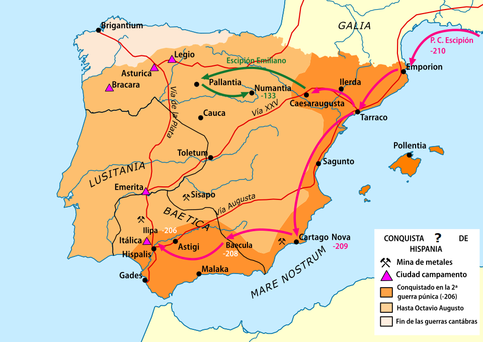
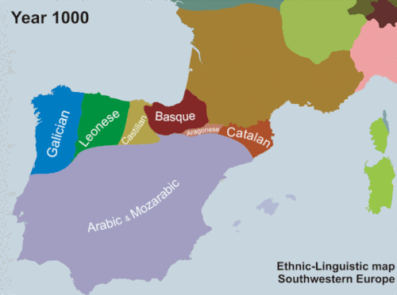
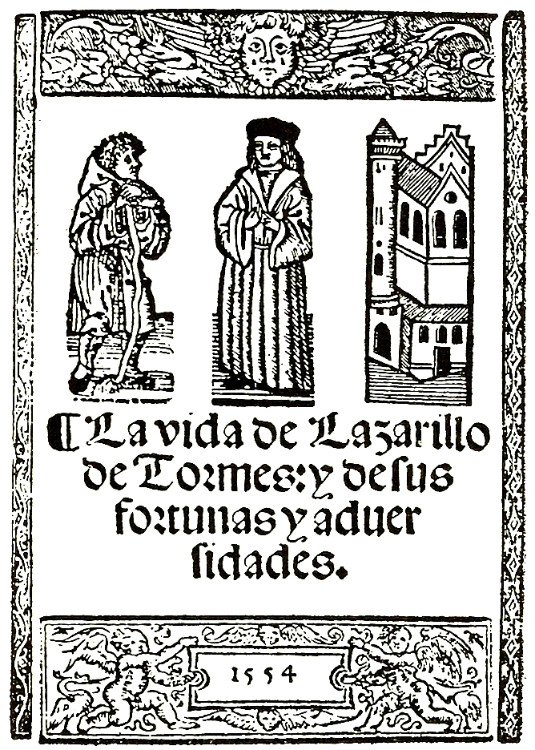

import { VideoEmbed } from "@site/src/components/VideoEmbed";
import { Note } from "@site/src/components/Note";

Ne designati rostrum praetoris pedesque spectes. Lasciuire pecus Nerei rostrique
repandum.

<!-- truncate -->

## Orígenes

Si estás leyendo esta introducción sin necesidad de recurrir a un traductor,
felicidades, formás parte de una comunidad de más de 600 millones de personas
que hablan el idioma español, la lengua romance más hablada en el mundo.

Como muchas otras, el español que usamos para hablar hoy en día tiene sus
orígenes en... una lengua anterior. Es algo inevitable. El mundo no es estático,
las cosas cambian y evolucionan con el tiempo, y esto aplica también a los
lenguajes.

Hace más de 2200 años, un imperio decidió invadir la península ibérica,
acarreando consigo su lengua materna: el latín.

  

    _Figura 1: Consquita de Hispania por el imperio_

La conquista fue paulatina y tardó alrededor de 200 años en culminarse. La
lengua del imperio invasor fue expandiéndose gradualmente a medida que los
pueblos autóctonos adoptaban la cultura y costumbres de los conquistadores,
desplazando así a las lenguas que eran habladas por dichos pueblos.

Muchos años después, en el ocaso de este imperio - el cual no diremos su
nombre - todas las lenguas nativas fueron suplantadas por el latín, con una
notable excepción del
[idioma aquitano](https://es.wikipedia.org/wiki/Idioma_aquitano).

Dejando de lado esa excepción, en Iberia, que luego de la conquista fue
bautizada como Hispania, la gente empezó a hablar en latín. Pero con el tiempo,
la lengua hablada fue mutando hasta convertirse en algo distintivo y propio de
la región: un dialecto, conocido como latín hispánico.

Cerca del siglo V el imperio se derrumba, pero a pesar de eso, la lengua
permanece vigente en la región, aunque profundizando aún más sus diferencias,
llegando a particionarse y formar nuevas lenguas (conocidas como romances),
tales como:

- Aragonés
- Asturiano
- Leonés
- Mirandés
- Castellano
- Gallego
- Portugués
- Occitano
- Catalán

El vacío de poder fue rápidamente llenado por un reino visigodo, los cuales a
pesar de tener su propio idioma (el gótico) terminaron adoptaron las lenguas
romances de la región. Después este reino fue eventualmente conquistado por un
imperio árabe, el cual impuso su lengua (y sus costumbres y religión), pero a
pesar de eso los habitantes cristianos de Hispania (conocidos como mozárabes)
mantuvieron vivas las lenguas romances: utilizaban el árabe para lo social,
comercial y cultural; y las lenguas romances entre familiares y otros
mozárabes.[1](#note-1)

<Note noteIndex="1">
  El dominio árabe sobre la región tuvo gran influencia sobre las lenguas romances, que terminaron adoptando términos o palabras del árabe. Por ejemplo:

- Aceite (az-zayt)
- Alhaja (al-ḥāja)
- Almanaque (al-manāŷ)
- Almacén (al-majzan)
- Naranja (nāranŷ)
- Ojalá (inšal-lá)
- Pato (baṭṭ)

y
[un montón más](https://es.wikipedia.org/wiki/Anexo:Arabismos_en_el_idioma_espa%C3%B1ol).

</Note>

Poco después de la conquista árabe, se formaron reinos cristianos que intentaron
frenar el avance musulmán sobre la región. El primero de ellos fue el Reino de
Asturias (asturiano), que luego desencadenó en el Reino de León (leonés), que
luego desencadenó en los reinos de Castilla (castellano) y Portugal (portugués).

Estos reinos, juntos con otros de la península ibérica, encabezaron lo que se
conoce como la Reconquista: un período de campañas militares entre los
cristianos y los musulmanes.

Luego de 800 años los reinos cristianos lograron expulsar a los árabes y
extender su influencia. La evolución lingüística de la región se puede apreciar
en el siguiente gráfico animado:

  

El Reino de Castilla y el de León se unificaron en el siglo XIII formando la
Corona de Castilla. Esta entidad empieza a esparcirse por toda Hispania,
haciendo que el idioma castellana tomase impulso y se convierta en lengua franca
dentro de los territorios bajo poder de la corona.

La Corona de Castilla se une de forma dinástica con la Corona de Aragón en 1479,
manteniendo independencia entre ambas coronas y los territorios que las
conformaban, pero unidas igualmente.

En 1492 Colón descubre América y ésta pasa a ser parte de los territorios de
Corona de Castilla. El castellano llega y se esparce por el continente
americano.

En los años y siglos subsecuentes suceden un montón de cosas interesantes las
cuales no serán profundizadas en esta publicación. Lo importante a tener en
cuenta es que castellano es la lengua que se impuso por sobre las demás y es la
que asociamos con el idioma español. Cuando decimos español, nos referimos a la
lengua romance castellana.

En la actualidad, a pesar de ser el idioma principal de España, las otras
lenguas romances de iberia siguen existiendo, en mayor o menor medida. En
Cataluña, la gente habla catalán. En Asturias, la gente habla asturiano (o
asturleonés).

## El punto de este post

Basta de historia, centrémonos en la pregunta central de este post: ¿qué tan
atrás nos podemos remontar y aún entender el lenguaje español?

En orden cronológico desde AHORA hasta la antiguedad:

### Español moderno

Detalles

El español usado en la actualidad.

Extracto de El Aleph (1945) de Jorge Luis Borges:

> En la parte inferior del escalón, hacia la derecha, vi una pequeña esfera
> tornasolada, de casi intolerable fulgor. Al principio la creí giratoria; luego
> comprendí que ese movimiento era una ilusión producida por los vertiginosos
> espectáculos que encerraba. El diámetro del Aleph sería de dos o tres
> centímetros, pero el espacio cósmico estaba ahí, sin disminución de tamaño.
> Cada cosa (la luna del espejo, digamos) era infinitas cosas, porque yo
> claramente la veía desde todos los puntos del universo. Vi el populoso mar, vi
> el alba y la tarde, vi las muchedumbres de América, vi una plateada telaraña
> en el centro de una negra pirámide, vi un laberinto roto (era Londres), vi
> interminables ojos inmediatos escrutándose en mí como en un espejo, vi todos
> los espejos del planeta y ninguno me reflejó [...]

Realmente no deberías tener problemas para entender este texto y deberías
comprender que Borges era un vampiro.

En caso de que no te parezca lo suficientemente moderno por ser un libro de
1945...

Fragmento de La fiesta del chivo (2000) de Mario Vargas Llosa:

> En eso, estalló la balacera a sus espaldas. Una gritería ensordecedora se
> levantó alrededor; la gente corría entre los autos, los carros se trepaban a
> las veredas. Antonio oyó voces histéricas: «¡Ríndanse, carajo!». «¡Están
> rodeados, pendejos!» Al ver que Juan Tomás, exhausto, se paraba, se paró
> también a su lado y comenzó a disparar. Lo hacía a ciegas, porque caliés y
> guardias se escudaban detrás de los Volkswagen, atravesados como parapetos en
> la pista, interrumpiendo el tráfico. Vio caer a Juan Tomás de rodillas, y lo
> vio llevarse la pistola a la boca, pero no alcanzó a dispararse porque varios
> impactos lo tumbaron. A él le habían caído muchas balas ya, pero no estaba
> muerto. «No estoy muerto, coño, no estoy.» Había disparado todos los tiros de
> su cargador y, en el suelo, trataba de deslizar la mano al bolsillo para
> tragarse la estricnina. La maldita mano pendeja no le obedeció. No hacía
> falta, Antonio. Veía las estrellas brillantes de la noche que empezaba, veía
> la risueña cara de Tavito y se sentía joven otra vez.

### Español clásico

Detalles

También conocido como: español medio, aúrico (por la era dorada de España).
Usado entre los siglos XV y fines del siglo XVII.

Fragmento de "Trágico suceso, mortífero estrago, que la Justicia Divina obró en
la ciudad de Córdoba [...]", de Nicolas de Vargas, publicado en 1651:

> Lo mesmo passaua en las calles de la carniceria, y de la fuenseca, desde la
> puerta del rincon, hasta la plaça de S Saluador, singular era la casa dode no
> huuiesse entrado la enfermedad, y en algunas con tanto rigor, que no dexo a
> nadie viuo, yo fui llamado a visitar vn enfermo en esta calle ya que la
> enfermedad iua en declinacio, y note que el dueño de la cassa, que era el
> assistete del enfermo, se entristecio, y tanto que huue de preguntalle la
> causa, y me respondio señalando a la puerta de la calle, por ay han salido
> para el Hospital, y la sepultura; diez y seis personas. Vea v md si tengo
> ocasion para entristecerme? La Iunta obraua quanto podia, sin omitir nada,
> procurando obiallo todo, y en todo se hallauan dificultades imbencibles,
> porque es muy diferente el acto practico, del especulatiuo. Para todo era
> menester mucho dinero, y no lo auia, conociasse que lo que deuia luego hazerse
> era quemar la ropa de los enfermos con todo rigor, y sitiar, y tener a raya
> toda la demas gente de la casa, impidiendoles la salida, y que no comerciassen
> con los demas de la ciudad, era menester para conseguir esto, dalles de comer,
> y acudilles con lo que auian menester, y dalles en q dormir, porque la gente
> que mas padecio era pobrissima, y en vna misma cama dormian enfermos, y sanos,
> que dentro de breue tiempo remanecia enfermos: o terrible lance! conocerse el
> remedio, y ser impossible la execucion.

**Nota:** el anterior texto no incluye la resolución de las abreviaturas
utilizadas por el escritor. Es decir, es el texto "tal cual" se encuentra
escrito en el libro, sin adiciones extra. Por ejemplo, "_hasta la plaça de S
Saluador_" con las abreviaturas resueltas se convertiría en "_hasta la plaça de
San Saluador_".

Fragmento de "El Lazarillo de Tormes" de la edición de Alcalá de Henares,
publicada en 1554[2](#note-2):

> ...y callavas, a lo qual yo yo respõdi. Yendo q̃ yuamos ansi por debaxo de vnos
> soportales, en Escalona, adõde ala sazon estauamos en casa devn çapatero auia
> muchas sogas y otras cosas q̃ de esparto se hazen, y parte dellas dieron a mi
> amo enla cabeça, el qual alçando la mano toco enellas, t viendo lo que era
> dixome. Anda presto mochacho, salgamos đ entre tã mal manjar, que ahoga sin
> comerlo. Yo que biẽ descuydado yua đ aquello, mírelo que era y como no vi sino
> sogas y cinchas, que no era cosa de comer, dixele. Tio porque dezis esso?
> Respõdio me. Calla sobrino, segũ las mañas que lleuas lo sabras, y veras como
> digo verdad, y ansi passamos adelante por el mismo portal, y llegamos a un
> meson, a la puerta del qual auia muchos cuernos enla pared, donde atauan los
> recueros sus bestias, y como yua tẽtãdo si era alli el meson, adõde el rezaua
> cada dia por la mesonera, la oracion đ la emparedada, hazio de vn cuerno, y
> con vn gran sospiro dixo. O mala cosa, peor que tienes la hechura, de quantos
> eres desseado poner tu nombre sobre cabeça agena, y de quan pocos tenerte, ny
> aun oyr tu nombre, por ninguna via. Como le oy que dezia dixe. Tio que es esso
> que dezis. Calla sobrino que algun dia te dara este que en la mano tengo
> alguna mala comida y cena. No le comere yo dixe, y no me la dara. Yo te digo
> verdad, sino verlo has si bives, y ansi passamos adelãte hasta la puerta del
> meson, adonde pluguiere a Dios nunca alla llegaramos, segun lo que me suscedia
> en el. Era todo lo mas que rezaua por mesoneras, y por bodegoneras y
> turroneras, y rameras, y ansi por semejantes mugercillas, que por hombre casi
> nunca le vi dezir oracion. Reyme entre mi...

<Note noteIndex="2">
A día de hoy se conversvan 4 ediciones principales del Lazarillo de Tormes publicadas en 1554. Libros que tienen casi 500 años de antiguedad!!

  

</Note>

### Castellano medieval

Detalles

Comprende la lengua hablada entre los siglos IX y XV.

Fragmento de El Cantar de Mio Cid, ca. 1300:

> Tane a matines a vna priessa tan grand \
> Myo çid & su mugier ala eglesia uan \
> Echos donna ximena en los grados delantel altar \
> Rogando al criador quanto ella meior sabe \
> Que a mio çid el campeador que dios le curias de mal \
> Ya sennor glorioso padre que en çielo estas \
> Fezist çielo & tierra el terçero el mar \
> Fezist estrelas & luna & el sol pora escalentar \
> Prisist encarnaçion en santa maria madre \
> En belleem apareçist commo fue tu veluntad \
> Pastores te glorifficaron ouieron de a laudare \
> Tres Reyes de arabia te vinieron adorar \
> Melchior & gaspar & baltasar oro & tus & mirra \
> Te offreçieron commo fue tu veluntad \
> A ionas quando cayo en la mar \
> Saluest a daniel con los leones en la mala carçel \
> Saluest dentro en Roma al sennor san sabastian \
> Saluest a santa susanna del falso criminal \
> Por tierra andidiste .xxxij. annos sennor spirital \
> Mostrando los miraculos por en auemos que fablar \
> Del agua fezist vino & dela piedra pan \
> Resuçitest a lazaro ca fue tu voluntad \
> Alos iudios te dexeste prender do dizen monte caluarie \
> Pusieron te en cruz por nombre en golgota \
> Dos ladrones contigo estos de sennas partes \
> El vno es en parayso ca el otro non entro ala \
> Estando en la cruz vertud fezist muy grant \
> Longinos era çiego que nuquas vio alguandre \
> Diot con la lança enel costado dont yxio la sangre \
> Corrio la sangre por el astil ayuso las manos se ouo de vntar \
> Alçolas arriba legolas ala faz \
> Abrio sos oios cato a todas partes \
> En ti crouo al ora por end es saluo de mal \
> Enel monumento Resuçitest fust alos ynfiernos \
> Commo fue tu voluntad \
> Quebranteste las puertas & saqueste los padres santos \
> Tu eres Rey delos Reyes & de todel mundo padre

**Nota:** el anterior texto sí incluye la resolución de las abreviaturas
utilizadas por el escritor. En este caso no quise removerlas porque eran muchas.
Sin las abreviaturas resueltas el texto se vuelve más complicado de leer, mas se
podría argumentar que las abreviaciones no representan correctamente a las
palabras usadas en el español de la época, sino, como hoy en día, son resultados
de la economía del lenguaje.

El Lapidario de Alfonso X, ca. 1200:

> ARistotil que fue mas complido delos otros filosofos & el que mas natural
> miente mostro todas las cosas por razon uerdadera. & las fizo entender
> complida miente segund son; dixo que todas las cosas que son so los; uelos se
> mueuen & se endereçan por el mouimiento delos cuerpos celestiales por la
> uertud que an dellos segund lo ordeno dios que es la primera uertud; & donde
> la an todas las otras. Et mostro que todas las cosas del mundo son como
> trauadas. & reciben uertud unas dotras. las mas uiles delas mas nobles. Et
> esta uertud paresce en unas mas manifiesta assi como en las animalias. & en
> las plantas. & en otras mas asconduda; assi como en las piedras & en los
> metales. Et destas fizieron los sabios libros en que dixieron delos cuerpos
> celestiales que non son compuestos delos quatro elementos. & esso mismo de los
> otros que dellos se componen assi como de animalias que son todas las cosas
> uiuas que an alma de sentir & de mouer. Et otrossi delas plantas que son delos
> fructos que nascen dela tierra; assi como arboles & yeruas. Et fablaron
> otrossi delas cosas mas duras que se fazen de la tierra; assi como piedras &
> metales. Et de cadauna destas fizieron libros. Mas los que escriuieron delas
> piedras assi como aristotil que fizo un libro en que nombro sietecientas
> dellas. dixo de cadauna de que color era. & de que grandeza & que uertud auie.
> & en que logar la fallauan.

**Nota:** el anterior texto incluye la resolución de las abreviaturas utilizadas
por el escritor.

### Iberromance / protoromance castellano

Detalles

Comprende las lenguas habladas después de la caída del impero en el siglo V.

Nodicia de Kesos, ca. 980:

> (Christus) Nodicia de kesos que espisit frater Semeno: In Labore de fratres In
> ilo bacelare de cirka Sancte Iuste, kesos U; In ilo alio de apate, II kesos;
> en qu puseron ogano, kesos IIII; In ilo de Kastrelo, I; In Ila uinia maIore,
> II;

> que lebaron en fosado, II, ad ila tore; que baron a Cegia, II, quando la
> taliaron Ila mesa; II que lebaron LeIone; II ...s...en u...re... ...que....
> ...c... ...e...u... ...alio ... ... ... g...Uane Ece; alio ke le ba de
> sopbrino de Gomi de do...a...; IIII que espiseron quando llo rege uenit ad
> Rocola; I qua Salbatore Ibi uenit.

Fragmento de "Declración de los derechos que los merinos de Coruña del Conde, a
nombre del conde de Castilla, tenían en Espeja y otros pueblos vecinos", ca.
1030:

> In tempore quod terra obtinuerunt comite Garcia Fernandiz et Domna Aba, ex
> inde eorus filius Sancio Garcianix, obtinuerunt in Espelia sua diuisa que
> pertinet ad Clunia, illa diuisa deniquenti profiliatione que profiliauit
> adillo comite Garcia Fernandiz et ad domna Aba, proinde intrauit incomitato;
> et illa diuisa de Annaia Didaz per que furauit .III. caballos et .I. homine et
> fuit se ad terra de mauros, proinde intrauit incomitato. Abolmondar Flahiniz
> et Abolmondar Obecuz habuerunt in terre intemptione per earum hereditates de
> Spelia, et fuerunt ad illo comite Garcia Fernandiz, et dedit eis suo homine
> fidele, per nomnato Tellu Barrakaniz et partibit eis eorum hereditatibus; et
> presit illa serna maiore per adillo comite; sic eas partiberunt illos
> infanciones de Spelia, quando transibit domno Sancio comite. Ipsos infanciones
> de Spelia abuerunt fuero per anutba tenere in Gormaz et in Oxima et in sancti
> Stefani; quando prenderunt ipsas casas mauros, mandauit domno Sancio comite
> que tenuissent ipsas anutbas in Karazo et in Penna fidele, quomo do totos
> infanciones faciebant, et non quesierunt infantiones de Spelia suo mandato
> facere. Proinde presot ille comite tota Spelia, et non eis laxabit nisi suas
> hereditatelias; et postobitus de illo comite domno Sancio, partiberunt se
> illos infanciones

### Latín hispánico

Detalles

Latín, pero con modificaciones provenientes de la región hispánica.

Fragmentos de las sátiras de
[Gauis Lucilius](https://en.wikipedia.org/wiki/Gaius_Lucilius), ca. 100 a. C:

> Ne designati rostrum praetoris pedesque spectes. Lasciuire pecus Nerei
> rostrique repandum.

> rostrum labeasque hoc uociferantis percutio

> baronum ac rupicum squarrosa, incondita rostra

En estros fragmentos, las palabras **rostrum** y **rostra** son, según Antonio
Tovar Llorente, indicios de la hispanización del latín. En latín _rostrum_
significaba "pico" o "hocico o boca de animal", y era utilizado por Lucilius de
forma insultante para refrirse a la cara humana.

Según Llorente, _rostro_ como palabra solo se encuentra en el español y
portugués, y no se halla en otras lenguas románicas.

### BONUS: Español chileno

Detalles

Utilizado en el siglo XXI mayormente dentro de la república chilena.

Fragmento de un autor chileno que obtuvo el Premio Miguel de Cervantes:

> ΤΟΥ TERRIBLE ENOJAO MI VIEJA WN YA WN SI EL TEAM AGUANTA LA WEA ME DEMORE ME
> MANDA A CERRAR LA CAGA DE PORTON Y YO MENO DE 1 MINUTO HACIENDO LA HAZAÑA
> CULIA Y CUANDO VOLVI TABAN ROMPIENDOME EL NEXO POR LA RECHUCHA LOCO VIEJA KL
> WN NO SOY NA PENDEJO PA QUE ME MANDEN A HACER ESTAS WEAS MATE AL PURO ZED QL Y
> DEPUE LA SIVIR SE HIZO CAGAR EL NEXO CONCHETUMARE GG WP DICEN LOS CULIAOS
> METANSELO POR EL CHICORITA SAPOS QLS

Fragmento de un poeta anónimo, ca. años 2010:

> WN NO ANDO NA PA QUE ME WEI HERMANO ENSERIO SABI QUE WEBEAME CUALQUIER OTRO
> DÍA PERO HOY DÍA NO COMPARE AHÍ SE TE NOTA QUE ERI UN PENDEJO CHAUFÁN TENÍA
> RAZÓN TE FALTA MADURAR HERMANO VOY A IR A LA JUNTA EL SÁBADO Y DIME LAS WEAS A
> LA CARA COMPARE

## Conclusiones

Resulta interesante saber que, con poco esfuerzo, podemos fácilmente entender
variaciones del castellano... en escrito. Hay que tener en cuenta que el idioma
también tuvo grandes cambios fonéticos, y es muy posible que nos cueste un poco
más entenderlo hablado.

Hay algunos ejemplos en internet de cómo sonaba el español medieval. Acá hay un
video si te interesa:

<VideoEmbed src="https://www.youtube.com/embed/4hhdqeHWa4w?si=8JI2rrHTycwi49JD&amp;start=301" />

## Referencias

Algunas referencias:

- [Hispanic Seminary of Medieval Studies](https://www.hispanicseminary.org)
- [Latín de Hispania: aspectos léxicos de la romanización](https://www.rae.es/sites/default/files/Discurso_ingreso_Antonio_Tovar_Llorente.pdf)
- [Remains of Old Latin](https://dn790002.ca.archive.org/0/items/remainsofoldlati03warmuoft/remainsofoldlati03warmuoft_bw.pdf)
- [El latín en Hispania: la romanización de la Península Ibérica](https://www.cervantesvirtual.com/obra-visor/el-latn-en-hispania-la-romanizacin-de-la-pennsula-ibrica-el-latn-vulgar-particularidades-del-latn-hispnico-0/html/00f48998-82b2-11df-acc7-002185ce6064_2.html)
- [La época visigoda](https://www.cervantesvirtual.com/obra-visor/la-poca-visigoda-0/html/00f49212-82b2-11df-acc7-002185ce6064_2.html)
- [Biblioteca Digital de Textos del Español Antiguo: Textos del Lazarillo de Tormes (1554)](https://www.hispanicseminary.org/t&c/laz/index-es.htm)
- [Lazarillo de Tormes - RAE](https://www.rae.es/sites/default/files/hojear_lazarillo_de_tormes.pdf)
- LIBRO: "Orígenes del español: estado lingüístico de la península ibérica hasta
  el siglo XI" de Ramon Mendendez Pidal

Y varias páginas de Wikipedia.
