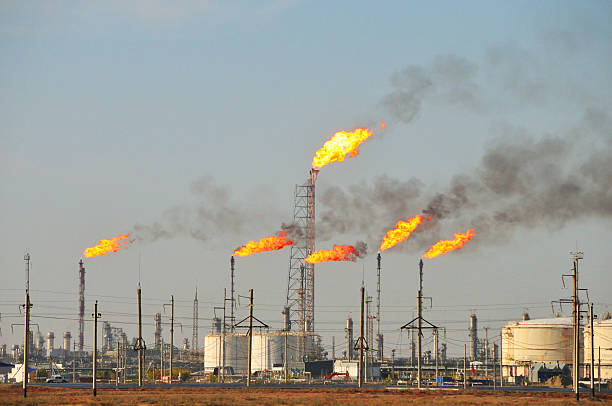
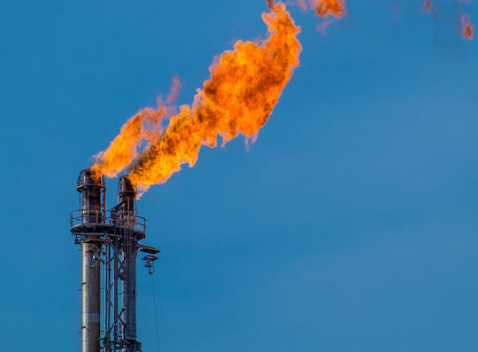
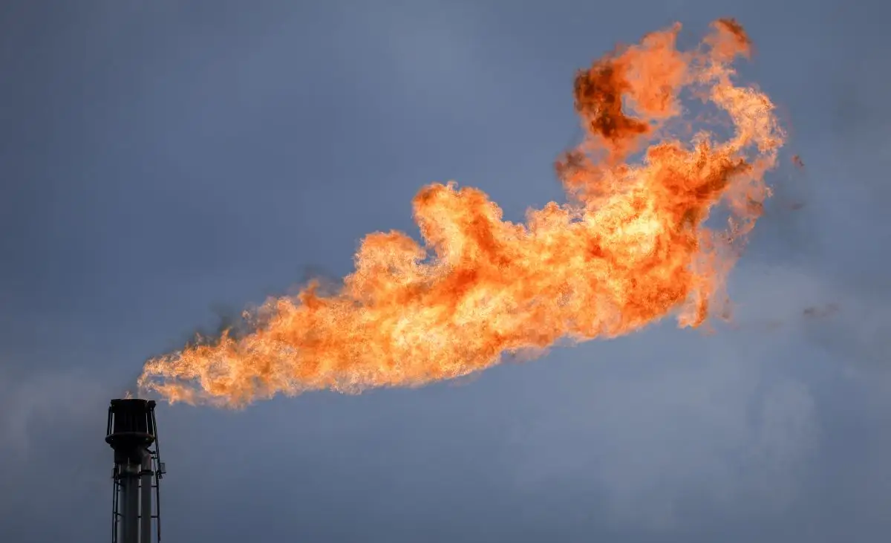
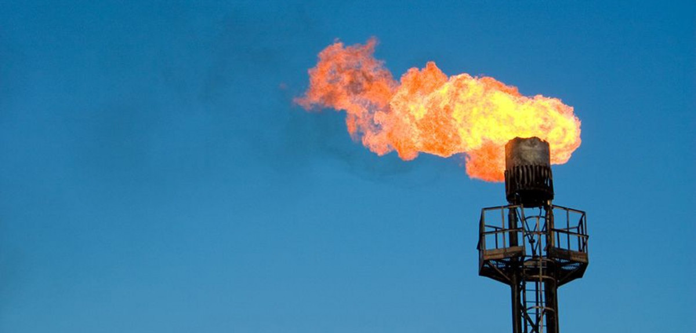
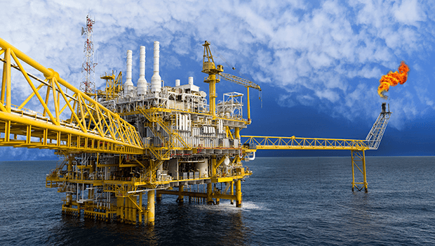

import { VideoEmbed } from "@site/src/components/VideoEmbed";
import { Note } from "@site/src/components/Note";

¿Por qué tienen una llama encendida todo el rato? ¿Qué es lo que queman? ¿No es
contaminante hacer eso? ¿Por qué no usan lo que queman para generar energía?

<!-- truncate -->

**¿por**

**qué**

**esa**

**llama?**

## Prefacio

Ayer estuve a escasos metros de una refinería de petróleo por varias horas. Algo
que me llamó la atención fue ver que, durante todo el tiempo que estuve ahí,
unas chimeneas de la refinería producían llamas de fuego que en ningún momento
se apagaban.

Siendo la persona más preocupada por el uso eficiente de recursos que existe en
el mundo, me pregunté por qué hacían eso. Tenía el leve recuerdo de que _por
alguna razón_ lo hacían, algo que iba por el lado de que era más fácil quemarlo,
que hacer otra cosa.

¿Pero por qué? ¿Qué función cumplen? ¿No es algo derrochador y contaminante? ¿No
se podría usar esa llama para, no sé, calentar agua y generar
energía[1](#note-1)?

<Note noteIndex="1">
  La mayoría de las formas en las que generamos energía para consumo consisten
  en esto. Incluso las plantas nucleares "simplemente" calientan agua que se usa
  para girar turbinas usando vapor.
</Note>

## Gases

Aparentemente, tanto en el extracción como en el refinado de petróleo se
producen gases.

A medida que se produce estos gases, aumenta la presión sobre los equipos
industriales involucrados en el proceso de extracción/refinamiento. Si la
presión no es controlada, tuberías pueden estallar, o equipamiento necesario
para la operación puede ser dañado.

Liberar estos gases es una forma de controlar la presión y no causar un desastre
mayor.

## El problema

O los problemas: estos gases no son solamente flamables, sino también altamente
tóxicos.

Uno de los gases involucrados es el ácido sulfhídrico. Esto es lo que Wikipedia
(en español) dice al respecto en el primer párrafo:

> Este gas, más pesado que el aire, es inflamable, incoloro, tóxico, odorífero:
> su olor es el de materia orgánica en descomposición, similar al olor de los
> huevos podridos.

Otro de los gases involucrados es el metano. Este no es tan terrible como el
anterior, aunque:

> El metano es un gas de efecto invernadero relativamente potente que contribuye
> al calentamiento global del planeta Tierra, ya que tiene un potencial de
> calentamiento global
> de 23.[5](https://es.wikipedia.org/wiki/Metano#cite_note-5)​ Esto
> significa que en una medida de tiempo de 100 años cada kilogramo de
> CH4 calienta la Tierra 23 veces más que la misma masa de
> CO2, sin embargo, hay aproximadamente 220 veces más dióxido de
> carbono en la atmósfera de la Tierra que metano por lo que el metano
> contribuye de manera menos importante al efecto invernadero.

:/

No parece buena idea liberar estos gases así como si nada.

## Las llamas

Para liberar estos gases se utilizan unas construcciones verticales de
considerable altura llamadas chimeneas.

En la cima de las mismas se encuentra una llama que se encuentra prendida todo
el día.[2](#note-2) Esta llama se utiliza para prender fuego los
gases anteriormente mencionados.

¿Por qué?

Porque al quemarlos, los gases se transforman en sustancias menos nocivas. El
ácido sulfhídrico se convierte en dióxido de azufre, que, si bien sigue siendo
tóxico, al menos no es asesino.

El metano se convierte en el tan conocido dióxido de carbono, que es menos
contaminante para el medioambiente.

<Note noteIndex="2">
  Esta llama tiene que estar prendida siempre, bajo toda condición. No solo para
  evitar que la planta industrial vuele por los aires por acumulación de
  presión, sino para evitar que estos gases peligrosos y más pesados que el aire
  caigan al piso, contaminen todo y nos maten.
</Note>

## ¿No es eso contaminante también?

Sí.

Justamente el mayor problema que tenemos relacionado a los gases de invernadero
y el calentamiento global, es la acumulación de dióxido de carbono.

Y la combustión de los gases no es perfecta todo el tiempo así que tanto metano
como el ácido sulfhídrico terminan siendo liberados a la atmósfera.

## ¿No es un derroche?

Sí.

> Not only is gas flaring a significant hazard to the public, it’s also
> tremendously wasteful. Worldwide, approximately 140 billion cubic meters (bcm)
> of natural gas was flared in 2022 – almost equal to 70% of the natural gas
> exports from the United States that same year.

Esos gases son combustibles, ¿por qué no los almacenamos y los usamos después
para... calentar cosas?

En algunos casos, se hace. En otros, capturar y almacenar se complica por la
ubicación donde se realiza la extracción de petróleo:

_Figura: Extracción de petróleo en el mar_

Pero como siempre, todo se reduce a un tema económico. No es imposible hacer
algo para capturar esos gases. Pero es costoso. Y las empresas involucradas en
la extracción de petróleo prefieren ir por lo que les den más ganancias y sea lo
más fácil de hacer (como cualquier empresa).

Esto es algo que se solucionaría con regulaciones más estrictas por parte de los
gobiernos, que sería necesario en este caso, ya que en 2025 la cantidad de gas
que fue quemado de esta forma llegó al nivel más alto registrado desde 2007.

## Referencias

https://www.worldbank.org/en/programs/gasflaringreduction/gas-flaring-explained

https://www.worldbank.org/en/programs/zero-routine-flaring-by-2030/about

https://www.worldbank.org/en/programs/gasflaringreduction/publication/2025-global-gas-flaring-tracker-report

https://www.aer.ca/understanding-resource-development/enerfaqs-and-fact-sheets/enerfaqs-flaring

https://blacksummitfg.com/burning-money-the-harm-and-waste-of-gas-flaring/
