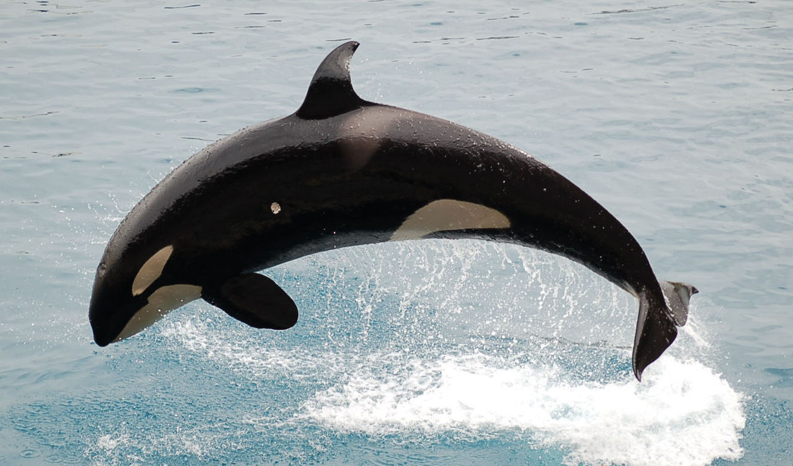
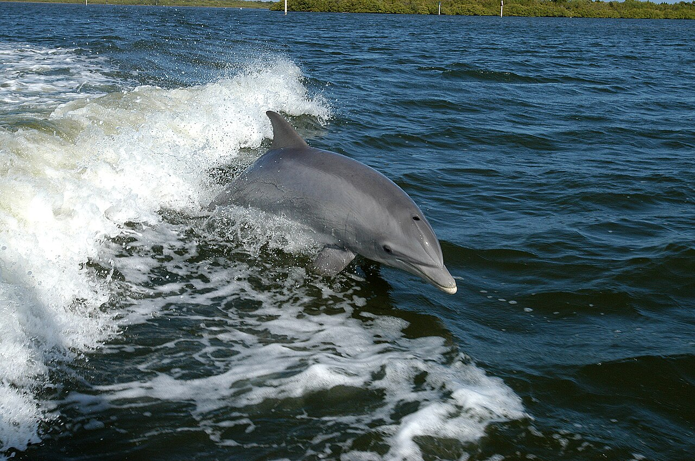

import { VideoEmbed } from "@site/src/components/VideoEmbed";
import { Note } from "@site/src/components/Note";

> [...] relató que los malayos afirmaban que el orangután podía hablar, pero que
> prefería no hacerlo "para que no lo obligasen a trabajar".

<!-- truncate -->

## Orcas

### Orca ragebaiteadora

Dos investigadores estaban observando a un grupo de orcas que se alimentaban de
una ballena gris. Pasado un rato, un pedazo de grasa de ballena del tamaño de un
colchón flotó hacia la superficie.

Los investigadores querían extraer una muestra de la grasa de ballena para
realizarle un análisis de genética. Cuando se acercaron para extraer la muestra,
una orca emergió rápidamente, agarró el pedazo de grasa, y se fue nadando.

A 300 metros de distancia la orca suelta la grasa (:v), los investigadores se
acercan, pero la orca nuevamente emerge y les arrebata el pedazo de grasa.

Este patrón se repitió entre siete u ocho veces. Según los investigadores
"claramente la orca estaba jugando con nosotros".

Referencia:
[Killer whale games](https://web.archive.org/web/20071011062137/http://www.killerwhale.org/BFS/BFS_13.pdf)

### Orca aprende a tirar bolas de nieve

Unos investigadores fueron a la Antártida para recolectar evidencia que
determinase si un conjunto de orcas pertenecía en realidad a una especie
distinta.

Para llamar la atención de una orca y "hacerle saber que estaban ahí", un
investigador agarra y le tira una bola de nieve, que impacta sobre el costado
del cetáceo.

La orca pareció estar confundida por unos segundos, pero luego empezó a empujar
un gran pedazo de hielo. En un momento dado, le dio un golpe con la punta de su
hocico y el pedazo se partió en dos.

Luego de esto desapareció por unos minutos hasta que volvió con un pedazo de
hielo del tamaño de una pelota. Volvió a golpearla con su hocico y el pedazo de
hielo se propulsó por los aires, cayendo algunos metros delante.

La simpática orca continuó jugando con su pelota de hielo durante 5 minutos.

Referencia:
[Scientist Has 'Snowball Fight' With a Killer Whale](https://www.livescience.com/3284-scientist-snowball-fight-killer-whale.html)

### Colaboración entre humanos y orcas

La caza de ballenas es algo que los humanos, lamentablemente, practicamos desde
hace mucho tiempo. En el auge de la revolución industrial esta caza se
incrementó, ya que la grasa de ballena se utilizaba para generar aceite, el cual
era utilizado para lubricar maquinarias y para iluminación, y que era codiciado
por ser de mejor calidad a otras alternativas de la época.

Pero no somos la única especie que se dedicó a matar ballenas cruelmente. Las
orcas viven de eso. Es más, se las conoce como "asesina ballenas" porque atacan
y matan a cetáceos más grandes que ellos.

El interés en común por matar ballenas dio lugar a una colaboración simbiótica
entre los humanos y las orcas. Entre 1840 y 1930, un grupo de orcas australianas
que merodeaban las costas de New South Wales comenzaron a ayudar a los cazadores
de ballenas.

Las orcas identificaban a ballenas como objetivos, las "pastoreaban" a una bahía
o áreas cercanas a la costa, y luego nadaban por varios kilómetros hasta donde
estaban las cabañas de los cazadores para "avisarles" y que estos ayudasen a
matarlas.

Una de las orcas, a la que le acuñaron el nombre Old Tom, solía golpear
repetidamente el agua con su cola para llamar la atención.

Cuando los cazadores mataban a la ballena, remolcaban el cadáver y lo dejaban
anclado durante la noche, para que las orcas se alimentasen de la lengua y los
labios de la difunta ballena.

Referencia:
[Killer whales of Eden, New South Wales](https://en.wikipedia.org/wiki/Killer_whales_of_Eden,_New_South_Wales)

### Orcas usando salmones muertos como sombreros

Por alguna razón, en 1987, un grupo de orcas empezó a nadar llevando un salmón
muerto sobre sus cabezas. Como si fuera un sombrero.

La que inició la tendencia fue una hembra. A las pocas semanas, otras orcas
empezaron a copiarla. Al mes todo su grupo e incluso orcas de otros grupos
tenían sombreros de salmón.

Así como empezó, la tendencia terminó abruptamente y no se volvió a repetir. Se
vieron a algunas orcas con un salmón en la cara en años posteriores, pero no se
volvió una tendencia nuevamente.

No sabemos por qué hicieron esto. Pero claramente las orcas son bastantes
inteligentes y sociales, así que quizás esté relacionado a una función social.

Referencia:
[In 1987, Orcas Had A Fashion Of Wearing A Dead Salmon As A Hat](https://www.iflscience.com/in-1987-orcas-had-a-fashion-of-wearing-a-dead-salmon-as-a-hat-69542)

## Delfines

### El delfín que aprendió inglés y se suicidó

En la década del 60, un neurocientífico llamado John C. Lilly se vio
particularmente interesado en los delfines y como estos se comunicaban.

Una cosa lo llevó a la otra y terminó interesándose en la comunicación entre
humanos y delfines.

Para que haya comunicación, ambos seres deben hablar un lenguaje en común, así
que decidió enseñarle inglés a un delfín.

Por favor, lea la siguiente aclaración:

...a esta altura es totalmente posible que te estés dudando la veracidad de
todos estos hechos y pesando que este post es una obra llena de historias
absurdas con el único fin de hacerte perder el tiempo

y te voy a ser sincero si bien los primeros dos relatos sobre las orcas no
tienen mucha más referencias que "un tipo lo dijo", este parte del delfín que le
enseñaron inglés es algo que realmente pasó y está bien documentado, con fotos,
videos, grabaciones de audio

así que NO no te estoy mintiendo ni tomando el pelo!!!

Para llevar a cabo este cometido, el delfín (Peter) convivió con su profesora de
inglés, Margaret Howe Lovatt, en una casa que estaba parcialmente inundada.
Porque, como sabés, los delfines necesitan agua para vivir y hacer sus cosas. Y
nosotros también pero no tanta.

Margaret y Peter convivieron en esa casa durante 2 meses y medio. Estaban juntos
todo el rato: mientras comían, dormían, jugaban, y cuando tenían las clases de
inglés.

Esto era básicamente un experimento sustentado bajo la idea de que "un animal
inteligente imitaría el lenguaje de sus captores para comunicarse", y el hecho
de convivir constantemente con el delfín ayudaría a que el mismo formase un
fuerte lazo y aprendiese a comunicarse más rápidamente.

El experimento tuvo cierto éxito: se notaba el esfuerzo de Peter por imitar la
forma en que Margaret le hablaba.

<VideoEmbed src="https://www.youtube.com/embed/uNhR-16r5lM" />

Esta historia se torna todavía más rara...

Peter tenía dos defectos: el primero, ser hombre, el segundo, ser un
animal.[1](#note-1)

Y como todo animal, tenía necesidades. Algunas incluso por fuera de comer y
dormir.

Para evitar interrupciones en las clases de inglés, Margaret se empezó a hacer
cargo de esas necesidades.

<VideoEmbed src="https://www.youtube.com/embed/31AWe-FN7CA" />

Al final, el experimento finalizó casi al tercer mes y no se le dio
continuación, principalmente porque Margaret tenía los ovarios llenos de vivir
en un lugar inundado y con olor a delfín todo el tiempo.

Con el paso del tiempo y la pérdida de financiamiento, Lilly mudó a Peter (y
otros delfines) a tanques de menor tamaño que, además, no recibían mucha luz del
sol. La salud de Peter se deterioró, y según Lilly se terminó suicidando.

Según Ric O'Barry (un activista):

> Dolphins are not automatic air-breathers like we [humans] are... Every breath
> is a conscious effort. If life becomes too unbearable, the dolphins just take
> a breath and they sink to the bottom. They don't take the next breath

Referencia:
[The dolphin who loved me: the Nasa-funded project that went wrong](https://www.theguardian.com/environment/2014/jun/08/the-dolphin-who-loved-me)

<Note noteIndex="1"> is there a difference...?</Note>

### Delfines salvajes aprendiendo a caminar sobre el agua

En mundo marino, o como se llamen esos lugares donde torturan animales acuáticos
para el entretenimiento de los espectadores, les enseñan a los delfines a
"caminar" sobre el agua:

<VideoEmbed src="https://www.youtube.com/embed/x0e244PZ4k8" />

Esto es un "truco", y no es algo que los delfines salvajes hagan en sus hábitats
naturales...

...salvo por un grupo de delfines australianos (¿qué tiene Australia con los
cetáceos haciendo cosas raras?) que aparentemente lo realiza con frecuencia.

Esto comenzó a sucede cuando una delfín hembra llamada Billie (que no es mi
amante, solamente es una chica que dice que yo soy el elegido, pero el pibe no
es hijo mío) fue rescatada y vivió por unas semanas con delfines cautivos, los
cuales realizaron el truco delante de ella, y terminó aprendiéndolo.

Al ser devuelta al mar, Billie continúo realizando este truco. Otro delfín,
Wave, se volvió loco por el truco y lo empezó a realizar con mucha frecuencia.
Incluso llegó a impartírselo a sus hijos.

Eventualmente todo un grupo de delfines lo aprendió y lo realizan con cierta
frecuencia. Lo cual es extremadamente raro: "caminar" sobre el agua es algo que
les demanda mucha energía y no les otorga ninguna ventaja a cambio.

El estudio (citado a continuación) argumenta que hay una razón social detrás de
la adopción del truco por parte de estos delfines, es decir, que sea parte de su
cultura, similar a lo de las orcas usando salmones como sombreros.

Referencia:
[Tail walking in a bottlenose dolphin community: the rise and fall of an arbitrary cultural ‘fad’](https://pmc.ncbi.nlm.nih.gov/articles/PMC6170752/)

https://en.wikipedia.org/wiki/Dolphin#Tail-walking

### Fungie

Fungie era un delfín salvaje que solía frecuentar las costas de Irlanda.

Separado de otros delfines salvajes, empezó únicamente a socializar y buscar
interacción con humanos.

Fungie vivió en las costas de Irlanda por 37 años hasta su desaparición y
posible muerte en 2020. Es el primer caso de un delfín salvaje interactuando
positivamente con humanos en Irlanda.

Referencia: [Fungie](https://en.wikipedia.org/wiki/Fungie)

### Concepción del futuro y "gratificación aplazada"

Kelly, un delfín del Institute for Marine Mammal Studies en Mississippi,
demostró tener una concepción del futuro y tener la habilidad de resistir la
tentación de una recompensa inmediata y esperar una recompensa posterior.

Los delfines de este instituto están entrenados para mantener sus tanques de
agua limpios: cuando ven basura, se la tienen que acercar a un cuidador, y éste
les da peces como recompensa.

Kelly comenzó a guardar pedazos de papel bajo una piedra al fondo del tanque.
Cada vez que pasaba un cuidador, se sumergía hasta el fondo, buscaba la ropa, y
arrancaba un pedacito de papel para dárselo. Cuando recibía el pez como premio,
volvía a sumergirse para buscar más papel y obtener más pescados.

Se dio cuenta de que el tamaño de la basura no era condicionante para recibir un
premio, solamente la acción de acercarla era suficiente.

Una vez una gaviota cayó en el tanque de agua. Kelly la agarró y los cuidadores
le tiraron una avalancha de pescados como premio.

La próxima vez que le dieron de comer, guardó un pescado bajo la roca, y cuando
no había entrenadores cerca lo sacaba para usarlo como carnada para atrapar
gaviotas.

Referencia:
[Why dolphins are deep thinkers](https://www.theguardian.com/science/2003/jul/03/research.science)

## Parte 2

pronto en tu cine más cercano
