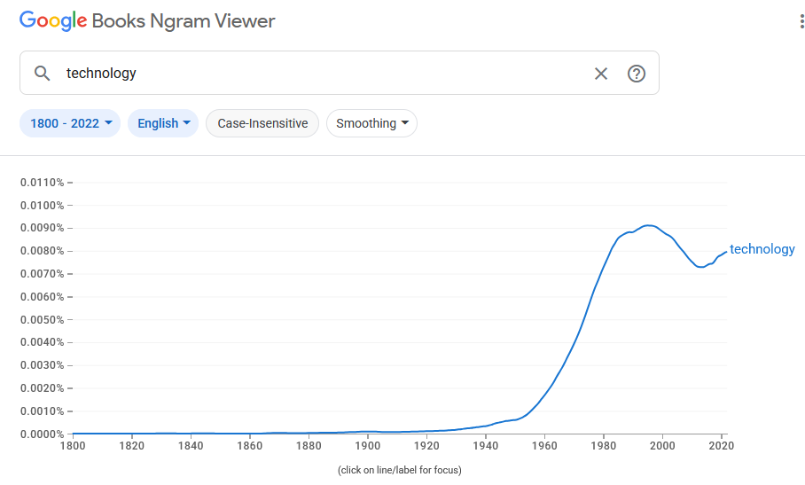
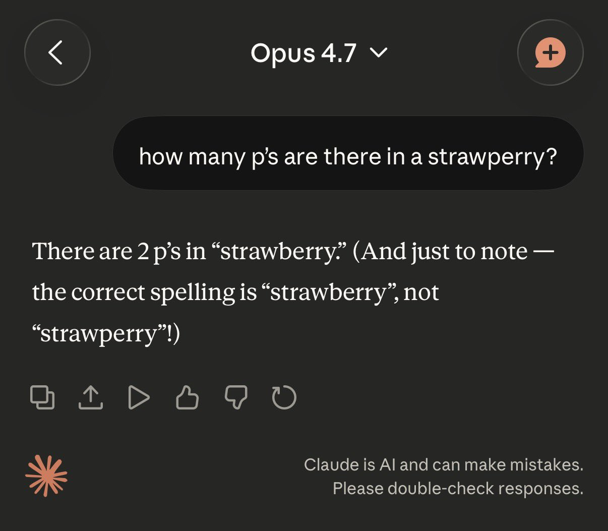

import { VideoEmbed } from "@site/src/components/VideoEmbed";
import { Note } from "@site/src/components/Note";

Interrumpimos la programación habitual de "cosas interesantes sobre animales"
para discutir sobre tecnología. No cambies de canal. Por favor.

<!-- truncate -->

## Título intencionalmente engañoso

La respuesta al título de este post es, claramente,
**no**.[1](#note-1)

Pero antes de responder, analicemos la pregunta de cerca:

Es joda, en realidad, quiero centrarme en la palabra "tecnología".

<Note noteIndex="1"> 

</Note>

## Tecnología

Esta es una palabra que, al menos en la modernidad contemporánea, repetimos
incesantemente. Hablamos de tecnología en nuestros trabajos. Probablemente
hables de tecnología con tus amigos. Tenemos medios de comunicación con
secciones, o dedicados totalmente, a hablar de tecnología. En el mundo
empresarial y de negocios es común escuchar hablar de empresas tecnológicas, las
cuales se enfocan en ofrecer productos o servicios tecnológicos.

Comúnmente cuando usamos esta palabra lo hacemos para referirnos a aparatos o
técnicas "de punta", es decir, cosas que se hayan creado recientemente y que
representen un progreso novedoso.

Esta acepción y uso masivo de la palabra es producto de nuestros tiempos. Si
bien Ngram no es una fuente determinante y cien-por-ciento fáctica, podemos
notar una clara tendencia en el incremento del uso de la palabra a lo largo del
siglo 20:

Pero, en realidad, tecnología no significa únicamente "cosas nuevas bonitas y
brillantes". No es solamente la electrificación y digitalización de las cosas,
la computación en todas partes, los dispositivos con pantallas hechas de
cristal.

Una rueda, inventada hace más de 6000 años, es tecnología.

Las herramientas que hacíamos a base de piedras en la época paleolítica, como
hachas de mano, lanzas o cuchillos, también son tecnología.

_Figura: Puntas de piedra generadas con el
[Método Levallois](https://es.wikipedia.org/wiki/M%C3%A9todo_Levallois)_

Teniendo esto en cuenta, la pregunta del título parece un poco ridícula. ¿Cómo
podríamos decir que, la invención de herramientas de piedra, nos hizo más
tontos?

No tiene sentido alguno. Es justamente nuestro ingenioso uso de estas
herramientas que nos dio una ventaja por sobre otras especies. Si no fuera
porque un grupo de primates prehistóricos decidiese usar piedras en su día a
día, no tendríamos nada de esto. No tendríamos sociedad, ni cultura, ni
lenguajes, ni... nuevas, bonitas y brillantes tecnologías.

¿Y cuál es la definición de inteligencia, en todo caso? ¿Cuál es la vara que
decide si somos más o menos tontos? ¿Es, por ejemplo, un humano "moderno" de
hace 200.000 años, más inteligente que nosotros?

Claramente los tipos sabían lo que hacían. Imaginate intentar sobrevivir 200.000
años atrás con el conocimiento que tenés actualmente, pero sin ninguna de las
facilidades modernas. ¿Serías capaz de generar una lanza con punta de piedra? ¿Y
de crear fuego cuando lo necesites? ¿De coordinarte con otros humanos para matar
a un mamut? ¿De recordar dónde está tu refugio y poder hallarlo nuevamente?

A su vez, estos humanos arcaicos no tenían idea de matemática. No serían capaces
de despejar una ecuación o resolver una integral. ¿Nos hace eso más
inteligentes?

Por mi parte, adhiero a lo expresado en
[pensamientos sobre el pensamiento](https://linternita.com/blog/pensamientos-sobre-pensamiento#algunos-pensamientos-sobre-el-pensamiento).
Lo que consideramos como "inteligente" es algo subjetivo que cambia según la
época. El conjunto de habilidades que producía que la sociedad te viese como
alguien inteligente hace 500 años es muy distinto al conjunto actual. A ningún
humano antiguo le parecería inteligente alguien que puede resolver integrales
pero no cazar animales. Con el paso del tiempo, y gracias a la tecnología,
ciertas habilidades cayeron en desuso y las dejamos de aprender y valorar.

Pero, ¿qué consecuencias tiene eso en nuestra especie? El hecho de que dejemos
de lado ciertas habilidades, y de que cada vez más y más las tecnologías nos
simplifiquen la vida, al punto de poder vivir casi "sin fricción alguna", ¿puede
causar una reducción en nuestras capacidades cognitivas?

Lo que me lleva al que realmente debería haber sido el título de este post, o la
pregunta a responder:

## ¿Es el continuo esfuerzo por simplificar nuestras vidas lo más posible realmente benéfico para nuestra especie? ¿Para nuestra sociedad?

¿Está bien que deleguemos cada una de nuestras "cargas" que tenemos en nuestra
vida cotidiana?

Mirá, te voy a ser sincero, no hay nada nuevo bajo el sol. Esto es lo que decía
Sócrates
[acerca de la invención de la escritura y los libros](https://www.historyofinformation.com/detail.php?id=3439):

> "For this invention will produce forgetfulness in the minds of those who learn
> to use it, because they will not practice their memory. Their trust in
> writing, produced by external characters which are no part of themselves, will
> discourage the use of their own memory within them. You have invented an
> elixir not of memory, but of reminding; and you offer your pupils the
> appearance of wisdom, not true wisdom, for they will read many things without
> instruction and will therefore seem [275b] to know many things, when they are
> for the most part ignorant and hard to get along with, since they are not
> wise, but only appear wise."[2](#note-2)

Es fácil entender su planteo: los libros almacenan conocimiento. Si querés saber
algo, ya no tenés que memorizarlo para luego recordarlo, podés agarrar el libro
y leerlo en el momento que lo necesites. Ya no hace falta que te esfuerces en
usar tu memoria, por lo que, con el tiempo, vas a tener una peor capacidad para
recordar cosas. Además, sugiere que leer algo no necesariamente te haga experto
en ese tema, porque no pasaste por todo el proceso y esfuerzo necesario para
realmente entenderlo.

¿Tiene razón?

Difícil dar una respuesta concreta en este caso. Es posible que las culturas
antiguas que dependían de la tradición oral fuesen mejores en memorizar y
recordar cosas que lo que somos nosotros hoy en día. Después de todo, debían
recordar historias completas, leyes y reglas, y cualquier otro tipo de expresión
cultural. Hoy en día, si bien es posible seguir memorizando esas cosas, si
queremos recordar lo que dice una ley simplemente leemos el texto de esa ley.
Delegamos el esfuerzo y liberamos a nuestra memoria de esa carga.

Pero hay algunos estudios que indican que la excesiva dependencia en una
tecnología puede causarnos problemas cognitivos:

[Uso habitual de GPS impacta de forma negativa la memoria espacial durante navegación autoguiada](https://www.nature.com/articles/s41598-020-62877-0):

> Although the longitudinal sample was small, we observed an important effect of
> GPS use over time, whereby greater GPS use since initial testing was
> associated with a steeper decline in hippocampal-dependent spatial memory.

[Demencia digital en la generación del internet: el excesivo uso de pantallas durante el desarrollo del cerebro incrementará el riesgo de Alzheimer y demencias similares en la adultez](https://www.imrpress.com/journal/jin/21/1/10.31083/j.jin2101028):

> Excessive screen time is known to alter gray matter and white volumes in the
> brain, increase the risk of mental disorders, and impair acquisition of
> memories and learning which are known risk factors for dementia. Chronic
> sensory overstimulation (i.e., excessive screen time) during brain development
> increases the risk of accelerated neurodegeneration in adulthood (i.e.,
> amnesia, early onset dementia).

[Efectos de Google en la memoria: consecuencias cognitivas de tener información al alcance de nuestras manos](https://dtg.sites.fas.harvard.edu/DANWEGNER/pub/Sparrow%20et%20al.%202011.pdf):

> The results of four studies suggest that when faced with difficult questions,
> people are primed to think about computers and that when people expect to have
> future access to information, they have lower rates of recall of the
> information itself and enhanced recall instead for where to access it

Si querés encontrar o leer más estudios como estos, este paper recolecta y
menciona varios:
[The impact of digital technology, social media, and artificial intelligence on cognitive functions: a review](https://www.frontiersin.org/journals/cognition/articles/10.3389/fcogn.2023.1203077/full)

<Note noteIndex="2">
  En realidad, esto es algo más profundo que "libros = malo", ya que Sócrates
  estaba haciendo un análisis de las cosas que veía en su época, donde muy pocos
  eran capaces de leer y escribir. Además hay toda una cuestión filosófica de
  fondo acerca de cómo se llega a la verdad a través del dialógo y blablabla a
  quién le importa Sócrates
</Note>

## Delegación del pensamiento

Seguramentes conocés eso de pensar. Obvio que lo conocés. Es algo que hacemos
los humanos. Estoy seguro que alguna vez escuchaste de eso. Es más, es algo tan
humano, que se podría decir que es lo que nos hace tan especiales y diferentes a
las otras especies.

Después de haber leído que hay una numerosa cantidad de estudios que indican que
el uso excesivo y la dependencia tecnológica nos afecta a nivel cognitivo,
seguramente estarás aliviado al saber que al menos por el momento no existe
ninguna tecnología que podamos usar para delegar la "carga" de pensar. Las
computadoras y celulares nos pueden afectar a la memoria y cosas así, pero por
lo menos no estamos adoptando masivamente una tecnología que realmente ponga en
riesgo nuestra habilidad de pensar. Ya sabés. Esa cosa que hacen los humanos. Lo
que nos distingue.

Y por suerte no estamos en un mundo donde multimillonarios que son dueños de
medios de comunicación y que poseen influencia por sobre las corporaciones y
gobiernos más poderosos del mundo nos intentan vender una tecnología a medio
cocinar que prometa algo por el estilo, provocando que toda una industria adopte
dicha tecnología porque esto es el futuro y es fascinante ya no tenemos que
tener empleados que piensen podemos hacer que nuestras ganancias suban hacia el
infinito y no ves como todo el mundo lo está usando nosotros también deberíamos
usarlo porque si no nos vamos a quedar atrás.

Dios, qué escenario hipotético espantoso. Uno se pregunta cuál podría ser el
posible resultado de forzar un cambio así. Pero hay que agradecer que por suerte
no estamos viviendo por algo como eso y que todavía podemos pensar.

Ya sabés.

Esa cosa que hacen los humanos.

## Tecnología moderna = mala

No soy ludita. Este post tampoco es anti inteligencia artificial. Es más que
nada para concientizar como el mal uso de la tecnología puede perjudicarnos sin
que nos demos cuenta.

Nuestras vidas deberían ser lo más simples y sin fricción posibles. Pero esto no
significa convertirnos en seres adictos a una pantalla, incapaces de retener
información, y que ni siquiera tengan que pensar porque hay una tecnología que
lo hace por ellos. Significa tener acceso a comida, agua, un techo donde vivir,
salud, educación. Deberíamos estar esforzándonos en eso, y no seguir prestándole
atención a multimillonarios psicópatas que dicen a viva voz que nos van a dejar
sin trabajos y arruinar nuestras vidas.

Para terminar, unas citas de The Demon-Haunted World, que siguen tan relevantes
hoy como en 1997:

> We've arranged a global civilization in which most crucial elements profoundly
> depend on science and technology. We have also arranged things so that almost
> no one understands science and technology. This is a prescription for
> disaster. We might get away with it for a while, but sooner or later this
> combustible mixture of ignorance and power is going to blow up in our faces.

> If we can't think for ourselves, if we're unwilling to question authority,
> then we're just putty in the hands of those in power. But if the citizens are
> educated and form their own opinions, then those in power work for us. In
> every country, we should be teaching our children the scientific method and
> the reasons for a Bill of Rights. With it comes a certain decency, humility
> and community spirit. In the demon-haunted world that we inhabit by virtue of
> being human, this may be all that stands between us and the enveloping
> darkness.

> I have a foreboding of an America in my children's or grandchildren's time --
> when the United States is a service and information economy; when nearly all
> the manufacturing industries have slipped away to other countries; when
> awesome technological powers are in the hands of a very few, and no one
> representing the public interest can even grasp the issues; when the people
> have lost the ability to set their own agendas or knowledgeably question those
> in authority; when, clutching our crystals and nervously consulting our
> horoscopes, our critical faculties in decline, unable to distinguish between
> what feels good and what's true, we slide, almost without noticing, back into
> superstition and darkness...
>
> The dumbing down of American is most evident in the slow decay of substantive
> content in the enormously influential media, the 30 second sound bites (now
> down to 10 seconds or less), lowest common denominator programming, credulous
> presentations on pseudoscience and superstition, but especially a kind of
> celebration of ignorance

