import { VideoEmbed } from "@site/src/components/VideoEmbed";
import { Note } from "@site/src/components/Note";

Hertz no se dió cuenta de la importancia a nivel práctico que tenían sus
experimentos con ondas de radio. Declaró que:

> No tienen uso alguno... esto es solo un experimento que demuestra que el
> Maestro Maxwell estaba en lo correcto—tenemos estas misterioras ondas
> electromagnéticas que no podemos ver a ojo desnudo. Pero están ahí.

Cuando se le preguntó acerca de las aplicaciones que sus descubrimientos podían
tener, Hertz respondió:

> Ninguna, supongo.

<!-- truncate -->

## Introducción

El telégrafo cambió la forma en que se luchaban las guerras. El teléfono redujo
las distancias, brindando un sentimiento de cercanía en nuestra sociedad. Las
ondas de radio... transformaron todo.

Me resulta fascinante el contraste entre las afirmaciones de
[Heinrich Hertz](https://en.wikipedia.org/wiki/Heinrich_Hertz) y lo que terminó
sucediendo. La aplicación práctica de las ondas de radio revolucionó
completamente el siglo XX.

Podríamos hacer una extensa lista de todas las cosas que _no_ hubieran pasado si
este descubrimiento no se hubiese hecho, pero creo que lo podemos resumir en lo
siguiente:

- No hubiéramos ido a la luna
- No tendríamos radio ni televisión
- No tendríamos teléfonos celulares

Imaginate un siglo XX sin ninguna de esas cosas y sus ramificaciones. Estaríamos
viviendo en un planeta totalmente distinto.

Pero esto no es un post acerca de tecnología o cómo la misma cambió al mundo. Si
querés leer sobre eso tenés
[este otro post](https://linternita.com/blog/monopolio-que-cambio-mundo).

## Intermisión: NEWSLETTER-NITA

¿QUERÉS ESTAR AL TANTO DE LOS ÚLTIMOS POSTS?

¿NECESITÁS MÁS LINTERNITA EN TU VIDA?

NO SUFRAS MÁS.

TENEMOS LA SOLUCIÓN PARA VOS EN SUAVES DOSIS DE NUEVE MILÍMETROS.

UNITE AL [PATREON DE LINTERNITA.COM](https://www.patreon.com/cw/Linternita) PARA
OBTENER UN CORREO CADA VEZ QUE SUBA UN POST.

QUÉ EMOCIÓN!!

Abrime

Tuve que ceder a la demanda popular. Muchos de mis amigos
[_[citation needed]_](https://en.wikipedia.org/wiki/Wikipedia:Citation_needed)
me pidieron que haga una especie de newsletter para poder recibir notificaciones
por correo cada vez que subo un post.

En vez de, como quizás sabés, la idiotez de subir historias en Instagram.

Si bien me gustaba la idea, no tenía ganas de pagar un servicio que haga eso.

Hasta que me acordé que existe Patreon. Básicamente si te unís al Patreon vas a
recibir una notificación cada vez que cree una publicación ahí.

La única desventaja es que tenés que crearte una cuenta de Patreon pero fuera de
eso no tenés que pagar (ni yo) nada y podés estar al tanto de todo lo que pasa
en Linternita.com por el resto de tu vida.

## Des-intermisión

En este post no voy a ahondar sobre conceptos físicos ni teóricos acerca de
electromagnetismo, ondas de radio, antenas, y demás.

Primero, porque es largo y aburrido. Segundo, porque honestamente no sé mucho
sobre antenas.

Desde hace **años** que tengo un RTL-SDR y siempre quise utilizarlo para
escuchar _algo_ por fuera de la frecuencia de radios FM. Resulta que, para hacer
eso, necesitás una o varias antenas.

Existen decenas de diseños de antenas distintos, cada uno con sus ventajas y
desventajas. Esto es porque no existe una antena que funcione óptimamente para
todos los casos/frecuencias. Pero en sí, para lo que es _recepción_ de señales
(u ondas de radio, como le quieras decir), una antena puede ser cualquier pedazo
de cable o caño de metal que tengas al alcance.

No es joda. Una de las antenas más "simples" de hacer para captar
[frecuencias altas](https://en.wikipedia.org/wiki/High_frequency) es...
literalmente un pedazo de cable largo tendido entre dos postes:

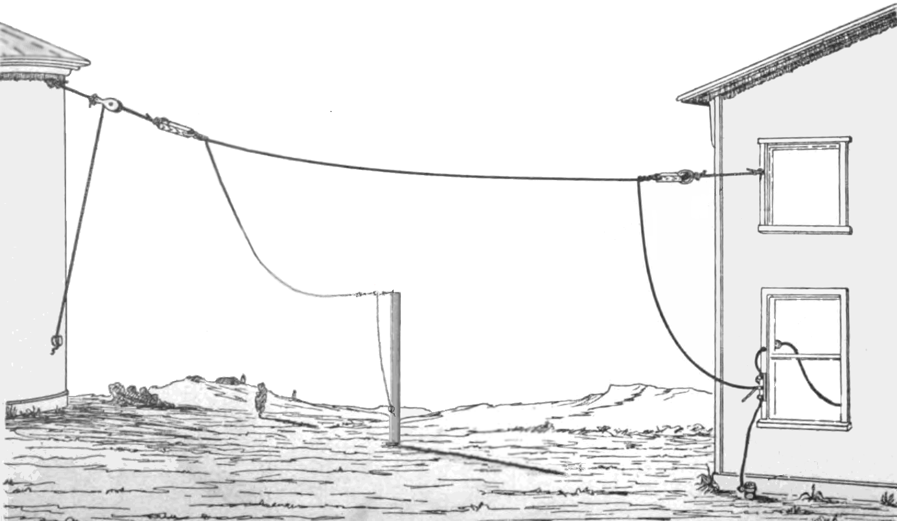

_Figura 1: una
["random wire antenna"](https://en.wikipedia.org/wiki/Random_wire_antenna)_

En mi caso, me decidí por intentar hacer las siguientes tres antenas:

- Una antena dipolo "estándar"
- Una antena de "bucle magnético"
- Una antena dipolo V invertida

Todas estas antenas las intenté hacer con la mayor cantidad de material
reciclado posible porque no tenía ganas de gastar mucha plata en esto. Incluso
algunos cables me los robé de la calle.

Si bien con cualquier pedazo de cable podemos capturar señales que estén
viajando a través del campo electromagnético, necesitamos una forma de
interpretarlas. Acá es donde entra juego el "SDR". En términos simples, es un
aparatito mágico que con la ayuda de alguna matemática y ciertos circuitos
electrónicos permite que tu computadora pueda interpretar las señales.

Es un aparatito como este:

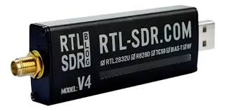

La parte que tiene un USB se conecta a tu computadora. La otra parte, que tiene
un conector dorado llamado SMA, se usa para conectarlo a la antena.

## Antena dipolo estándar

Si un pedazo de cable o caño es la antena más simple, el dipolo se lleva el
segundo puesto. Básicamente son dos pedazos de cable.

A pesar de eso, hay muchas formas de construir un dipolo. En este caso, construí
lo que voy a llamar un dipolo "estándar" o clásico, que tiene una forma de T,
como se aprecia en la siguiente figura:

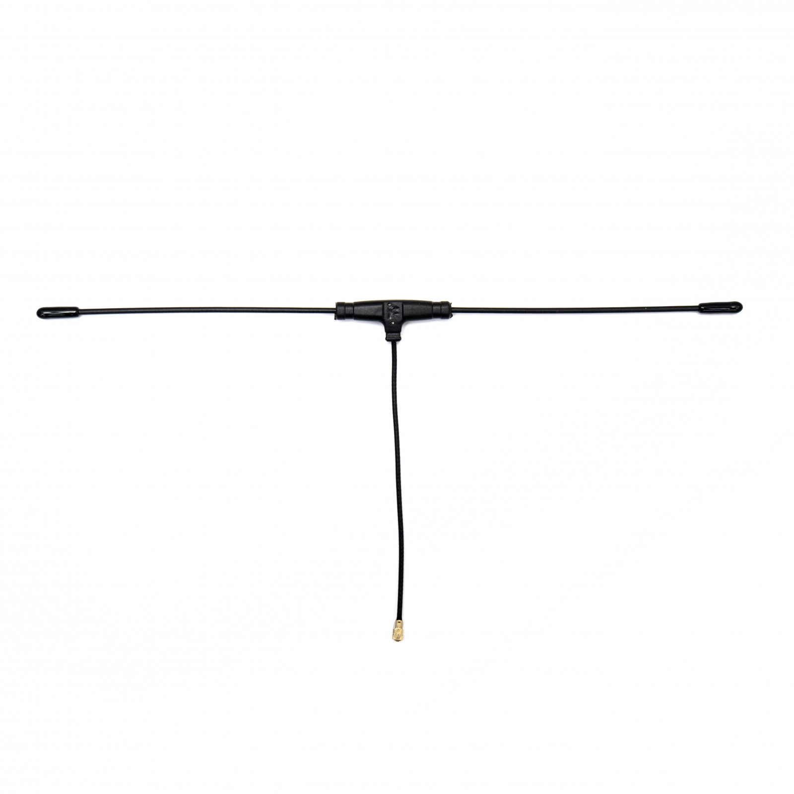

En las antenas dipolo, a cada "pedazo de cable" se lo llama pata. El largo de
las patas influye en la frecuencia que tu antena va a recibir mejor.

"la frecuencia que tu antena recibe mejor" se suele llamar frecuencia central o
frecuencia resonante. Una antena puede captar distintas frecuencias, pero
siempre va a captar mejor a la frecuencia resonante.

Y en el caso de este tipo de antenas, mientras más cortas sean las patas, más
alta va a ser la frecuencia resonante. Y mientras más largas sean, más baja
será.

La construcción de un dipolo es bastante simple: cortás dos pedazos de cable.
Uno va a ser la pata izquierda, el otro la pata derecha. Los alinéas
horizontalmente procurando mantener una pequeña separación entre ambos. Después
conectás una de las patas al conductor exterior del cable coaxial, y luego otra
al conductor núcleo.[1](#note-1)

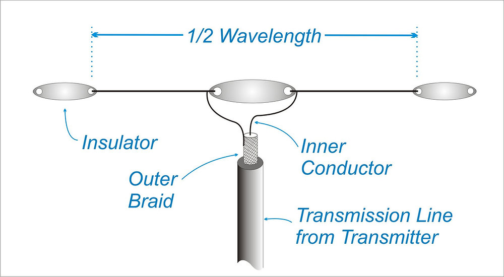

Después conectás el cable coaxial a tu SDR y tirás la antena en algún lugar alto
y listo. Tu primer dipolo.

<Note noteIndex="1">
  Es la primera vez que menciono un cable coaxial en este post. Como dije antes,
  no voy a ahondar demasiado, pero básicamente lo podés pensar como el cable que
  transmite la señal capturada por la antena hacia el SDR.
</Note>

Para esta antena disponía de los siguientes materiales:

- Dos antenas telescópicas (las cuales habré sacado de alguna radio antigua rota
  en algún momento de mi vida)
- Tablitas de madera "fibrofácil" (recicladas de proyectos artisticos fallidos)
- Pedazos varios de cables de cobre viejos
- Un pedazo caño de PVC termofusión

Con un poco de pegamento, una agujereadora y muy poca paciencia, este fue el
resultado:

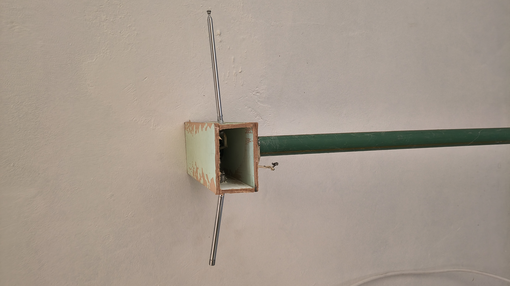

La caja de fibrofácil la hice a mano cortando las tablitas y pegándolas. Esta
caja asegura la separación entre ambas patas del dipolo. En teoría también
debería servir para que estén alineados horizontalmente, pero como soy
impaciente no esperé a que el pegamento se seque del todo y las patas quedaron
algo torcidas formando un ángulo (esto no afecta demasiado a la recepción).

En la parte de abajo de la caja hice un agujero para poder hacer pasar el caño
de PVC. La idea detrás de esto era poder subir la antena lo más alto posible,
haciendo que no esté en contacto con... el techo de mi casa o lo que fuere.

El hecho de que cada pata del dipolo sea "telescópica" es una ventaja
interesante de esta antena:

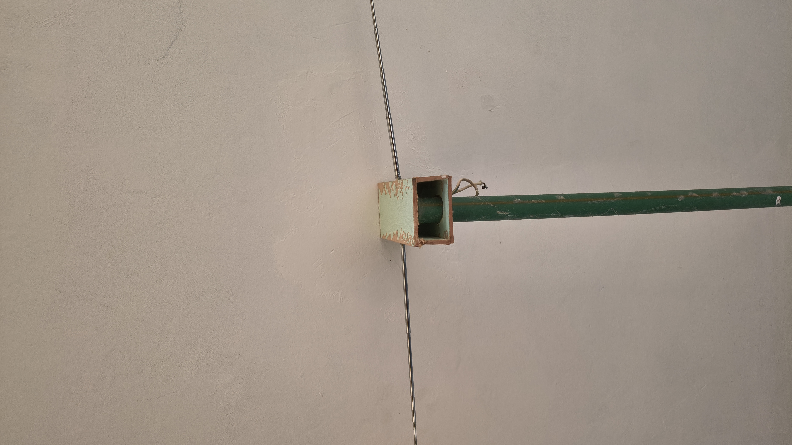

Como mencioné antes, el largo de las patas afecta a la frecuencia resonante. Al
ser telescópicas, puedo cambiar a gusto la frecuencia resonante del dipolo,
simplemente extendiendo o contrayendo las patas.

### ¿Qué logré capturar?

Además de estaciones de radio FM, pude captar audio de canales de televisión.

<VideoEmbed src="https://www.youtube.com/embed/kigushx-cck" />

Estoy seguro que este audio no es el del sistema de televisión digital terrestre
en Argentina (TDA), ya que en ese sistema tanto el audio como video son
transmitidos de forma digital... Mientras que lo que recibí acá es claramente
una señal analógica.

La TDA existe desde 2008 en Argentina, a esta altura no debería haber canales de
televisión que transmitan de forma analógica. [2](#note-2)

<Note noteIndex="2">

Aparentemente el apagón de las transmisiones analógicas algo que se viene
postergando y en 2 meses va a dejar de existir:

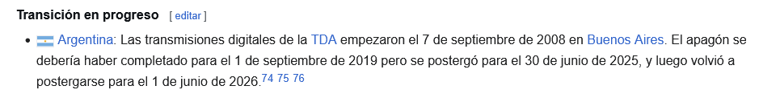

</Note>

## Antena de bucle magnético

Las antenas de bucle magnético o "magnetic loop antenas" son totalmente
distintas a las dipolo.

En vez de tener dos pedazos de cables ubicados de forma horizontal, tenemos...
un bucle hecho con cable coaxial.

Así se ven estas antenas:

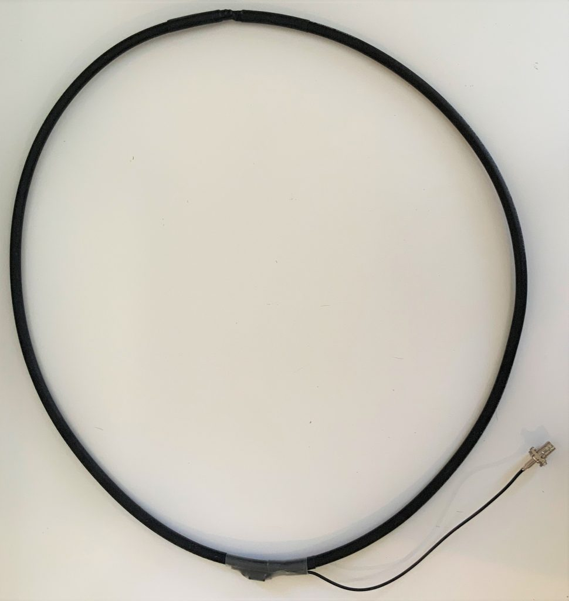

¿Por qué harías una antena como esta en vez de un dipolo?

El problema del dipolo es que, mientras más bajas sea la frecuencia resonante,
más grande tiene que ser la antena.

Por ejemplo, si querés hacer un dipolo que tenga una frecuencia resonante de 20
MHz, vas a terminar con una antena que tiene como 7 metros de largo.

En cambio, con una de bucle magnético, terminarías con un círculo de algo de 1
metro de diámetro.

Para esta antena disponía de los siguientes materiales:

- Un cable coaxial "quad-shield" (robado de la calle)
- Un toroide de ferrita (sacado de una motherboard quemada)
- Cables de cobre

Básicamente, seguí esta guía:
[DIY: How to build a Noise-Cancelling Passive Loop (NCPL) antenna](https://swling.com/blog/2020/04/diy-how-to-build-a-noise-cancelling-passive-loop-ncpl-antenna/).

En comparación con el dipolo, la construcción se dificulta. Tenés que
cuidadosamente manipular el cable coaxial y soldar bien todo.

Para complicar más las cosas, la guía específica que tenés que usar un balun
para esta antena.

¿...qué carajo es un balun?

[Acá](https://ludens.cl/Radiacti/topicos/balun/balun.htm) tenés una explicación
detallada que incluso explica las diferentes formas de balunes que existen.

Yo no leí esa explicación detallada. Pero según lo que sé actualmente: la
impedancia es la oposición al paso de la corriente alterna, medida en Ohms. Las
antenas tienen una impedancia dada. Los cables coaxiales también tienen una
impedancia, que puede ser distinta a la de la antena. El receptor SDR también
maneja un valor impedancia. Si en tu sistema antenístico no intentás "arreglar"
las diferencias entre impedancias, vas a tener peor rendimiento y pérdidas en la
señal. Los balunes ayudan a regular la impedancia y que todo el sistema trabaje
bajo un mismo valor.[3](#note-3)

En fin. Hay varias formas de hacer un balun casero. Una de ellas consiste en
agarrar un toroide de ferrita y darle una cierta cantidad de vueltas con un
cable de cobre.

Las plaquetas de dispositivos electrónicos antiguos suelen tener estos toroides.
Se ven así:

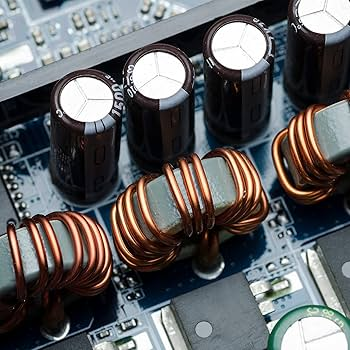

En mi caso, saqué uno de una motherboard rota y lo convertí en el peor balun del
mundo. Digo esto porque al armar un balun tenés que tener en cuenta las
dimensiones del toroide y las cantidad de vueltas que le das con el cable. Yo no
tuve en cuenta nada.

<Note noteIndex="3">

Después de toda esta explicación, estarás pensando: "wow sí o sí necesito un
balun si quiero recibir señales".

No. Las diferencias de impedancia afectan más a la transmisión de señales que a
la recepción. Las pérdidas que tengas por no usar un balun al recibir señales
son negligibles. Así que no te preocupes y no gastes tiempo en construir o
conseguir uno.

Yo no lo sabía en ese momento.

</Note>

### ¿Qué logré capturar?

Nada fuera de estaciones de radio FM.

Realmente me rendí con esta antena. Si bien logré armar el bucle y
conectar/soldar todo másomenos como se debía, no tenía manera fácil de conservar
la forma circular de la antena y subirla a mi techo para poder capturar más
cosas.

De todas formas, es un diseño de antena interesante. Si algún día ves un pedazo
de cable coaxial cortado en la calle, tranquilamente lo podrías intentar
convertir en una antena de estas.

## Antena dipolo V invertida

Ante el fracaso de la antena de bucle volví a lo simple, a lo que sabía que
funcionaba. Dipolo my beloved.

El dipolo V invertida es una variación del dipolo estándar. En este caso, en vez
de tener las dos patas horizontales, están orientadas hacia abajo, formando una
V invertida:

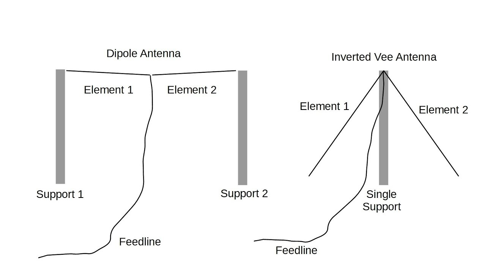

¿Cuál es la ventaja de hacer esta antena?

Como la imagen lo muestra, en el dipolo estándar necesitás tener 2 soportes para
fijar cada pata. En el dipolo invertido solo usás un soporte, y las patas las
fijás en el piso.

Además este tipo de antena tiene menor impedancia que el dipolo estándar pero no
vamos a ahondar en eso.

En este caso quería construir una antena con una frecuencia resonante de 30 MHz.
Según [la calculadora](https://k7mem.com/Ant_Inverted-V.html) que usé, estas
serían las dimensiones finales:

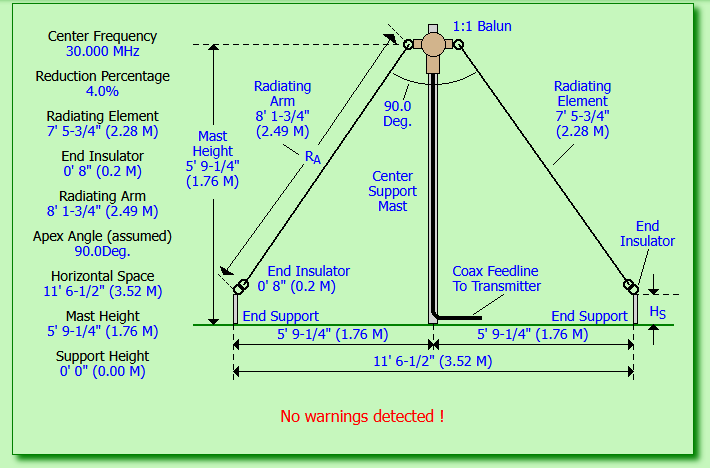

Un mástil de 1.76 metros de altura, con cada pata midiendo 2.28 metros de largo
(sin contar los soportes). El largo total de la antena ocupa 3.52 metros.

La lista de materiales es casi la misma que el dipolo original. Fibrofácil,
caños, cables, tornillos.

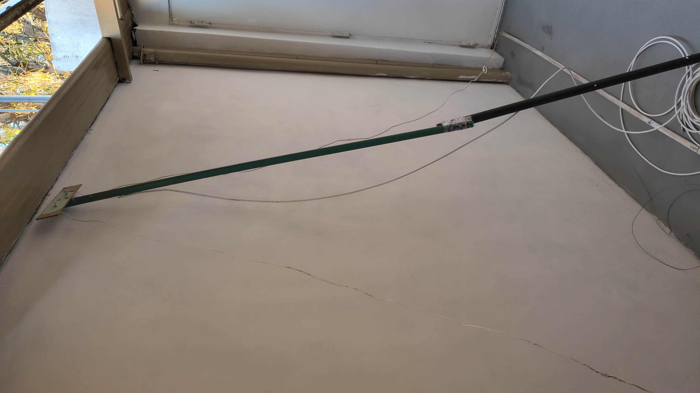

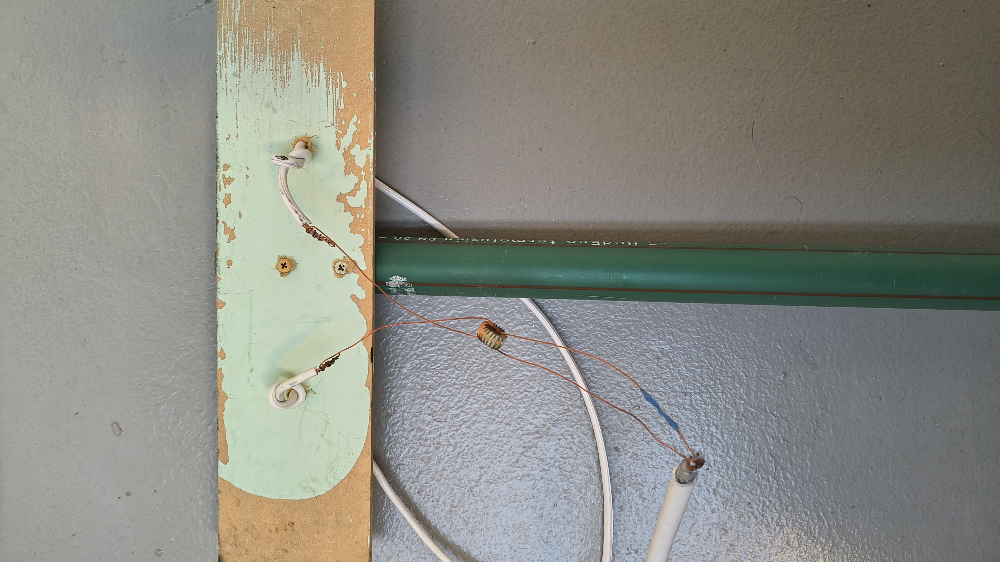

_balun incluido!!!1_

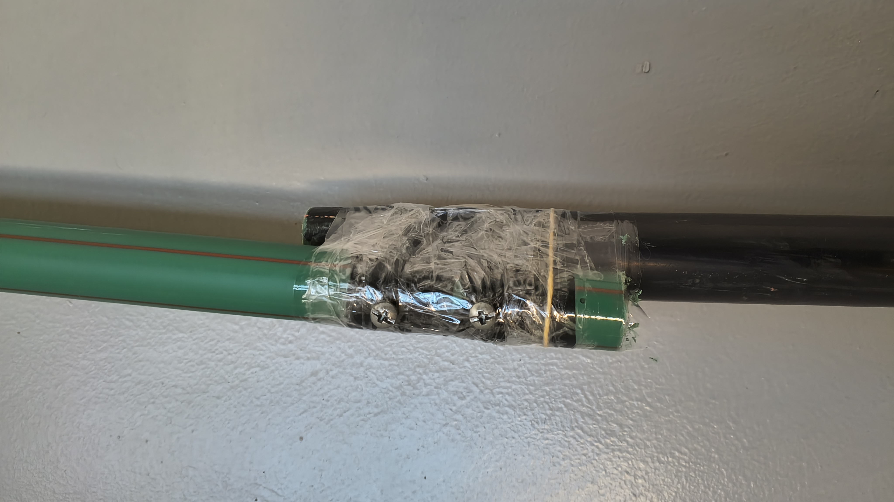

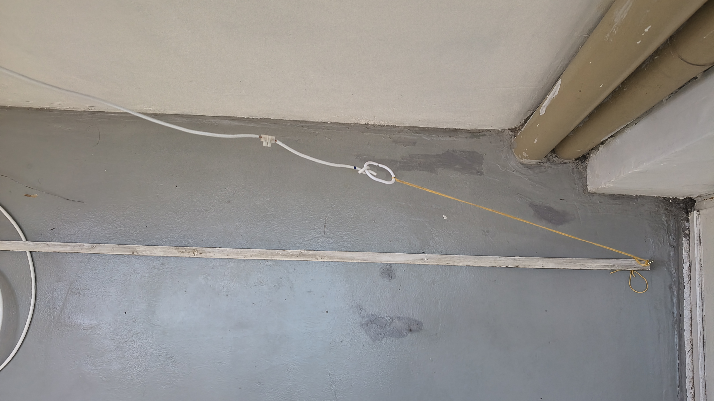

### ¿Qué logré capturar?

De todo, menos cosas en la frecuencia resonante.

Esto es por varias razones, pero principalmente porque desplegué la antena así
no más. En general, se recomienda tener las antenas lo más alto posible,
alejadas de otros elementos que puedan causar interferencias (metales, cables,
árboles, dispositivos electrónicos). Digamos que mi antena no estaba muy
alejada.

Otra cosa que aprendí al momento de construir esta antena es a usar el control
de ganancia en la aplicación de SDR que uso en la computadora. Básicamente el
control de ganancia te permite "amplificar" (con muchas comillas) las señales
que estás recibiendo, haciendo más fácil distinguirlas.

Esto, más el hecho de que es una antena más grande y que estaba más alta que el
primer dipolo, me permitió capturar:

- Torres de control de aeropuertos
- Aviones
- Comunicaciones entre radioaficionados

Lo que más me sorprendió es que logré capturar a un radioaficionado que estaba
hablando a través de un handy a 60 km de distancia de mi casa.

El siguiente video tiene una recopilación de capturas que realicé con la antena.

<VideoEmbed src="https://www.youtube.com/embed/UelA5lQTM6c" />

## Notas finales

que divertido, no?

## Próximamente

Cómo armar un radiotelescopio casero en tu casa usando materiales reciclados
