import { VideoEmbed } from "@site/src/components/VideoEmbed";
import { Note } from "@site/src/components/Note";

¿...por qué el simbolo de "play" es un triángulo? ¿desde cuándo usamos una
flecha (→) para apuntar a cosas? ¿cuál es el símbolo más antiguo que aún es
usado? ¿cúal fue el primer símbolo?

<!-- truncate -->

## Introducción

_Figura 1: un símbolo_

Símbolos. ¿No te parecen interesantes? Un conjunto de trazos, marcas, formitas y
colores que, al verlos, te transmiten un mensaje, idea, o concepto.

Lo cual es algo muy parecido a lo que te está pasando ahora al leer este texto.
Al avanzar por esta oración estás interpretando un conjunto de símbolos
pertenecientes al alfabeto español, que comúnmente los llamamos letras.

Todo sistema de escritura está basado en símbolos. Uno podría pensar que, cuando
inventamos la escritura, también inventamos los símbolos. Pero la evidencia o
registros de escritura más antiguos que tenemos son de, aproximadamente, el 3000
a.C; mientras que el uso de símbolos antecede la invención de la escritura por
_muchos_ miles de años.

No sabemos exactamente _cuántos_, pero excavaciones realizadas en la Cueva de
Blombos (ubicada en un arrecife al sur de África) trajeron a la luz algunos
objetos como estos:

Esto es, según los tipos que lo descubrieron, "el dibujo más antiguo (que
conocemos hasta el momento) hecho por un humano", contando con 73.000 años de
antigüedad. En sí, es un pedazo de piedra que fue pintado con ocre.

Para llamar esto un símbolo tendríamos que ser demasiaaado generosos con la
definición de la palabra. Aunque, por otro lado, aplicar las concepciones
modernas que poseemos es un error. Quién sabe. Capaz para algún humano de 73.000
años esas específicas marcas en la piedra _claramente_ significaban algo.

De la misma cueva también salió esta otra piedra:

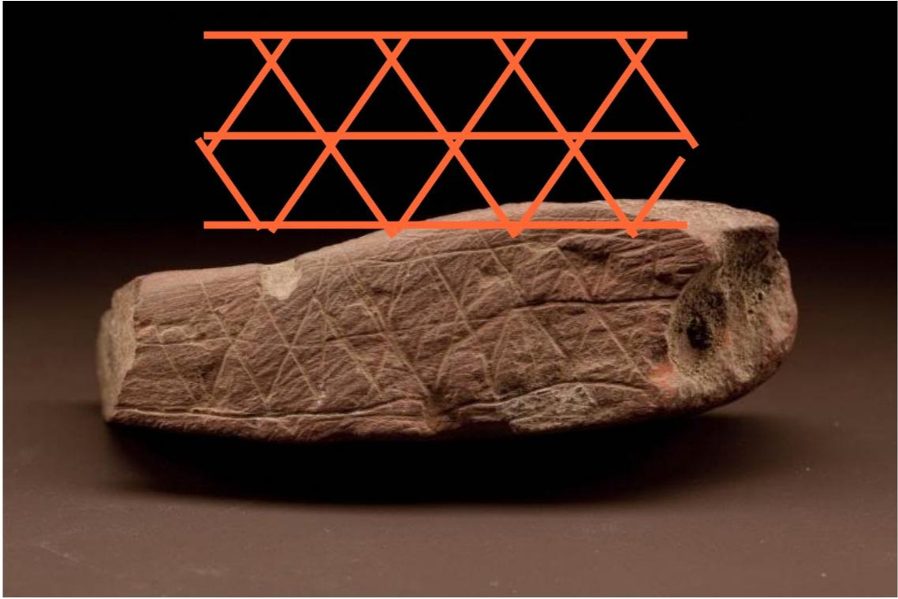

Un bloque de ocre de aproximadamente la misma antigüedad que el anterior, pero
en este caso podemos observar que no tiene par de marcas hechas así no más. Hay
un claro patrón. Un antepasado nuestro se tomó el tiempo de grabar esta piedra.
Nuevamente, no sabemos el significado. Pueden ser símbolos, o puede ser algo
puramente decorativo que no transmite ningún mensaje al verlo.

Lo que muestran estos hallazgos de la Cueva de Blombos es que ya veníamos
dejando marcas intencionalmente hace, al menos, 73.000 años
atrás.[1](#note-1)

<Note noteIndex="1">
  Como todo lo relacionado a la arqueología, es muy difícil encontrar evidencia.
  Es posible que hiciéramos esas cosas incluso mucho antes, en otro tipo de
  materiales o medios que no tienen la misma permanencia que la piedra. Quizás
  hacíamos dibujos en la arena de las playas, solo para que sean borrados al
  llegar una ola. O quizás dejábamos marcas en trozos de madera, la cual se
  descompone sin dejar rastro alguno.
</Note>

Algunos años después (aproximadamente 68.000 años en el pasado) se ve que
empezamos a hacer dibujitos como estos en las paredes de algunas cuevas:

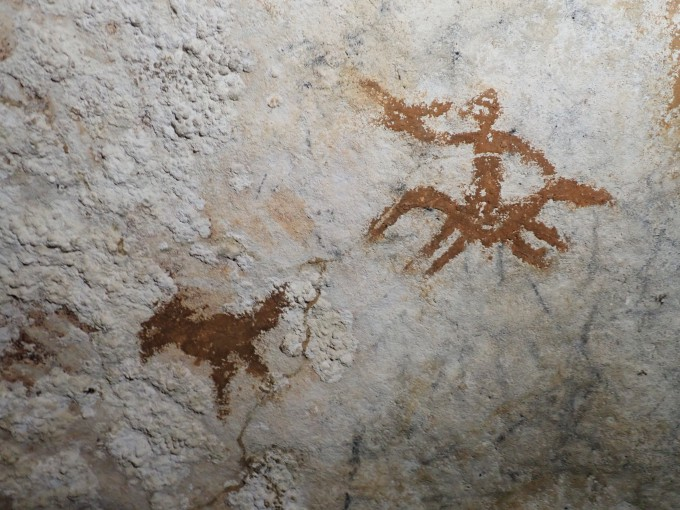

_Pinturas en la isla de Sulawesi_

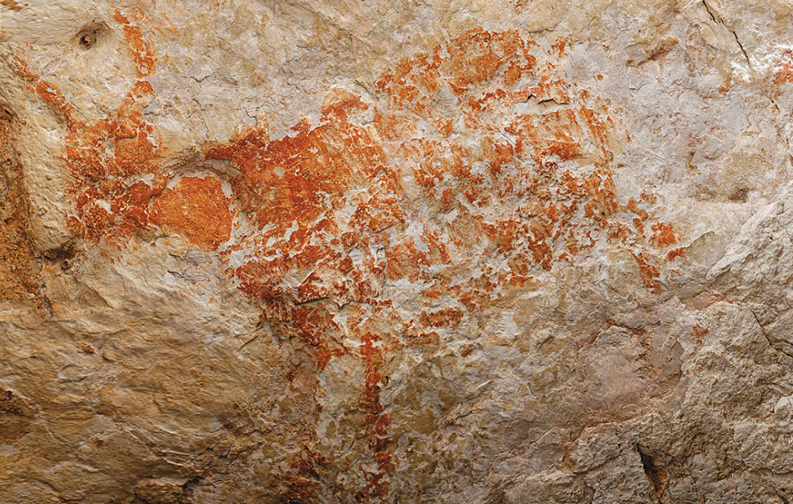

_Un ¿toro? pintado en la cueva Lubang Jeriji Saléh en Indonesia_

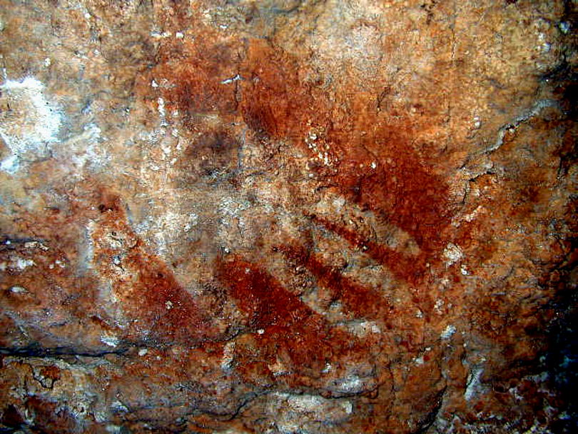

_Manos en la cueva de Maltravieso en España_

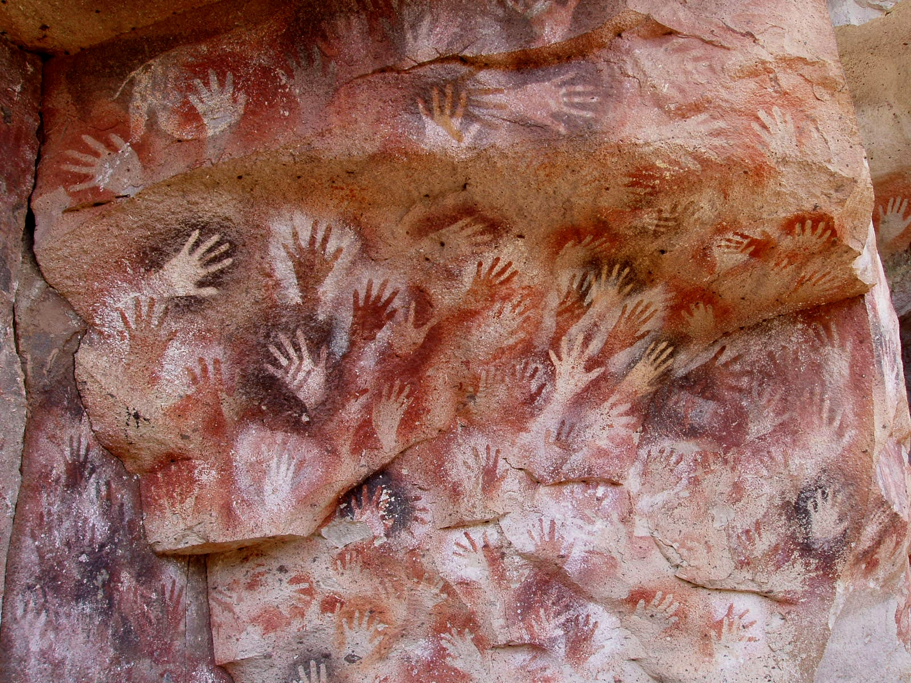

_Manos en la Cueva de las Manos en Argentina[2](#note-2)_

<Note noteIndex="2">
  ok lo admito, la última foto es de algo _mucho_ más reciente (9000 años
  atrás), pero, ¿cómo no voy a poner a la Cueva de las Manos como ejemplo?
  ❤️🇦🇷❤️
</Note>

Que no solo demuestran un claro avance en nuestras habilidades simbólicas, sino
que quizás algunos de los símbolos son cosas que podemos llegar a "entender",
incluso sin tener el contexto ni saber el significado real detrás de los mismos.

Es decir: es fácil ver que el bloque de ocre de la Cueva de Blombos tiene un
patrón grabado, pero intentar llegar a entender qué querían representar es una
causa perdida. En cambio, con algunas pinturas rupestres...

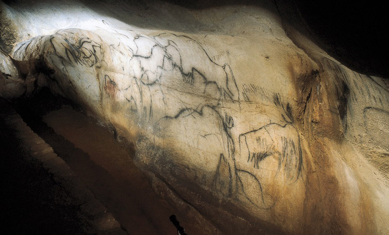

...el objeto representado se hace evidente, como en este caso que podemos ver
caballos, mamuts y bisontes retratados.

O en este otro, donde podemos observar algo que se asemeja a un humano con
marcas (que parecen ser lanzas o flechas) atravesándolo:

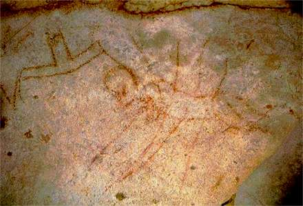

De nuevo, no sabemos el contexto, el significado real, lo que estaban tratando
de transmitir; pero podemos hacernos algunas ideas. Quizás fue el resultado
final de un enfrentamiento, que decidieron retratar a modo conmemorativo
(similar a como, después de matar a alguien en el Counter-Strike 1.6, les ponías
un graffiti sobre el cuerpo del muerto y escribías por chat "al lobby
pt"[3](#note-3)). Quizás era una señal de advertencia, un aviso de
peligro.

<Note noteIndex="3">
  

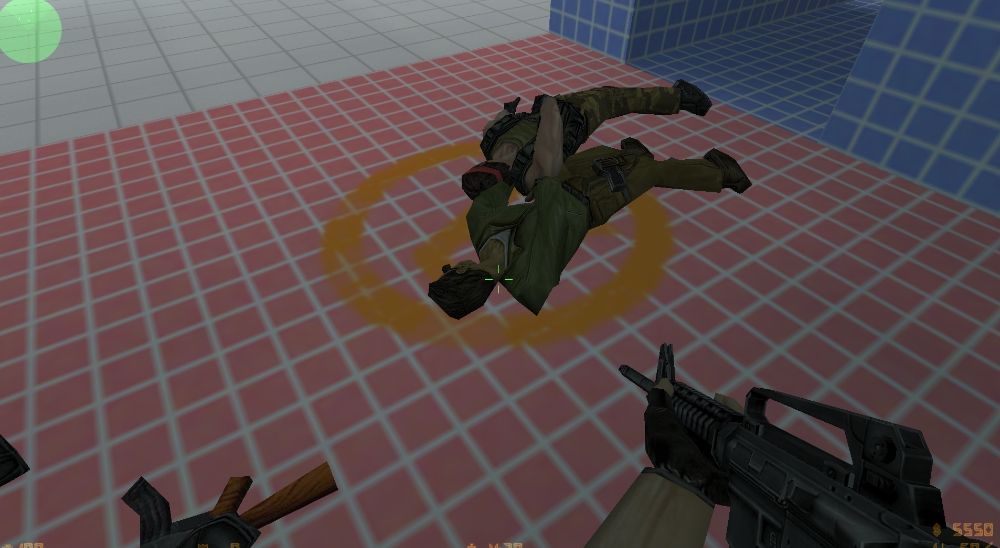

al lobby pt

  

</Note>

El uso de símbolos para transmitir ideas, conceptos o mensajes siguió
evolucionando con el tiempo, llegando a crearse sistemas de "proto-escritura".
La proto-escritura se diferencia de los "verdaderos" sistemas de escritura en
que estos últimos representan al _lenguaje_ hablado por una persona, mientras
que los primeros representan y transmiten de forma limitada una serie de
conceptos.

Por dar un ejemplo (muy simplificado y quizás erróneo, pero bueno, no soy
lingüista), en el sistema de escritura español podemos escribir:

> Yo vi la casa explotar.

Que no es más que una representación escrita de la gramática que usamos al
hablar.

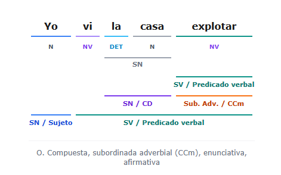

Lo más importante es que, con dicha representación, podemos recrear oralmente
con exactitud el mensaje.

En cambio, la proto-escritura no te da esa garantía:

> 👁️🏠💣💥

Al ver esos símbolos, podemos interpretar que una casa estaba siendo observada y
que luego una bomba explotó. La información que se transmite es la misma, pero
no se está transmitiendo un lenguaje en sí.

Perdón, estoy desvariando mucho. Este post no es sobre lingüística ni sobre
proto-escritura. Es sobre símbolos y preguntas boludas alrededor de ese tema.
Así que vayamos a eso!!!!!

## Evolución del alfabeto

Me encanta contradecirme. Obviamente el alfabeto está relacionado a la
escritura, pero no voy a profundizar mucho en eso. Solo mirá esta imagen para
ver de dónde surgieron las letras que estás leyendo ahora mismo:

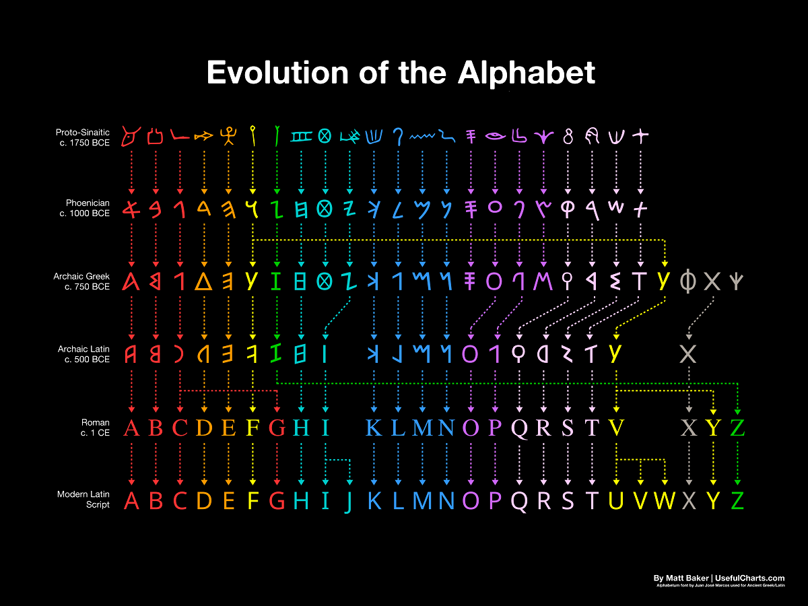

La letra A es la transformación, tras muchos milenios, de un dibujito de la
cabeza de un buey. Y así con el resto. Re loco, ¿no? ¿A que no vas a poder
dormir esta noche?

## Flechas

Usamos flechas para indicar una dirección o "apuntar" hacia algo. Es algo tan
común que lo tenemos bastante integrado y grabado en nuestras cabezas.

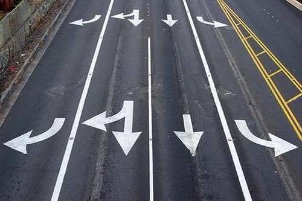

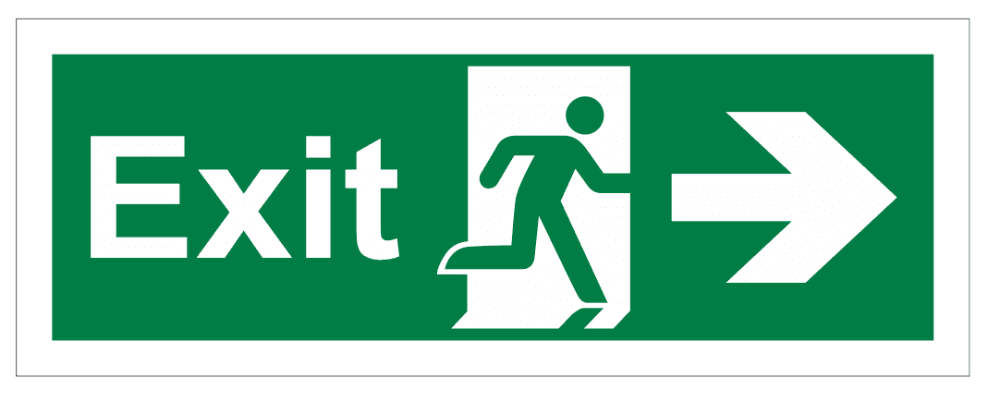

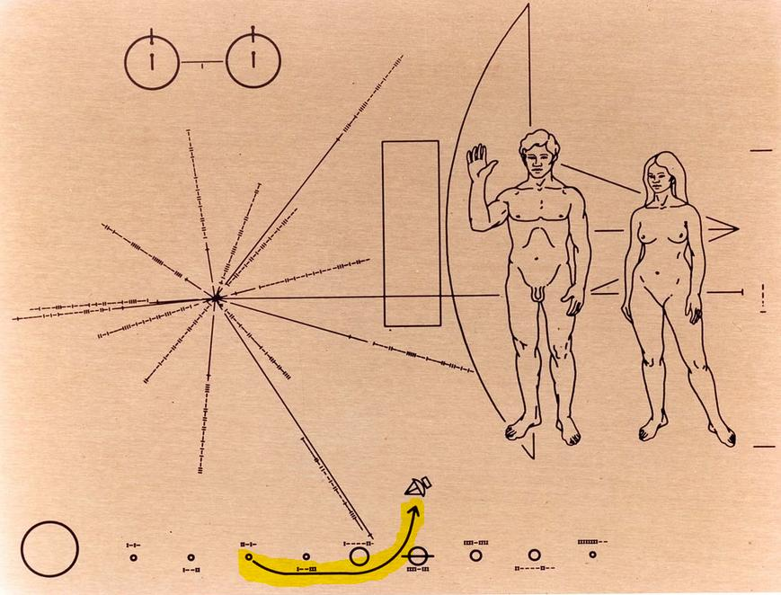

La última foto es de la placa que fue lanzada con las sondas espaciales Pioneer.
La placa contiene la representación un átomo de hidrógeno, una ilustración de
una mujer y un hombre, la ubicación del sol en base a púlsares cercanos, el
sistema solar... y una flecha que muestra la trayectoria de la sonda.

La inclusión de esa flecha recibió algunas críticas.

Nosotros sabemos lo que representa una flecha. Venimos usándolas hace _años_.
Los restos de flechas más antiguas que hallamos datan de 61.000 años en el
pasado. Hay varias pinturas rupestres que muestran el uso de arcos y flechas. Si
un alien se encuentra una flecha, lo más probable es que no tenga idea de qué
significa, ya que es posible que nunca hayan tenido o creado flechas como las
nuestras. Es obvio para nosotros que el dibujo de una flecha apunta o indica el
lugar de algo, porque es algo venimos haciendo desde hace miles de años.

......¿no?

Aparentemente, no.

No es que te haya mentido. Realmente hay pinturas rupestres que muestran arcos y
flechas. Y venimos usándolas para cazar y matar cosas desde hace miles de años.

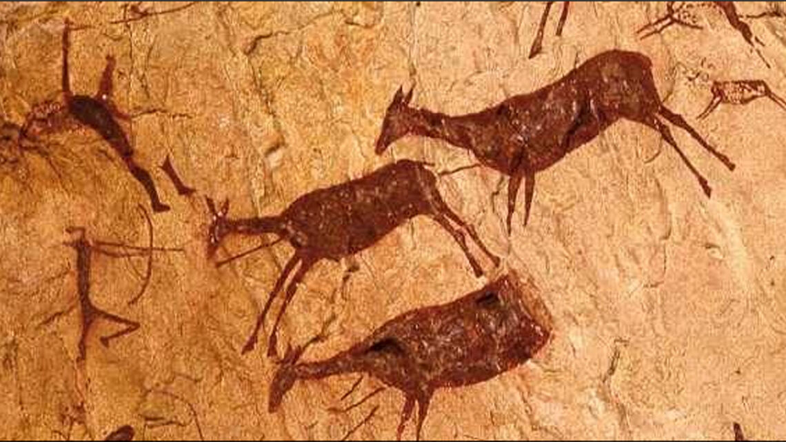

Pero el uso de la flecha para indicar la dirección o posición de algo es...
bastante nuevo. Uno de los primeros usos de una flecha bajo ese sentido se
encuentra en _L'architecture hydraulique_, un libro de ingeniería hidráulica
escrito en 1737 por un tal Bernard Forest de Bélidor.

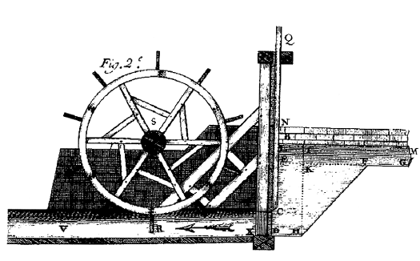

_La flecha marca la dirección del flujo del agua luego de que la rueda sea
girada_

Y como se ve en el diagrama, la flecha contiene el "emplumado", como si se
tratase del dibujo de una flecha real, y no la simplificación a la que estamos
acostumbrados actualmente (→).

La gran pregunta es: ¿qué usábamos antes entonces?

Manecillas. Literalmente un dibujito de una mano apuntando con el dedo índice.

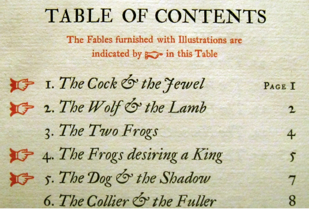

No sabemos exactamente desde cuándo. El libro más viejo que contiene una
manecilla es el [Domesday Book](https://en.wikipedia.org/wiki/Domesday_Book) del
año 1086.

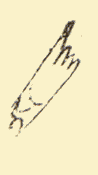

Pero no se sabe _cuándo_ se hizo la anotación. Pudo haber sido en ese entonces,
o mucho después de que se haya escrito el libro.

¿Y qué se usaba antes de eso?

Estuve investigando (léase: buscar en Google y Wikipedia furiosamente) un par de
horas y encontré... nada. No sale a la luz ningún otro símbolo que haya sido
usado con los mismos fines. O no estoy buscando lo suficientemente bien, o no
existía un símbolo comúnmente utilizado para ese fin.

Así que quizás solo entre los últimos 1000 años de historia es que nos empezamos
a preocupar y a usar símbolos para apuntar a algo.

## Esvásticas

Seguro te pensás que este post arranca con una esvástica porque me quise hacer
el gracioso o el _edgy_, pero no.

Occidentalmente hablando, es bien sabido que, durante la Segunda Guerra Mundial,
el partido nazi usó la esvástica como un símbolo representativo.

Y quizás también sepas que el símbolo en sí no fue una creación o idea que
tuvieron ellos, sino que ya era algo que venía siendo usado por otras culturas y
religiones hace tiempo.

Pero,

capaz no sabías que la esvástica es uno de los símbolos más antiguos que aún
seguimos usando.

Los registros más viejos que tenemos datan entre 10.000 y 17.000 años de
antigüedad, en unas piezas de marfil halladas en
[Mezine](https://en.wikipedia.org/wiki/Mezine), que fueron talladas para
resemblar lo que parece ser un pájaro. Grabado en el marfil se pueden encontrar
diversos patrones, entre ellos, esvásticas:

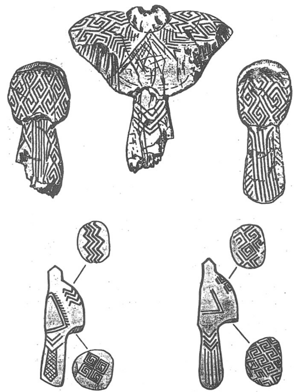

Otros hallazgos algo más recientes son petroglifos (grabados en piedra)
encontrados [cerca de Irán](https://en.wikipedia.org/wiki/Lakh_Mazar), que
cuentan con 7000 años de antigüedad:

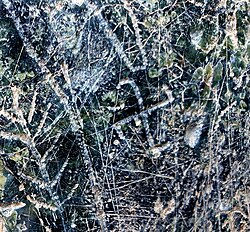

Quién sabe realmente desde hace cuánto que venimos haciendo este símbolo.
Quizás, por fuera de símbolos más "simples" como rayas (/), puntos (.), o cruces
(X), la esvástica sea uno de los símbolos más "elaborados" que cuentan con un
uso ininterrumpido por miles de años.

Con este trasfondo me da lástima pensar en cómo, occidentalmente hablando, el
símbolo carga con tanta connotación negativa. Un símbolo que nos viene
acompañando desde los inicios de la civilización...

## Espirales y trisqueles

Las espirales le siguen de cerca a la esvástica. En este caso, los registros más
viejos se posicionan entre los 4500 y 3000 años de antigüedad:

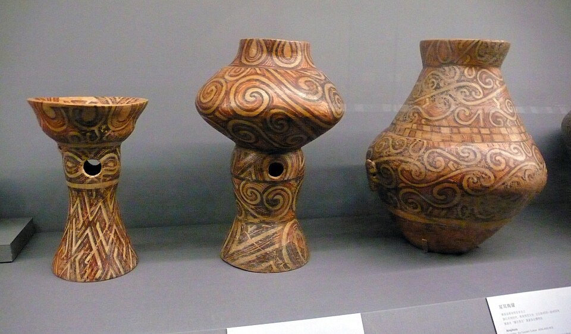

_Diversos jarrones de la cultura
[Cucuteni](https://en.wikipedia.org/wiki/Cucuteni%E2%80%93Trypillia_culture)
decorados con espirales_

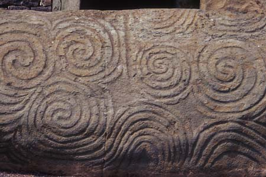

_Petroglifos hallados en el
[monumento de Newgrange](https://en.wikipedia.org/wiki/Newgrange)_

Los de la última foto forman lo que se conoce como un "trisquel", que no es más
que un símbolo formado por tres espirales que comparten simetría rotacional.

Y a día de hoy _también_ seguimos usando estos símbolos. Acá algunos ejemplos
modernos:

_La consola Sega Dreamcast, lanzada en 1999, lucía una espiral como logo_

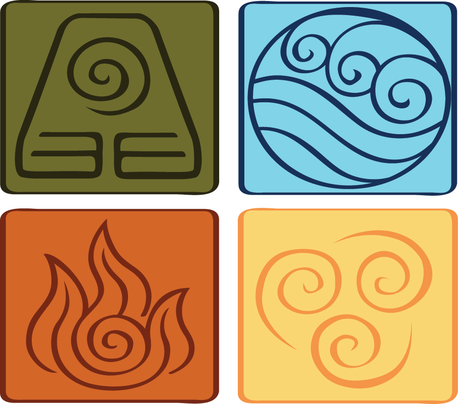

_La aclamada serie animada "Avatar: la leyenda de Aang" utiliza espirales (y un
trisquel) en cada uno de los símbolos que representan a los cuatro elementos_

_La aclamada serie de animación japonesa "Gurren Lagann" utiliza espirales como
elemento simbólico principal_

Incluso la galaxia en la que vivimos, la Vía Láctea, fue transformada en una
espiral en el año 1985 para mostrar el amor que le tenemos al símbolo:

Hablando en serio, ¿no es fascinante? Por milenios venimos haciendo espirales y
hace relativamente poco descubrimos que el lugar donde se encuentra nuestro
sistema solar dando vueltas no es más que una espiral astronómicamente gigante.

## Símbolos de reproducción

Dejemos atrás el pasado. Hablemos de símbolos modernos.

¿Por qué el símbolo de "play" o "reproducir" es un
triángulo?[4](#note-4) ¿Por qué el de pausa son dos "palitos"?

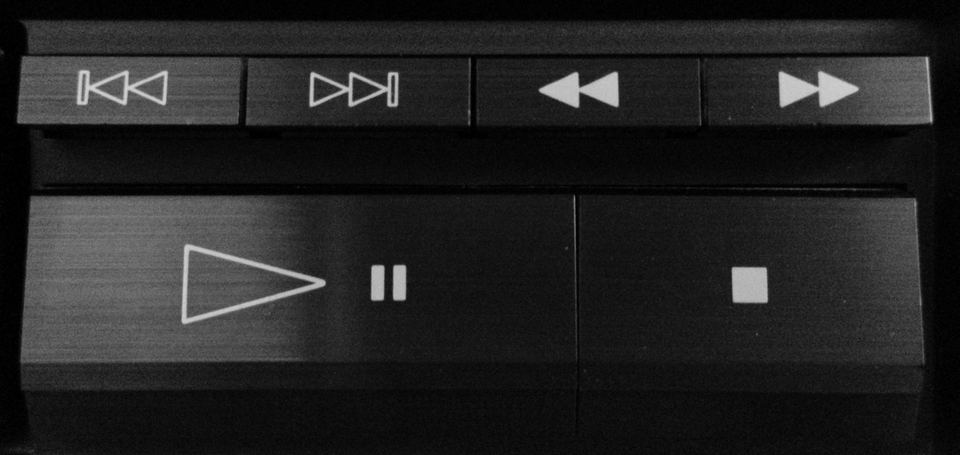

No parece haber una respuesta definitiva o siquiera un origen concreto del cual
hayan surgido estos símbolos. Wikipedia cita como fuente principal... un
[hilo](https://boards.straightdope.com/t/origin-of-play-stop-pause-etc-buttons/473426)
en un foro random de internet.

Lo que sí parece ser cierto es que:

- Surgieron eventualmente, no fueron producto de una sola empresa u asociación.
  El tiempo los fue moldeando.

- Los primeros casos donde se usaron símbolos como estos fueron en dispositivos
  grabación y reproducción allá por la década del 60.

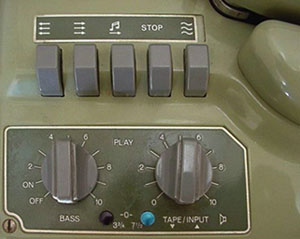

_Botones de una grabadora Revox C36 (ca. 1960), donde predominantemente se usan
flechas en los símbolos._

- Estos dispositivos eran de tipo "reel-to-reel", que usaban cinta magnética
  para almacenar el sonido.

_Una grabadora reel-to-reel_

- En base a esto, se supone que el símbolo de play (▶) se adoptó para indicar la
  dirección en la que se movería la cinta al reproducirla.

- Una vez adoptado el símbolo de play, los de "rebobinar" (rewind ⏪︎) y "avance
  rápido" (fastforward ⏩︎) surgieron siguiendo la misma lógica.

- Por mucho tiempo se usaba STOP para el símbolo de pausa (⏸)

- El símbolo de "grabar" (⏺) (generalmente en rojo) surgió tomando como
  inspiración de otros escenarios, como la luz roja que se usaba en las radios
  para indicar que se estaba transmitiendo en vivo.

¿Y el origen del símbolo de pausa? No se sabe bien. Algunos dicen que quizás
surgió basándose en el símbolo
[caesura (//)](https://en.wikipedia.org/wiki/Caesura), que en la teoría musical
representa una pausa silenciosa.

<Note noteIndex="4">
  Hace unos meses me surgió la pregunta "¿de dónde salieron los símbolos play y
  pausa?" y pensé que era un tema interesante para hacer un post. Cuando busqué
  información para responder la pregunta, me pareció medio aburrido y que no
  daba para hacer un post solo sobre eso. Eventualmente esa pregunta me llevó a
  pensar sobre símbolos en general.
</Note>

## Bonus: palos mensajeros

Los aborígenes australianos usaban palos o bastones de madera como dispositivo
para comunicarse entre ellos. Los palos tenían marcas o inscripciones talladas
en los mismos.

El funcionamiento era el siguiente: un remitente quería mandar un mensaje a
larga distancia. Para esto, designaba a alguien como mensajero, y luego tomaba
un palo y empezaba a tallarlo explicando como cada uno de los símbolos se
relacionaba con el mensaje. El mensajero luego llevaba el palo hasta el
destinatario y reproducía el mensaje de forma oral mientras apuntaba a las
marcas correspondientes.

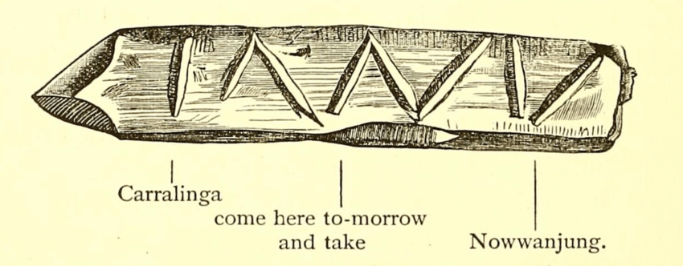

Lo cual es una linda conexión con esa nota en la que digo que, probablemente,
venimos haciendo símbolos en madera mucho antes que en piedra u otros
materiales, solo que la madera se degrada y no nos deja evidencia alguna.

## Bonus bonus: un símbolo de peligro que sea entendible por siempre

La energía nuclear es algo bueno, pero los desechos radiactivos no tanto.
Actualmente la mejor solución que tenemos para "deshacernos" de ellos es...
meterlos bajo tierra lo suficientemente profundo y rezar para encontrar mejores
soluciones en el futuro.

Uno de los problemas asociados con esto es, ¿cómo creás un símbolo que
signifique "peligro" y que sea fácilmente reconocible por miles de años? No
queremos causarle daño a futuros humanos que se puedan llegar a encontrar con
una cueva rica en radioactividad.

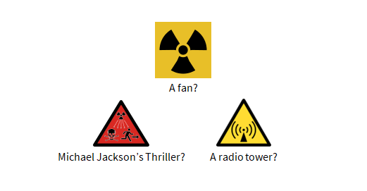

Este es el campo de estudio de la semiótica nuclear. Hay varios ejemplos en
internet, algunos son propuestas oficiales, otros son más que nada para entender
el concepto. Estos dos me parecen graciosos:

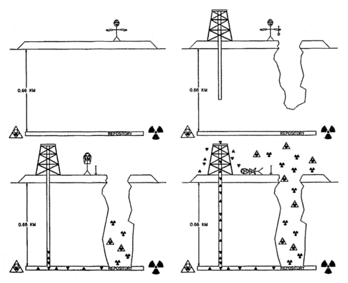

## BONUS bonus bonus: ¿y otros símbolos?

Bueno eso es parte de lo entretenido del tema. Hay infinidad de símbolos que
usamos y que tienen un trasfondo interesante.

Por ejemplo, ¿por qué la iglesia católica usa una cruz...? Parece un símbolo muy
raro y arbitrario para representar una religión. ¿Cuál será la historia detrás
de eso? ¿Se copiaron del Ankh egipcio? NECESITAMOS RESPUESTAS.

## Referencias

https://www.nytimes.com/2018/09/12/science/oldest-drawing-ever-found.html

https://www.nationalgeographic.com/science/article/news-ancient-humans-art-hashtag-ochre-south-africa-archaeology

https://pmc.ncbi.nlm.nih.gov/articles/PMC12916292/

https://www.nature.com/articles/s41586-025-09968-y

https://www.pearsonhighered.com/assets/samplechapter/0/2/0/5/0205744222.pdf

https://www.pnas.org/doi/10.1073/pnas.2520385123

https://bravenewwords.info/2026/03/20/thoughts-on-humans-40000-y-ago-developed-a-system-of-conventional-signs/

https://printinghistory.org/arrow/

https://www.newberry.org/blog/finger-pointing

https://www.pixartprinting.co.uk/blog/pictograms-history/

https://gizmodo.com/the-secret-histories-of-those-ing-computer-symbols-5612630

https://ux.stackexchange.com/questions/41434/why-is-the-record-icon-always-round-and-usually-red

https://en.wikipedia.org/wiki/Arrow_(symbol)

https://en.wikipedia.org/wiki/Spiral

https://en.wikipedia.org/wiki/Swastika

https://en.wikipedia.org/wiki/Message_stick

https://messagesticks.com.au/about/what-are-message-sticks/

https://en.wikipedia.org/wiki/Long-term_nuclear_waste_warning_messages
