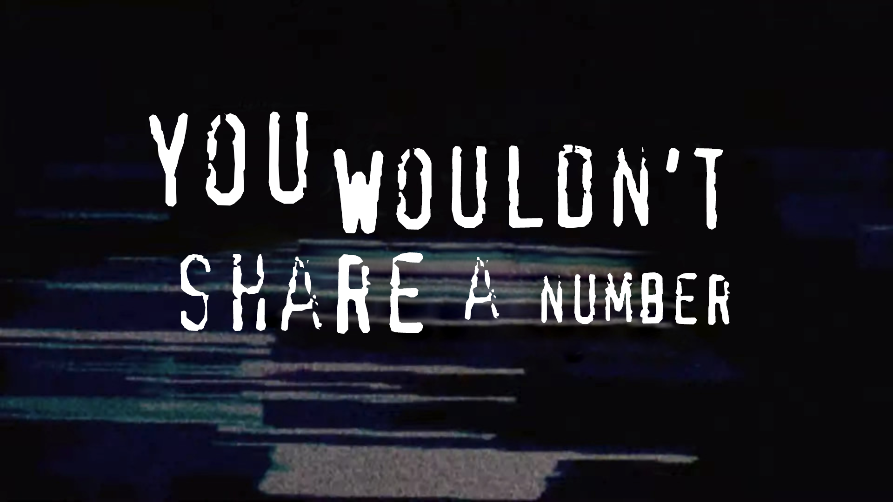
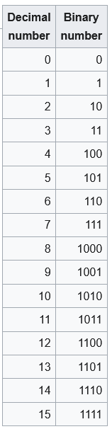
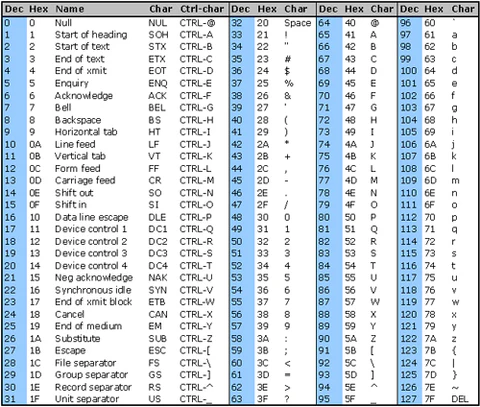
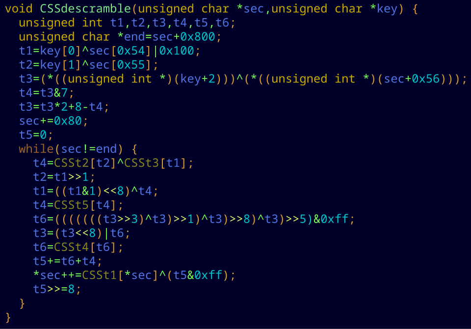
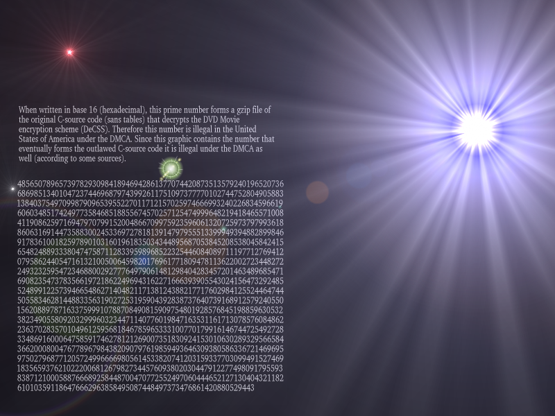
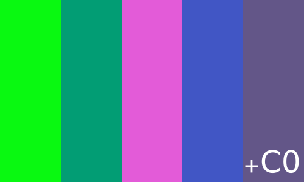

import { VideoEmbed } from "@site/src/components/VideoEmbed";
import { Note } from "@site/src/components/Note";

<!-- truncate -->

## Codificación de la información

Al leer estas palabras están sucediendo cosas asombrosas en tu vida. Primero que
nada, estás perdiendo el tiempo leyendo un post de Linternita.com. Pero aún más
asombroso es que tu cerebro está recibiendo información al interpretar este
mensaje.

Es algo trivial a lo que normalmente no le prestamos atención. Pero pensá en
esto detenidamente. De alguna forma, tu cerebro es capaz de procesar aquello que
perciben tus ojos, reconocerlo como letras (o
[SÍMBOLOS](https://linternita.com/blog/simbolos)) y saber exactamente qué es lo
que significan al estar ordenadas de una forma específica.

En la rama de la psicología este proceso recibe el nombre de
[codificación](<https://en.wikipedia.org/wiki/Encoding_(memory)>), que es
básicamente eso: la habilidad que tienen nuestros cerebros de transformar
(codificar) la información que captan nuestros sentidos en algo que pueda ser
almacenado (y luego recordado) en nuestra memoria.

Como tenemos distintos sentidos, existen distintos tipos de codificación.
Actualmente estás haciendo provecho de la codificación visual. Pero si
estuviéramos hablando, harías uso de la acústica. Si pasases por una panadería y
sintieras el aroma de medialunas recién hechas, sería codificación olfativa. Y
así con el resto de los sentidos.

Pero nosotros somos humanos y tenemos mucho en común (after all), ¿pero qué pasa
con las computadoras? No hay que estar en el ámbito para saber que las
computadoras "tratan" con información (por algo alguien decidió llamarlo
"informática"), ¿pero cómo hacen para codificar datos si no tienen un cerebro
como el nuestro?

Sin profundizar demasiado... las computadoras utilizan electricidad para
funcionar. Dentro de una computadora tenés muchos componentes electrónicos que
trabajan de forma binaria[1](#note-1), es decir: la presencia de
corriente es interpretada como un "1" y la ausencia como un "0".

<Note noteIndex="1">
  ¿Por qué solo unos y ceros? ¿A nadie se le ocurrió hacer una computadora
  ternaria o cuaternaria? En realidad, sí, se experimentó con [computadoras
  ternarias](https://en.wikipedia.org/wiki/Ternary_computer) en los 60's y 70's.
  No es que estemos atados a usar electrónica binaria, pero como todo, es un
  tema de costos y simpleza. Es mucho más fácil detectar si hay corriente o no,
  que intentar interpretar distintos estados de corriente, o corriente modulada
  de alguna forma.
</Note>

Todo dato u información procesado por una computadora, en su más bajo nivel,
está representado de forma binaria. Los números decimales que manejamos a diario
se pueden representar en binario de la siguiente forma:

_Figura 1: Tabla de números decimales a binarios_

Ok, pero esos son números, y cambiar números de base es un truco matemático
simple. ¿Qué pasa con otro tipo de cosas, como las letras?

Es simple: hay que codificarlo. No hay forma de que una computadora procese la
letra A como lo hacemos nosotros. Pero... podríamos establecer un sistema en el
que la letra A sea representada por una cadena de números binarios.

Por ejemplo, podríamos decirle a la computadora que cada vez que encuentre esta
secuencia de números `100 0001`, la interprete como la letra A.

Y podríamos decirle que `100 0010` debería ser interpretado como B.

Y así con el resto de letras y símbolos que usamos, hasta terminar formando algo
como el [código ASCII](https://en.wikipedia.org/wiki/ASCII).

_Tabla ASCII, donde el código para cada símbolo se muestra en Decimal y
Hexadecimal[2](#note-2)_

<Note noteIndex="2">
  Hay que recordar que las computadoras trabajan en binario, pero para no estar
  escribiendo chillones de unos y ceros, muchas veces se representan los números
  binarios en otras bases numéricas, como decimal y hexadecimal.
</Note>

La conclusión de todo esto es que **toda información puede ser representada como
un número**.

Y algunos de esos **números** son **ilegales**.

## Lo más ilegal del mundo: "truchar" cosas

Tiempo atrás, en una época distinta, se habían empezado a usar DVDs (esos discos
que parecen un CD pero que se llaman distinto) para distribuir películas y otros
tipos de contenido multimedia.

El problema con los DVDs (y otros medios físicos) es que es relativamente fácil
hacer una copia del contenido del disco. Y si podés hacer una copia, podés
compartirla con otras personas. Lo cual representaría un problema importante
para aquellas corporaciones que estaban interesadas en vender la mayor cantidad
de DVDs posibles.

Para evitar esto, se inventaron mecanismos de protección que impedían que un
usuario común pudiese copiar el contenido de un DVD, o incluso reproducirlo si
no contabas con el dispositivo/software adecuado[3](#note-3).

<Note noteIndex="3">

Esto significaba que sí o sí necesitabas contar con un reproductor de DVD
"autorizado", o si estabas en una computadora, tenías que tener un software que
haya pagado la licencia correspondiente para poder reproducir de forma
autorizada el contenido del disco.

Pero por más que pudieras reproducirlo con un software de esos, existían trabas
que impedían que pudieras acceder al contenido directamente y copiarlo.

**Nota de la nota:** Si bien hubo otros mecanismos de protección antes de que
existiesen los DVDs, fue con ellos que entraron en auge, caaasi coincidiendo
cronológicamente con la aprobación de la
[Ley de Derechos de Autor de la Era Digital (DCMA)](https://en.wikipedia.org/wiki/Digital_Millennium_Copyright_Act)
de Estados Unidos allá por fines de la década del 90.

</Note>

### DeCSS

Pero siempre que haya un candado va a haber alguien dispuesto a intentar
abrirlo, con o sin la llave.

En 1999 se envió de forma anónima un código escrito en el lenguaje C a la lista
de correos de [LiViD](https://en.wikipedia.org/wiki/LiViD), un proyecto cuyo
objetivo era crear programas y herramientas para poder reproducir DVDs en el
sistema operativo Linux.

Este código fuente era capaz de romper el mecanismo de protección
[Content Scramble System (CSS)](https://en.wikipedia.org/wiki/Content_Scramble_System)
(el primero para los DVDs, introducido en 1996), permitiendo reproducir el
contenido del DVD en una computadora/dispositivo no autorizado. Recibió el
nombre de [DeCSS](https://en.wikipedia.org/wiki/DeCSS).

_Fragmento del código DeCSS_

Inevitablemente se esparció como un incendio patagónico y dió vueltas por
internet, siendo publicado en sitios como [dvd-copy.com](https://dvd-copy.com),
[www.2600.com](https://www.2600.com), y utilizado en distintos softwares de
reproducción de DVDs.

Esto no le gusto para nada a los estudios cinematográficos, y ocho de ellos
(_Universal, Paramount, Metro-Goldwyn-Mayer, Tristar Pictures, Columbia
Pictures, Time Warner Entertainment, Disney, y Twentieth Century Fox_) se
juntaron en banda para llorarle a papi estado que había gente rompiendo la
nuevísima y flamante ley DCMA y haciéndoles perder plata. Pedían que se
detuviese la distribución y el uso del código, además de solicitar
indemnizaciones por el daño económico causado.

Las cortes fallaron a favor de las grandes corporaciones capitalistas, para el
enojo y decepción de los defensores que argumentaban que el código fuente en sí
debería estar protegido bajo el derecho constitucional de libertad de expresión.
Es decir: el código no debería ser ilegal, sino el acto de utilizarlo para
evadir las protecciones.

El fallo solo contemplaba el código fuente en sí, y como dice el sitio
[Gallery of CSS Descramblers](https://www.cs.cmu.edu/~dst/DeCSS/Gallery/):

> Si un código que puede compilarse y ejecutarse directamente puede ser
> censurado en virtud de la DMCA, como afirma el juez Kaplan en su fallo
> preliminar, pero una descripción textual del mismo algoritmo no puede ser
> censurada, entonces, ¿dónde exactamente debería trazarse la línea?

En forma de protesta se empezaron a publicar y compartir versiones de DeCSS
representadas en distintas formatos. Descripciones del algoritmo en inglés,
imágenes con esteganografía aplicada, grabaciones de audio donde se lee el
código en voz alta...

...y como mencionamos con anterioridad en este post: **toda información puede
ser representada como un número**, así que alguien se las arregló para
representar el código de DeCSS como un número primo:

  
CUIDADO: CONTENIDO ILEGAL

4856507896573978293098418946942861377074420873513579240196520736
6869851340104723744696879743992611751097377770102744752804905883
1384037549709987909653955227011712157025974666993240226834596619
6060348517424977358468518855674570257125474999648219418465571008
4119086259716947970799152004866709975923596061320725973797993618
8606316914473588300245336972781813914797955513399949394882899846
9178361001825978901031601961835034344895687053845208538045842415
6548248893338047475871128339598968522325446084089711197712769412
0795862440547161321005006459820176961771809478113622002723448272
2493232595472346880029277764979061481298404283457201463489685471
6908235473783566197218622496943162271666393905543024156473292485
5248991225739466548627140482117138124388217717602984125524464744
5055834628144883356319027253195904392838737640739168912579240550
1562088978716337599910788708490815909754801928576845198859630532
3823490558092032999603234471140776019847163531161713078576084862
2363702835701049612595681846785965333100770179916146744725492728
3348691600064758591746278121269007351830924153010630289329566584
3662000800476778967984382090797619859493646309380586336721469695
9750279687712057249966669805614533820741203159337703099491527469
1835659376210222006812679827344576093802030447912277498091795593
8387121000588766689258448700470772552497060444652127130404321182
610103591186476662963858495087448497373476861420880529443

### AACS

El
[Advanced Access Content System (AACS)](https://en.wikipedia.org/wiki/Advanced_Access_Content_System)
es otro mecanismo de protección anti-copia para los DVDs que apareció en el
nuevo milenio, allá por 2005.

La historia es muy similar a lo que pasó con CSS, pero en este caso lo que se
filtró no fue un código capaz de derrotar al mecanismo, sino una de las claves
criptográfica que podían usarse para descifrar el contenido del disco.

Esta clave en sí no es más que un número de 128 dígitos binarios, que en
hexadecimal se puede representar como:
`09 F9 11 02 9D 74 E3 5B D8 41 56 C5 63 56 88 C0`.

Nuevamente, interesados en preservar el flujo de dinero hacia sus bolsillos
empezaron a patalear, demandando que la clave dejase de compartirse y amenazando
a cualquier sitio o persona que la publicase en internet.

...produciendo el efecto contrario y haciendo que más gente lo publicase por
todas partes, incluso representándolo de diversas formas al igual que había
pasado años atrás con DeCSS.

_Clave filtrada de AACS representada como colores RGB_

### PlayStation 3

Ok esto no es un DVD pero está relacionado con el tema y no quiero hacer una
sección aparte solo para esto.

Un par de años después, en 2011, pasó algo muy similar con la PlayStation 3.
Básicamente se filtró esta clave:

`C5 B2 BF A1 A4 13 DD 16 F2 6D 31 C0 F2 ED 47 20 DC FB 06 70`

Que permitía que pudieras jugar cualquier juego por más que no tengas una copia
original.

Sony demandó a la [persona](https://en.wikipedia.org/wiki/George_Hotz) que
filtró la clave, llegando a un acuerdo en el que el tipo se comprometía a nunca
más intentar "hackear" un producto de la empresa.

## ¿Son realmente ilegales?

Hay una [respuesta en StackOverflow](https://stackoverflow.com/a/4856155) que
dice lo siguiente:

> El hecho de que algo como el código DeCSS sea también un valor ordinal que
> representa un número entero entra en conflicto con la idea de que sea ilegal.
> Al fin y al cabo, ¿cómo puede ser ilegal el concepto abstracto de un número
> entero específico? El término «número ilegal» es un oxímoron que pretende
> señalar que las leyes se extralimitan al intentar controlar artefactos humanos
> que coinciden con conceptos abstractos. Lo que se puede sancionar es el acto
> de descifrar DVD, no la posesión o el conocimiento de un número entero en la
> recta numérica.

Así que quizás no sea un delito publicar o conocer el número en sí. Peeero...
¿vos te animarías a ser demandado por Sony por publicar un
número?[4](#note-4)

<Note noteIndex="4">
  Si la PS5 tuviera juegos, podrías jugarlos pirateados con el siguiente número:
  718281828459045235360287471352662497757247093699959574966
  967627724076630353547594571382178525166427427466391932003059
  921817413596629043572900334295260595630738132328627943490763
  233829880753195251019011573834187930702154089149934884167509
  244761460668082264800168477411853742345442437107539077744992
  069551702761838606261331384583000752044933826560297606737113
  200709328709127443747047230696977209310141692836819025515108
  657463772111252389784425056953696770785449969967946864454905
  987931636889230098793127736178215424999229576351482208269895
  193668033182528869398496465105820939239829488793320362509443
  117301238197068416140397019837679320683282376464804295311802
  328782509819455815301756717361332069811250996181881593041690
  351598888519345807273866738589422879228499892086805825749279
  610484198444363463244968487560233624827041978623209002160990
  235304369941849146314093431738143640546253152096183690888707
  016768396424378140592714563549061303107208510383750510115747
  704171898610687396965521267154688957035035402123407849819334
  321068170121005627880235193033224745015853904730419957777093
  503660416997329725088687696640355570716226844716256079882651
  787134195124665201030592123667719432527867539855894489697096
  409754591856956380236370162112047742722836489613422516445078
  182442352948636372141740238893441247963574370263755294448337
  998016125492278509257782562092622648326277933386566481627725
  164019105900491644998289315056604725802778631864155195653244
  258698294695930801915298721172556347546396447910145904090586
  298496791287406870504895858671747985466775757320568128845920
  541334053922000113786300945560688166740016984205580403363795
  376452030402432256613527836951177883863874439662532249850654
  995886234281899707733276171783928034946501434558897071942586
  398772754710962953741521115136835062752602326484728703920764
  310059584116612054529703023647254929666938115137322753645098
  889031360205724817658511806303644281231496550704751025446501
  172721155519486685080036853228183152196003735625279449515828
  418829478761085263981395599006737648292244375287184624578036
  192981971399147564488262603903381441823262515097482798777996
  437308997038886778227138360577297882412561190717663946507063
  304527954661855096666185664709711344474016070462621568071748
  187784437143698821855967095910259686200235371858874856965220
  005031173439207321139080329363447972735595527734907178379342
  163701205005451326383544000186323991490705479778056697853358
  048966906295119432473099587655236812859041383241160722602998
  330535370876138939639177957454016137223618789365260538155841
  587186925538606164779834025435128439612946035291332594279490
  433729908573158029095863138268329147711639633709240031689458
  636060645845925126994655724839186564209752685082307544254599
  376917041977780085362730941710163434907696423722294352366125
  572508814779223151974778060569672538017180776360346245927877
  846585065605078084421152969752189087401966090665180351650179
  250461950136658543663271254963990854914420001457476081930221
  206602433009641270489439039717719518069908699860663658323227
  870937650226014929101151717763594460202324930028040186772391
  028809786660565118326004368850881715723866984224220102495055
  188169480322100251542649463981287367765892768816359831247788
  652014117411091360116499507662907794364600585194199856016264
  790761532103872755712699251827568798930276176114616254935649
  590379804583818232336861201624373656984670378585330527583333
  793990752166069238053369887956513728559388349989470741618155
  012539706464817194670834819721448889879067650379590366967249
  499254527903372963616265897603949857674139735944102374432970
  935547798262961459144293645142861715858733974679189757121195
  618738578364475844842355558105002561149239151889309946342841
  393608038309166281881150371528496705974162562823609216807515
  017772538740256425347087908913729172282861151591568372524163
  077225440633787593105982676094420326192428531701878177296023
  541306067213604600038966109364709514141718577701418060644363
  681546444005331608778314317444081194942297559931401188868331
  483280270655383300469329011574414756313999722170380461709289
  457909627166226074071874997535921275608441473782330327033016
  823719364800217328573493594756433412994302485023573221459784
  328264142168487872167336701061509424345698440187331281010794
  512722373788612605816566805371439612788873252737389039289050
  686532413806279602593038772769778379286840932536588073398845
  721874602100531148335132385004782716937621800490479559795929
  059165547050577751430817511269898518840871856402603530558373
  783242292418562564425502267215598027401261797192804713960068
  916382866527700975276706977703643926022437284184088325184877
  047263844037953016690546593746161932384036389313136432713768
  884102681121989127522305625675625470172508634976536728860596
  675274086862740791285657699631378975303466061666980421826772
  456053066077389962421834085988207186468262321508028828635974
  683965435885668550377313129658797581050121491620765676995065
  971534476347032085321560367482860837865680307306265763346977
  429563464371670939719306087696349532884683361303882943104080
  029687386911706666614680001512114344225602387447432525076938
  707777519329994213727721125884360871583483562696166198057252
  661220679754062106208064988291845439530152998209250300549825
  704339055357016865312052649561485724925738620691740369521353
</Note>

## Referencias

https://www.cs.cmu.edu/~dst/DeCSS/Gallery/

https://www.splitcc.net/Documents/decss.html

https://dvd-copy.com/

https://en.wikipedia.org/wiki/Universal_City_Studios,_Inc._v._Corley

https://en.wikipedia.org/wiki/DVD_Copy_Control_Ass%27n_v._Bunner

https://en.wikipedia.org/wiki/DeCSS

https://en.wikipedia.org/wiki/AACS_encryption_key_controversy

https://www.theguardian.com/technology/gamesblog/2011/jan/07/playstation-3-hack-ps3

https://stackoverflow.com/questions/4855972/illegal-prime-numbers-what-is-it-exactly
