import { VideoEmbed } from "@site/src/components/VideoEmbed";
import { Note } from "@site/src/components/Note";

...sin tener idea de cómo

<!-- truncate -->

## La estrella de este programa

Es un reproductor de VHS marca Sanyo, modelo VHR-6500Z, quien en la "puertita"
donde se meten los casete esboza orgullosamente tener "Fuzzy Logic"... sea lo
que sea que signifique eso.

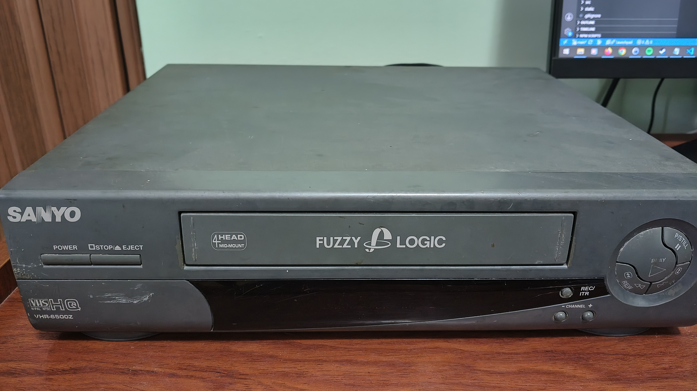

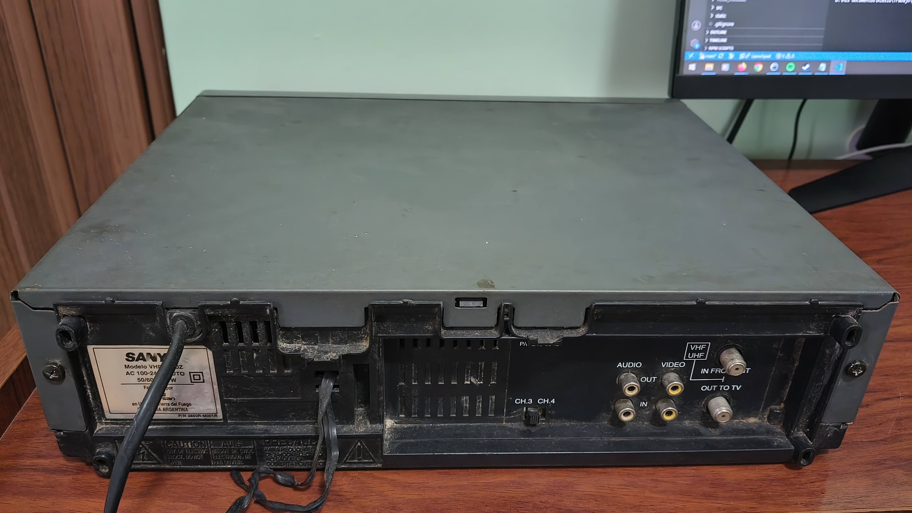

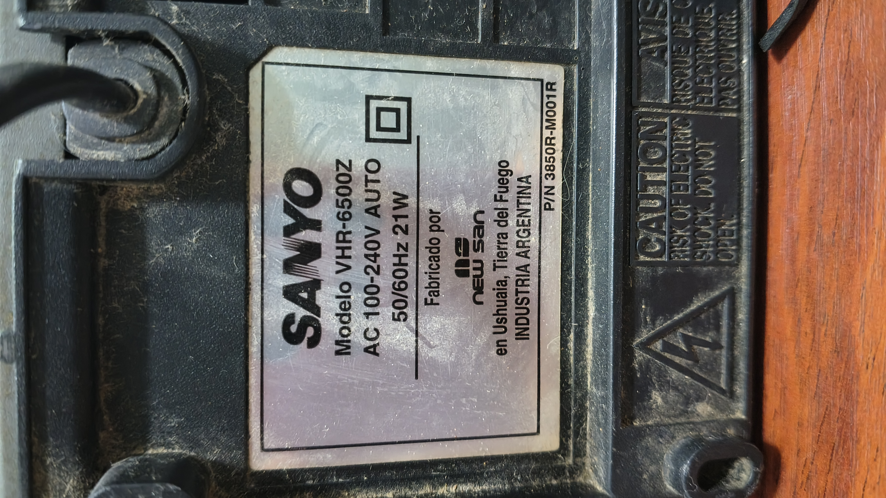

Habrá tenido mejor aspecto en el pasado, pero como se suele decir, no hay que
juzgar por las apariencias, lo que importa es lo de adentro.

En este caso, y como el título del post ya te lo anticipa, lo de adentro tampoco
está muy bien que digamos, así que podemos libremente juzgarlo y decir que es
una porquería.

Al intentar reproducir un casete, nos encontramos con los siguientes problemas:

1. **Mecanismo de eyección roto:** por más que intente varias veces, el
   reproductor no es capaz de expulsar el casete, quedándose atascado en la
   misma posición.
2. **Detector de cinta fallido:** luego de remover (forzosa y manualmente) el
   casete, el reproductor se comportaba como si tuviese uno puesto. Pero al no
   poder reproducir (porque no había nada), entraba en un bucle repetitivo
   intentando eyectar algo que no estaba ahí.
3. **Pausas en la reproducción:** cuando lograba reproducir una cinta (tras
   algunas artimañas e intervenciones de mi parte), la reproducción no era
   continúa. La cinta se reproducía unos segundos, luego se detenía por un breve
   lapso, volvía a reproducirse por unos segundos, luego se detenía por un breve
   lapso... y así.

Sin tener conocimiento alguno de cómo funciona internamente esta cosa decidí
intentar arreglarlo. ¿Para qué? Para reproducir cintas VHS... qué pregunta
tonta.

Para empezar a arreglarlo hay que remover la carcasa, que se puede lograr
desatornillando los dos tornillos que se ven en la parte trasera en la segunda
foto de este post:

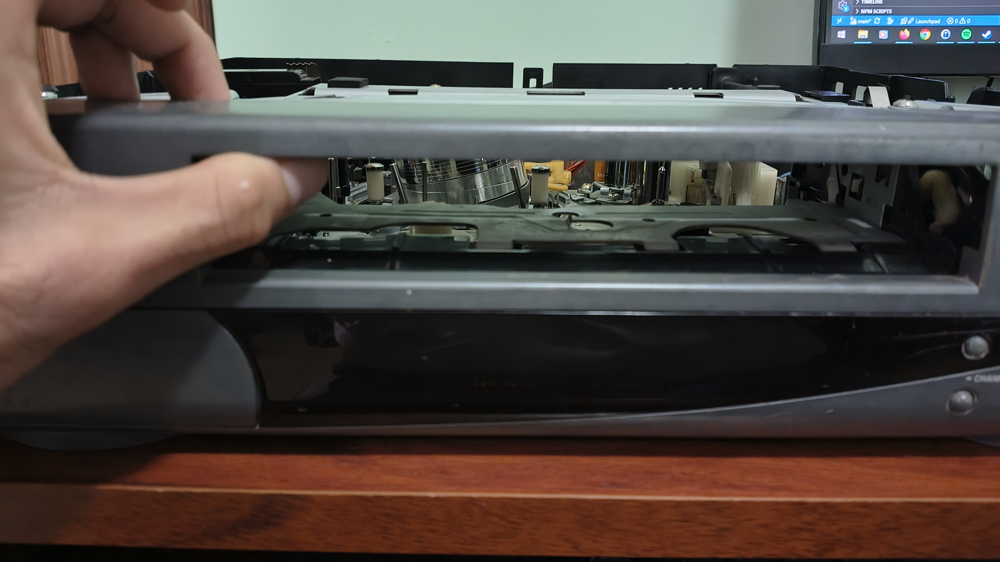

## Mecanismo de eyección

Este post va a ser medio raro porque se me ocurrió hacerlo después de haber
arreglado todas las cosas. Así que no puedo mostrar el estado roto de las
mismas. Aunque voy a intentar dar a entender el problema y mostrar una foto
"recreándolo".

Habiendo dicho eso, esto es lo que debería ocurrir normalmente cuando apretamos
el botón de eyección:

<VideoEmbed src="https://www.youtube.com/embed/uSkn02F6sso" />

En el video podemos observar cómo, antes de que el casete sea eyectado, la cinta
es recogida, y luego se eyecta. Lo cual tiene sentido, de otra forma terminarías
con un desastre de cinta toda desparramada y estirada dentro del reproductor.

¿Qué sucedía cuando estaba roto? La cinta era recogida dentro del casete, pero
el mecanismo no tenía la fuerza, o se trababa al intentar eyectarlo. El casete
quedaba cómodamente dentro del reproductor. Cada vez que encendía el mismo, el
reproductor intentaba eyectarlo en bucle unos 4 o 5 intentos, y después se
"rendía" y se apagaba.

Este video es un ejemplo demostrativo de cómo quedaba trabado el casete. En
realidad, quedaba trabado _un poco_ más abajo de lo que se muestra, pero es lo
mismo, en definitiva, el reproductor no era capaz de expulsarlo.

<VideoEmbed src="https://www.youtube.com/embed/8C9YLkmDGDE" />

Como el casete estaba trabado, solo había una posible solución, intentar
destrabarlo manualmente. Y si bien descubrí como accionar algunas partes que
producían que el casete se mueva, estaba bastante trabado.

Así que mi siguiente paso fue intentar desarmarlo. Para eso, removí los tres
tornillos que se ven en la foto:

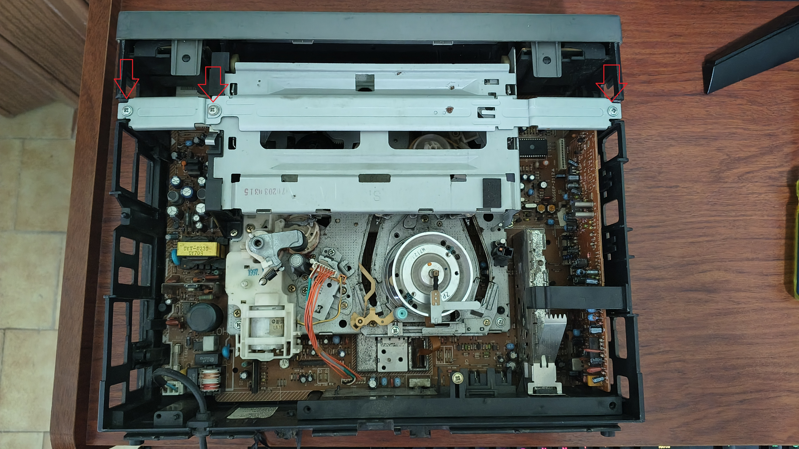

Lo cual nos deja con... esta... lámina de metal.

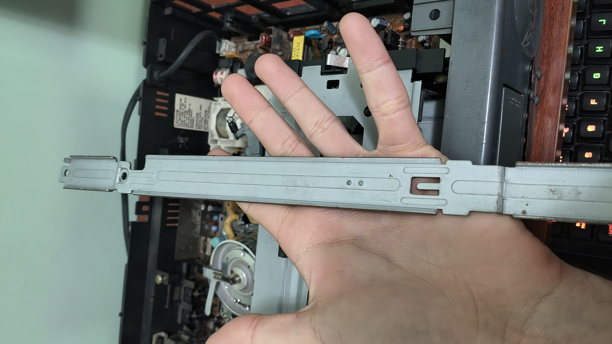

No parece cumplir otra función más que ser un soporte estructural o algo
parecido.

El mecanismo que traga y escupe los casetes está en realidad ajustado por estos
dos tornillos:

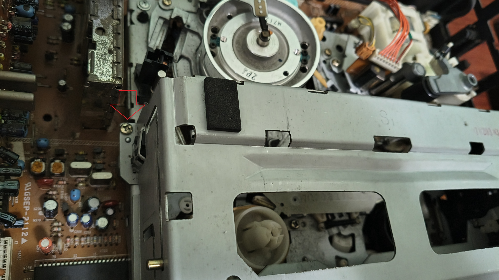

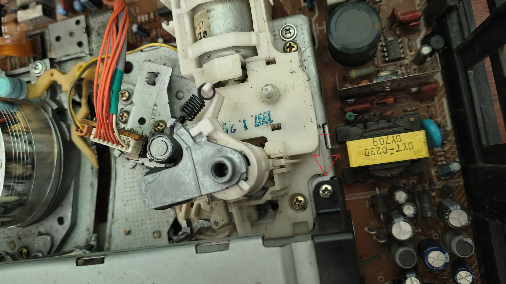

Al removerlos, podemos _cuidadosamente_ remover el mecanismo:

<VideoEmbed src="https://www.youtube.com/embed/JI-P0jb-d90" />

Removido completamente, se ve así:

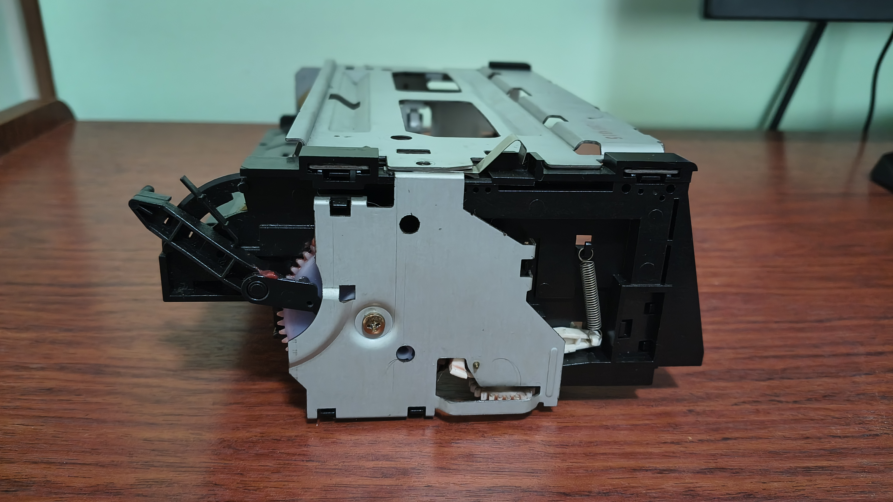

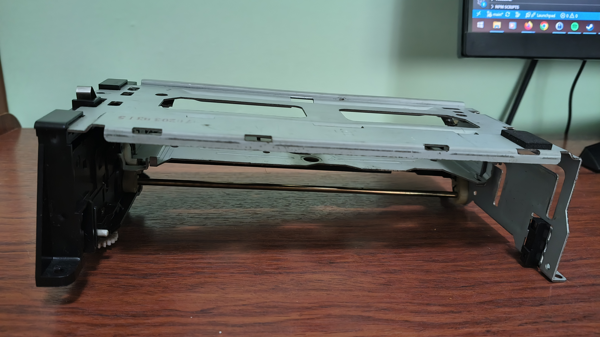

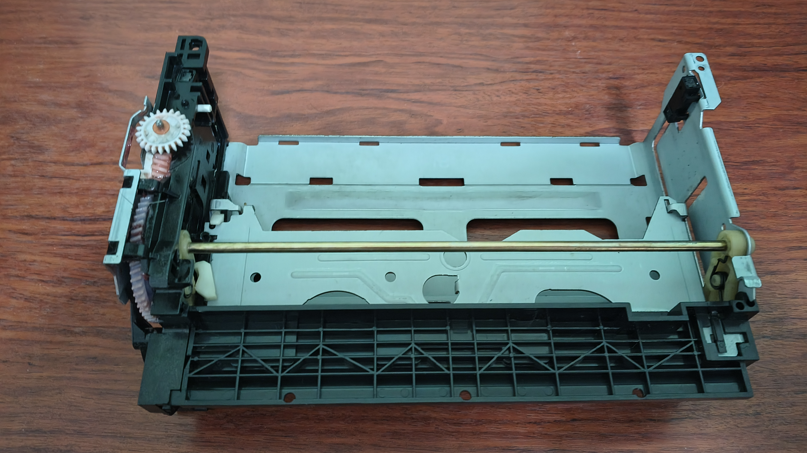

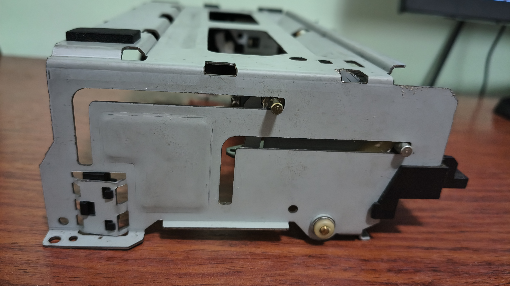

Ahora que lo tenemos suelto, podemos ver y entender más o menos cómo funciona.

<VideoEmbed src="https://www.youtube.com/embed/FAovLTBWJYI" />

Si bien en el video yo estoy moviendo el casete con las manos... podemos ver que
también se mueven unos engranajes, así que la conclusión más obvia es que cuando
el mecanismo está bien colocado dentro del reproductor, los engranajes giran
para introducir y eyectar el casete según sea necesario.

El lector avispado notará en las fotos y en el video que hay una peculiar
sustancia roja cubriendo los engranajes. Eso es grasa de litio, un lubricante
para piezas mecánicas, y fue lo que terminó solucionando el problema de
eyección.

En realidad, primero había probado con WD-40, y cuando vi que había una leve
mejora dije "por qué no ir por más", y le puse esa grasa. ¿Es el lubricante
adecuado para un sistema como este? Probablemente no. Pero ahora funciona.

## Detector de cinta fallido

Al arreglar el problema de la eyección del casete, me encontré con otro
problema: ahora el reproductor quería eyectar _siempre_.

No importa si había una cinta o no, intentaba expulsar algo todo el rato.

Ante este problema recurrí a buscar en internet. Costó un poco, porque estos
aparatos son cosas viejas y la información relevante está en lugares de nicho,
pero en uno de esos lugares leí un comentario que decía algo como: "fijate si el
sensor infrarrojo que detecta si hay una cinta o no está sucio".

DE TODO LO QUE VES ACÁ, ¿CUÁL TE PARECE QUE ES EL SENSOR INFRARROJO?

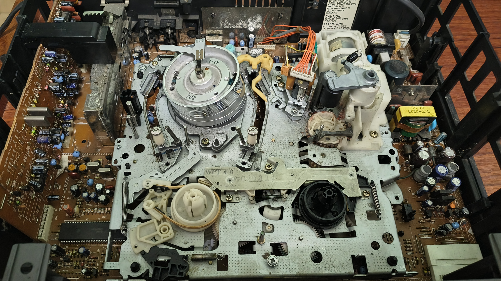

Es esta cosita de acá.

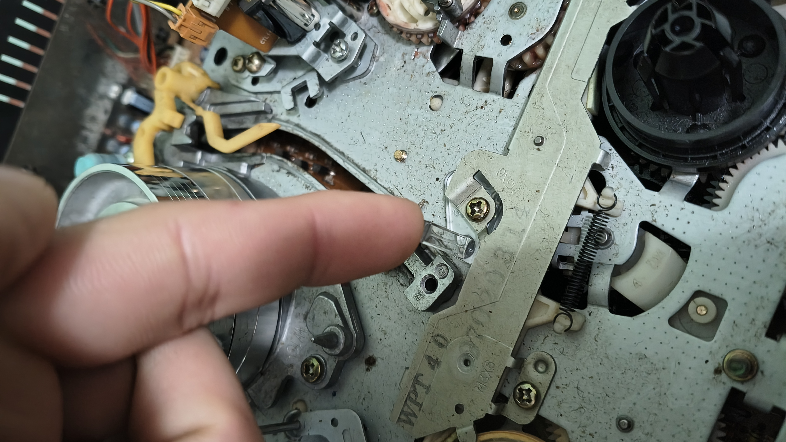

Para removerla completamente hay que sacar estos tres tornillos.

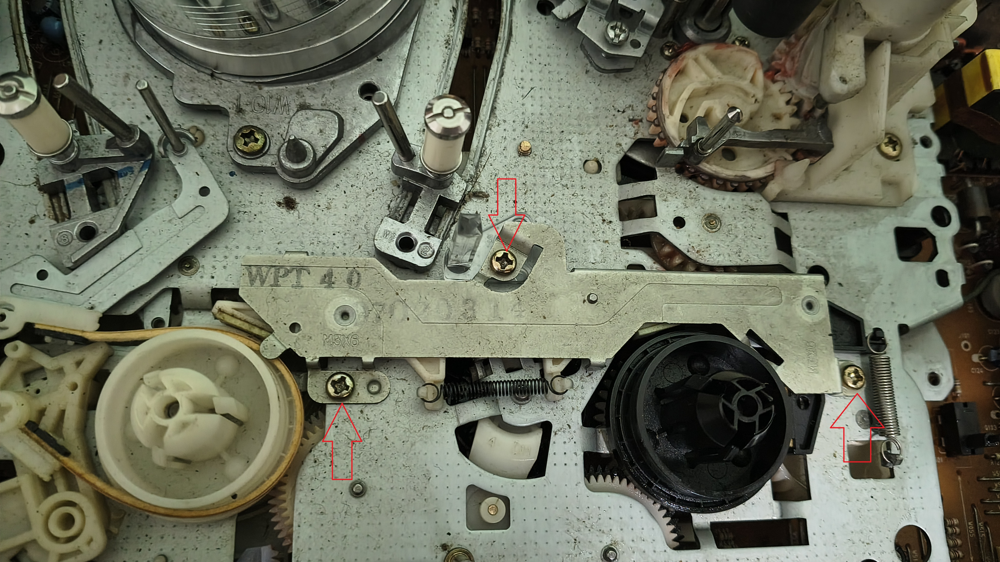

Pero ahora no lo voy a hacer porque funciona y no quiero que se vuelva a romper.
Lo que hice en su momento fue sacarla y limpiarla con un papel humedecido en
alcohol.

## Pausas en la reproducción

Habiendo solucionado ese problema... me encontré con otro. La cinta se
reproducía, pero no era algo constante. Se detenía a cada rato.

Al hacer este post, el mismo problema volvió a aparecer. Así que estás de
suerte, este video NO es una recreación:

<VideoEmbed src="https://www.youtube.com/embed/766ULENEYQI" />

Lo primero que pensé fue lo siguiente: si al mecanismo de eyección le faltaba
fuerza, entonces capaz también le esté faltando fuerza para poder girar los
engranajes que hacen que la cinta avance.

Entonces procedí a engrasar todo engranaje que vi dentro del reproductor.

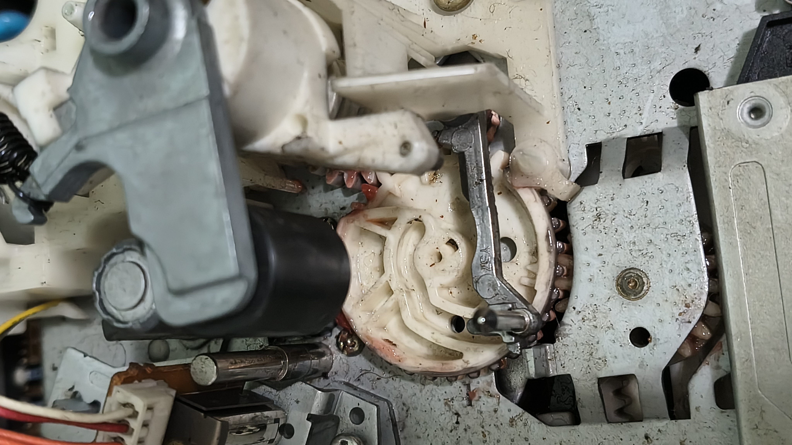

GRAVE ERROR. ME PASÉ DE GRASA. LOS ENGRANAJES NO HACÍAN CONTACTO. GIRABAN Y
GIRABAN SIN QUE SUS DIENTES COLISIONASEN. LA CINTA NO SE MOVÍA EN ABSOLUTO.

Después de agarrarme la cabeza y putearme por un buen rato por intentar arreglar
algo como esto, intenté solucionar mis propios problemas. Me anoté a un
psicólogo y ya llevo semanas de terapia. Mi vida nunca estuvo m

Quiero decir, agarré un hisopo y papel, y con mucha paciencia fui removiendo la
grasa de los engranajes.

Con eso logré volver al estado anterior sin mayores consecuencias.

El siguiente paso fue averiguar un poco más sobre cómo funcionan estas máquinas.
Ahí descubrí que los reproductores de VHS más antiguos tienen una correa que se
usa para transmitir la fuerza del motor a las diferentes partes mecánicas.

Estas correas están hechas de goma o algún material similar, y con el tiempo o
bien se degradan, o se terminan alargando de más y perdiendo tensión.

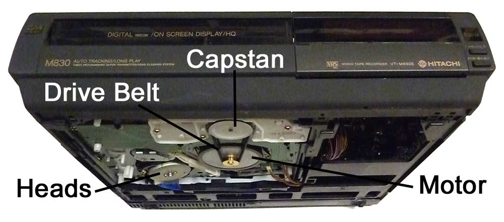

Para ver la correa hay que... levantar toda la parte mecánica. Afortunadamente
eso solo conlleva remover 4 tornillos y tener SUMO CUIDADO CON EL CABLE
FLEXIBLE. ODIO esos cables, se rompen por nada, y en este caso es _sumamente_
importante. Si se rompe ese cable, por más que arregle la parte mecánica no iba
a poder reproducir nada.

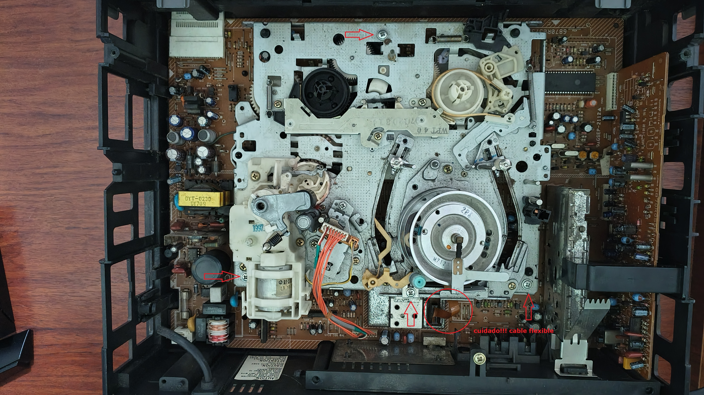

Una vez sacados los tornillos, lo que hay que hacer es un poco de fuerza hacia
arriba y la parte mecánica debería soltarse:

<VideoEmbed src="https://www.youtube.com/embed/JWJw3EhqTds" />

Eso nos da acceso a la correa y algunos engranajes.

La correa se ve bien, no parece estar muy floja ni desintegrándose. De todas
formas, para poner a prueba mi teoría agarré un par de banditas elásticas que
tenía y las usé como reemplazo de la correa original.

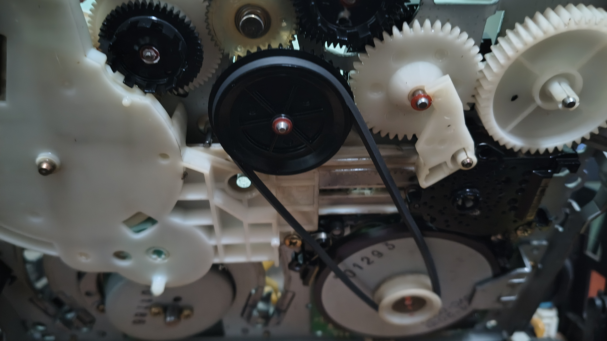

Esto es algo que todos dicen que no hay que hacer, no porque se vaya a romper
algo, sino porque las correas están hechas a medida y una bandita elástica no es
lo mismo y blablablabla.

En fin, la bandita elástica quedaba bien tensa y todo parecía funcionar
idénticamente. Así que hice la prueba y

el problema persistía.

Así que no era un problema de fuerza como presumía. Teoría descartada.

Busqué más información sobre problemas comunes con reproductores de VHS, y uno
de ellos es que los "cabezales" estén sucios. Los cabezales están dentro del
tambor, que es esta cosa redonda que gira rápido cuando hay una cinta:

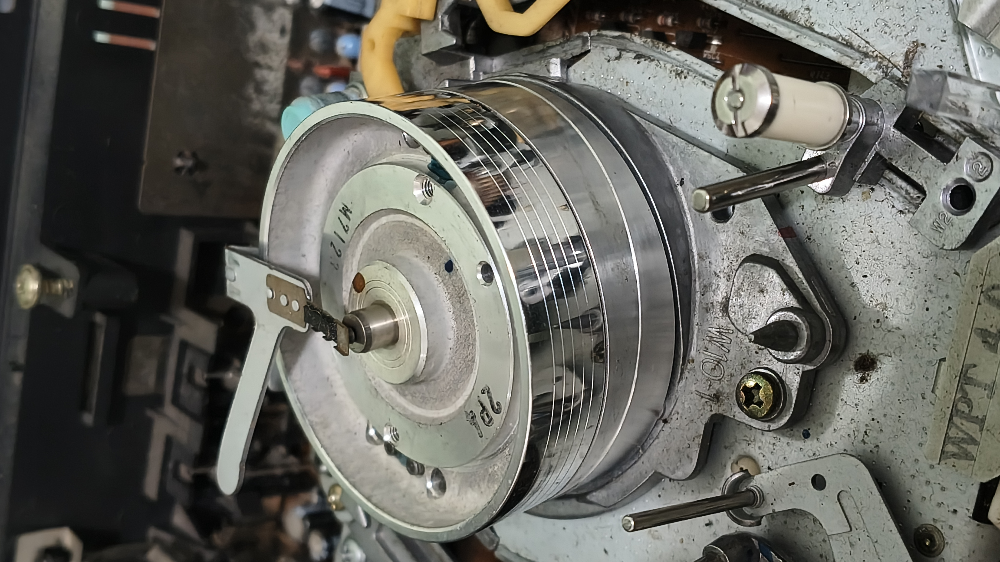

A lo largo del tambor hay unos "huequitos", cada huequito es un cabezal. Cuando
están sucios, tienen problemas para leer la cinta, y puede causar fallas en el
video u audio.

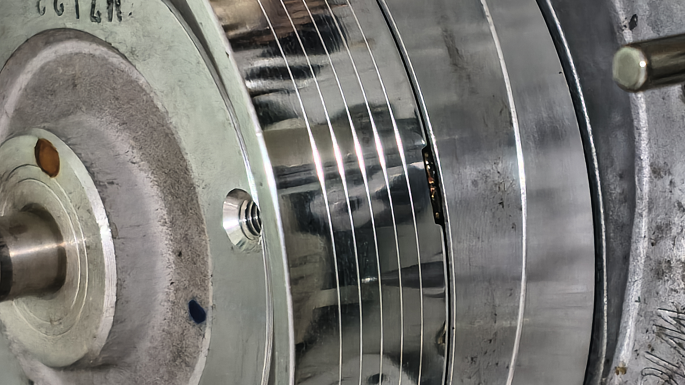

La forma de limpiarlos es humedeciendo un papel en alcohol (isopropílico, aunque
yo siempre uso el etílico porque soy pobre), presionarlo sobre el tambor y girar
el mismo continuamente. Repetir hasta que no queden marcas de mugre en el papel.

Uno podría verse tentado a usar un hisopo, pero esto sí que no es recomendado
para nada, porque el hisopo puede desprender pedacitos de algodón que queden en
el cabezal, y el cabezal es evidentemente una pieza muy sensible.

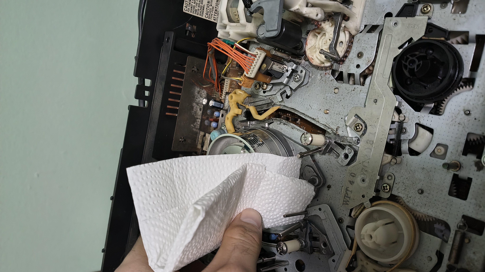

Aprovechando que el problema volvió a aparecer, voy a hacer algo que no había
hecho cuando arreglé esto: remover esta cosa celeste.

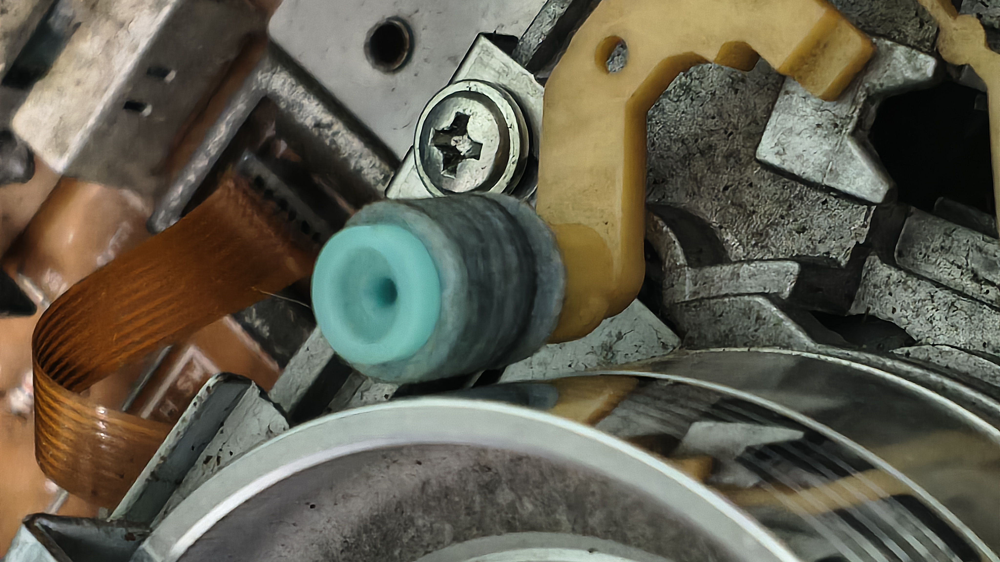

Aparentemente, la función de esa cosa celeste es limpiar los cabezales. Hace
contacto con el tambor cada vez que se ingresa o se eyecta una cinta. Con el
tiempo se ensucia demasiado y termina siendo contraproducente. Vi como
recomendación removerla.

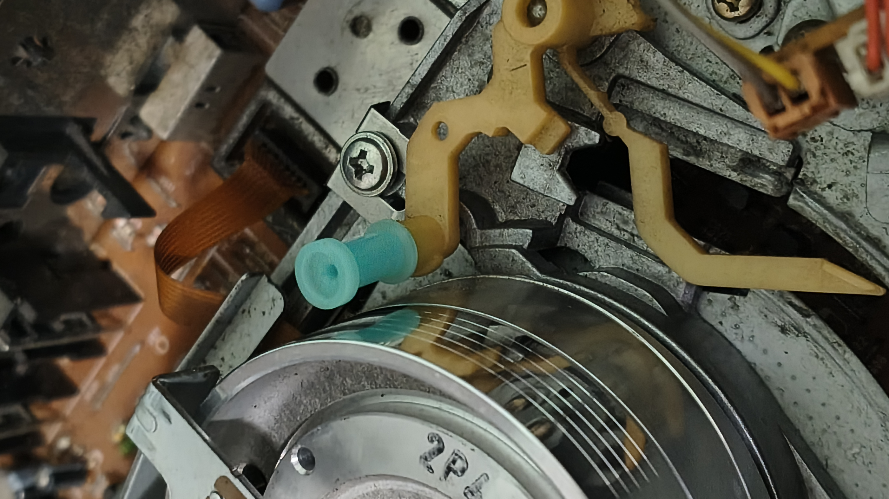

Así que ahora hice eso, limpié nuevamente los cabezales, y

el problema persiste.

## Usando un SDR para escuchar el audio de la cinta

Juro por Linternita que estaba arreglado. No sé si al desarmarlo para hacer este
post lo volví a romper o qué. Pero no importa, terminemos este post en una nota
interesante.

La mejor forma de probar si tu reproductor de VHS funciona es conectarlo a una
televisión de las viejas, esas de tubo.

Yo tengo una. Pero está guardada. Y pesa mucho. Y no la quiero sacar. Debería.
Pero no quiero. Total esto se volvió a romper otra vez así que ahora me dan
menos ganas. A menos que lo arregle. Pero igual. Pesa mucho.

Peeeeeeeeero!!

Estos aparatos venían con salida RF (radio-frecuencia): una salida por la cual
se envían ondas de radio que tienen una frecuencia de muchos megahertz. Explicar
el porqué de esto es contenido para otro post, pero resumidamente, la
"televisión" por mucho tiempo fue transmitida a través de ondas de radio. Para
"ver" un canal tenías que sintonizar una frecuencia dada.

Este reproductor de VHS, en su salida RF, es capaz de emitir señales en la
frecuencia del canal 3 o del canal 4.

Y un SDR es un aparatito que es capaz de capturar esas frecuencias. Así que en
teoría podríamos captar el audio y video de la cinta.

En este caso solo el audio porque mi SDR no se la banca para video. Pero si
tenés un aparato mejor podrías hacer ambas cosas.

El procedimiento es muy sencillo: conectamos una de las puntas de un cable
coaxial a la salida de RF que dice "OUT TO TV"...

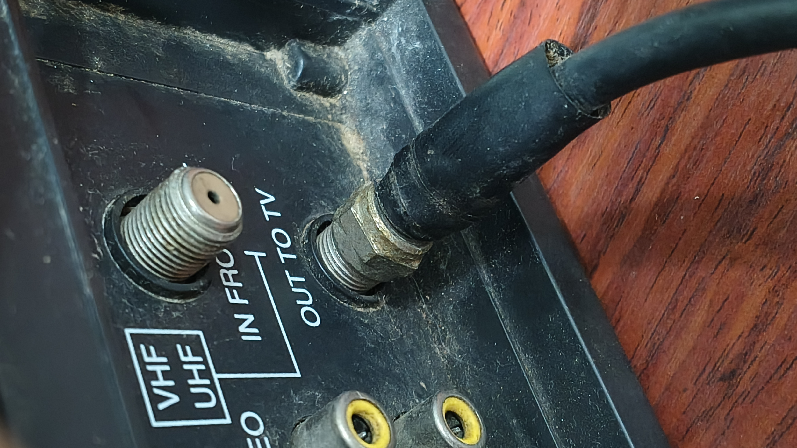

Y la otra a nuestro SDR...

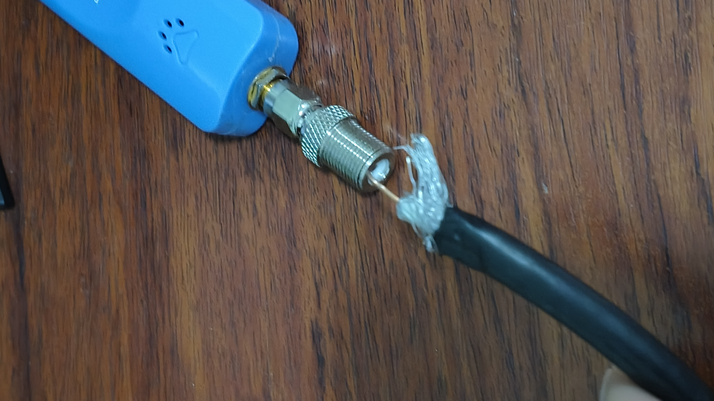

No te preocupes. Los conectores son un invento capitalista. Las señales se
transmiten igual.

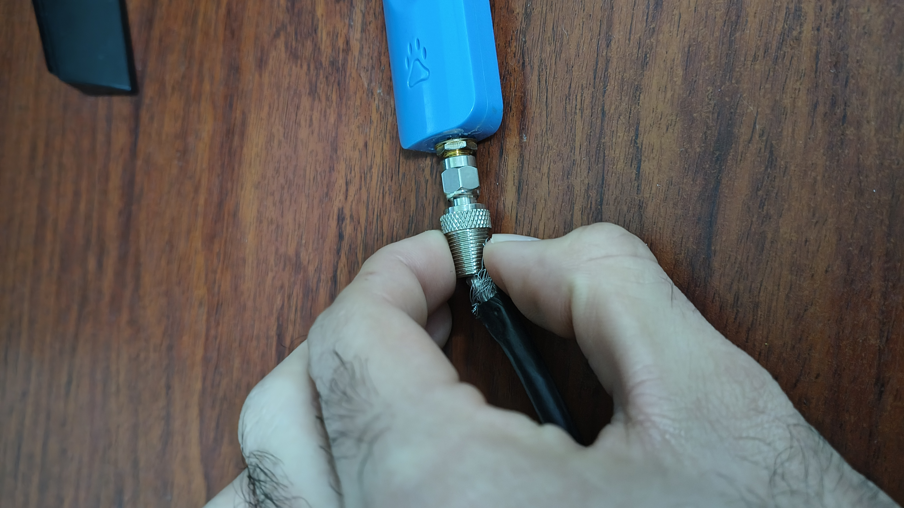

Me deberían llamar ingeniero en telecomunicaciones.

Después abrimos nuestro programa de SDR favorito, y buscamos alguna señal de
audio cerca de las frecuencias de los canales 3 y 4, y si tenemos suerte podemos
disfrutar de Una Navidad con Mickey de la peor forma posible:

<VideoEmbed src="https://www.youtube.com/embed/F86_pPszDdY" />

O de un documental sobre la Tierra:

<VideoEmbed src="https://www.youtube.com/embed/DvYYzAud0ZY" />

## Notas finales

Me parece fascinante toda la mecánica involucrada en estos aparatos. Hoy en día
nos alejamos de soluciones así, lo cual está bien y tiene todo el sentido, pero
siento que estas soluciones que involucran mover piezas delicadamente tienen su
sofisticación y elegancia.

Bueno, hasta que se rompen y no sabés bien por qué. Si alguien sabe cómo
arreglarlo definitivamente por favor que me avise.

SALUDOS CORDIALES,

LINTERNITA.
