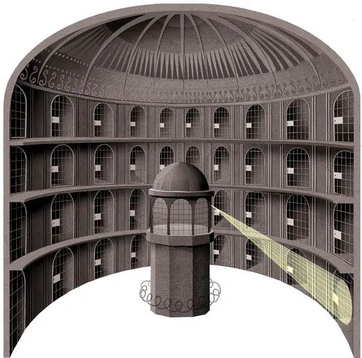
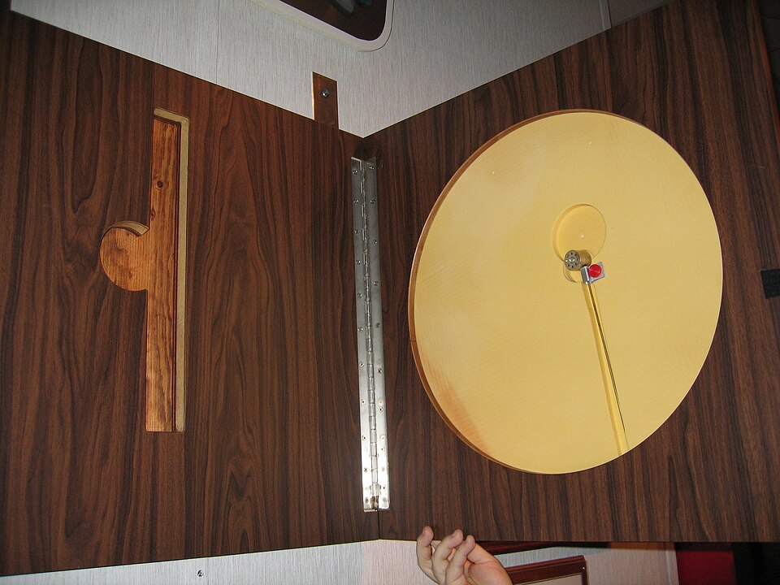
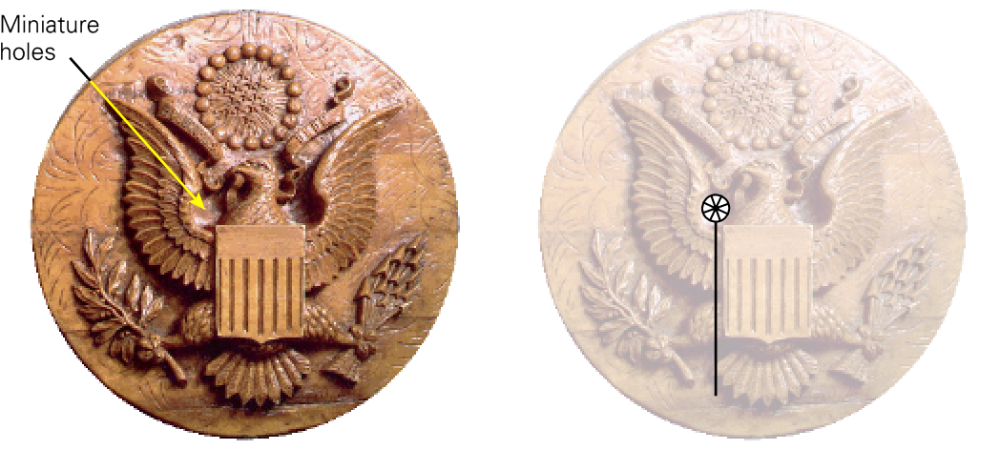
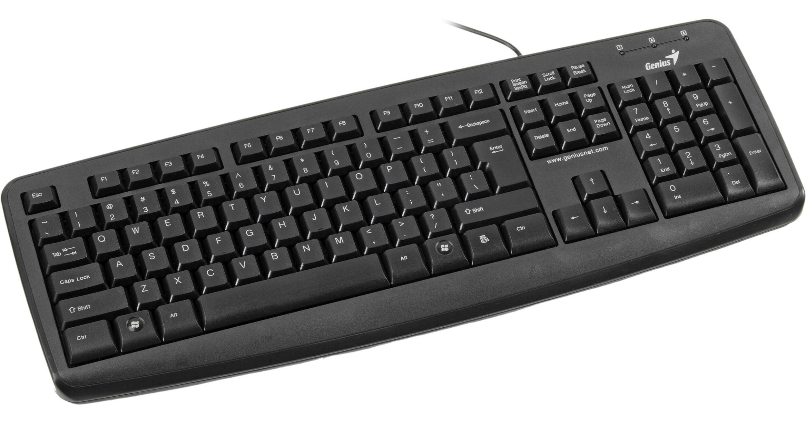
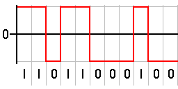
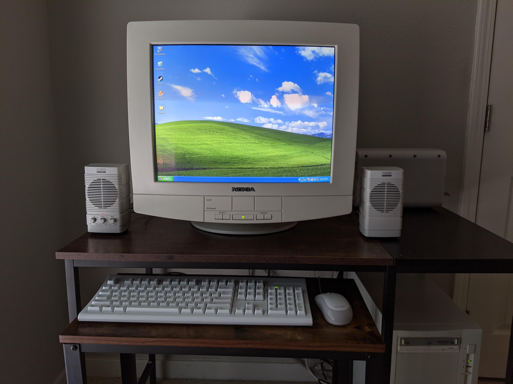
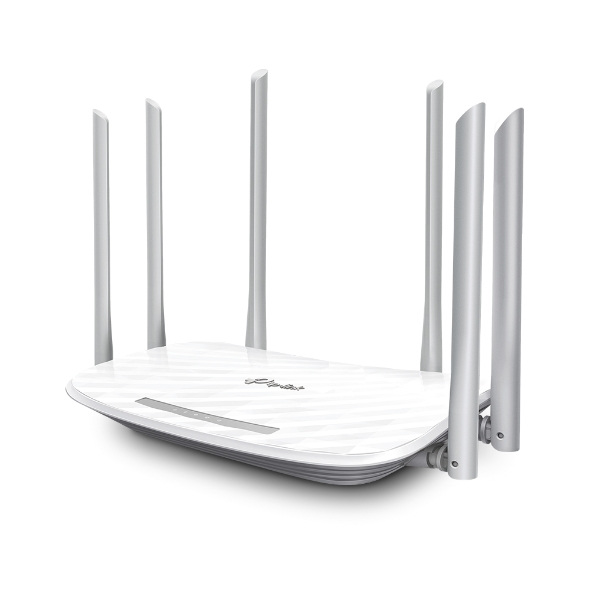
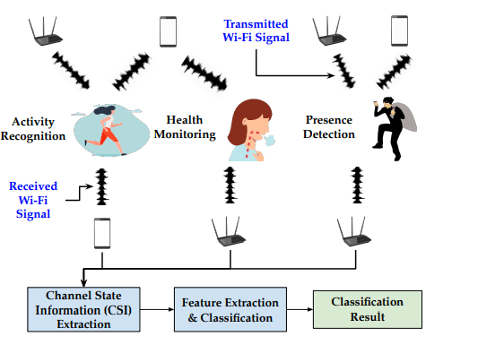

import { VideoEmbed } from "@site/src/components/VideoEmbed";
import { Note } from "@site/src/components/Note";

Espiar las cosas que hacés es relativamente fácil. ¿Deberías estar preocupado?

<!-- truncate -->

## La Cosa

Agosto de 1945. La Segunda Guerra Mundial está llegando a su fin. Alemania,
habiéndose rendido de forma incondicional, pasa a ser administrada por los
Aliados según lo dictado por el Acuerdo de Postdam. A escasos días de comenzar
el mes, el día 6 de agosto, Estados Unidos detonará una bomba que transportará
el infierno a Japón...

Pero dos días antes de que esto sucediese, ocurrió un simbolismo de menor
importancia. El 4 de agosto de 1945 la Unión Soviética le regala al embajador
americano W. Averell Harriman la siguiente placa conmemorativa:

Esta placa contiene gravado en madera el
[Gran Sello de los Estados Unidos](https://es.wikipedia.org/wiki/Gran_sello_de_los_Estados_Unidos).

Pese a ser presentado como un símbolo de amistad entre dos países aliados que
lucharon a la par para finalizar la cruenta guerra, fue en realidad uno de los
primeros dispositivos de espionaje basado en técnicas pasivas.

Detrás del gravado se encontraba una cavidad que contenía un micrófono
capacitivo muy simple y un pedazo de alambre que funcionaba como antena. No
había ningún dispositivo eléctrico ni una fuente de alimentación que otorgase
energía alguna.

Durante 7 años los soviéticos espiaron las conversaciones que se tenían en la
embajada estadounidense sin que nadie se enterase.

Si sos un ávido lector de este blog, o si tenés una noción de cómo funcionan las
antenas y los micrófonos, seguramente te estés preguntando cómo. ¿Cómo podían
espiar las conversaciones si el aparato en sí no tenía energía ni partes
eléctricas como para transmitir las ondas de sonido captadas por el micrófono?

La energía necesaria para que La Cosa funcionase era transmitida a través de
ondas de radio. Cuando los soviéticos querían escuchar una conversación,
apuntaban un transmisor hacia la ubicación de la placa. La antena dentro de la
misma captaba estas ondas emitidas por el transmisor, y al hacerlo, comenzaba a
resonar y radiar sus propias ondas en forma de respuesta.

Los sonidos capturados por el micrófono producían un cambio en la capacitancia,
lo que alteraba las propiedades de las ondas de radio emitidas por la antena.
Estos cambios pueden ser interpretados como una codificación del sonido
capturado por el micrófono.

Para finalizar el proceso, los soviéticos simplemente debían recibir las ondas
emanadas por La Cosa y decodificar las alteraciones de las mismas en sonido.

Esto es, sin dudas, un aparato bastante ingenioso e increíblemente difícil de
detectar. Dentro de la placa no había baterías, ningún mecanismo, nada pesado o
algo que siquiera emitiera un sonido. Pasa completamente desapercibido a simple
vista.

Pero la característica que llevó a que el dispositivo fuera descubierto es la
misma que lo hace algo tan ingenioso: podés esconder un micrófono y una antena,
podés hacerlos funcionar sin ningún tipo de batería, pero no podés esconder las
ondas de radio que estás emitiendo.

Eventualmente, otra gente además de los soviéticos capturó en distintas
ocasiones las emisiones producidas por La Cosa... Lo que llevo a que se
realizaran inspecciones en la embajada hasta que descubrieron este aparato.

## Radiación electromagnética

Quiero resaltar esta parte de la anterior sección:

> no podés esconder las ondas de radio que estás emitiendo.

Si sabés del tema es posible que estés diciendo "bueno, en realidad...", pero
dejame usar esa frase como puntapié, ¿ok? Gracias.

En el mundo moderno en el que vivimos estamos rodeados de radiación
electromagnética creada por los dispositivos electrónicos que usamos a diario.
Esta radiación no solo surge de aquellos dispositivos que cuentan con antenas,
sino que básicamente **cualquier dispositivo por el que pase una corriente
eléctrica va a inducir un cambio en el campo
electromagnético**.[1](#note-1)

<Note noteIndex="1">

Nota larga pero importante

Ateniéndonos a la mecánica clásica: una partícula cargada (como el electrón)
genera un campo magnético sólo cuando está en movimiento. La generación de un
campo magnético por sí solo no produce una onda electromagnética. Las ecuaciones
de Maxwell establecen que un campo magnético _variable_ en el tiempo actúa como
fuente de campo eléctrico, y que un campo eléctrico que _varía_ con el tiempo
genera un campo magnético.

Supongamos que tenemos un cable por el que pasa corriente continua. Las cargas
eléctricas que se muevan por el cable generarán un cambio en el campo magnético
alrededor del mismo. Pero al ser corriente continua, no se produce ninguna
variación en el movimiento de las cargas, por lo cual el campo magnético se
mantendrá constante. De esta forma no podemos generar una onda electromagnética.

Para generar una onda electromagnética necesitamos que haya _cambios_, en el
caso de cable podemos introducirlos al variar en el tiempo el voltaje o el
amperaje de la energía que pasa a través del mismo.

En los dispositivos electrónicos que usamos a diario, a pesar de que muchos de
ellos SON alimentados por corriente continua, los circuitos dentro de los mismos
pueden provocar oscilaciones de corriente en el tiempo las cuales se traducirán
en emisiones de ondas electromagnéticas.

Si algo de esto está mal quejate con Sears y Zemansky. O conmigo. Puede que me
equivoque. Soy una linterna después de todo.

</Note>

Espero que hayas leído la nota porque es importante.

A lo que quería ir con todo esto es que inevitablemente mucho de los
dispositivos que usamos a diario emanan ondas electromagnéticas. Y estas ondas
se esparcen libremente por el espacio, permitiendo a cualquiera (que cuente con
una antena y algún que otro dispositivo) captarlas.

Esto es un problema, porque las ondas emitidas por el dispositivo pueden llegar
a revelar información acerca de lo que el mismo esté haciendo. Información que
cualquiera podría captar. En criollo: el gobierno te está espiando y vigilando
en este mismo momento.

Estoy siendo bastante abstracto con lo de "cualquier dispositivo". Para darte
una mejor idea, veamos algunos ejemplos que te pueden resultar cercanos.

### Teclados

No voy a ahondar en profundidad acerca de cómo funciona un teclado de
computadora contemporáneo. Pero en resumidas cuentas, cada vez que presionás una
tecla, un conjunto de dígitos binario es enviado a la computadora. La
computadora interpreta ese conjunto de dígitos como la tecla que presionaste y
hace en consecuencia una acción, como, por ejemplo, imprimir por pantalla la
letra correspondiente.

Si tu teclado es inalámbrico no debería sorprenderte que el mismo emita ondas
electromagnéticas en cada pulsación, ya que el mismo cuenta con un transmisor
(generalmente Bluetooth) encargado de emitir esa cadena de dígitos binarios
hacia un receptor que se encuentra conectado en (la mayoría de los casos) un
puerto USB de tu computadora.

Pero... los teclados con cable también emanan estas ondas en cada pulsación.
Recordemos la breve clase de física que acabamos de tener: para generar ondas
electromagnéticas necesitamos que exista una variación en el tiempo del campo
eléctrico o del magnético. Cuando vos presionás una tecla, el teclado envía una
serie de pulsos eléctricos que representan la codificación binaria de la tecla a
través del cable.[2](#note-2)

<Note noteIndex="2">
Supongamos que estás utilizando un teclado que sigue el código ASCII. Bajo
esta codificación, la tecla A es representa en binario por los siguientes
dígitos: 01000001.

Existen _múltiples_ formas de enviar esta información a través de un cable, pero
generalmente se utilizan variaciones en el voltaje que es transmitido para
representar un 1 o un 0.

Por ejemplo, un 1 puede ser representado por un voltaje positivo, mientras que
un 0 puede ser representado por un voltaje negativo.

</Note>

Las variaciones de corriente producidas por estos pulsos eléctricos generan
ondas electromagnéticas a medida que viajan a través del cable.

Así que, si alguien quisiera, podría realizar un "ataque" y captar dichas ondas
para saber qué teclas estás pulsando.

En 2009 se publicó el siguiente artículo titulado
[Compromising Electromagnetic Emanations of Wired and Wireless Keyboards](https://www.usenix.org/legacy/event/sec09/tech/full_papers/vuagnoux.pdf)
en el cual se muestran distintas técnicas que pueden ser utilizadas para
reconocer teclas que son pulsadas en un teclado. En sí está mayormente enfocado
en teclados que usan el antiguo puerto PS/2, aunque también incluye técnicas de
ataque que podrían ser utilizadas en teclados USB e inalámbricos.

Esto es lo que dice el resumen:

> Los teclados de ordenador se utilizan a menudo para transmitir datos
> confidenciales, como contraseñas. Dado que contienen componentes electrónicos,
> los teclados emiten ondas electromagnéticas. Estas emisiones podrían revelar
> información sensible, como las pulsaciones de teclas. La técnica que se suele
> utilizar para detectar estas emisiones comprometedoras se basa en un receptor
> de banda ancha, sintonizado a una frecuencia específica. Sin embargo, este
> método puede no ser óptimo, ya que se pierde una cantidad significativa de
> información durante la adquisición de la señal. Nuestro enfoque consiste en
> adquirir la señal en bruto directamente de la antena y procesar todo el
> espectro electromagnético capturado. Gracias a este método, detectamos cuatro
> tipos diferentes de emisiones electromagnéticas comprometedoras generadas por
> teclados con y sin cable. Estas emisiones permiten la recuperación total o
> parcial de las pulsaciones de teclas. Implementamos estos ataques de canal
> lateral y nuestro mejor ataque práctico recuperó el 95 % de las pulsaciones de
> un teclado PS/2 a una distancia de hasta 20 metros, incluso a través de
> paredes. Probamos 12 modelos de teclado diferentes, adquiridos entre 2001 y
> 2008 (PS/2, USB, inalámbricos y para portátiles). Todos son vulnerables a al
> menos uno de los cuatro ataques. Concluimos que la mayoría de los teclados de
> ordenador modernos generan emisiones comprometedoras (principalmente debido a
> las presiones de costes del fabricante en el diseño). Por lo tanto, no son
> seguros para transmitir información confidencial.[3](#note-3)

<Note noteIndex="3">
  Perdón, esto esta traducido por el traductor de Google, no tenía ganas de
  traducirlo a mano. :-(
</Note>

Ahora, desconozco por qué el paper hace tanto enfoque en PS/2 siendo que ya en
2009 estaba en vías de extinción. Asumo (y puedo estar totalmente equivocado)
que el protocolo de intercambios de datos a través de PS/2 es mucho más simple y
termina generando emisiones de radiofrecuencias que son más fáciles de
descifrar, en comparación con las generadas por teclados USB.

Esto no quiere decir que estemos seguros usando teclados USB. El problema de
fondo (la emisión indeseada de radiofrecuencias) sigue estando, y una breve
búsqueda en internet arroja los siguientes artículos relativamente recientes:

- [A Signal-Denoising Method for Electromagnetic Leakage from USB Keyboards](https://www.mdpi.com/2079-9292/12/17/3647)
- [Reconstruction of leaked signal from USB keyboards](https://ieeexplore.ieee.org/document/7601331)
- [Keystroke Detection by Exploiting Unintended RF Emission from Repaired USB Keyboards](https://arxiv.org/abs/2509.00043)
- [Compromising Electromagnetic Emanations of Wired USB Keyboards](https://eudl.eu/pdf/10.1007/978-3-319-92213-3_6)

Si son buenos o malos artículos es algo que va más allá de este post. Lo que
quiero mostrar es que la investigación alrededor de este tema no paró.

Para finalizar esta parte, hay que recordar que no solo las computadoras
utilizan teclados como fuente de entrada. Los cajeros de los bancos también los
usan.[4](#note-4)

<Note noteIndex="4">
  Aunque siendo realistas hoy en día todo es una "touchscreen" y cada vez hay
  menos teclados físicos. Pero a que no adivinás qué es lo que pasa con las
  pantallas táctiles...
</Note>

### Monitores

Si pensabas que alguien espiando lo que escribís en un teclado era algo bastante
malo, las cosas se ponen PEOR.

En 1985 Wim van Eck publica el siguiente artículo titulado
[Electromagnetic Radiation from Video Display Units: An Eavesdropping Risk?](http://www.tscm.com/vaneck85.pdf),
en el cual explica cómo los monitores de esa época (los famosos "tubo de rayos
catódicos") emitían "al aire libre" señales que al ser capturadas se podían usar
para reconstruir la imagen que se estaba visualizando en el monitor.

Acá una resumida explicación tomada directamente de la publicación hecha por Van
Eck:

> A diferencia de otras señales de banda ancha dentro de un monitor, la señal de
> vídeo se amplifica desde el nivel de la unidad lógica transistor-transistor
> (TTL) hasta varios cientos de voltios antes de ser introducida en el tubo de
> rayos catódicos (CRT). Por lo tanto, la radiación originada por la señal de
> vídeo será el componente dominante del campo de banda ancha generado por el
> monitor en la mayoría de los casos. Cada armónico (radiado) de la señal de
> vídeo muestra una notable similitud con una señal de televisión, como se
> muestra en el apéndice técnico de este documento. Por consiguiente, es posible
> reconstruir la imagen mostrada en el monitor a partir de la emisión radiada
> mediante un receptor de televisión convencional.

En la actualidad, no usamos más monitores de tubo. Tenemos "pantallas planas"
que utilizan tecnología "liquid crystal display" con retroiluminación LED y vaya
uno a saber qué otra cosa más, así que quizás no deberíamos estar tan
preocupados por este problema.

O quizás sí porque el problema _sigue_ existiendo incluso para monitores
modernos.

En 2014, Martin Marinov presenta su tesis en la Universidad de Cambridge,
titulada
[Remote video eavesdropping using a software-defined radio platform](https://raw.githubusercontent.com/martinmarinov/TempestSDR/master/documentation/acs-dissertation.pdf).
En la misma explica cómo es posible capturar las emanaciones provocadas por
cables de video modernos (como por ejemplo, HDMI) con el fin de reconstruir la
imagen que se visualiza en los mismos, utilizando equipamiento de bajo costo
como lo es un SDR.

No solo eso, sino que también hace público un software de código abierto llamado
[TempestSDR](https://github.com/martinmarinov/TempestSDR), el cual automatiza la
captura y decodificación de estas señales.

> El vídeo rasterizado se transmite normalmente línea por línea, codificado como
> una corriente variable. Esto genera una onda electromagnética que puede ser
> captada por un receptor SDR. El software asigna en tiempo real la intensidad
> del campo magnético recibido por cada píxel a un tono de gris. Esto crea una
> estimación en falso color de la señal de vídeo original.

En teoría, es posible usar el software de Marinov a día de hoy, pero puede ser
un poco complicado hacerlo andar en computadoras modernas. Debido a esto,
surgieron alternativas como
[gr-tempest](https://github.com/git-artes/gr-tempest) (hecho por gente de
Uruguay, ¿qué loco, no?) que traslada parte de las funciones a GNU Radio.

En fin, si querés ver una demostración de esto funcionando, mirate 2 minutos de
este video de Cathode Ray Dude:

<VideoEmbed src="https://www.youtube.com/embed/9fGCQBGes20?start=2746" />

Como es de esperarse, la investigación sobre este tema no se detuvo. En 2024 se
publicó el artículo
[Deep-TEMPEST: Using Deep Learning to Eavesdrop on HDMI from its Unintended Electromagnetic Emanations](https://arxiv.org/html/2407.09717v1),
nuevamente desde Uruguay, en el cual utilizan técnicas de deep learning para
tratar de obtener una mejor imagen a partir de la señal capturada.

### Wi-Fi

Los anteriores ejemplos se caracterizaban por ser dispositivos que, en su
funcionamiento normal, fugan "sin querer" radiación electromagnética. En este
caso, si tenés un dispositivo que está utilizando el protocolo Wi-Fi, que emita
ondas de radio es algo esperable.

¿Cómo podrían "espiarte" usando las ondas del Wi-Fi?

Si sabés algo de cómo funciona el protocolo Wi-Fi, quizás pienses: _"bueno, la
única forma de espiarme sería si alguien captura los paquetes de la red, pero
para eso mi red tendría que ser abierta Y no tener ningún paquete encriptado,
así que lo veo un poco difícil"_

Lo cual es válido, pero en este caso no nos estamos centrando en técnicas de
packet sniffing o cosas así. Seguimos con la misma temática del post: espiar lo
que hacés en base a las emisiones de radiofrecuencias.

En 2015 se publica el artículo titulado
[Smart Homes that Monitor Breathing and Heart Rate](https://sci-hub.box/https://dl.acm.org/doi/10.1145/2702123.2702200),
en el cual se demuestra el funcionamiento de un dispositivo capaz de detectar
los movimientos causados por las respiraciones y los latidos del corazón:

> Presentamos Vital-Radio, una tecnología de detección inalámbrica que
> monitoriza la respiración y la frecuencia cardíaca sin contacto físico.
> Vital-Radio está basado en el hecho de que las señales inalámbricas se ven
> afectadas por el movimiento que suceda en el entorno de las mismas, incluyendo
> los movimientos del pecho al inhalar y exhalar, y las vibraciones de la piel
> causadas por los latidos del corazón. Describimos el funcionamiento de
> Vital-Radio y demostramos, mediante un estudio con usuarios, que puede
> registrar la respiración y la frecuencia cardíaca con una precisión media del
> 99 %, incluso a 8 metros del dispositivo o en una habitación diferente.
> Además, permite monitorizar las constantes vitales de varias personas
> simultáneamente.
>
> [...]
>
> Vital-Radio transmite una señal inalámbrica de baja potencia y mide el tiempo
> que tarda en llegar al cuerpo humano y reflejarse de vuelta a sus antenas.
> Sabiendo que las señales inalámbricas viajan a la velocidad de la luz, podemos
> usar el tiempo de reflexión para calcular la distancia entre el dispositivo y
> el cuerpo humano. Esta distancia varía ligeramente y periódicamente a medida
> que el usuario inhala, exhala y late su corazón. Vital-Radio registra estos
> mínimos cambios de distancia y los utiliza para extraer los signos vitales del
> usuario.
>
> [...]
>
> El dispositivo genera una señal que varía de 5,46 GHz a 7,25 GHz cada 2,5
> milisegundos, transmitiendo una potencia inferior a 1 mW. Estos parámetros se
> seleccionan en [6] de manera que el sistema de transmisión cumple con las
> regulaciones de la FCC para dispositivos electrónicos de consumo.

Si bien Vital-Radio no está basado en Wi-Fi, el dispositivo opera en un rango de
frecuencias similar y a menor potencia que aquella manejada por, digamos, un
router Wi-Fi.

Así que no es de sorprender que un par de años después, circa 2019, surgiese
[Wi-Fi Sensing](https://wballiance.com/resource/wi-fi-sensing/):

> Wi-Fi Sensing es una nueva tecnología que permite la detección de movimiento,
> el reconocimiento de gestos y la medición biométrica mediante el uso de
> señales Wi-Fi existentes.

Poco tiempo después, en 2020, la I Triple E (IEEE) aprobó el proyecto IEEE
802.11bf, el cual busca estandarizar la tecnología de Wi-Fi Sensing e
incorporarla al ya existente IEEE 802.11.

> cuando se finalice y se introduzca 802.11bf como estándar IEEE en septiembre
> de 2024, el Wi-Fi dejará de ser un estándar de comunicación únicamente y se
> convertirá legítimamente en un paradigma de detección completo

Al final, terminó tardando un poco más, siendo aprobado por la IEEE en mayo
de 2025.[5](#note-5)

<Note noteIndex="5">
¿Importa que haya sido estandarizado por la IEEE? No. Incluso sin estar
incorporado a un estándar, el concepto de "Wi-Fi Sensing" puede ser aplicado
sin problemas. Que se haya estandarizado implica que aplicar tal tecnología no
es algo difícil y se espera que surjan nuevos dispositivos que hagan uso de la
misma.

Pero espiar te podrían espiar igual, esté o no esté estandarizado.

</Note>

En el mismo año, el Karlsruhe Institute of Technology (KIT) publica el
comunicado de prensa
["The Spy Who Came in from the WiFi: Beware of Radio Network Surveillance!"](https://www.kit.edu/kit/english/pi_2025_069_the-spy-who-came-in-from-the-wifi-beware-of-radio-network-surveillance.php),
en el cual explican que, usando Wi-Fi, beamforming, y machine learning, resulta
muy fácil espiar e identificar a las personas:

> A diferencia de los ataques con sensores LIDAR o los métodos anteriores
> basados ​​en Wi-Fi, que utilizan información del estado del canal (CSI,
> Channel State Information) —es decir, datos medidos que indican cómo cambia
> una señal de radio al reflejarse en paredes, muebles o personas—, los
> atacantes no necesitan ningún hardware especial. Este método solo requiere un
> dispositivo Wi-Fi estándar. Funciona explotando la comunicación de los
> usuarios legítimos de la WLAN, cuyos dispositivos están conectados a la red
> Wi-Fi. Estos envían regularmente señales de retroalimentación dentro de la
> red, también llamadas información de retroalimentación de formación de haces
> (BFI, Beamforming Feedback Information), al router, sin cifrar, de modo que
> cualquiera dentro del alcance puede leerlas. Esto crea imágenes desde
> diferentes perspectivas que pueden servir para identificar a las personas. Una
> vez entrenado el modelo de aprendizaje automático la identificación solo tarda
> unos segundos.

El KIT publicó esto como un llamado de atención hacia el estándar IEEE 802.11bf,
pidiendo que se agreguen medidas de protección de la privacidad al mismo.

De todas las cosas que vimos hasta ahora, esta es quizás la más preocupante. Las
técnicas que aplican a teclados y monitores funcionan, pero se ven derrotadas
fácilmente con la distancia. Pero en el caso de Wi-Fi resulta imposible
distanciarse. Ponele que en tu casa decidís no usar Wi-Fi en absoluto y tenés
toda la red cableada. OK. ¿Pero cómo hacés con las casas de tus vecinos? ¿Y
cuando salís a la calle? Hay señales Wi-Fi por todos lados.

## Sonido

### Teclados

Olvidate de las ondas electromagnéticas producidas por los teclados. No hace
falta nada de eso. El sonido que hacen las teclas a medida que las presionás es
capaz de delatar lo que estás escribiendo, así lo demuestra este paper publicado
en 2024:
[Acoustic Side Channel Attack on Keyboards Based on Typing Patterns](https://arxiv.org/pdf/2403.08740)

[Keytap](https://github.com/ggerganov/kbd-audio) es un proyecto open source de
Georgi Gerganov. Lo podés abrir en tu celular yendo a
[https://keytap3-gui.ggerganov.com/](https://keytap3-gui.ggerganov.com/) y
comprobar si tu teclado es vulnerable o no.

¿Lo bueno? Estas técnicas solo funcionan en teclados mecánicos. Así que si tenés
un teclado de membrana podés estar tranquilo.

### Fansmitter

Esto en sí no es un ataque que alguien puede realizar para espiarte, sino más
bien para transmitir la información una vez que ya te están espiando.

Supongamos que tenés una computadora totalmente aislada, sin conexión a
internet, ni a ningún tipo de dispositivo inalámbrico. Podrías considerar que es
la máxima expresión de seguridad: al estar desconectada de todo, nadie podría
espiar lo que hagas en esa computadora.

Bueno, en 2016, un grupo de investigadores israelitas publicaron el artículo
titulado
[Fansmitter: Acoustic Data Exfiltration from (Speakerless) Air-Gapped Computers](https://arxiv.org/pdf/1606.05915),
en el cual demuestran cómo transmitir información por medio de los "coolers" de
tu computadora. Controlando la velocidad a la que giran los mismos es posible
cambiar el sonido que produce tu computadora al andar, pudiéndose así codificar
datos.

Obviamente alguien debería poder captar ese sonido (con algún micrófono o algo),
pero la idea se mantiene. Incluso aunque tu computadora esté desconectada de
todo, alguien podría estar espiándote controlando... los ventiladores.

¿Lo ves muy poco probable? Recordá que tanto Israel y Estados Unidos estuvieron
detrás de cosas como [Stuxnet](https://en.wikipedia.org/wiki/Stuxnet), un virus
altamente sofisticado diseñado específicamente para atacar el programa nuclear
iraní.

### Otros

Este post se hizo más largo de lo que esperaba y la subcategoría de "sonido" es
en realidad interminable. El siguiente video de Benn Jordan explica algunas
técnicas novedosas:

<VideoEmbed src="https://www.youtube.com/embed/mEC6PM97IRI" />

## TEMPEST

¿Qué es [TEMPEST](<https://en.wikipedia.org/wiki/Tempest_(codename)>)? Es un
código clave de la NSA y una certificación de la NATO que se usa para referirse
a cualquier tipo de espionaje basado en las fugas de señales de radio, sonido, o
vibraciones.

O sea, todo lo que estuvimos viendo en este post.

Si bien la mayor parte es información clasificada, existen estándares TEMPEST
que especifican cómo tienen que estar protegidos los dispositivos para prevenir
la fuga de información sensible a través de todos esos medios que mencionamos.

Las técnicas de protección por lo general incluyen:

- **Distancia:** si bien cualquier dispositivo electrónico puede tener fugas de
  ondas de radio, las mismas tienen poca potencia y se vuelven imposibles de
  capturar a cierta distancia.
- **Blindaje:** podés prevenir que tu dispositivo emita ondas de radio si lo
  blindás completamente, pero esto suele ser bastante costoso.
- **Filtrado:** se pueden aplicar filtros en los cables para prevenir que se
  envíen ciertas frecuencias que podrían ser fácilmente capturadas.
- **Enmascaramiento:** podés generar "ruido" electromagnético para tapar las
  emisiones producidas por tus dispositivos.

El vídeo de Cathode Ray Dude que está más arriba en este post muestra justamente
una computadora (usada en alguna agencia del gobierno de Estados Unidos) que se
encuentra totalmente blindada y que sigue los estándares
TEMPEST.[6](#note-6)

<Note noteIndex="6">
  Dicho sea de paso, ese video fue el que inspiró este post. No conocía sobre
  TEMPEST hasta que lo vi.
</Note>

## ¿Deberías estar preocupado?

Depende. A menos que estés en la lista de más buscados del FBI, dudo que alguien
haga todo el esfuerzo de espiarte usando algunas de las técnicas mencionadas en
este post.

Pero algunas de estas técnicas podrían ser utilizadas por gobiernos o grandes
compañías para socavar información sobre vos, armar un perfil, y tenerte bien
identificado. En especial esa de Wi-Fi Sensing. No me sorprendería que se
empiece a usar para vigilar a la población, sino es que no está siendo usada
actualmente.

Si bien estas nuevas tecnologías y técnicas son interesantes, siempre deberíamos
abogar por la privacidad.

pero en fin la solución es muy simple te comprás un terreno en digamos la pampa
construis una jaula de faraday gigante sobre tu casa y solo salis para hacer
pastar a las ovejas y ordeñar las vacas, a ver si se anima google a espiarte asi

momento... google tiene satelites y el coso de google earth... siempre estan un
paso mas adelante!!!!!!!!

## Referencias

- [The Great Seal Bug](https://www.cryptomuseum.com/covert/bugs/thing/)

- [Compromising Electromagnetic Emanations of Wired and Wireless Keyboards](https://www.usenix.org/legacy/event/sec09/tech/full_papers/vuagnoux.pdf)

- [Electromagnetic Radiation from Video Display Units: An Eavesdropping Risk?](http://www.tscm.com/vaneck85.pdf)

- [Deep-TEMPEST: Using Deep Learning to Eavesdrop on HDMI from its Unintended Electromagnetic Emanations](https://arxiv.org/html/2407.09717v1)

- [TempestSDR](https://github.com/martinmarinov/TempestSDR)

- [Remote video eavesdropping using a software-defined radio platform](https://raw.githubusercontent.com/martinmarinov/TempestSDR/master/documentation/acs-dissertation.pdf)

- [Smart Homes that Monitor Breathing and Heart Rate](https://sci-hub.box/https://dl.acm.org/doi/10.1145/2702123.2702200)

- [How Wi-Fi sensing became usable tech](https://www.technologyreview.com/2024/02/27/1088154/wifi-sensing-tracking-movements/)

- [Wi-Fi 802.11bf: así es el nuevo estándar que podrá detectar el movimiento y medir distancias en función de la señal](https://www.xataka.com/privacidad/wi-fi-802-11bf-asi-nuevo-estandar-que-podra-detectar-movimiento-medir-distancias-funcion-senal)

- [IEEE 802.11bf: Toward Ubiquitous Wi-Fi Sensing](https://arxiv.org/pdf/2103.14918)

- [Ordinary WiFi can now identify you with near-perfect accuracy](https://www.sciencedaily.com/releases/2026/08/260811052857.htm)

- [The Spy Who Came in from the WiFi: Beware of Radio Network Surveillance!](https://www.kit.edu/kit/english/pi_2025_069_the-spy-who-came-in-from-the-wifi-beware-of-radio-network-surveillance.php)

- [Acoustic Side Channel Attack on Keyboards Based on Typing Patterns](https://arxiv.org/pdf/2403.08740)

- [Keytap](https://github.com/ggerganov/kbd-audio)

- [Fansmitter: Acoustic Data Exfiltration from (Speakerless) Air-Gapped Computers](https://arxiv.org/pdf/1606.05915)

- [A TEMPEST In AT-Cup: The IBM TPC](https://www.youtube.com/watch?v=9fGCQBGes20)

- [7 Concerning Levels Of Acoustic Spying Techniques](https://www.youtube.com/watch?v=mEC6PM97IRI)
